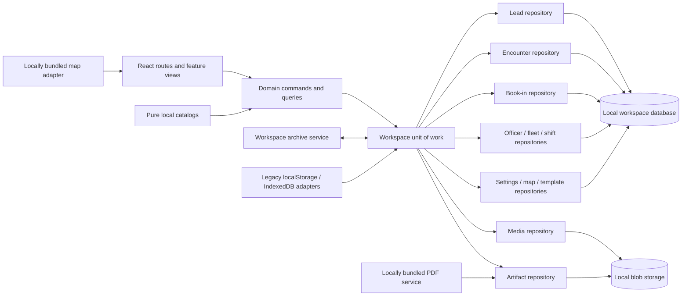
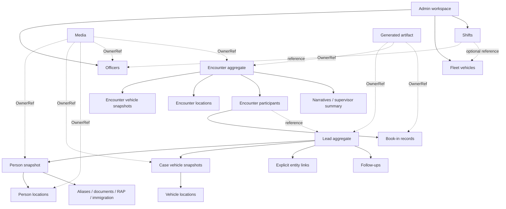
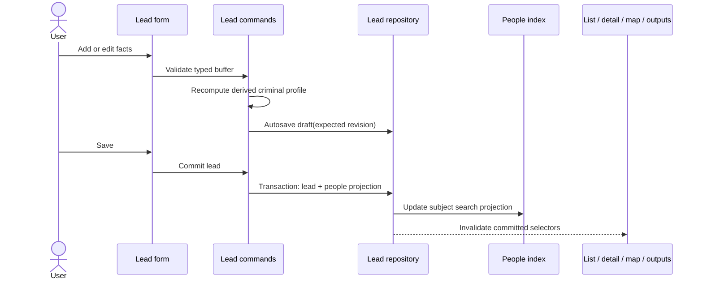
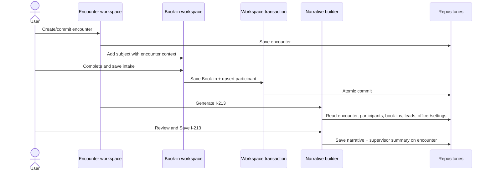
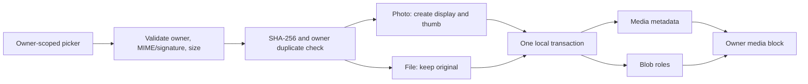
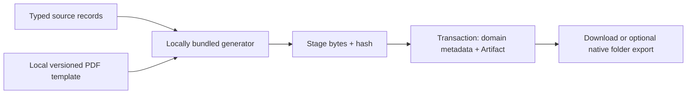

# COPDocX React rewrite blueprint (separate track)

**Blueprint ID:** `COPDOCX-BP-1`  
**Status:** Frozen rewrite contract; not classic-app authority  
**Applies to:** A future React recreation and its migration/cutover only  
**Owner:** COPDocX product owner and implementation team  
**Snapshot inspected:** 2026-08-31  
**Last verified against:** classic-script worktree on 2026-08-31  
**Classic app authority:** `docs/app-structure/` and the current disk implementation  
**Target:** React + TypeScript, entirely local at runtime  
**Companion registry:** [`app-blueprint.taxonomy.json`](app-blueprint.taxonomy.json)

> **Boundary:** This file is a rewrite design captured from an old snapshot. It
> must not be used as a punch list or current-state description for the classic
> multi-page app. The classic product is now **0.67.0** and includes Investigate,
> Operations, Home utilities, the privacy lock, and later storage/media/map
> behavior that this frozen blueprint does not model. Update this document only
> as part of an explicitly authorized React rewrite.

## 1. Purpose and authority

This is the implementation contract for a possible React recreation of the
2026-08-31 snapshot. It does not govern ongoing work in the classic-script app.
Statements about what "exists" refer only to that inspected baseline.

It does **not** claim that the React target already exists. Existing behavior is labelled separately from the intended rule.

Use this authority order during the recreation:

1. The **Intended rule** and decision ledger in this blueprint.
2. The stable IDs and relationships in `app-blueprint.taxonomy.json`.
3. Current source code for behavior not resolved here.
4. `docs/app-structure/` as design history and migration context.
5. Legacy files only as visual or data-recovery references.

For an explicitly started React recreation, this blueprint governs the target
architecture. For all classic-app work, `docs/app-structure/` and current tests
govern. Neither track silently supersedes the other.

### State labels

| State | Meaning |
| --- | --- |
| **Built** | Present in the current modern app and included in parity scope. |
| **Skeleton** | Present, but its content is placeholder or incomplete. |
| **Intended** | Canonical behavior for the React recreation. |
| **Planned** | Reserved capability that must not be presented as working. |
| **Legacy** | Kept for reference or migration only; do not port as active code. |

### Inspected baseline

- 27 source HTML files, excluding the transient `map-dom.html` inspection output.
- 23 active modern pages.
- Two compatibility redirects: `index.html` and `Narrative_Builder.html`.
- One legacy monolith: `Alien_Book_In_Docs_v1_0_4.html`.
- One zero-byte Operations placeholder: `operation.html`.
- At the inspected snapshot, visible versions were `0.18.4` on most pages and
  `0.19.0` on Map. Those are historical baseline labels, not the current
  product version (`0.67.0`).
- The inspected app was a classic-script, multi-page application. Subsequent
  classic features are deliberately outside this frozen rewrite baseline.

## 2. Product definition

COPDocX is a local case-workspace application with six primary product areas:

| Module ID | Product area | Responsibility | Canonical records |
| --- | --- | --- | --- |
| `M-HOME` | Home | Read-only operational briefing and recent-work entry points. | None. Derived projections only. |
| `M-LEADS` | Leads | Build and review a subject-centered case snapshot and issue lead outputs. | Lead, Person snapshot, case Vehicle, Location, Link, Follow-up. |
| `M-ENCOUNTERS` | Encounters | Record a field event, connect booked subjects, and generate I-213 narratives. | Encounter, Encounter participant, Narrative. |
| `M-BOOKIN` | Book-in | Capture detainee biographic/medical intake and generate packets/cards. | Book-in and generated Artifact. |
| `M-MAP` | Map | Read workspace locations and create operational map views and markup. | Map state only; never owns case facts. |
| `M-ADMIN` | Admin | Maintain personnel, fleet, schedule, and operational summaries. | Officer, Fleet vehicle, Shift. |

Media, settings, templates, import/export, and PDF generation are cross-cutting services rather than primary navigation modules.

## 3. System scheme



The hard boundary is: **components do not read browser storage, DOM IDs, files, or IndexedDB directly**. They call domain commands and queries. Storage adapters implement those ports.

## 4. Page and route taxonomy

The React target is a static single-page build using hash routes. This avoids server rewrite requirements and preserves deep links when served by a local loopback server or desktop wrapper.

Compatibility adapters must accept current query parameters during migration: `id`, `leadId`, `encounterId`, `recordId`, `ownerType`, and `return`.

### Primary and case-workflow pages

| Page ID | Current file | Current state and purpose | Intended hash route | Intended view | Reads | Writes |
| --- | --- | --- | --- | --- | --- | --- |
| `P-HOME` | `home.html` | **Skeleton.** Briefing cards and preview lists exist, but are placeholders. | `#/home` | Dashboard | Committed lead, encounter, book-in, officer, fleet, and shift projections. | None. |
| `P-LEAD-LIST` | `leads.html` | **Built.** Filtered draft/committed collection. | `#/leads` | Record collection | Leads. | None in parity. Any future archive/delete requires a separately approved explicit command. |
| `P-LEAD-VIEW` | `lead.html` | **Built.** Committed lead snapshot, nested objects, issued warrants, and media. | `#/leads/:leadId` | Record detail | Lead and owner-scoped media. | None except explicit media commands. |
| `P-LEAD-NEW` | `lead-form.html` | **Built.** Staged lead editor with repeatable domain cards. | `#/leads/new` | Record form | Catalogs and people search projection. | Draft/commit lead. |
| `P-LEAD-EDIT` | `lead-form.html?id=` | **Built.** Hydrates and edits a lead. | `#/leads/:leadId/edit` | Record form | Lead, catalogs, people search projection. | Draft/commit lead. |
| `P-TARGET-SHEET` | `mobile-target-sheet.html?id=` | **Built.** Mobile/print target presentation with primary photo. | `#/leads/:leadId/target-sheet` | Printable detail | Lead and person media. | None. Target-sheet file export remains **Planned**. |
| `P-I200` | `i200-form.html?id=` | **Built.** I-200 issuance for a lead. | `#/leads/:leadId/warrants/i-200/new` | Issuance form | Lead, committed officers, warrant settings, PDF template. | Issued-warrant metadata and Artifact. |
| `P-I205` | `i205-form.html?id=` | **Built.** I-205 issuance for a lead. | `#/leads/:leadId/warrants/i-205/new` | Issuance form | Lead, committed officers, warrant settings, PDF template. | Issued-warrant metadata and Artifact. |
| `P-ENCOUNTER-LIST` | `encounter.html` | **Built.** Encounter collection. | `#/encounters` | Record collection | Encounters. | Current explicit delete only; archive/retention behavior is target policy work. |
| `P-ENCOUNTER-NEW` | `encounter-form.html` | **Built.** Field-event editor. | `#/encounters/new` | Editable workspace | Catalogs, fleet/person lookups as applicable. | Draft/commit encounter. |
| `P-ENCOUNTER-WORKSPACE` | `encounter-form.html?id=` | **Built.** The form also serves as encounter detail. | `#/encounters/:encounterId` | Editable workspace | Encounter, linked book-ins, lead/person references. | Encounter and participant commands. |
| `P-NARRATIVE` | `narrative.html?encounterId=` | **Built.** I-213 editor and supervisor summary. | `#/encounters/:encounterId/narrative` | Editor workspace | Encounter, book-ins, referenced leads, officer/settings, templates. | Encounter narratives and supervisor summary. |
| `P-NARRATIVE-TRAINING` | `narrative.html` | **Built.** Deterministic in-memory training lab. | `#/narrative/training` | Training workspace | Bundled fixtures and templates. | In-memory draft only. |
| `P-BOOKIN` | `bookin.html` | **Built.** Combined form and saved-record table with lead/encounter context. | `#/book-in` | Form workspace | Leads, encounter context, saved book-ins, catalogs. | Book-in; encounter participant in the same intended transaction. |
| `P-BASEBALL` | `baseballcard.html` | **Built.** Editable generated summary reached from Book-in. | `#/book-in/baseball-card` | Generated-output editor | Book-in handoff and referenced lead/person. | Baseball-card history and optional Artifact. |

There is intentionally no separate encounter read-only view in parity scope. `P-ENCOUNTER-WORKSPACE` is the canonical detail/edit surface until the product requires a filed, immutable presentation.

Book-in keeps **Generate** as its primary action. **Save record** moves from File to the secondary action cluster; **New record** and **Open saved record** live with the Saved records panel. Generate validates and commits the current typed Book-in/participant transaction before creating an Artifact, so an output cannot be detached from its source record.

### Map, media, and administration pages

| Page ID | Current file | Current state and purpose | Intended hash route | Intended view | Reads | Writes |
| --- | --- | --- | --- | --- | --- | --- |
| `P-MAP` | `map.html` | **Built, partly planned.** Full-screen planning board, saved views, layers, markup, brief/print. | `#/map` | Geospatial workspace | Committed lead/encounter locations, arrests, officer homes, icons. | Map views/layers/icons/markup only. KMZ/JSON/CSV exports remain **Planned**. |
| `P-PHOTO-PICKER` | `photo-picker.html` | **Built.** Lab mode or owner-scoped photo workflow. | `#/media/photos` | Media picker/inspector | Owner context and media. | Media only. |
| `P-FILE-UPLOAD` | `file-upload.html` | **Built.** Lab mode or owner-scoped file workflow. | `#/media/files` | Media picker/inspector | Owner context, document catalog, media. | Media only. |
| `P-ADMIN` | `admin.html` | **Built.** Duty/fleet/arrest summary. | `#/admin` | Dashboard | Officers, fleet, shifts, book-in projections. | None. |
| `P-OFFICER-LIST` | `officers.html` | **Built.** Officer collection. | `#/admin/officers` | Record collection | Officers. | Current explicit remove only; archive/retention behavior is target policy work. |
| `P-OFFICER-VIEW` | `officer.html?id=` | **Built.** Officer detail and media. | `#/admin/officers/:officerId` | Record detail | Officer and owner media. | Media commands only. |
| `P-OFFICER-NEW` | `officer-form.html` | **Built.** Officer editor. | `#/admin/officers/new` | Record form | Catalogs. | Draft/commit officer. |
| `P-OFFICER-EDIT` | `officer-form.html?id=` | **Built.** Officer editor. | `#/admin/officers/:officerId/edit` | Record form | Officer and catalogs. | Draft/commit officer. |
| `P-FLEET-LIST` | `vehicles.html` | **Built.** Government fleet collection. | `#/admin/vehicles` | Record collection | Fleet vehicles. | Current explicit remove only; archive/retention behavior is target policy work. |
| `P-FLEET-VIEW` | `vehicle.html?id=` | **Built.** Fleet-vehicle detail and media. | `#/admin/vehicles/:vehicleId` | Record detail | Fleet vehicle and owner media. | Media commands only. |
| `P-FLEET-NEW` | `vehicle-form.html` | **Built.** Fleet-vehicle editor. | `#/admin/vehicles/new` | Record form | Officers and catalogs. | Draft/commit fleet vehicle. |
| `P-FLEET-EDIT` | `vehicle-form.html?id=` | **Built.** Fleet-vehicle editor. | `#/admin/vehicles/:vehicleId/edit` | Record form | Fleet vehicle, officers, catalogs. | Draft/commit fleet vehicle. |
| `P-SCHEDULE` | `schedule.html` | **Built.** Week grid, shift editor, and table. | `#/admin/schedule` | Schedule workspace | Committed officers and fleet. | Shifts. |

### Compatibility, legacy, and reserved entries

| Artifact | Classification | Rule |
| --- | --- | --- |
| `index.html` | Compatibility redirect | Redirect to the React entry route only; no product UI. |
| `Narrative_Builder.html` | Compatibility redirect | Preserve old bookmarks by redirecting to Narrative training. |
| `Alien_Book_In_Docs_v1_0_4.html` | Legacy | Data/visual reference only. Do not embed or port its architecture. |
| `style/style-old.css`, `functions/address_old.js` | Legacy | Exclude from the active bundle. |
| `operation.html` | Planned placeholder | It is zero bytes. Reserve `#/operations`, `#/operations/:operationId`, and `#/operations/:operationId/edit`, but hide them until the Operations domain and acceptance criteria are approved. |
| `demo-import.json` | Legacy/incompatible fixture | Replace with a valid fixture for the selected archive schema. |

### Dormant and reference inputs

The following JavaScript inputs are not loaded by any active HTML page at the inspected snapshot and therefore are not automatic React scope: `data/biographics.js`, `data/catalogs.js`, `data/locations.js`, `data/ops-codes.js`, `data/us-cities.js`, `data/le/detention-facilities.js`, the nine `data/ina/*.js` modules, `functions/address_old.js`, and the no-op compatibility pointer `functions/model/schema.js`.

Port one only when a named feature owns it, its source/license and update policy are known, and a typed consumer/test exists. `tools/build-bookin.py` is a historical generator unless it is reconciled with the current Book-in source and made reproducible.

## 5. Application shell and action contract

```text
App
└── AppShell
    ├── ProductHeader
    │   ├── FileMenu
    │   ├── PrimaryNav
    │   └── AdminMenu
    ├── PageActionBar
    ├── RouteOutlet
    ├── AppStatus
    └── DialogHost
```

Route metadata, not page markup, owns the selected tab and actions:

```ts
type RouteUi = {
  module: "home" | "leads" | "encounters" | "bookin" | "map" | "admin";
  fileActions: ActionSpec[];
  primaryAction?: ActionSpec;
  secondaryActions?: ActionSpec[];
  capabilities?: string[];
};
```

Rules:

1. **File means local file I/O:** workspace import/export, download, restore, or print-to-file. It never contains in-app New, Open, or Save. On Book-in, Save is secondary to Generate; New/Open belong to Saved records.
2. The action bar has at most one primary action: Add, Save, Edit, Generate, Issue, or Print brief.
3. Back is the first secondary action after the primary action.
4. An unimplemented action is represented by route capability metadata and rendered consistently as unavailable; it must not look successful.
5. Status messages use one shared live region. Dialogs use an accessible dialog primitive with focus restoration.
6. The application version is generated once at build time. Feature-layout versions do not replace the app version.

## 6. UI and card taxonomy

### Shared UI primitives

| Component ID | Component | Responsibility |
| --- | --- | --- |
| `UI-SHELL` | `AppShell` | Product chrome, route outlet, status, dialogs, and version. |
| `UI-PAGE` | `Page` / `PageHeader` | Page title, context, and layout bounds. |
| `UI-ACTIONS` | `PageActionBar` / `ActionMenu` | Route-defined primary, secondary, and file actions. |
| `UI-FORM` | `FormSection` / `FormGrid` / `Field` | Labels, help, errors, and responsive field layout. |
| `UI-CARD` | `Card` | The one generic bounded content surface. |
| `UI-REPEATABLE` | `RepeatableCardList<T>` | Typed add/remove/reorder of domain rows using entity IDs as React keys. |
| `UI-RECORD-LIST` | `RecordListPage` / `DataTable` | Filtering, empty state, status badge, and row navigation. |
| `UI-RECORD-VIEW` | `RecordViewPage` / `SnapshotGrid` | Read-only filed record presentation. |
| `UI-RECORD-FORM` | `RecordFormPage` | Draft buffer, validation, autosave state, and explicit commit. |
| `UI-FILTERS` | `FilterChips` / `RecordStateBadge` | All/draft/committed selection and lifecycle display. |
| `UI-MEDIA` | `MediaBlock` | Primary image, thumbnail strip, document list, and owner-scoped actions. |
| `UI-DIALOG` | `Dialog` / `ConfirmDialog` | Import, export, missing fields, destructive confirmation, and picker dialogs. |

### Domain editor and snapshot cards

| Card ID | React component | Canonical input/output | Where used |
| --- | --- | --- | --- |
| `CARD-LEAD-SOURCE` | `LeadSourceCard` | `Lead.source` | Lead form/view. |
| `CARD-SUBJECT` | `SubjectCard` | `Lead.person` identity and immigration summary. | Lead form/view, target sheet. |
| `CARD-ALIAS` | `AliasCard` | `Person.aliases[]` | Lead form/view. |
| `CARD-RELATIONSHIP` | `RelationshipCard` | Person-to-person `Lead.links[]`. | Lead form/view. |
| `CARD-CASE-VEHICLE` | `CaseVehicleCard` | `Lead.vehicles[]`, including nested locations and links. | Lead and encounter forms/views. |
| `CARD-LOCATION` | `LocationCard` | Owner-nested `Location`; resolve/manual coordinates and optional map preview. | Person, vehicle, encounter, officer contexts. |
| `CARD-LINK` | `EntityLinkCard` | Typed `Lead.links[]` from/to references, reasons, notes. | Nested vehicle/person association UI. |
| `CARD-DOCUMENT` | `IdentityDocumentCard` | `Person.documents[]` metadata; scan bytes are Media. | Lead form/view. |
| `CARD-RAP-ENCOUNTER` | `PoliceEncounterCard` | `Person.encounters[]` historical RAP row. | Lead form/view. |
| `CARD-ARREST` | `ArrestCard` | `Person.arrests[]`. | Lead form/view and map projection. |
| `CARD-CONVICTION` | `ConvictionCard` | `Person.convictions[]`. | Lead form/view. |
| `CARD-WARRANT` | `WarrantCard` | `Person.warrants[]`; manual RAP or issued form metadata. | Lead form/view. |
| `CARD-FOLLOWUP` | `FollowUpCard` | `Lead.followUps[]`. | Lead form. |
| `CARD-ENCOUNTER-DETAILS` | `EncounterDetailsCard` | Encounter office/team/start metadata. | Encounter workspace. |
| `CARD-ENCOUNTER-SUBJECT` | `EncounterParticipantCard` | Encounter-to-book-in participant relation and role. | Encounter and Book-in. |
| `CARD-SUPERVISOR` | `SupervisorSummaryCard` | `Encounter.supervisorSummary`. | Encounter and Narrative. |
| `CARD-OFFICER` | `OfficerCard` | Officer roster data. | Officer form/view and pickers. |
| `CARD-FLEET` | `FleetVehicleCard` | Government fleet data and assignments. | Fleet form/view. |
| `CARD-SHIFT` | `ShiftCard` | Officer/date/time/vehicle/assignment. | Schedule. |
| `CARD-MEDICAL` | `MedicalQuestionCard` | One typed Book-in medical answer and details. | Book-in. |
| `CARD-MEDIA` | `MediaAttachmentCard` | Owner-scoped Media metadata and blob roles. | Lead/object, officer, fleet, encounter, target sheet. |
| `CARD-STAT` | `StatCard` | Read-only derived count/value. | Home and Admin only. |

The current `<template>` cloning and ID rewriting in `functions/cards.js` is a migration source, not a target pattern. React arrays use stable entity IDs and explicit field paths.

## 7. Domain taxonomy and canonical schema

The interfaces below are the target contracts. A migration adapter may accept legacy aliases, but new feature code writes only canonical names.

### Common types

```ts
type EntityId = string;
type IsoDate = string;      // YYYY-MM-DD
type IsoDateTime = string;  // ISO-8601 with offset or Z

type LifecycleStatus = "draft" | "committed";

type RecordMeta = {
  schemaVersion: number;
  status: LifecycleStatus;
  createdAt: IsoDateTime;
  updatedAt: IsoDateTime;
  committedAt?: IsoDateTime;
  revision: number;
};

type OwnerRef = {
  type: "PERSON" | "VEHICLE" | "LOCATION" | "OFFICER" |
        "ENCOUNTER" | "LEAD" | "BOOKIN";
  id: EntityId;
};
```

Rules:

- A missing lifecycle status on a legacy row migrates to `committed`.
- Draft autosave updates `updatedAt` and `revision`, but preserves an existing `committedAt`.
- Commit is explicit. Collection/detail/export selectors may default to committed records, while edit recovery may include drafts.
- Derived values such as age, criminal flags, threat level, counts, and display labels are selectors, not independently editable facts.

### Lead aggregate

```ts
type LeadAggregate = {
  schema: "copdocx.lead.v1";
  leadId: EntityId;
  subjectPersonId: EntityId;
  caseRole: "LEAD" | "TARGET" | "DETAINEE";
  source: {
    leadSource: string;
    caseNumber: string;
    refAgency: string;
    refAgencyCode: string;
    probationCheck: boolean;
    leadInfo: string;
  };
  person: PersonSnapshot;
  vehicles: CaseVehicleSnapshot[];
  links: EntityLink[];
  followUps: FollowUp[];
  meta: RecordMeta;
};

type FollowUp = {
  followUpId: EntityId;
  type: "person" | "vehicle" | "location" | string;
  label: string;
  note: string;
  status: "open" | "done";
};
```

The person embedded in a lead is a **case snapshot**. The current `people{}` registry is a commit-time search/link projection. It must not silently override the filed subject snapshot.

### Person snapshot and RAP subrecords

```ts
type PersonSnapshot = {
  personId: EntityId;
  entityType: "PERSON";
  caseRole: string;
  name: { lastName: string; firstName: string; middleName: string };
  sex: string;
  dateOfBirth: IsoDate | "";
  citizenship: string;
  ssn: string;
  lexId: string;
  locations: Location[];
  aliases: Alias[];
  documents: IdentityDocument[];
  criminal: CriminalProfile;
  encounters: RapEncounter[];
  arrests: Arrest[];
  convictions: Conviction[];
  warrants: Warrant[];
  immigration: ImmigrationProfile;
};

type Alias = {
  aliasId: EntityId;
  lastName: string;
  firstName: string;
  middleName: string;
};

type IdentityDocument = {
  documentId: EntityId;
  documentType: string;
  documentNumber: string;
  issuingState: string;
  issuingCountry: string;
  documentIssueDate: IsoDate | "";
  documentExpiration: IsoDate | "";
};

type CriminalProfile = {
  fbiNumber: string;
  ncicNumber: string;
  stateId: string;
  rapSheet: string;
  // Derived selectors, persisted only for compatibility/cache:
  isCriminal: boolean;
  hasCriminalRecord: boolean;
  hasCriminalWarrants: boolean;
  sexOffender: boolean;
  foreignFugitive: boolean;
  armed: boolean;
  threatLevel: "none" | "low" | "moderate" | "high" | "severe";
};

type ImmigrationProfile = {
  alienNumber: string;
  finNumber: string;
  disposition: string;
  status: string;
  finalOrder: boolean;
  finalOrderDate: IsoDate | "";
  firstDeportationDate: IsoDate | "";
  lastDeportationDate: IsoDate | "";
  baseballCards: BaseballCardHistory[];
};
```

`RapEncounter`, `Arrest`, and `Conviction` retain their current stable IDs and factual date/agency/location/offense fields. `Warrant.formType` discriminates manual RAP warrants from issued I-200/I-205 metadata:

```ts
type Warrant = {
  warrantId: EntityId;
  charge: string;
  warrantNumber: string;
  warrantDate: IsoDate | "";
  warrantStatus: string;
  warrantIssuer: string;
  warrantIssuerCode: string;
  formType: "" | "I-200" | "I-205";
  fileNo: string;
  pdfFileName: string;
  office: string;
  officerName: string;
  officerTitle: string;
  basis: string[];
  inaLaw: string;
  entryPlace: string;
  entryDate: IsoDate | "";
  issuedAt: IsoDateTime | "";
};
```

### Location, vehicle, and explicit links

```ts
type Location = {
  locationId: EntityId;
  entityType: "LOCATION";
  street: string;
  street2: string;
  city: string;
  state: string;
  zip: string;
  latitude: string;
  longitude: string;
  association: "" | "residence" | "work" | "registration" |
               "known-parking" | "plate-check" | "stop" | "staging" | "other";
  parksHere: "" | "yes" | "no";
  targetPriority: string;
};

type VehicleIdentity = {
  vehicleId: EntityId;
  entityType: "VEHICLE";
  licensePlate: string;
  plateState: string;
  vehicleYear: string;
  vehicleMake: string;
  vehicleModel: string;
  vehicleColor: string;
  vehicleBodyStyle: string;
  vin: string;
};

type CaseVehicleSnapshot = VehicleIdentity & {
  governmentVehicle: false;
  registeredOwnerName: string;
  locations: Location[];
};

type EntityLink = {
  linkId: EntityId;
  from: { type: string; id: EntityId };
  to: { type: string; id: EntityId };
  reasons: string[];
  notes: string;
};
```

A Location has one owning aggregate; nesting is ownership. It keeps a stable ID because Media may refer to it. Links are explicit facts and are never inferred from similar names or ownership text.

### Encounter and narrative

```ts
type EncounterAggregate = {
  schema: "copdocx.encounter.v1";
  encounterId: EntityId;
  entityType: "ENCOUNTER";
  officeCode: string;
  team: string;
  startedAt: IsoDateTime | "";
  vehicles: CaseVehicleSnapshot[];
  locations: Location[];
  participants: EncounterParticipant[];
  narratives: EncounterNarrative[];
  supervisorSummary: {
    text: string;
    derivedAt: IsoDateTime | "";
    coverage: unknown | null;
  };
  meta: RecordMeta;
};

type EncounterParticipant = {
  participantId: EntityId;
  bookInId: EntityId;
  personId?: EntityId;
  leadId?: EntityId;
  encounterRole: "TARGET" | "COLLATERAL" | "";
  // Display projection retained for offline resilience:
  lastName: string;
  firstName: string;
  alienNumber: string;
};
```

Current `encounter.subjects[]` imports into `participants[]`. In the target, Book-in and its encounter participant update in one transaction so the two sides cannot drift.

### Book-in

Current Book-in records wrap a DOM-ID-keyed `formState`. That shape is accepted only by the legacy importer. The target record is grouped by meaning:

```ts
type BookInRecordV2 = {
  bookInId: EntityId;
  leadId?: EntityId;
  personId?: EntityId;
  encounterId?: EntityId;
  encounterRole: "TARGET" | "COLLATERAL" | "";
  identity: {
    lastName: string;
    firstName: string;
    alienNumber: string;
    sex: string;
    dateOfBirth: IsoDate | "";
    citizenship: string;
  };
  intake: {
    iceEvent: string;
    officerName: string;
    dateTime: IsoDateTime | "";
    team: string;
    isCriminal: boolean;
    immigrationDisposition: string;
    immigrationStatus: string;
    cash: string;
    travelDocuments: string;
    propertyTag: string;
    cellNumber: string;
    notPrimaryCaregiver: boolean;
    childrenNotes: string;
  };
  medical: {
    communication: "yes" | "no" | "";
    noMedicalIssues: boolean;
    issues: string;
    medicine: string;
    answers: Record<string, { answer: "yes" | "no" | ""; details: string }>;
    additionalObservations: string;
    referral: "yes" | "no" | "";
  };
  extensions?: Record<string, unknown>;
  meta: RecordMeta;
};
```

Unknown legacy form fields are preserved in `extensions` during migration so a round trip does not discard data.

### Officer, fleet vehicle, and shift

```ts
type Officer = {
  officerId: EntityId;
  entityType: "OFFICER";
  lastName: string;
  firstName: string;
  middleName: string;
  badge: string;
  callSign: string;
  duty: "available" | "in-field" | "admin" | "leave" | "off";
  role: string;
  team: string;
  eod: IsoDate | "";
  phoneGov: string;
  phonePrivate: string;
  locations: Location[];
  qualifications: string[];
  qualOther: string;
  equipment: string[];
  equipNotes: string;
  meta: RecordMeta;
};

type FleetVehicle = VehicleIdentity & {
  governmentVehicle: true;
  unit: string;
  availabilityStatus: "available" | "assigned" | "down" | "out";
  barcode: string;
  driverNumber: string;
  assignedOfficerIds: EntityId[];
  equipment: string[];
  meta: RecordMeta;
};

type Shift = {
  shiftId: EntityId;
  date: IsoDate;
  officerId: EntityId;
  vehicleId?: EntityId;
  start: string;
  end: string;
  assignment: "field" | "transport" | "office" | "other";
  meta: RecordMeta;
};
```

Officer is not Person. Fleet vehicle and case vehicle may share value objects and UI, but they are different aggregates. The target name `availabilityStatus` eliminates the current collision between fleet root `status` and `meta.status` lifecycle.

### Media and generated artifacts

```ts
type Media = {
  mediaId: EntityId;
  entityType: "MEDIA";
  mediaClass: "photo" | "file";
  owner: OwnerRef;
  ownerKey: string;
  kind: string;
  documentType: string;
  documentId?: EntityId;
  caption: string;
  takenAt: IsoDateTime | "";
  place: string;
  tags: string[];
  notes: string;
  mime: string;
  bytes: number;
  width: number;
  height: number;
  originalName: string;
  sha256: string;
  roles: Array<"original" | "display" | "thumb">;
  crop: { x: number; y: number; w: number; h: number } | null;
  primary: boolean;
  meta: RecordMeta;
};

type Artifact = {
  artifactId: EntityId;
  owner: OwnerRef;
  artifactType: "I-200" | "I-205" | "BOOKIN_PACKET" |
                "BASEBALL_CARD" | "I-213" | "TARGET_SHEET" | string;
  fileName: string;
  mime: string;
  bytes: number;
  sha256: string;
  generatorVersion: string;
  templateVersion: string;
  sourceRevisions: Array<{ type: string; id: EntityId; revision: number }>;
  generatedAt: IsoDateTime;
  meta: RecordMeta;
};
```

Media means user-supplied content. Artifact means generated output. The owner policy is:

| Owner | Photos | Files/artifacts | Canonical rule |
| --- | --- | --- | --- |
| Person | Yes | Yes | Mugshot/portrait and identity scans. |
| Vehicle | Yes | Yes | Vehicle/plate photos and registration/title. |
| Location | Yes | Yes | Place photos and location documents. |
| Officer | Yes | Yes | Portrait and credentials/certifications. |
| Encounter | Scene photos | Yes | Event-wide media and I-213/packet artifacts. |
| Lead | **No** | Rare case-level files | A lead is a case file, not the depicted object. |
| Book-in | Only when no Person exists | Yes | Prefer Person ownership for the detainee photo. |

Identity-document metadata remains in `Person.documents[]`; the scanned file is Media with an optional `documentId` reference.

### Ownership scheme



## 8. Persistence and repository blueprint

### Current physical stores

| Store ID | Current location | Current authority | Known limitation |
| --- | --- | --- | --- |
| `S-CORE-V1` | localStorage `copdocx.store.v1` | `leads{}`, `people{}`, `encounters{}`, `currentLeadId`. | Whole-store rewrites; no cross-store transaction. |
| `S-ADMIN-V1` | localStorage `copdoc.admin.v1` | `officers[]`, `vehicles[]`, `shifts[]`. | Aliases and lifecycle/fleet status collision. |
| `S-BOOKIN-V1` | localStorage `alien-book-in.saved-records.v1` | Book-in wrapper records and DOM `formState`. | UI IDs are the schema; separate encounter write can drift. |
| `S-MEDIA-V1` | IndexedDB `copdocx.media.v1` | Media metadata plus original/display/thumb blobs. | Not included in a complete backup; owner existence is not centrally enforced. |
| `S-WARRANT-HANDLE` | IndexedDB `copdocx.warrants` | File System Access directory handle. | Permission/environment state, not portable data. |
| `S-SETTINGS-V1` | localStorage `copdocx.settings.v1` | Warrant/application preferences. | Partial export coverage. |
| `S-MAP-V1` | localStorage `copdocx.map.views.v1`, `.layers.v1`, `.icons.v1`, `.markup.v1` | Map presentation and markup. | Fragmented versioning; partial export coverage. |
| `S-NARRATIVE-TEMPLATES` | localStorage `opdoc.narrative.templates.v2` | User narrative templates. | Prefix differs from the product name; partial export coverage. |
| `S-LAB` | localStorage `copdocx.photo-picker.v1`, `copdocx.file-upload.v1` | Development picker libraries. | Base64/lab data is not production authority. |
| `S-SESSION` | sessionStorage handoffs/cache | Baseball handoff and geocode cache. | Temporary only; must never be canonical. |

### Intended repository ports

```ts
interface RecordRepository<T> {
  get(id: EntityId): Promise<T | null>;
  list(query?: unknown): Promise<T[]>;
  save(record: T, expectedRevision?: number): Promise<T>;
  remove(id: EntityId, expectedRevision?: number): Promise<void>;
}

interface WorkspaceUnitOfWork {
  leads: RecordRepository<LeadAggregate>;
  encounters: RecordRepository<EncounterAggregate>;
  bookIns: RecordRepository<BookInRecordV2>;
  officers: RecordRepository<Officer>;
  fleetVehicles: RecordRepository<FleetVehicle>;
  shifts: RecordRepository<Shift>;
  media: MediaRepository;
  artifacts: ArtifactRepository;
  settings: SettingsRepository;
  map: MapStateRepository;
  templates: NarrativeTemplateRepository;
  transaction<T>(work: (tx: WorkspaceUnitOfWork) => Promise<T>): Promise<T>;
}
```

The browser target uses one physical IndexedDB database, `copdocx.workspace.v2`, with logical object stores:

```text
workspaceMeta, migrations
leads, peopleIndex, encounters
bookIns
officers, fleetVehicles, shifts
settings, mapState, narrativeTemplates
mediaMeta, mediaBlobs
artifactMeta, artifactBlobs
```

One database allows Book-in/participant updates and primary-photo changes to be atomic. The logical repository boundaries remain separate even though the physical database is shared.

A desktop wrapper may implement the same ports with SQLite plus an application-managed, hashed blob directory. React and the domain layer do not change.

### Migration rules

1. Preserve every existing record ID.
2. `id` imports into `officerId` or `vehicleId`; only the canonical field is written by V2.
3. `plate` imports into `licensePlate`; only `licensePlate` is written by V2.
4. Officer `address` imports into `locations[]`; only `locations[]` is written by V2.
5. Fleet root `status` imports into `availabilityStatus`. It is never interpreted as lifecycle status.
6. Missing `meta.status` imports as committed. Preserve historical timestamps where available.
7. `encounter.subjects[]` imports into `participants[]` with a newly stable `participantId`.
8. Book-in `formState` maps into typed groups; unrecognized keys go to `extensions`.
9. Preserve unknown extension fields during import/export round trips.
10. Lab base64 libraries are not migrated automatically. The user may explicitly import selected files as Media.
11. File-system directory handles are never archived and must be reauthorized on the destination device.

## 9. Data feed matrix

| Data product | Producers/commands | Authoritative repository | Consumers/selectors |
| --- | --- | --- | --- |
| Lead/person snapshot | Lead draft autosave, explicit commit, warrant issuance, baseball writeback, import. | Lead repository. | Lead collection/detail, people search projection, target sheet, map, Book-in prefill, Narrative bundle, archive. |
| People search index | Same transaction as lead commit. | Derived `peopleIndex`. | Relationship/link lookup only; never overwrites lead snapshots. |
| Encounter | Encounter form, participant sync, Narrative save, import. | Encounter repository. | Encounter collection/workspace, Narrative builder, map, archive. |
| Book-in | Book-in save/import. | Book-in repository. | Encounter participant projection, Admin arrest counts, Narrative mapping, baseball/PDF generation, archive. |
| Officer | Officer form/import. | Officer repository. | Admin/list/detail, Schedule, map officer homes, warrant officer picker, Narrative reporting officer, media. |
| Fleet vehicle | Fleet form/import. | Fleet repository. | Fleet views, Schedule, encounter selection, media. |
| Shift | Schedule commands/import. | Shift repository. | Schedule and Home/Admin projections. |
| Media | Photo/file save, crop, primary, remove, import. | Media repository. | Object media blocks, lead detail, officer/fleet detail, target sheet, archive. |
| Artifact | Warrant, Book-in, Narrative, baseball, target-sheet generators. | Artifact repository. | Download/export, owner output history, complete archive. |
| Narrative templates | Template editor/import. | Template repository. | Narrative engine. |
| Settings | Settings/warrant UI/import. | Settings repository. | Warrant defaults, office/team context, Narrative projection. |
| Map state | Map view/layer/icon/markup commands. | Map repository. | Map only and complete archive. |
| Catalogs | Bundled static modules. | Read-only application assets. | Forms, labels, validation, narrative content, PDF mappings. |

### Catalog rule

Files under `data/` become pure typed exports. A catalog module must not query or mutate the DOM during evaluation. UI population belongs in components/adapters. Only catalogs referenced by a feature enter that feature's bundle; dormant catalog files remain excluded until a consumer is defined.

## 10. Workflow schemes

### Lead draft, commit, and downstream use



Lead editing must preserve issued-warrant metadata and baseball history that have no editable lead-form card.

### Encounter, Book-in, and Narrative



Without `encounterId`, Narrative training uses deterministic bundled fixtures and does not persist a workspace record.

### Media



Primary-photo demotion and insertion happen in the same transaction. Removing a primary and promoting its replacement also happens in one transaction. Object URLs are component-local and revoked on change/unmount.

### Generated PDF/artifact



The optional native folder is an export destination, not the source of truth. A failed record commit cannot leave an untracked “successful” generated file.

### Workspace archive

`copdocx.transfer.v1` remains a legacy import format. The target is `copdocx.workspace-archive.v2`:

```ts
type WorkspaceArchiveV2 = {
  format: "copdocx.workspace-archive.v2";
  createdAt: IsoDateTime;
  appVersion: string;
  manifest: {
    counts: Record<string, number>;
    hashes: Array<{ path: string; sha256: string; bytes: number }>;
  };
  records: {
    leads: LeadAggregate[];
    encounters: EncounterAggregate[];
    bookIns: BookInRecordV2[];
    officers: Officer[];
    fleetVehicles: FleetVehicle[];
    shifts: Shift[];
  };
  settings: unknown;
  mapState: unknown;
  narrativeTemplates: unknown[];
  media: { meta: Media[]; blobs: unknown[] };
  artifacts: { meta: Artifact[]; blobs: unknown[] };
};
```

The actual disk representation may be a ZIP containing JSON plus binary files. Import performs: parse → validate → migrate → dry-run conflict/dependency report → safety backup → atomic commit. Directory handles, object URLs, and session handoffs are excluded.

## 11. Local-only React architecture

### Runtime rule

“Local files only” means **zero required runtime network requests**:

- React, router, map library, icons, fonts, workers, catalogs, and PDF library are bundled into the build.
- PDF templates and other static forms are versioned local assets.
- No CDN scripts, remote fonts, remote tiles, Census/Nominatim requests, Google Maps links, analytics, or cloud APIs are required for a successful workflow.
- Browser persistence is IndexedDB. User-controlled portability is through complete local archives.

Use a Vite-built static SPA with TypeScript and `HashRouter`. The supported browser deployment is a fixed local loopback origin; a packaged desktop wrapper is the stronger distribution for sensitive offline data and filesystem integration. Direct `file://` opening is a convenience test only, not the acceptance environment, because storage, modules, workers, and local asset fetch behavior vary by browser.

### Source layout

```text
src/
  app/
    App.tsx
    router.tsx
    route-ui.ts
    AppShell.tsx
    providers.tsx
  domain/
    common/
    leads/
    encounters/
    book-in/
    admin/
    media/
    artifacts/
    map/
  application/
    commands/
    queries/
    migrations/
    archive/
  infrastructure/
    persistence/indexeddb/
    persistence/legacy/
    files/
    pdf/
    maps/
  features/
    home/
    leads/
    encounters/
    book-in/
    narrative/
    map/
    media/
    admin/
  components/
    shell/
    forms/
    records/
    media/
  catalogs/
  legacy-islands/
  styles/
tests/
  unit/
  migration/
  integration/
  e2e/
  visual/
public/
  pdf/
  map-packs/
```

### State ownership

| State type | Owner |
| --- | --- |
| Persisted domain data | Repositories only. |
| Unsaved form buffer and validation | Feature form reducer/hook. |
| Server-like query cache | Repository query layer; invalidated after commands. |
| Route selection and context | Router. |
| Dialog/open-menu/filter state | Local component or feature UI state. |
| Object URLs and decoded images | Media component lifecycle only. |
| Legacy imperative engine state | Its isolated adapter until ported. |

React state libraries, if used, are not persistence. No component may mirror the entire workspace store as a second writable source.

### Map strategy

The baseline local build must work with manual coordinates and a basemap-free planning canvas. An install may add a bounded, locally stored PMTiles/tile pack and an optional local geocoder dataset through the map adapter. Missing optional packs produce an explicit “offline basemap/geocoder not installed” state, never a silent network fallback.

### Incremental legacy islands

The Narrative engine is the safest first island because it already mounts beneath `#narrativeEngineHost`. React owns the host and passes a typed input/output adapter; it does not reconcile descendants created by the legacy engine. Book-in may use the same technique briefly, but its DOM-ID form state must be replaced rather than made permanent.

## 12. Inconsistency resolution ledger

This table is normative: when the current code and intended behavior disagree, implement the Intended rule.

| Decision ID | Current mismatch or risk | Intended rule |
| --- | --- | --- |
| `D-001` | Historical docs contain stale release statements and duplicate roadmap step numbers. | This blueprint uses stable module/page/card/decision IDs. Releases are delivery metadata, not architecture IDs. |
| `D-002` | Historical rewrite baseline: most pages displayed `0.18.4`, while Map displayed `0.19.0`; the classic app has since moved to the `workspace-config.js` product version (`0.66.1`). | One build-generated application version in a future `AppShell`. Feature schema/layout versions live in migrations, not the product header. |
| `D-003` | Page behavior is selected by both `data-page` and legacy `data-admin-page`. | One typed route registry supplies page component, navigation state, actions, permissions, and capabilities. |
| `D-004` | The header is duplicated across active HTML pages and `functions/app-bar.js` branches by string keys. | One `AppShell` and route metadata. Page files contain no copied product chrome. |
| `D-005` | Book-in places New/Save/Open in File and duplicates record controls in the page. | File is file I/O only. New/Open are record controls; Save/Generate is the one primary page action. |
| `D-006` | Save sometimes means autosave, commit, generate, or download. | Autosave creates/revises a draft; explicit Save commits; Generate creates an Artifact; Download exports existing bytes. Labels and commands stay distinct. |
| `D-007` | Book-in persistence is keyed by DOM control IDs. | `BookInRecordV2` is typed by domain groups; DOM IDs are an import adapter only. |
| `D-008` | Book-in and encounter-subject updates are separate localStorage writes. | Save Book-in and upsert/remove its Encounter participant in one transaction. |
| `D-009` | Officers/vehicles dual-write `id` plus canonical IDs; vehicles dual-write `plate`; officers dual-write `address`. | Preserve aliases on import, then write only `officerId`, `vehicleId`, `licensePlate`, and `locations[]` in V2. |
| `D-010` | Fleet root `status` and lifecycle `meta.status` share a name. | Rename the fleet fact to `availabilityStatus`; lifecycle remains `meta.status`. |
| `D-011` | Media accepts LEAD as an owner type but rejects LEAD photos later. | The owner-policy matrix is validated before the picker opens and again in the repository. LEAD may own rare files, never photos. |
| `D-012` | Media primary demotion/insertion and delete/promotion can be multi-step. | Each invariant-changing media operation is a single database transaction. Validate the referenced owner exists. |
| `D-013` | Generated PDFs are partly downloaded directly, partly represented as warrant metadata, and templates/libraries are duplicated or remote. | Bundle one versioned template per form; generators create Artifact records, then download/export from Artifact storage. |
| `D-014` | `copdocx.transfer.v1` omits media blobs, artifacts, settings, map state, templates, and handles failures store-by-store. | `WorkspaceArchiveV2` covers all durable workspace data, hashes binaries, dry-runs imports, creates a safety backup, and commits atomically. |
| `D-015` | “Local” pages load Leaflet/pdf-lib from CDNs and map/geocode/Google services from the network. | The core app makes no runtime network request. Bundle libraries/assets; use manual coordinates plus optional installed local map/geocoder packs. |
| `D-016` | Some `data/` scripts populate controls as a side effect of script evaluation. | Catalogs are pure typed values. Components decide how and when to render them. |
| `D-017` | Home shows realistic-looking placeholder metrics/lists but reads no stores. | Home is a read-only projection of committed repositories. Until selectors exist, label modules unavailable or omit them; never present fabricated operational values. |
| `D-018` | `operation.html` is empty while planning docs describe future Operations. | Operations is Planned and hidden. Reserved routes become active only with an approved domain schema, store, pages, and tests. |
| `D-019` | Encounter has list + form but no read-only detail, conflicting with a general record-triad convention. | Parity intentionally uses one editable Encounter workspace as detail. Add a read-only view only as a separately approved capability. |
| `D-020` | Narrative is a large imperative document-global engine. | Mount it as an isolated legacy island behind typed input/output. Port its internals only after parity fixtures protect narrative text and coverage. |
| `D-021` | Arbitrary HTML/SVG uploads may be opened under the application origin. | Inspect MIME and magic bytes; render safe previews only. Active content is downloaded or handed to the OS, never executed same-origin. |
| `D-022` | Current media/file owners are not always checked against live records. | Every save/import validates owner type, owner existence, allowed media class, and reference integrity. Orphans require an explicit recovery workflow. |
| `D-023` | Current app data is plaintext in localStorage/IndexedDB and plaintext exports. | “Local-only” is not “encrypted.” Production packaging must document the threat model, protect archives, and use OS-backed/encrypted storage where deployment permits. |
| `D-024` | `demo-import.json` uses a format the current transfer parser does not accept. | Every shipped fixture is schema-validated in CI against the exact importer it demonstrates. |
| `D-025` | Old CSS, address logic, monolith pages, no-op `schema.js`, and generated inspection files can look active. | Active, compatibility, planned, and legacy files are explicitly classified; legacy sources are excluded from the React bundle and coverage metrics. |

## 13. Implementation blueprint

Use capability IDs instead of release numbers so work can be reordered without corrupting the architecture plan.

| Phase | Capability IDs | Outcome | Exit condition |
| --- | --- | --- | --- |
| 0. Freeze and recover | `FND-001`–`FND-004` | Capture a clean, reproducible baseline and complete legacy export before changing origin/storage. | All live source files tracked; test commands documented; complete recovery export verified. |
| 1. React foundation | `APP-001`–`APP-006` | Vite/TypeScript/React scaffold, HashRouter, AppShell, route metadata, design tokens, error/status/dialog services. | Every active/reserved route renders the correct shell and capability state with zero network. |
| 2. Domain and persistence | `DAT-001`–`DAT-010` | Type schemas, repositories, IndexedDB V2, migrations, revisions, archive V2. | Legacy fixture migration and V2 round trip preserve IDs, aliases, unknown fields, and blobs. |
| 3. Low-risk admin parity | `ADM-001`–`ADM-008` | Officer/fleet triads, Schedule, Admin projections, shared record primitives. | CRUD, draft/commit, references, media slots, and accessibility pass. |
| 4. Lead parity | `LED-001`–`LED-012` | Lead list/view/form, all repeatable cards, target sheet, people projection, CSV/JSON compatibility. | Current lead fixtures render and round-trip; derived profile and issued-output preservation pass. |
| 5. Encounter and Book-in | `ENC-001`–`ENC-008`, `BKI-001`–`BKI-010` | Encounter workspace, typed Book-in, transactional participants, saved-record UI. | Multi-record transaction and recovery tests pass; no DOM-ID persistence remains. |
| 6. Narratives and artifacts | `NAR-001`–`NAR-008`, `ART-001`–`ART-006` | Narrative island, typed packet projection, local PDF engine/templates, artifact history. | Golden narrative/PDF fixtures and interrupted-generation tests pass offline. |
| 7. Media and Map | `MED-001`–`MED-010`, `MAP-001`–`MAP-008` | Owner-safe media, complete backup, local map modes, views/layers/markup/brief. | Quota, transaction, object-URL, no-network, and optional-map-pack tests pass. |
| 8. Cutover | `CUT-001`–`CUT-006` | Redirect old entry points, remove compatibility bindings after parity, produce signed/local installer or static package. | Acceptance matrix passes on a copy of real data; rollback archive is verified. |

Recommended port order inside phases: shell → officers → fleet → lead collection/detail → lead editor → encounter → Book-in → Narrative → media → map. Map is late because offline basemap/geocoder distribution is an architectural dependency, not just a component rewrite.

## 14. Acceptance and verification matrix

| Gate ID | Gate | Required evidence |
| --- | --- | --- |
| `G-BUILD` | Reproducible build | Locked dependencies; clean build from a fresh checkout; generated version and asset manifest. |
| `G-ROUTE` | Route/page parity | Automated coverage of every page ID, compatibility URL, context parameter, selected nav item, and action contract. |
| `G-DOMAIN` | Domain invariants | Unit/property tests for factories, draft/commit timestamps, revisions, derived criminal profile, ID/reference rules, media ownership, and fleet/lifecycle separation. |
| `G-MIGRATE` | Legacy migration | Golden fixtures for every current store and alias; idempotent migration; unknown-field preservation; no source-store mutation until commit. |
| `G-TRANSACTION` | Atomic writes | Failure injection for Book-in/participant, lead/people projection, media primary changes, Artifact/domain writeback, and archive restore. |
| `G-ARCHIVE` | Complete portability | Export → erase test workspace → import → byte/hash and record equality, including media/artifacts/settings/map/templates. |
| `G-OFFLINE` | No required network | Browser test blocks all network requests; every core workflow, PDF, icon, font, catalog, and map baseline remains usable. |
| `G-SECURITY` | Local data safety | MIME/magic-byte checks, same-origin active-content block, CSP, archive protection policy, redacted diagnostics, and owner/reference validation. |
| `G-A11Y` | Accessible interaction | Keyboard-only flows, visible focus, semantic forms/tables, dialog focus trap/restore, live status, automated checks, and manual screen-reader smoke test. |
| `G-VISUAL` | Layout parity | Screenshots at mobile/tablet/desktop widths plus dark/light if supported; no clipped fields/actions/dialogs. |
| `G-PRINT` | Output parity | Golden or field-level verification for I-200, I-205, Book-in packet, target sheet, Narrative, baseball card, and Map brief. |
| `G-PERF` | Local scale | Indexed queries avoid full-library blob scans; large fixture budgets for list, map, media strip, archive, and initial load. |
| `G-RECOVERY` | Interrupted work | Draft recovery, stale-revision conflict UI, quota errors, malformed import, and generator failure leave the workspace consistent. |

### Current baseline debt to resolve before parity comparisons

At the inspected snapshot the worktree is actively dirty and several untracked files are loaded by active pages. The available suite contains 14 scripts; 13 are offline-eligible. Eleven of those pass and two currently fail:

- `scripts/test-age.js`: cross-realm `Date` test-harness mismatch.
- `scripts/test-narrative-build9.js`: assertion still expects raw theme colors after CSS/token changes.

The remaining pdf-lib test fetches from `unpkg.com` and therefore cannot be an offline acceptance test. Repair/freeze these baselines before treating screenshot or behavior differences as React regressions.

## 15. Production decisions and blueprint defaults

| Decision | Blueprint default | Why it matters |
| --- | --- | --- |
| Distribution | Packaged desktop app for production; local-loopback browser build for development/review. | Filesystem integration, stable origin, updates, and sensitive-data controls are stronger than direct `file://`. |
| Legacy-origin migration | Export a complete archive from the classic app, then import it on first run of the new origin/runtime. | Browser localStorage and IndexedDB are origin-scoped; the new app cannot assume it can read the old origin directly. |
| Browser support | One managed Chromium-family runtime/version. | File System Access, IndexedDB quota, workers, printing, and PDF behavior vary across browsers. |
| Offline map data | Core basemap-free/manual-coordinate mode; separately installed regional PMTiles and optional local geocoder. | Avoids silently bundling huge or stale national data and guarantees a no-network fallback. |
| Encryption | OS-protected/encrypted workspace and protected archives for production. | The current plaintext stores contain sensitive PII. |
| Conflict policy | Optimistic revision check with an explicit compare/reload workflow; never last-write-wins silently. | Multiple tabs/windows can otherwise overwrite local records. |
| Deletion/retention | Soft-delete/archive first; permanent purge is explicit and also covers owned media/artifacts. | Current ownership spans records and binary stores. |
| Operations | Disabled until separately approved. | The current file contains no implementation to preserve. |

## 16. Definition of complete

The React recreation is complete when it:

1. Implements every Built page and action in this blueprint or marks the capability visibly unavailable exactly where specified.
2. Migrates a copy of the existing workspace without losing IDs, committed/draft state, nested records, media, settings, or unknown Book-in fields.
3. Runs every core workflow with network access blocked.
4. Generates and reopens required outputs using only bundled libraries/templates and local Artifact storage.
5. Exports a complete archive and restores it into an empty workspace with record and binary hashes intact.
6. Passes the acceptance matrix, including keyboard, print, failure-injection, and recovery checks.
7. Keeps Operations and other Planned features out of normal navigation until their own contracts and tests are approved.

## 17. Blueprint governance

- Every architecture document declares status, scope, owner, last verification point, and what it supersedes.
- Every capability has exactly one state: Built, Skeleton, Intended, Planned, or Legacy.
- Each implementation change names the affected module, page, card/entity, repository, migration, and gate IDs.
- Schema, archive, route/query, PDF mapping, and template changes require versioned migrations plus backward fixtures.
- The taxonomy registry is validated in CI for unique IDs/routes, valid references, existing Built source files, and acceptance-test ownership.
- A dependency addition requires a lockfile update, license review, and proof that it is bundled locally at runtime.
- No runtime network capability is added without an explicit architecture decision and a documented offline fallback.
- Historical documents remain historical; they may receive a banner pointing here, but their old decisions are not silently rewritten.
- A release does not ship with a dirty worktree, an untracked runtime dependency, a failing required test, or an undocumented migration.
