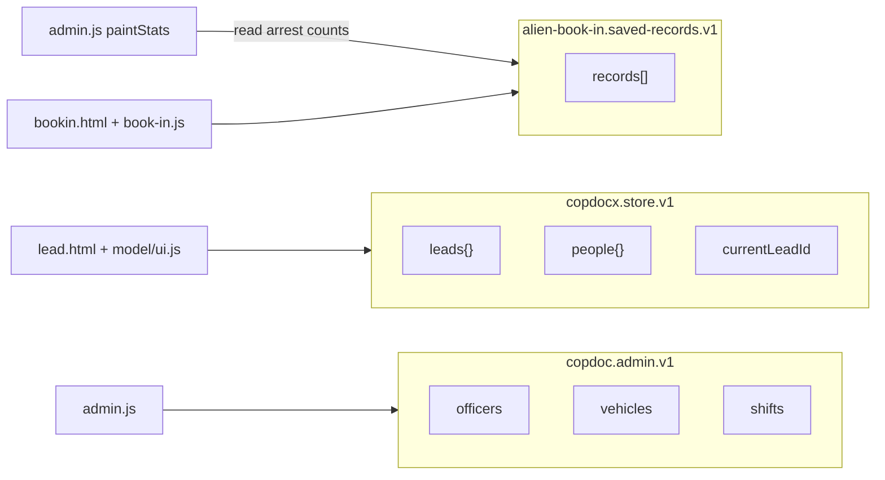
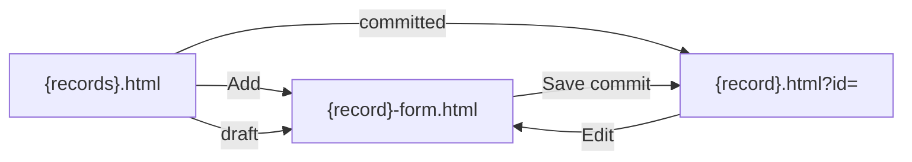
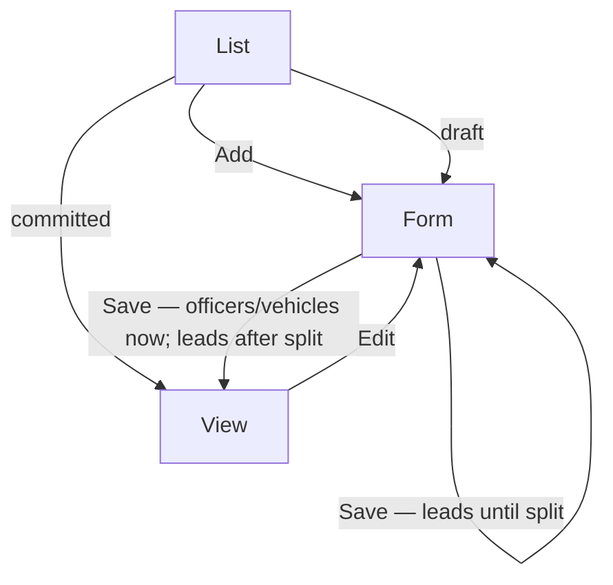

# COPDoc app structure, taxonomy, chrome, record lifecycle, and models

| Field | Value |
| --- | --- |
| **Author** | TBD |
| **Date** | 2026-08-30 |
| **Status** | Draft (rev 3) |
| **Product** | COPDoc (vanilla HTML/JS/CSS ICE/ERO field app) |
| **Workspace** | `C:\Users\johnw\PycharmProjects\COPDocX` |
| **Current stamp** | 0.5.2 (SemVer 0.x until save-shape freeze) |
| **Living outline (canonical tables)** | [`docs/app-structure/`](C:\Users\johnw\PycharmProjects\COPDocX\docs\app-structure\README.md) |

This document is the design pass. It does not change application HTML/JS/CSS except `docs/app-structure/`. Book-in stays in its own store.

**Where facts live:** File menu, triad names, `data-page`, lifecycle tables, and model fields are **only** in the outline. This document keeps decisions, current-state research, alternatives, risks, API sketches, and the PR file lists. If a table here and an outline file disagree, fix this document.

---

## Overview

COPDoc is a static multi-page field app. Officers and vehicles already follow **list → view snapshot → edit form**. Leads do not: `lead.html` is the form, `index.html` dumps the user onto it, and File → Open is the only roster. Chrome is copy-pasted; Admin subpages occupy the **action** side of the nav row; File still means New/Save/Open. Autosave and Save both write the live store.

This design makes every record type follow the officer/vehicle template, splits **draft (autosave)** from **committed (Save)**, paints chrome from one helper, and gives officers and fleet vehicles real models. Stores stay split.

**Until the lead triad ships**, `lead.html` remains the form (`data-page="lead-form"`). Save stays on that page; Cancel and Book-in are omitted; File New/Open stay. Hydrate **only** when `?id=` is present (not `currentLeadId`); File New/Open must `replaceState` the URL. See [records.md](C:\Users\johnw\PycharmProjects\COPDocX\docs\app-structure\records.md) Interim.

---

## Background & Motivation

### Current pages (verified)

| Page | Role today |
| --- | --- |
| `index.html` | Refresh **and** canonical **and** fallback link → `home.html` |
| `lead.html` | Lead **form**. Bare `<body>` (no `data-page`). Tab label **Lead** (singular). File: New / Save / Open select / Download JSON / CSV. Right: +Person +Vehicle +Location, Follow-ups, `#quickSaveLeadButton` Save. |
| `bookin.html` | Form. File: New / Save / Open. Right: Clear, Baseball card, Generate. Records **toolbar** already has Export / Import-merge / Restore-replace. |
| `map.html` | Planning board (`data-page="map"`). Map card + targets table. File: Save PDF / KMZ / JSON / CSV (`data-not-built`). Empty action slot. |
| `admin.html` | Dashboard (`data-admin-page="dashboard"`). |
| `officers.html` / `officer.html` / `officer-form.html` | List / view / form. View is `data-admin-page="officer-view"` (not `officer`). Form Save is `#addOfficerButton` in the **body** (~129–132). View Edit is `#officerEditLink` (`<a>`). |
| `vehicles.html` / `vehicle.html` / `vehicle-form.html` | List / view / form. View is `data-admin-page="vehicle-view"`. Form Save is `#addVehicleButton` in the body (~136–138). **No** focusout autosave. File Save on the vehicle form calls `addVehicle({ quiet: true })` (`admin.js` ~1587–1591). |
| `schedule.html` | Week grid + add-shift on the same page. File is only `#adminSaveButton`. |
| `home.html` | Briefing hub (`data-page="home"`). Chrome shell, empty action slot, no store writes. |
| `encounter.html` | Encounter **list** (`data-page="encounter"`). 0.11.0. |
| `encounter-form.html` | Encounter **form**. ID minted on Add. Subjects via Book-in `?encounterId=`. Generate I-213. |
| `operation.html` | **Zero-byte** file, not a chrome shell. |
| `baseballcard.html` | Chrome + playground. File: New/Save/Open `data-not-built`. |

Stamp `0.5.2` is in every header `data-version` **and** `functions/book-in.js` `APP_RELEASE.version` (backup filenames / `createdWithVersion`). Those are different clocks — see Key Decision 14.

`admin.js` `adminPage()` reads `data-admin-page`. `paint()` snapshots only when that value is `"officer-view"` / `"vehicle-view"` (~862–867). `findOfficer` / `findVehicle` match **only** `row.id`. `paintTable` always emits View + Remove; `editButton()` exists and is never called.

### Current chrome (pain)

Two-row sticky bar in `style/style.css` (`.app-bar*` ~114–343, `.app-bar-nav` ~1848, `.app-bar-actions { margin-left: auto }` ~167, wrap ~159, `.app-bar-nav .app-bar-menu` ~212–220). `functions/app-bar.js` (~72 lines) dismisses menus, handles `data-not-built`, and `COPDoc.setAppBarStatus` (prefers `#appBarStatus`, then `#leadSaveStatus`, then `#status`) — and **always removes** `.is-ok`. It does **not** paint the header.

Lead UI ignores the helper and writes `#leadSaveStatus` only (`ui.js` ~60–77). `lead-csv.js` ~69–76 same, with a fallback to `setAppBarStatus`.

```
Row 1: COPDoc | Version 0.5.2 | date
Row 2: [ File ▾ ] [ Lead | Book-in | Map | Admin ]     [ RIGHT MIX ]
```

Admin pages put Dashboard/Officers/Vehicles/Schedule **and** Add/Edit/Cancel in `.app-bar-actions.app-bar-nav`.

### Current stores (do not merge)



- `store.saveLead` always sets `meta.markedComplete = false` and `rememberPeople` (`store.js` ~88–101). Quiet and loud lead save are the same function (`ui.js` `saveCurrentLead`).
- Officer quiet save writes `state.officers` then `saveState()`. Invalid phone / partial address **skip persist** (`addOfficer` ~1234–1277).
- Vehicle quiet save exists **only** as Admin File Save.
- Book-in `saveCurrentRecord({ quiet: true })` + `bindBookInAutoSave` (focusout) write the book-in key. `activeRecordId` starts `null`.
- `collectLead` always returns a **new** `meta` with no `status` / `committedAt` (`collect.js` ~424–428). `createdAt` survives only via the card dataset.
- `downloadCurrentLead` / CSV export **`collectLead()` of the live form**, not the store.

### Current models

| Object | Factory | Gap |
| --- | --- | --- |
| Lead | `lead.js` `createLead` | No `meta.status`. Form and page are the same file. |
| Person | `person.js` | Fine. Officers are **not** persons. Name is nested `{ lastName, firstName, middleName }`; `formatPersonLabel` uses `person.name \|\| person`. |
| Location | `location.js` | Officer uses loose `address` + `locationAssociation`. |
| Vehicle | `vehicle.js` | Case-shaped only. Admin fleet fields live on loose objects. Root `status` is already fleet `available\|assigned\|down\|out`. No `governmentVehicle`. |
| Officer | **none** | Loose `id` (hyphen `ofc-…` from `admin.js` `newId`), flat names, `address`. |
| Link | `link.js` | Unchanged. |

`addVehicle` **deletes** `registeredOwnerName` and `locations` (~1371–1373) — correct for fleet. `collect.js` ~347 builds case vehicles via `createVehicle`.

### Pain points

1. Leads cannot be scanned as a table; officers can.
2. Autosave **is** the live record.
3. Chrome copy-paste will drift.
4. File vs action vs admin subnav are three jobs in two slots.
5. Fleet vs case vehicles share a word and almost no code.
6. Lead Save/Cancel/Book-in cannot follow the triad until the split, but chrome and save-shape land first — that contract must be explicit (it was not in rev 1).

---

## Goals & Non-Goals

### Goals

1. One page template: collection list landing; add/edit on a form; committed records have a snapshot view.
2. Leads grow `leads.html` + view `lead.html` + `lead-form.html`, matching officers/vehicles.
3. Autosave writes **draft**. Save **commits**. Lists, exports, dashboard counts, shift pickers, and the people registry prefer committed data.
4. Nav row 2: File (disk) · tabs including Admin ▾ · action slot (Add / Edit|Save / Book-in).
5. Real `createOfficer`. Extend `createVehicle` with `governmentVehicle`. Reuse `createLocation` for officer address.
6. Living outline in `docs/app-structure/` that future pages must follow — **one File menu, one triad table**.
7. Ordered, independently mergeable PRs, including **interim** lead behavior.

### Non-goals

- Merging book-in (or admin) into `copdocx.store.v1`.
- Rewriting PDF layout / `generateCombinedPacket`.
- Editing `data/immigration.js`.
- Implementing Map export files (labels stay `data-not-built`).
- Baseball-card criminal/immigration cards.
- +Person / +Vehicle / +Location on Book-in or Map.
- Confirm-on-leave; twin committed snapshot / undo.
- Fleet parking locations; shift draft/commit.
- Book-in list/view/form split (follow-on, same taxonomy).
- Fleshing out zero-byte `encounter.html` / `operation.html`. Home is a briefing skeleton (no store writes).
- Bundler, router, or framework.
- Implementing roster Import JSON (label only).
- Purging historical `people{}` rows created by today’s autosave.

---

## Key Decisions

1. **Leads use the officer/vehicle file triad** (end state). `leads.html` list, `lead.html` view, `lead-form.html` form. `index.html` refresh **and** canonical **and** fallback `<a>` → `home.html`. Names: [taxonomy.md](C:\Users\johnw\PycharmProjects\COPDocX\docs\app-structure\taxonomy.md).

2. **One primary action slot; Edit and Save are the same control** — `#appBarPrimaryAction` only. **No dual ids.** Add/Edit are `<a href>`; Save is `<button type="button">` with `data-chrome-action="add|edit|save"`. Chrome **paints**; page scripts **bind Save**. Hide `#quickSaveLeadButton`, `#addOfficerButton`, `#addVehicleButton`, `#officerEditLink`, `#vehicleEditLink` in the chrome PR. Tables: [chrome.md](C:\Users\johnw\PycharmProjects\COPDocX\docs\app-structure\chrome.md).

3. **File is disk I/O only** (end state). Never New, Open, in-app Save, Add. **Exceptions** (only these; living copy in chrome.md, not a PR number here): (a) Lead File New/Open until `leads.html` exists; (b) **vehicle-form File Save** until shared autosave exists (it is the only quiet persist for fleet today). Unimplemented File items are `data-not-built`. Book-in File is Export + Import(merge) + Restore(replace); toolbar duplicates come out when File gains them.

4. **`meta.status`: `"draft"` | `"committed"`**. Autosave writes draft and may `replaceState` `?id=`. Save commits and stamps `committedAt`. Existing rows with no status migrate as **committed**. **Lead Save does not navigate to a view until the triad exists.** After the split, commit → view. Interim load hydrates **only** when `?id=` is present — never `currentLeadId`. File New/Open keep the URL in sync ([records.md](C:\Users\johnw\PycharmProjects\COPDocX\docs\app-structure\records.md) Interim).

5. **One object per id; demote on edit.** First autosave of a committed record sets `meta.status: "draft"` in place; **preserve `committedAt`**. Collect does not own meta lifecycle fields; `saveLead` merges onto the previous snapshot. Draft list rows open the form; committed rows open the view.

6. **Stores stay three.** Cross-store reads OK; writes only on the destination form’s Save.

7. **Officer is a new model, not a Person.** `createOfficer`. Location is `locations[]` via `createLocation`. **Dual-write** `id` + `officerId` and `address` + `locations[]` until 1.0; **do not delete `address`**. Lookups: `row.id === id || row.officerId === id`.

8. **One Vehicle factory, gated by `governmentVehicle`.** Default `false` (lead cards; `collect.js` passes it explicitly). Admin fleet is `true`; factory then defaults fleet `status` to `"available"`. Root `status` is **fleet**; lifecycle is **`meta.status`**. Dual-write `id`/`vehicleId` and `plate`/`licensePlate`; do not delete `plate`.

9. **Chrome is painted in `app-bar.js`** (`COPDoc.chrome.mount`). Registry keys off `data-page`. **Dual-write** `data-page` and today’s `data-admin-page` (`officer-view` / `vehicle-view`) so `admin.js` `paint()` does not go blank. Do not add `functions/chrome.js` at 72 lines.

10. **Shared `functions/model/autosave.js` + extract `functions/model/util.js`** (`assign`, `nowIso`, `newId`) so admin does not load `createLead`. Vehicle autosave ships in the save-shape PR, same PR that removes vehicle-form File Save.

11. **People registry on commit only.** Do not purge historical `people{}` rows.

12. **Export committed only.** Never `collectLead()` of a draft form. Existing Download JSON/CSV no-op unless the **stored** snapshot is committed.

13. **Book-in from a lead is prefill, not a write.** `bookin.html?leadId=` always `startNewRecord()` then fill existing biographic ids only (**no `#middleName`** — drop middle). `suppressAutoSave` + `rememberFormSignature()` so focusout does not persist. No baseball-card control on Lead.

14. **Stamps:** header `data-version` is the product stamp (bump in the same PR as user-visible work). `APP_RELEASE.version` bumps **only** when book-in backup format changes. Chrome rearrangement is **0.5.3**. Save-shape is **0.6.0**. Officer model **0.6.1**. `governmentVehicle` **0.6.2**. Lead triad **0.7.0** (new capability). Book-in prefill **0.7.1**. File leftover **0.7.2**.

15. **`lead.html` carries `data-page="lead-form"` until the split** so chrome paints Save, not Edit. File New → `replaceState` `lead.html` (no query). File Open → `replaceState` `lead.html?id=`. Blank visit (no `?id=`) stays a new form.

16. **Shift pickers and dashboard availability use committed records only.**

17. **Lead list city** is first `person.locations[].city`, else **—**. Source column uses human labels (`tag` → “Plate Check”), not raw codes. **`functions/lead-source.js` has no label map today** (it only toggles `[data-source]` panels; labels live as `<option>` text on `lead.html`). The triad PR **adds `SOURCE_LABELS`** there; `leads.js` reads that map. Do not scrape `#leadSource`.

18. **`encounter.html` / `operation.html` stay empty** in this program. `home.html` is the briefing hub (`data-page="home"`); counts stay placeholders until a later painter.

---

## Proposed Design

### A. Page taxonomy and URL / file naming

Canonical names, `data-page` / `data-admin-page` mapping, button IDs, CSS slots, directories, and **script order**: [taxonomy.md](C:\Users\johnw\PycharmProjects\COPDocX\docs\app-structure\taxonomy.md).



**Interim:** today’s `lead.html` is the form with `data-page="lead-form"`. After the split, `lead.html?id=` of a **draft** redirects to `lead-form.html?id=`; `lead.html` with **no** `id` is empty state + Back to leads (not an auto-redirect to a new form). View must not load `workflow.js` / `ui.js` / `baseballcard.js`.

### B. App-bar chrome

Zones, File table (with exceptions and `data-not-built`), Admin dropdown, action slot, mobile wrap, painter API: [chrome.md](C:\Users\johnw\PycharmProjects\COPDocX\docs\app-structure\chrome.md).

```
[ File ▾ ]     Leads │ Book-in │ Map │ Admin ▾              [ PRIMARY ]
.app-bar-menu  ------------ .app-bar-nav --------------     .app-bar-actions
```

**Wiring (rev 1 was wrong about dual ids):**

- Painter chooses element type from `chromeAction`.
- Edit `href` = `{record}-form.html?id=` + current query `id`.
- `ui.js` / `admin.js` bind Save to `#appBarPrimaryAction[data-chrome-action="save"]` (same PR as mount).
- `ui.js` `setStatus` and `lead-csv.js` use `COPDoc.setAppBarStatus(message, { ok: true })`. Extend the helper so `.is-ok` can be set.
- Lead File **Save** (`#saveLeadButton`) leaves File in the chrome PR (action slot already has Save; lead already autosaves).
- Admin File Save remains **only** on `vehicle-form` until save-shape.

### C. Record lifecycle

End-state rules, `collectLead`/`saveLead` meta contract, list UX, export, book-in prefill: [records.md](C:\Users\johnw\PycharmProjects\COPDocX\docs\app-structure\records.md).



### D. Shared chrome + save helper

**`COPDoc.chrome.mount`** — see chrome.md. Pages keep the info row in HTML; JS paints `#appBarNavRow`.

**`functions/model/util.js`** — `model.assign`, `model.nowIso`, `model.newId`. `lead.js` keeps `createLead` / `SCHEMA` / `subjectOf` and calls util.

**`functions/model/autosave.js`**

```js
COPDoc.model.autosave.bind({
  signatureRoot: Element,
  collect: function () { return record; },
  saveDraft: function (record) { return { ok: true, id: "", error: "" }; },
  idFrom: function (record) { return ""; },
  formFile: "officer-form.html",
  canDraft: function (record) { return { ok: true, message: "" }; },
  onDraft: function (result) {}
});

COPDoc.model.autosave.commit({
  collect: function () {},
  validate: function (record) { return { ok: true, message: "" }; },
  saveCommit: function (record) { return { ok: true, id: "" }; },
  afterCommit: function (record) {}
});
```

Copied from today’s three implementations: signature skip, `suppressAutoSave` around hydrate, `focusout` capture + `change`, `setTimeout(0)`, `data-record-ignore`.

Lead `afterCommit` **until split:** `replaceState` + status, **no navigation**. After split: `location.href = "lead.html?id=" + id`.

### E. Data models

Fields, stores, dual-write migration, `meta.status` vs fleet `status`: [data-models.md](C:\Users\johnw\PycharmProjects\COPDocX\docs\app-structure\data-models.md).

Officer form already embeds the lead location card (`#officerAddressCard`, `data-location-owner="person"`). Persist as `locations[]` **and** keep `address` in 0.6.x. Update `readOfficerAddress` / `paintOfficerView` / list city in the officer-model PR so they **prefer** `locations[0]` and fall back to `address`.

### F. Lead list / view / Book-in

List columns, city/source rules, view DOM ids, prefill: [records.md](C:\Users\johnw\PycharmProjects\COPDocX\docs\app-structure\records.md) + [taxonomy.md](C:\Users\johnw\PycharmProjects\COPDocX\docs\app-structure\taxonomy.md) Interim.

View snapshot: Source + Subject (read-only). Compact plate/city lists optional. `#leadSnapshot` / `#leadMissing`. Scripts: list/view vs form enumerated in taxonomy.md.

Book-in button only on **committed** view. `bookin.html?leadId=` → `startNewRecord` + prefill existing fields + signature remember. PDF Generate untouched.

### G. Directory map

See taxonomy.md Directories + Script order. `functions/leads.js` is list+view only after the split.

### H. Risks

| Severity | Risk | Mitigation |
| --- | --- | --- |
| High | Lead commit `location.href = "lead.html?id="` before the view exists reloads a blank form and mints a new `leadId`. | Interim: stay on form; hydrate **only** `?id=` (not `currentLeadId`). |
| High | File New/Open vs `?id=` hydrate: New without stripping query reloads the old lead; Open without `replaceState` loses the opened id on refresh. | File New → `lead.html` no query; File Open → `lead.html?id=`. Drop with New/Open in the triad PR. |
| High | Chrome paints `#appBarPrimaryAction` but `ui.js`/`admin.js` still bind old ids → Save/Edit dead. | Chrome PR includes those JS files; one id; hide old buttons. |
| High | Stripping Admin File Save before vehicle autosave loses the only fleet quiet path. | Vehicle-form File Save stays until save-shape. |
| High | Removing Lead File Open before `leads.html`. | Exception until the triad PR. |
| High | `data-page="officer"` without `data-admin-page="officer-view"` blanks views. | Dual-write. |
| Med | Demote looks like a vanished lead. | Drafts first, badge, chips, default All. |
| Med | `collectLead` blank meta wipes `committedAt`. | `saveLead` merges previous snapshot. |
| Med | Fleet `status` vs `meta.status`. | Never a helper arg named `status` without `meta.` / fleet. Tests. |
| Med | Deleting `address` breaks 0.5.2 rollback and `paintOfficerView`. | Dual-write until 1.0. |
| Med | Book-in prefill + focusout autosave writes a row. | `startNewRecord` + suppress + `rememberFormSignature`; never `saveCurrentRecord`. |
| Med | Dual ids on one element. | Forbidden. |
| Low | `APP_RELEASE` vs header stamp desync. | Different clocks (KD 14). |
| Low | PDF / Map / immigration regressions. | Out of scope. |

---

## API / Interface Changes

### `COPDoc.chrome.mount` (new)

See chrome.md. Pages lose handwritten File lists, Admin subnav, and ad-hoc action links.

### `COPDoc.setAppBarStatus(message, opts)`

`opts.ok === true` adds `.is-ok`. Lead `ui.js` and `lead-csv.js` switch to this in the chrome PR.

### `COPDoc.model.autosave` (new)

See §D. `model.saveCurrentLead` becomes a thin wrapper.

### `model.store.saveLead(snapshot, opts)`

```js
saveLead(snapshot, { mode: "draft" | "commit" })
```

Merge onto previous snapshot; `mode` owns `meta.status`; draft preserves `committedAt`; commit stamps it and `rememberPeople`. `listLeads()` adds `status` (**meta**), `caseNumber`, `leadSource`, `city`. Optional `listLeads({ metaStatus: "committed" })` — not `{ status }`.

### `createOfficer` / `createVehicle` / `util.js`

New / extended. `createLead` meta gains `status` + `committedAt` at create time (`draft`). Collect still must not be the source of truth for those fields on edit.

### Admin persistence

`addOfficer` / `addVehicle` split collect + `saveDraft` + `saveCommit`. Lookups accept `id` **or** `officerId`/`vehicleId`. `paintTable` as records.md. `paintPickers` committed only.

### Book-in

New load branch: `leadId` query → `startNewRecord` + prefill. `saveCurrentRecord` unchanged until the File-cleanup PR moves the Save **record** button into the action slot (Generate stays primary).

---

## Data Model Changes

See [data-models.md](C:\Users\johnw\PycharmProjects\COPDocX\docs\app-structure\data-models.md). No new localStorage keys. Additive fields + dual-write of old keys. Save-shape freeze at 1.0.0 includes `meta.status`.

---

## Alternatives Considered

### 1. Keep `lead.html` as the form; add `leads.html` + `lead-view.html`

Rejected: officers already use `{record}.html` = view. Interim `data-page="lead-form"` on today’s file is the compatibility hatch, not a permanent exception.

### 2. Merge officers/vehicles into `copdocx.store.v1`

Rejected: roster vs case, fleet vs evidence, shifts, people-registry filters.

### 3. Parallel `drafts{}` map instead of `meta.status`

Rejected as v1 complexity. In-place demote + preserved `committedAt` is enough; revert can wait.

### 4. Confirm-on-leave

Rejected: autosave is explicitly not commit; drafts are listed.

### 5. New `functions/chrome.js`

Rejected while `app-bar.js` is ~72 lines.

### 6. Treat pre-0.6.0 rows as drafts

Rejected: they already appear in Open and feel like real cases.

### 7. Dual ids (`#appBarPrimaryAction` + `#saveLeadButton` on one node)

Rejected (rev 1 suggested it). HTML allows one id. One hook, rebind listeners.

### 8. Put vehicle autosave in the chrome PR so File Save can die immediately

Rejected: chrome is 0.5.3 (no save-shape). Exception (b) is cheaper than mixing schema into a header-only PR.

### 9. Extract `util.js` vs loading `lead.js` on admin

Chose extract. Admin must not pull `createLead` / lead schema just for `newId`.

---

## Security & Privacy Considerations

Local-only. Exports are LE PII.

| Threat | Handling |
| --- | --- |
| Draft PII in JSON/CSV | Export stored committed snapshot only; disable on drafts. |
| Import replacing roster/leads | File only; roster import stays `data-not-built`. Book-in already caps backup size. |
| Prefill writing a book-in row | `startNewRecord` + suppress autosave + remember signature; no `saveCurrentRecord`. |
| Roster phones in lead export | Lead JSON is `copdocx.store.v1` only. |

---

## Observability

- Autosave: `Draft saved.` + `.is-ok`.
- Commit: `Committed {type} — {label}.`
- Quiet skip: no status. Commit failure: loud, stay.
- Prefill: `Filled from lead — {name}. Not saved until you Save.`
- Draft export attempt: `Commit this record before exporting.`

Manual per PR: add, autosave `?id=`, refresh hydrate, list badge, officer/vehicle commit → view, **lead commit stays on form until triad**, export omits drafts, dashboard/pickers ignore drafts, Book-in count unchanged until Save, PDF Generate still works.

---

## Rollout Plan

Staged as **PR Plan** below. No feature flags.

Rollback 0.6 → 0.5.2 is safe **only** because `address` / `id` / `plate` remain. A 0.6 draft rolled back looks live again (`meta.status` ignored). Acceptable on 0.x.

---

## Open Questions

No product choice is blocked. Follow-ons (not this program): book-in triad + `meta.status` on its store; Map PDF/KMZ/JSON/CSV; baseball criminal/immigration cards; lead delete; revert-to-last-commit; roster import implementation; `people{}` purge; `admin-store.js` extract; dropping the `address`/`id`/`plate` aliases at 1.0.

---

## References

- Outline: `docs/app-structure/` ([README](C:\Users\johnw\PycharmProjects\COPDocX\docs\app-structure\README.md), [taxonomy](C:\Users\johnw\PycharmProjects\COPDocX\docs\app-structure\taxonomy.md), [chrome](C:\Users\johnw\PycharmProjects\COPDocX\docs\app-structure\chrome.md), [records](C:\Users\johnw\PycharmProjects\COPDocX\docs\app-structure\records.md), [data-models](C:\Users\johnw\PycharmProjects\COPDocX\docs\app-structure\data-models.md), [implementation-plan](C:\Users\johnw\PycharmProjects\COPDocX\docs\app-structure\implementation-plan.md))
- `functions/app-bar.js`, `style/style.css`
- `functions/admin.js` (`addOfficer`, `addVehicle`, `bindOfficerAutoSave`, `paintTable`, `adminPage`)
- `functions/model/store.js`, `ui.js`, `collect.js`, `lead.js`, `vehicle.js`, `location.js`, `person.js`
- `functions/book-in.js`, `functions/lead-csv.js`, `functions/lead-source.js`, `functions/workflow.js`
- `scripts/test-model.js`

---

## PR Plan

Each PR is independently reviewable. Do not mix save-shape, chrome, and the lead file split. Do not touch `data/immigration.js`, PDF field maps, or Map export implementations.

PR numbers below are **this plan’s** numbers. File-menu exceptions are named by **feature** (`leads.html`, shared autosave), not by PR number, in the outline.

### PR 1 — Living outline (`docs/app-structure/`)

- **Title:** Document app taxonomy, chrome, and record lifecycle
- **Files:** `docs/app-structure/README.md`, `taxonomy.md`, `chrome.md`, `records.md`, `data-models.md`, `implementation-plan.md`
- **Dependencies:** none
- **Stamp:** none
- **Description:** Check in the living rules. No application HTML/JS/CSS.

### PR 2 — Shared chrome + rebind listeners

- **Title:** Paint app-bar chrome from COPDoc.chrome.mount
- **Files:** `functions/app-bar.js` (`mount`, `setAppBarStatus` `.is-ok`); `style/style.css` (mobile actions wrap); **every live HTML header**; **`functions/model/ui.js`** (bind `#appBarPrimaryAction`, `setStatus` → helper); **`functions/admin.js`** (bind Save; stop requiring `#officerEditLink` / `#addOfficerButton`; keep `data-admin-page` reads); **`functions/lead-csv.js`**; `lead.html` (`data-page="lead-form"`); officer/vehicle/admin/schedule/map/bookin/baseball headers; dual `data-page` + `data-admin-page` (`officer` + `officer-view`, `vehicle` + `vehicle-view`)
- **Dependencies:** PR 1
- **Stamp:** **0.5.3** (headers only; not `APP_RELEASE`)
- **Description:** Painter + Admin dropdown + action slot. Hide/remove `#quickSaveLeadButton`, `#addOfficerButton`, `#addVehicleButton`, `#officerEditLink`, `#vehicleEditLink`, Lead File Save. **Keep Lead File New/Open** — painter **must emit** `#newLeadButton`, `#openLeadButton`, `#savedLeadSelect` (select+button row), `#downloadLeadButton`, `#downloadLeadCsvButton`. **Keep vehicle-form File Save** (`#adminSaveButton`). Officer/vehicle primary is already Add/Edit/Save in the slot; form-body Save gone. Dashboard/schedule File = roster import/export `data-not-built`. Map File unchanged labels. Lead action slot: Save + follow-up stubs; **no Cancel, no Book-in**. Tab label may stay “Lead” until PR 6. No store/schema change.

### PR 3 — Draft vs committed + shared autosave (includes vehicle autosave)

- **Title:** Split autosave drafts from committed Save
- **Files:** `functions/model/util.js` (new; extract from `lead.js`); `functions/model/autosave.js` (new); `functions/model/lead.js`, `store.js`, `collect.js`, `ui.js`; `functions/admin.js`; **admin/officer/vehicle HTML script tags** (`util.js` → `location.js` → `vehicle.js` → `autosave.js` → `admin.js`); **lead.html script tags** (util + autosave before `ui.js`); `scripts/test-model.js`; `style/style.css` (badge + chips); `officers.html` / `vehicles.html` (chip markup if not JS-painted); version **0.6.0** on headers
- **Dependencies:** PR 2
- **Stamp:** **0.6.0**
- **Description:** `meta.status` / `committedAt`. `saveLead(..., { mode })` merges previous meta. Hydrate **`lead.html?id=` only when the query is present** — do **not** load `currentLeadId` on a bare `lead.html`. First draft `replaceState`s `?id=`. **File New** mints ids, clears `currentLeadId`, `replaceState` to `lead.html` with **no** query. **File Open** hydrates + `replaceState` `lead.html?id=`. **Lead commit stays on the form**. Officer quiet → draft; officer Save → commit → `officer.html?id=`. **Vehicle `autosave.bind`**; then **remove vehicle-form File Save**. Failed commit keeps draft. Migration: missing `meta.status` → committed (do not read fleet `status`). `rememberPeople` on commit only. `downloadCurrentLead` / CSV: stored committed only. `paintStats` / previews / **`paintPickers`**: committed. `paintTable`: drafts first, badge, Edit vs View, keep Remove. Chips All/Drafts/Committed.

### PR 4 — Officer model + location reuse

- **Title:** Add createOfficer and dual-write locations[] / address
- **Files:** `functions/model/officer.js` (new); `functions/admin.js` (`findOfficer` id|officerId; city/view/form prefer `locations[0]` fallback `address`; script tag); officer HTML if needed; `scripts/test-model.js`
- **Dependencies:** PR 3
- **Stamp:** **0.6.1**
- **Description:** Factory. Load-path: `officerId` + `id`, wrap `address` → `locations[]`, **keep `address`**. No lead-store move.

### PR 5 — Vehicle model: `governmentVehicle`

- **Title:** Extend createVehicle for agency fleet
- **Files:** `functions/model/vehicle.js`; `functions/model/collect.js` (`governmentVehicle: false`); `functions/admin.js` (load-path `true`, dual `id`/`vehicleId` `plate`/`licensePlate`, lookups); `scripts/test-model.js`
- **Dependencies:** **PR 3 only** (needs `meta`; does **not** need PR 4)
- **Stamp:** **0.6.2**
- **Description:** Flag + agency fields on the factory. `createVehicle({ governmentVehicle: true })` defaults fleet `status` to `"available"`. Case vehicles leave fleet fields empty. Agency form still does not collect owner/locations. Can land in parallel with PR 4.

### PR 6 — Lead list / view / form split

- **Title:** Split leads into list, view, and form pages
- **Files:** `leads.html` (new); `lead-form.html` (new, body + **form** scripts from `lead.html`); `lead.html` rewritten as view (`#leadSnapshot` / `#leadMissing`; **no** `workflow.js` / `ui.js` / `baseballcard.js`); `index.html` (refresh, **canonical**, fallback `<a>` → `leads.html`); `functions/leads.js` (new); `functions/model/ui.js` (form-only; drop Open select; **commit navigates to view**; Cancel → view or list); `functions/lead-csv.js`; `functions/app-bar.js` registry; `functions/lead-source.js` (**add `SOURCE_LABELS`** — it does not exist today; `leads.js` reads it; do not scrape `#leadSource`); chrome File: **remove Lead New/Open**
- **Dependencies:** PR 2, PR 3
- **Stamp:** **0.7.0**
- **Description:** Leads tab → `leads.html` (label **Leads**). Columns per records.md. **Add `SOURCE_LABELS` to `lead-source.js`** (map today’s option values: `tag` → “Plate Check”, `otherLe` → “Other Law Enforcement Agency”, `elite` → “Elite”, `other` → “Other”, `discovered` → “Discovered in case”). Add → `lead-form.html`. Committed row → `lead.html?id=`. Draft row → `lead-form.html?id=`. `lead.html` no `id` → missing + Back to leads. `lead.html?id=` if draft → `lead-form.html?id=`. `data-page` `leads` / `lead` / `lead-form`. Drop the interim File New/Open URL paragraph.

### PR 7 — Lead view Book-in action (prefill, no store merge)

- **Title:** Book-in from a committed lead without writing book-in storage
- **Files:** `lead.html` action slot; `functions/leads.js`; `functions/book-in.js` (`leadId` → `startNewRecord` + prefill + suppress + `rememberFormSignature`); `bookin.html` script tags: **`util.js` → `lead.js` → `person.js` → `store.js` → `book-in.js`** (plus existing catalogs). Do not load `officer.js` / `autosave.js`.
- **Dependencies:** PR 6
- **Stamp:** **0.7.1**
- **Description:** Book-in on committed view only. Fields that exist only (no middle). PDF path untouched. No baseball-card control on the lead page. `lead.js` needs `util.js` after PR 3’s extract.

### PR 8 — Book-in / baseball File taxonomy

- **Title:** Finish File taxonomy on Book-in and baseball card
- **Files:** `bookin.html`, `functions/book-in.js` (File: Export, Import-merge, Restore-replace; **remove toolbar duplicates**; New/Save record as action secondaries; Generate primary); `baseballcard.html` (File: Export `data-not-built` only)
- **Dependencies:** PR 2 (PR 7 if load-order conflicts)
- **Stamp:** **0.7.2**
- **Description:** File menus match chrome.md. **Do not** write `encounter.html` / `operation.html`. No Map export implementations. No book-in triad.

### Follow-on (not this program)

- Book-in triad + draft/commit on `alien-book-in.saved-records.v1`
- Map PDF/KMZ/JSON/CSV
- Baseball criminal/immigration cards
- Lead delete, revert-to-last-commit, `people{}` purge, roster import, drop `address`/`id`/`plate` aliases at 1.0
