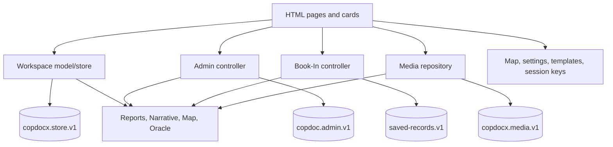

# COPDoc Stage 1 — Current Data Contract

**Contract status:** frozen description of the current implementation

**Base commit:** `980e5096414a74c16dd71be534b4f88ca456f364`

**Base tree:** `28e2ddd99bd4fbf9f3a78dc6466f8c338acd4408`

**Observed product version:** `0.69.2`

**Stage 0 additions included:** read-only integrity scan, verified safety archive,
and isolated known-risk characterization tests

This package freezes the data contract COPDoc actually persists and consumes.
It is not a redesign and it does not make inconsistent shapes look cleaner than
they are. When two copies can both win, the contract says **ambiguous**. When a
record is a projection or historical snapshot, the contract says so explicitly.

No file in this package authorizes a schema migration, field rename, repair,
deduplication, delete cascade, or change of authority. Those require later
stages and must continue to pass the Stage 0 safety gates.

## Evidence labels

- **VERIFIED** — traced to a current read/write path, constructor, storage call,
  or repeatable isolated test.
- **INFERRED** — strongly supported by the code, but dependent on browser state,
  runtime timing, or a workflow that was not executed end to end.
- **UNKNOWN / REVIEW** — persisted or referenced shape whose complete live use
  cannot be established safely from the repository alone.
- **RECOMMENDED** — intentionally excluded from this current-contract package.

## Package map

| File | Contract surface |
|---|---|
| [current-master-schema.md](current-master-schema.md) | TypeScript-style description of the effective current schemas and ER diagram. |
| [workspace-store.md](workspace-store.md) | Workspace root, Case/Lead, Person, shared objects, Associations, Investigations, Operations, Encounters, CRUD and projection rules. |
| [admin-bookin.md](admin-bookin.md) | Admin and Book-In stores, Officer/fleet/Shift, packet/form state, booking promotion and cross-store writes. |
| [storage-media-transfer.md](storage-media-transfer.md) | Complete storage-key inventory, IndexedDB Media, warrants handle, transfer/import and Stage 0 safety archive boundaries. |
| [narrative-reports.md](narrative-reports.md) | Narrative Build 9, reports, PDFs, baseball cards, warrants and field-change blast radius. |
| [map-operations-analytics-windows.md](map-operations-analytics-windows.md) | Map, Oracle, Operations/Investigations consumers and cross-window/session data flow. |
| [field-ownership.md](field-ownership.md) | Field authority, copies, joins, derivations, aliases and conflicts. |
| [architecture-manifest.json](architecture-manifest.json) | Machine-readable entities, fields, storage, relationships, workflows, functions, reports, events and risks. |

The explanatory Markdown is authoritative for nuance. The JSON manifest is the
automation/impact-analysis index and deliberately points back to source evidence.

## Effective architecture

**VERIFIED:** COPDoc is a static, framework-free, multi-page browser application.
Ordered classic scripts attach APIs to `window.COPDoc`; pages collect DOM state
and call those globals directly. There is no remote application API, server
database, module loader, or transactional unit of work. See
`functions/app-bar.js`, `functions/model/ui.js`, and the script lists in each
active HTML entry point.



The physical split matters: a single user action can write Workspace, Book-In,
Admin, and Media independently. LocalStorage has no cross-key transaction, and
current workflows do not provide a general rollback journal.

## Current source-of-truth register

| Domain | Effective current authority | Status |
|---|---|---|
| Case/Lead | `workspace.leads[leadId]` | **VERIFIED authoritative** for the Case aggregate. |
| Person | `workspace.people[personId]` and `Lead.person` | **VERIFIED ambiguous:** both can overwrite the other. |
| Field Encounter | `workspace.encounters[encounterId]` | **VERIFIED authoritative** working aggregate; `completed` is a persisted historical projection. |
| Encounter participation | `Encounter.subjects[]` | **VERIFIED aggregate-owned**, but identity, booking and outcome are duplicated elsewhere. |
| Arrest | `Lead.person.arrests[]` for reports | **VERIFIED split:** Book-In and EncounterSubject hold competing/bridging facts. |
| Book-In packet | Book-In record `formState` for reopen/PDF; top-level packet fields for search/join | **VERIFIED field-dependent split authority.** |
| Vehicle/Location | canonical Workspace dictionaries and embedded Lead/Encounter copies | **VERIFIED ambiguous:** stale embedded copies can write backward. |
| Relationship | `workspace.associations{}` is intended canonical; embedded Links/nesting remain writable projections | **VERIFIED incompletely enforced authority.** |
| Investigation | `workspace.investigations[investigationId]` | **VERIFIED authoritative** for wall state; nodes reference shared objects. |
| Operation | `workspace.operations[operationId]` | **VERIFIED authoritative** for plan; target freeze/order are intentional commit-time snapshots. |
| Officer/fleet/Shift | Admin state arrays | **VERIFIED authoritative** within Admin; event/report display copies are snapshots or free text. |
| Narrative | `Encounter.narratives[]` | **VERIFIED authoritative** persisted record; engine/UI state is a working copy. |
| Media bytes/metadata | IndexedDB `copdocx.media.v1` | **VERIFIED authoritative** for attachments; owner references are not database-enforced. |
| Map/Oracle | none | **VERIFIED derived views** over other stores plus map preference keys. |

## Contract rules for later work

1. Do not treat a constructor as the entire schema. Import paths and historical
   records can bypass it, and unknown fields currently survive some merges.
2. Do not rename an ID or field from one writer only. Search the manifest's
   writers, copies, joins, readers, reports, Narrative bindings, Map and Oracle.
3. Do not call embedded Person/Vehicle/Location data a read-only snapshot. The
   current save paths can project it back into shared dictionaries.
4. Do not call `Person.encounters[]`, criminal flags, Officer arrest counts,
   Encounter completion totals, supervisor summaries, or Operation order data
   primary facts. They are stored derivations/projections.
5. Do not treat `copdocx.transfer.v1` as exact recovery. Stage 0's
   `copdocx.safety-backup.v1` is the byte-preserving capture; restore remains a
   later, separately tested capability.
6. Do not invent missing entities or links during migration. Empty, malformed,
   legacy, duplicated, and unresolved values are evidence and must remain
   visible until an explicit migration policy exists.

## Validation

Run the complete frozen baseline and contract gate from the repository root:

```sh
node scripts/run-stage1.js
```

This first runs the Stage 0 persistence, Media, Narrative, integrity, backup,
and known-risk checks. It then verifies the Stage 1 manifest against the live
storage registry, domain-document package, entity and relationship references,
source citations, and Stage 0 risk catalog. A known risk remaining reproducible
is a passing characterization; remediation uses the separate strict gate.

## Stage 1 exit gates

| Gate | Evidence |
|---|---|
| Persisted objects inventoried | Every durable, semi-durable, transient and retired store is listed in the storage contract and manifest. |
| CRUD traced | Every primary persistent object has create/read/update/delete or explicit "none found" paths. |
| Field ownership visible | Important identity, event, booking, location, officer, relationship and output fields have owners, copies and consumers. |
| IDs and joins visible | Primary IDs, aliases, generation schemes and cross-store join fields are declared. |
| Current schema frozen | The TypeScript-style schema describes current writes, including inconsistencies and optional dynamic fields. |
| Machine contract valid | `node scripts/test-stage1-data-contract.js` validates structure, source references, entity/relationship links and complete storage-key coverage. |
| Runtime unchanged | Stage 1 adds documentation and contract validation only; all Stage 0 and existing offline tests remain green. |
