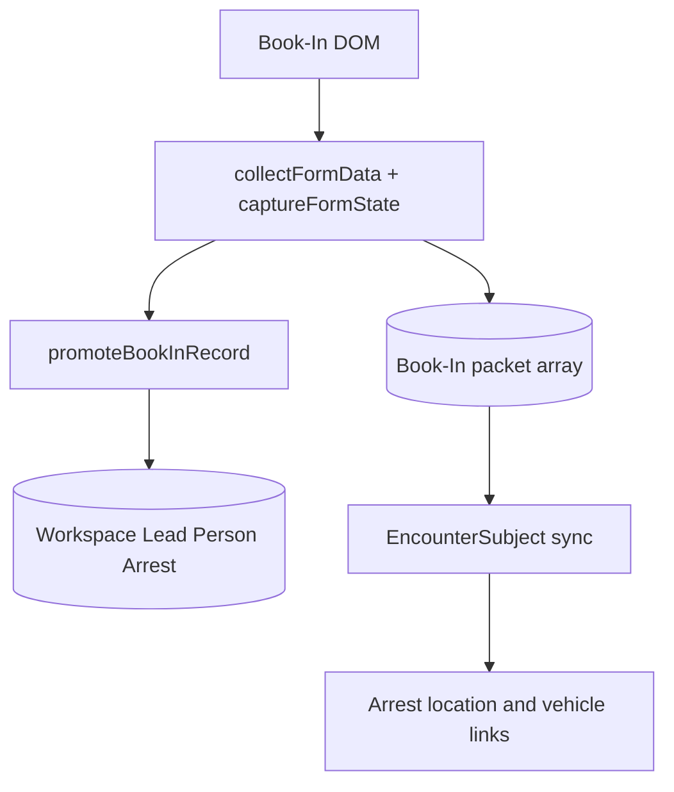
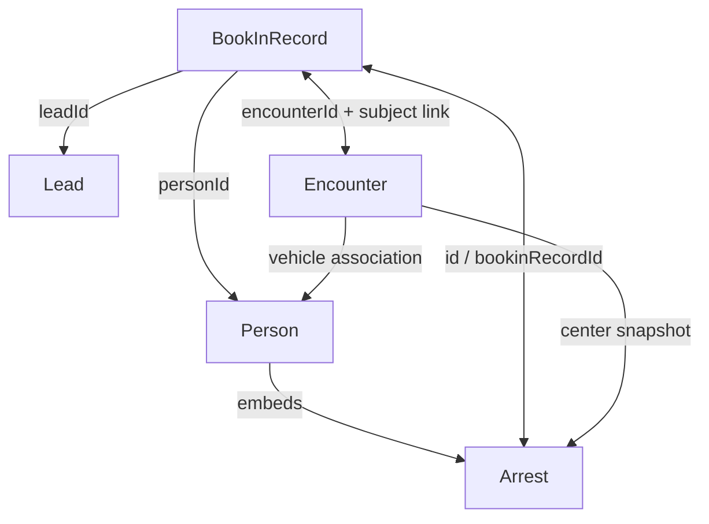

# Admin and Book-In Current Data Contract

**Contract status:** current implementation freeze; no redesign or migration is
proposed here.

**Scope:** Admin roster/fleet/schedule, Book-In packets and forms, their
Workspace projections, and the persistent/semi-persistent baseball-card path.

**Primary implementation:** `functions/admin.js`, `functions/book-in.js`,
`functions/officer-roster.js`, `functions/encounters.js`, and
`functions/model/store.js`.

## Evidence and field labels

- **VERIFIED** means the behavior is present in a current constructor, read or
  write path, caller, or consumer.
- **INFERRED** means the failure result follows from the verified ordering or
  browser storage semantics but was not forced in the live application for this
  contract pass.
- Field comments use **ID**, **required**, **optional**, **reference**,
  **duplicate**, **derived**, **snapshot**, **legacy**, and **UI-only**. A field
  can have more than one classification.
- “Required” below means required by the effective reader or always emitted by
  the named current writer. Import paths are called out where they weaken that
  guarantee.

## 1. Executive contract

**VERIFIED:** Admin and Book-In are not repositories over the Workspace store.
They are separate whole-value browser stores. Admin owns arrays of officers,
government fleet vehicles, and shifts. Book-In owns an array of packet records
whose `formState` is keyed by live DOM element IDs. An explicit Book-In save
also projects selected facts into Workspace `Lead`, `Person`, embedded `Arrest`,
and `EncounterSubject` records. There is no cross-key transaction
(`functions/workspace-config.js:entries:10-33`;
`functions/admin.js:writeDisk:350-363`;
`functions/book-in.js:writeSavedRecords:1497-1509`;
`functions/model/store.js:writeDisk:252-265`).

**VERIFIED:** Authority is field-dependent, not aggregate-wide:

| Domain fact | Effective current authority | Competing copies |
|---|---|---|
| Officer profile | `copdoc.admin.v1.officers[]` | Officer IDs/names/aliases are copied into Workspace events, Encounter fields, narratives, warrants, and `fieldArrests`. |
| Government fleet profile | `copdoc.admin.v1.vehicles[]` | Shift and Operation hold IDs; Workspace can independently contain a different `Vehicle` with the same ID shape. |
| Shift | `copdoc.admin.v1.shifts[]` | Operation availability derives from it; no Workspace Shift entity exists. |
| Editable Book-In packet | `alien-book-in.saved-records.v1[]`, especially `formState` | A top-level search/index copy exists on the same row. |
| Person identity after filing | **Ambiguous:** Workspace `Lead.person`/`people{}` are canonical for case UI, but a later Book-In save can overlay them | Book-In top-level fields and `formState`; EncounterSubject identity snapshot. |
| Arrest after filing | Workspace `Lead.person.arrests[]` is the report source | Book-In packet, EncounterSubject outcome, Admin `Officer.fieldArrests[]`. |
| Booking questionnaire | Book-In `formState` is the reopen/PDF source; `Arrest.booking` is a projection | Current DOM can generate a PDF without saving either copy. |
| Encounter participation | Workspace `Encounter.subjects[]` for Encounter UI | Book-In rows can recreate/upsert it; Narrative prefers linked Book-In rows when any exist. |
| Baseball card | `Person.immigration.baseballCards[]` in Workspace | Session handoff and live baseball form are transient; foreign-warrant facts are also copied onto `Person.criminal`. |

The split authority above follows the concrete readers and writers documented
below; it is not a recommended model.

## 2. Storage roots and version semantics

### 2.1 Exact connected stores

| Medium and exact key | Raw root | Owner / use | Schema and portability evidence |
|---|---|---|---|
| `localStorage["copdoc.admin.v1"]` | `{ officers?: [], vehicles?: [], shifts?: [] }` | Admin roster, fleet, schedule | Registry says owner `admin`, portable; root has no `schema` or version field (`functions/workspace-config.js:entries:10-15`; `functions/admin.js:state:92-100`). |
| `localStorage["alien-book-in.saved-records.v1"]` | `BookInRecord[]` | Book-In packets | Registry says owner `book-in`, portable; live root is an unwrapped array with no root schema/version (`functions/workspace-config.js:entries:12-15`; `functions/book-in.js:SAVED_RECORDS_STORAGE_KEY:183-204`). |
| `localStorage["alien-book-in.saved-record-columns.v1"]` | `string[]` | Visible Saved Records columns | Non-portable preference; allowed names are the ten `SAVED_RECORD_COLUMN_KEYS` (`functions/workspace-config.js:entries:14-16`; `functions/book-in.js:SAVED_RECORD_COLUMN_KEYS:188-204,2198-2230`). |
| `localStorage["copdocx.store.v1"]` | Workspace object with `schema`, dictionaries, and maps | Canonical Lead/Person/Arrest/Encounter projections | Separate `model/store` owner; root default/normalizer uses `copdocx.store.v1` (`functions/workspace-config.js:entries:10-13`; `functions/model/store.js:emptyState:18-38,164-218`). |
| `sessionStorage["copdocx.baseball.handoff.v1"]` | one `BaseballHandoff` object | Book-In-to-baseball navigation handoff | Session-only, non-portable, no embedded schema (`functions/workspace-config.js:entries:27-30`; `functions/book-in.js:openBaseballCard:4918-4966`; `functions/baseball-page.js:readHandoff:8-18,40-81`). |
| `localStorage["copdocx.baseball.card-style.v1"]` | style preference object | Baseball-card presentation only | Non-portable; not the saved card (`functions/workspace-config.js:entries:28-31`; `functions/baseballcard.js:450`). |
| IndexedDB `copdocx.media.v1` | Media metadata/blob stores | Baseball arrest photo and Admin media | Card stores `photoMediaId`, not bytes (`functions/workspace-config.js:entries:31-33`; `functions/baseball-page.js:savePhotoToMedia:692-739`). |
| `localStorage["copdocx.import.done.v1"]` | timestamp string | Transfer-popup notification only | Signal, not domain state (`functions/workspace-config.js:entries:16-18`; `functions/transfer.js:notifyOpenerImported:1540-1560`). |

**VERIFIED media boundary:** `copdocx.media.v1` is IndexedDB version 1. Its
`meta` object store has key path `mediaId` and non-unique indexes `ownerKey`,
`mediaClass`, `sha256`, and `ownerSha`; `blobs` uses compound key
`[mediaId, role]` (`functions/model/media.js:openDb:240-270`). Admin attaches
media under owners `OFFICER:<id>` and `VEHICLE:<id>`
(`functions/admin.js:paintAdminFormMediaLinks:1883-1936`); baseball uses
`PERSON:<personId>` and puts its Book-In join in metadata `documentId`. Media
metadata itself declares `schema = "copdocx.media.v1"`, while binary variants
are independent blob rows (`functions/model/media.js:createMedia:164-225`;
`functions/baseball-page.js:savePhotoToMedia:692-739`). The Admin and Book-In
JSON roots contain no owned media array, so their JSON save success says
nothing about IndexedDB save/removal success.

### 2.2 What the version labels actually mean

| Label | **VERIFIED** meaning |
|---|---|
| Admin key suffix `v1` | A key name only. Neither `readDisk()` nor `loadState()` validates an Admin root schema/version. Load-time migration is opportunistic and unversioned (`functions/admin.js:readDisk:303-332`; `functions/admin.js:loadState:380-392`). |
| Book-In key suffix `v1` | A key name only. The local root is still a raw array and each record has no required schema discriminator (`functions/book-in.js:readSavedRecords:1455-1495`). |
| `BOOKIN_FORMAT.recordsSchemaVersion = 3` | Version of the **dedicated JSON backup envelope**, not the localStorage root. Dedicated import accepts versions 1–3 and normalizes every row (`functions/book-in.js:BOOKIN_FORMAT:158-165`; `functions/book-in.js:parseRecordsBackup:1818-1886`). |
| `backupVersion = "1.10.0"` | Product-specific backup/file label carried as `backupFormatVersion`; it is distinct from schema 3 and app version (`functions/book-in.js:BOOKIN_FORMAT:158-165`; `functions/book-in.js:exportSavedRecords:1913-1924`). |
| `createdWithVersion` / `updatedWithVersion` | App-build provenance on full-form saves/imports, not a migration level. The Encounter quick-book producer omits both (`functions/book-in.js:saveCurrentRecord:2957-2987`; `functions/encounters.js:saveBookToEncounter:2355-2395`). |
| Workspace `schema` | Root discriminator/default `copdocx.store.v1`; individual Encounters use `copdocx.encounter.v1`. It does not make Admin/Book-In transactional (`functions/model/store.js:emptyState:21-35`; `functions/model/encounter.js:createEncounterRecord:320-359`). |

## 3. Pages and controller entry points

| Surface | Controller / model wiring | Current responsibility |
|---|---|---|
| `admin.html` | shared model scripts then `functions/admin.js` (`admin.html:103-115`) | Counts available officers/vehicles and canonical Workspace arrests; mounts today’s arrest roster. |
| `officers.html`, `officer.html`, `officer-form.html` | all set an Admin page mode and load `functions/admin.js` (`officers.html:10,60-66`; `officer.html:16`; `officer-form.html:16,278-286`) | List/view/edit Officer; form autosave creates a draft, explicit save commits. |
| `vehicles.html`, `vehicle.html`, `vehicle-form.html` | same controller (`vehicles.html:10,59-65`; `vehicle.html:10`; `vehicle-form.html:10,148-156`) | List/view/edit the government-fleet variant of Vehicle. |
| `schedule.html` | Admin controller and Officer/Vehicle factories (`schedule.html:10,27-80,104-110`) | Add and remove Shift rows; render current week. |
| `bookin.html` | Workspace model/store is loaded before `functions/book-in.js` (`bookin.html:966-987`) | Edit packets, save/autosave, import/export, promote to cases, produce CAP/medical PDF, launch baseball card. |
| `encounter-form.html` | `functions/encounters.js` | Has a second, sparse Book-In producer and links the result back to an Encounter (`functions/encounters.js:saveBookToEncounter:2291-2433`). |
| `baseballcard.html` | `functions/baseball-page.js` plus model/store/media | Hydrates canonical case plus session handoff and saves a card under Person (`functions/baseball-page.js:hydrateFromLead:257-323`; `functions/baseball-page.js:persistBaseballCard:773-911`). |

## 4. Current TypeScript-style contracts

These interfaces describe the effective current values. Optionality reflects
what can actually be on disk after legacy/transfer import, not only what the
factories prefer.

### 4.1 Shared lifecycle metadata

```ts
type ISODateTimeText = string;
type ISODateText = string;
type LocalDateTimeText = string; // normally YYYY-MM-DDTHH:mm, not guaranteed

interface LifecycleMeta {
  createdAt: ISODateTimeText;              // required on current Admin form writes
  updatedAt: ISODateTimeText;              // required; last-writer timestamp
  markedComplete: boolean;                 // derived lifecycle flag
  completedAt?: ISODateTimeText | "";      // emitted by stampMeta; older rows omit
  status: "draft" | "committed" | string; // required after Admin load migration
  committedAt: ISODateTimeText | "";       // empty for an unfiled draft
}
```

`stampMeta()` replaces rather than revisions this object and carries no
revision/ETag (`functions/model/util.js:stampMeta:65-77`). Missing Admin Officer
or Vehicle metadata is treated as already committed and backfilled on Admin
load (`functions/model/util.js:ensureRecordMeta:80-96`;
`functions/admin.js:migrateAdminList:278-299`).

### 4.2 Admin root, Officer, fleet Vehicle, and Shift

```ts
interface RawAdminRoot {
  officers?: Officer[];       // normalized in memory to []
  vehicles?: FleetVehicle[];  // normalized in memory to []
  shifts?: Shift[];           // normalized in memory to []
  [unknownRootField: string]: unknown;
}

interface AdminState {
  officers: Officer[];
  vehicles: FleetVehicle[];
  shifts: Shift[];
}

interface OfficerAddress { // duplicate/legacy editable mirror
  locationId: string;                    // optional reference-like ID
  locationAssociation: string;           // duplicate alias of association
  association?: string;                  // legacy/current alias
  targetPriority: string;
  parksHere: string;
  pinColor?: string;
  street: string;
  street2: string;
  city: string;
  state: string;
  zip: string;
  latLong: string;                       // duplicate of latitude/longitude
  latitude: string;
  longitude: string;
  [legacyField: string]: unknown;
}

interface OfficerLocation {
  locationId: string;                    // ID; factory mints loc_... when absent
  id?: string;                           // duplicate ID alias from createLocation
  entityType?: "LOCATION";
  association: string;
  locationAssociation?: string;          // duplicate alias
  targetPriority: string;
  parksHere: string;
  pinColor?: string;
  street: string;
  street2: string;
  city: string;
  state: string;
  zip: string;
  latLong?: string;                      // duplicate coordinate string
  latitude: string;
  longitude: string;
  junked?: boolean;
  junkedAt?: string;
  occupancy?: string;
  occupiedFrom?: string;
  occupiedTo?: string;
  notes?: string;
  otherResidents?: string;
  [legacyField: string]: unknown;
}

interface OfficerFieldArrest { // derived, persisted reference cache
  arrestId: string;      // reference to Person.arrests[].arrestId; may be empty
  encounterId: string;   // reference; may be empty
  personId: string;      // reference; may be empty
  bookedAt: ISODateTimeText;
}

interface Officer {
  officerId: string;           // ID + duplicate alias; current factory ofc_...
  id: string;                  // ID + duplicate alias
  entityType?: "OFFICER";     // current form writes it; transfer rows may omit
  lastName?: string;
  firstName?: string;
  middleName?: string;
  badge?: string;
  callSign?: string;
  duty?: "available" | "in-field" | "admin" | "leave" | "off" | string;
  role?: "tac-med" | "tl" | "atl" | "language" | "" | string;
  team?: string;
  eod?: ISODateText | string;
  phoneGov?: string;
  phonePrivate?: string;
  address?: OfficerAddress;       // duplicate/legacy; still written by form
  locations: OfficerLocation[];   // duplicate/current read preference
  qualifications: string[];
  qualOther?: string;
  equipment: string[];
  equipNotes?: string;
  fieldArrests?: OfficerFieldArrest[]; // derived, written outside admin.js
  junked?: boolean;               // archive flag dynamically added
  junkedAt?: ISODateTimeText | "";
  meta: LifecycleMeta;
  [importedOrLegacyField: string]: unknown;
}

interface FleetVehicle {
  vehicleId: string;        // ID + duplicate alias; current factory veh_...
  id: string;               // ID + duplicate alias
  entityType?: "VEHICLE";
  governmentVehicle: true;  // migration/form force true
  plate: string;            // duplicate alias, uppercased
  licensePlate: string;     // duplicate alias, uppercased
  plateState?: string;
  vehicleYear?: string;
  vehicleMake?: string;
  vehicleModel?: string;
  vehicleColor?: string;
  vehicleBodyStyle?: string;
  vin?: string;
  unit?: string;
  status?: "available" | "assigned" | "down" | "out" | string;
  barcode?: string;
  driverNumber?: string;
  assignedOfficerIds: string[]; // Officer references
  equipment: string[];
  junked: boolean;
  junkedAt: ISODateTimeText | "";
  occupancy?: string;       // inherited general Vehicle fields, not fleet UI
  occupiedFrom?: string;
  occupiedTo?: string;
  notes?: string;
  otherResidents?: string;
  meta: LifecycleMeta;
  // Current Admin form explicitly deletes registeredOwner,
  // registeredOwnerName, and locations before persistence.
  [importedOrLegacyField: string]: unknown;
}

interface Shift {
  id: string;            // ID; current writer uses sft-... hyphen format
  date: ISODateText;     // required by add UI
  officerId: string;     // required reference to Officer.id as picked by UI
  vehicleId: string;     // optional FleetVehicle.id reference; "" means none
  start: string;         // local HH:mm; defaults 06:00
  end: string;           // local HH:mm; defaults 14:00
  assignment: "field" | "transport" | "office" | "other" | string;
  [importedField: string]: unknown;
}
```

Factory evidence is `functions/model/officer.js:createOfficer:114-163`,
`functions/model/location.js:createLocation:40-76`, and
`functions/model/vehicle.js:createVehicle:18-108`. The Admin form’s actual
Officer payload is `functions/admin.js:addOfficer:2240-2276`; its actual fleet
payload and the three deleted general-Vehicle fields are
`functions/admin.js:addVehicle:2341-2379`. The Shift shape is written literally
by `functions/admin.js:addShift:2538-2558`.

**VERIFIED inconsistency:** `Officer.address` and `Officer.locations[0]` are
both persisted. When both have data, `syncOfficerPlaces()` treats `address` as
the input and replaces the location array; readers such as `officerAddress()`
then prefer `locations[0]` (`functions/model/officer.js:officerAddress:72-86`;
`functions/model/officer.js:syncOfficerPlaces:88-111`). `pinColor` is captured
on `address`, but both conversion functions omit it; the derived Location gets
the factory default `""`. Reloading the edit form from the preferred Location
therefore blanks the color (`functions/admin.js:readOfficerAddress:453-470`;
`functions/model/officer.js:locationFromAddress:11-33,addressFromLocation:35-53`;
`functions/admin.js:fillOfficerForm:1940-1967`).

### 4.3 Book-In local record and dynamic form state

```ts
interface FormControlSnapshot {
  checked: boolean; // meaningful for checkbox/radio, still emitted for all
  type: string;     // DOM input type or tag name
  value: string;
}

type BookInFormState = Record<string, FormControlSnapshot>;

interface BookInRecord {
  id: string;                    // required ID; UUID or record-... fallback
  revision?: number;             // inconsistent; see ID/revision table
  createdAt?: ISODateTimeText;
  updatedAt?: ISODateTimeText;
  createdWithVersion?: string;   // app version, absent on quick-book rows
  updatedWithVersion?: string;   // app version, absent on quick-book rows

  firstName?: string;            // duplicate of formState.firstName.value
  lastName?: string;             // duplicate
  aNumber?: string;              // duplicate of formState.alienNumber
  fbiNumber?: string;            // duplicate
  iceEvent?: string;             // duplicate
  encounterNumber?: string;      // event number text; not necessarily ID
  subjectRole?: "TARGET" | "COLLATERAL" | "" | string; // duplicate role
  encounterRole?: "TARGET" | "COLLATERAL" | "" | string; // duplicate role
  vehiclePosition?: "Driver" | "Passenger" | "Other" | "" | string;
  dateTime?: LocalDateTimeText;   // Book-In time, duplicate
  arrestTime?: string;           // local HH:mm, duplicate
  foreignWarrants?: "yes" | "no" | string;
  foreignWarrantCountry?: string;
  dateOfBirth?: ISODateText | string;
  age?: string;                  // derived; only some producers persist top-level
  countryOfCitizenship?: string; // mixed label/code semantics
  caseType?: string;             // immigration-disposition code
  team?: string;
  officersName?: string;         // quick-book/legacy top-level snapshot

  encounterId?: string; // reference to Workspace Encounter
  leadId?: string;      // reference to Workspace Lead
  personId?: string;    // reference to Workspace Person
  arrestId?: string;    // reference to embedded Workspace Arrest
  canonicalizedAt?: string; // legacy comparison-only field; no current writer

  formState: BookInFormState; // required by the Book-In page reader
  [preservedLegacyField: string]: unknown;
}

type BookInLocalStorageRoot = BookInRecord[];
```

`readSavedRecords()` only admits a plain object with a non-empty string `id` and
a plain-object `formState`; every other top-level property is optional to that
reader (`functions/book-in.js:readSavedRecords:1455-1495`). The full-form writer
emits the indexed fields shown at `functions/book-in.js:saveCurrentRecord:2957-2987`.
The Encounter quick-book writer emits a smaller row at
`functions/encounters.js:saveBookToEncounter:2355-2395`.

#### Exact current `formState` key surface

`captureFormState()` snapshots **every** `input`, `textarea`, and `select` with
an ID except controls marked `data-record-ignore="true"` and input
button/submit elements (`functions/book-in.js:captureFormState:1289-1326`). As
rendered by `bookin.html`, the current persisted keys are:

| Group | Keys and classification |
|---|---|
| Identity/event | `lastName`, `firstName`, `alienNumber`, `iceEvent`, `fbiNumber`, `encounterNumber`, `officersName`, `dateTime`, `arrestTime`, `foreignWarrants`, `foreignWarrantCountry`, `vehiclePosition`, `dateOfBirth`, `citizenship`, `immigrationDisposition`, `team` — primary form snapshots, many duplicated top-level. |
| Radio/derived controls | `encounterRoleTarget`, `encounterRoleCollateral`, `sexMale`, `sexFemale`; `arrestTimeManual`, `age`, `isCriminal` — role/sex snapshots plus derived or UI-control state. |
| Booking | `cash`, `travelDocs`, `propertyTag`, `cellNum`, `children`; `notPrimaryCaregiver` is a derived UI switch whose handler writes a fixed sentence into `children` (`functions/book-in.js:4899-4997`). |
| Medical | `communication_yes`, `communication_no`, `noMedicalIssues`; `q1_yes`, `q1_no`, `medicalIssues`; `q2_yes`, `q2_no`, `medicine`; for each N=3…13, `qN_yes`, `qN_no`, `qN_details`; `additionalObservations`, `referral_yes`, `referral_no`. |
| Accidentally persisted UI | `baseballCardOutput` and `loadLeadSelect`. They meet the generic capture predicate even though they are output/dialog state (`bookin.html:988-1002`; `functions/book-in.js:captureFormState:1292-1323`). |
| Deliberately omitted | `immigrationStatus` and `recordsImportFile` carry `data-record-ignore="true"`. Status can be promoted directly to Person during the current session but cannot be reconstructed from the saved packet (`bookin.html:285-296`; `functions/book-in.js:promoteBookInRecord:2895-2922`). |

The medical HTML surface is visible at `bookin.html:343-820`. Import’s known-ID
set is constructed from the same live DOM, so the two UI-only keys are also
accepted from a backup (`functions/book-in.js:getKnownRecordFieldIds:1519-1542`).
Legacy snake-case IDs are retained by `LEGACY_FORM_IDS`, including
`first_name`, `a_number`, `subject_role_target`, `date_time`, `case_type`,
`travel_docs`, `property_tag`, and `no_medical_issues`
(`functions/book-in.js:LEGACY_FORM_IDS:254-279`).

### 4.4 Collected form, backup wrapper, and canonical booking projection

```ts
interface BookInFormData { // current live DOM collection, not itself stored whole
  firstName: string;
  lastName: string;
  aNumber: string;
  fbiNumber: string;
  iceEvent: string;
  encounterNumber: string;
  subjectRole: string;
  vehiclePosition: string;
  officersName: string;
  dateTime: string;
  arrestTime: string;
  foreignWarrants: string;
  foreignWarrantCountry: string;
  dateOfBirth: string;
  age: string;                    // derived as of today
  gender: "Male" | "Female" | "";
  countryOfCitizenship: string;   // selected display label
  caseType: string;               // normalized code
  team: string;
  cash: string;
  travelDocs: string;
  propertyTag: string;
  cellNum: string;
  children: string;
  medicalIssues: string;
  medicine: string;
  communicationAnswer: "yes" | "no" | "";
  q1Answer: string;
  q2Answer: string;
  q3Answer: string; q3Details: string;
  q4Answer: string; q4Details: string;
  q5Answer: string; q5Details: string;
  q6Answer: string; q6Details: string;
  q7Answer: string; q7Details: string;
  q8Answer: string; q8Details: string;
  q9Answer: string; q9Details: string;
  q10Answer: string; q10Details: string;
  q11Answer: string; q11Details: string;
  q12Answer: string; q12Details: string;
  q13Answer: string; q13Details: string;
  additionalObservations: string;
  referralAnswer: "yes" | "no" | "";
}

interface BookInRecordsBackupV3 {
  format: "alien-book-in-records";
  schemaVersion: 3;
  appVersion: string;
  backupFormatVersion: "1.10.0";
  exportedAt: ISODateTimeText;
  recordCount: number;          // derived from records.length
  records: BookInRecord[];
}

interface BookingMedicalProjection {
  communicationAnswer: string; // normally "Yes" | "No" | ""
  noMedicalIssues: boolean;    // derived checkbox copied as fact
  medicalIssues: string;
  medicine: string;
  additionalObservations: string;
  referralAnswer: string;      // normally "Yes" | "No" | ""
  q1Answer: string;
  q2Answer: string;
  q3Answer: string; q3Details: string;
  q4Answer: string; q4Details: string;
  q5Answer: string; q5Details: string;
  q6Answer: string; q6Details: string;
  q7Answer: string; q7Details: string;
  q8Answer: string; q8Details: string;
  q9Answer: string; q9Details: string;
  q10Answer: string; q10Details: string;
  q11Answer: string; q11Details: string;
  q12Answer: string; q12Details: string;
  q13Answer: string; q13Details: string;
  [legacyField: string]: unknown;
}

interface ArrestBookingProjection {
  cash: string;
  travelDocuments: string; // alias of Book-In travelDocs
  propertyTag: string;
  holdingCellNumber: string; // alias of Book-In cellNum
  children: string;
  medical: BookingMedicalProjection;
  [legacyField: string]: unknown;
}
```

`BookInFormData` is emitted by `collectFormData()`
(`functions/book-in.js:collectFormData:1004-1092`). The backup wrapper is emitted
by `exportSavedRecords()` (`functions/book-in.js:exportSavedRecords:1913-1924`).
The projection is constructed by `bookInMedicalData()` and
`bookInPromotionInput()` (`functions/model/store.js:bookInMedicalData:1117-1169`;
`functions/model/store.js:bookInPromotionInput:1172-1327`).

### 4.5 Workspace Arrest written by Book-In

```ts
interface Arrest {
  arrestId: string;          // ID; arr_... factory value, preserved on upsert
  arrestDate: string;
  arrestTime: string;
  arrestDateTime: string;
  arrestCharge: string;      // not populated by Book-In; preserved/default ""
  arrestStatute: string;
  arrestClass: string;
  arrestAgency: string;
  arrestAgencyCode: string;
  arrestLocation: string;    // snapshot/derived from Encounter center when linked
  latitude: string;
  longitude: string;
  arrestingOfficer: string;  // display text snapshot, not a durable Officer FK
  arrestingOfficerId?: string; // accepted elsewhere; Book-In upsert does not copy it
  team: string;
  iceEventNumber: string;    // alias of packet iceEvent
  encounterNumber: string;   // event-number text
  encounterId: string;       // Encounter reference
  subjectRole: string;
  vehiclePosition: string;
  bookinRecordId: string;    // Book-In reference and upsert key
  bookInDateTime: string;
  booking: ArrestBookingProjection;
  [legacyOrNonBookInField: string]: unknown;
}
```

The default shape is `functions/model/person.js:createArrest:174-208`.
`upsertBookInArrest()` finds an existing arrest by `bookinRecordId`, overlays
Book-In fields and preserves its `arrestId`; otherwise it mints a new one
(`functions/model/store.js:upsertBookInArrest:1375-1441`). Although Encounter’s
conversion input contains `arrestingOfficerId`, the Book-In upsert’s explicit
overlay does not include that property, while it does copy the display name
(`functions/model/encounter.js:arrestInputFromSubject:248-272`;
`functions/model/store.js:upsertBookInArrest:1399-1428`).

### 4.6 Baseball handoff and saved card

```ts
interface BaseballHandoff { // semi-persistent session navigation payload
  from: "bookin";
  leadId: string;            // Lead reference
  bookinRecordId: string;    // Book-In reference
  firstName: string;
  lastName: string;
  age: string;               // derived snapshot
  country: string;           // display label snapshot
  alienNumber: string;
  disposition: string;       // display label snapshot
  arrestDate: string;
  foreignWarrants: "yes" | "no" | string;
  foreignWarrantCountry: string;
  isCriminal: boolean;       // derived/UI snapshot
}

interface BaseballCard {
  cardId: string;             // ID; bbc_... factory value
  generatedAt: ISODateTimeText;
  text: string;               // derived editable output snapshot
  html: string;               // derived sanitized output snapshot
  photoMediaId: string;       // IndexedDB Media reference
  arrestDate: string;         // snapshot/legacy fallback join
  disposition: string;        // display snapshot, not Person disposition authority
  bookinRecordId: string;     // preferred Book-In/Arrest join
  foreignWarrantsKnown: boolean;
  hasForeignWarrants: boolean;
  foreignWarrantCountry: string;
  photoDataUrl?: string;       // legacy field tolerated by consumers
  [legacyField: string]: unknown;
}
```

The handoff writer is `functions/book-in.js:openBaseballCard:4918-4966`; the
reader fills empty form values only after canonical Lead hydration
(`functions/baseball-page.js:hydrateFromLead:257-323`;
`functions/baseball-page.js:hydrateFromHandoff:325-355`). Persistent cards use
the factory at `functions/model/person.js:createBaseballCard:261-278` and are
upserted under `Person.immigration.baseballCards[]` at
`functions/baseball-page.js:persistBaseballCard:811-880`.

## 5. Identifiers, aliases, timestamps, and revisions

| Object | Creation / accepted identity | Revision/concurrency behavior | Status |
|---|---|---|---|
| Officer | Normal pages load `model.newId("ofc")`: `ofc_<base36 time>_<6 random>`; fallback is `ofc-<base36 time>-<5 random>`. Both `id` and `officerId` persist (`functions/model/util.js:newId:15-23`; `functions/admin.js:newId:175-183`; `functions/admin.js:addOfficer:2240-2251`). | No revision. `meta.updatedAt` is last-write metadata only. Both aliases are only filled when one is missing; disagreement is not repaired (`functions/admin.js:migrateOfficerRow:220-250`). | **VERIFIED** |
| FleetVehicle | Normal `veh_<time>_<random>`; both `id` and `vehicleId`. Imported values may be arbitrary (`functions/model/vehicle.js:createVehicle:18-28,68-83`; `functions/admin.js:migrateVehicleRow:253-275`). | No revision. Same alias-disagreement risk. | **VERIFIED** |
| Shift | `sft-<base36 time>-<5 random>` from Admin-local generator; no second ID (`functions/admin.js:addShift:2550-2558`). | No meta or revision; add/remove only. Transfer conflict uses timestamps if present, otherwise equal/unknown incoming wins (`functions/transfer.js:incomingIsNewer:231-249`). | **VERIFIED** |
| BookInRecord | `crypto.randomUUID()` where available; fallback `record-<epoch>-<random hex>` (`functions/book-in.js:createRecordId:1276-1287`). Encounter quick-book also prefers UUID, with shorter timestamp fallback (`functions/encounters.js:saveBookToEncounter:2323-2327`). | Dedicated import always normalizes `revision` to a nonnegative integer; inline-table save increments it. Full-form save neither initializes nor increments it, and quick-book omits it (`functions/book-in.js:normalizeImportedRecord:1700-1704`; `functions/book-in.js:saveInlineRecordEdit:2717-2719`; `functions/book-in.js:saveCurrentRecord:2957-2987`). | **VERIFIED: not a usable row version.** |
| BookIn inline edit | Same `id`; captures `baseUpdatedAt`. | Only this editor checks current `updatedAt` before save (`functions/book-in.js:beginInlineRecordEdit:2623-2660`; `functions/book-in.js:saveInlineRecordEdit:2677-2695`). | **VERIFIED partial optimistic concurrency.** |
| Person / Lead / Arrest / card | Model IDs use `p_`, Lead’s factory ID, `arr_`, and `bbc_` with the shared timestamp/random generator (`functions/model/person.js:createPerson:56-87,createArrest:174-208,createBaseballCard:261-278`). | No revision/ETag; Workspace whole-root writes and metadata timestamps govern replacement. | **VERIFIED** |

**VERIFIED alias hazard:** migration only fills a missing alias. If an imported
Officer has different `id` and `officerId`, or a fleet row has different `id`
and `vehicleId`, both survive. Callers then choose different precedence: Admin
schedule option values use `item.id`, disposition checks prefer the long ID,
and general roster lookup accepts either (`functions/admin.js:fillSelect:740-780`;
`functions/admin-disposition.js:rowId:7-14`;
`functions/officer-roster.js:get:62-74`).

## 6. Admin lifecycle and CRUD

### 6.1 Whole-root persistence

**VERIFIED:** `loadState()` parses the Admin value, normalizes missing arrays in
memory, backfills missing metadata, synchronizes Officer location aliases, and
may immediately rewrite the whole root (`functions/admin.js:adoptDisk:365-378`;
`functions/admin.js:loadState:380-392`). All ordinary Admin mutations call
`adoptDisk()` immediately before changing state, then serialize the entire
three-array `state`. Failed writes call `adoptDisk()` as an in-memory rollback
(`functions/admin.js:persistOrRollback:398-405`).

| Entity/action | Preconditions | Mutation and write | Delete/cascade behavior |
|---|---|---|---|
| Officer create/autosave | Quiet autosave requires at least a name unless editing; explicit save reports missing name. Phone/address validation can abort (`functions/admin.js:addOfficer:2179-2234`). | New ID, form payload, `createOfficer()`, then whole Admin root. Quiet mode stamps `draft`; explicit mode stamps `committed` (`functions/admin.js:addOfficer:2235-2310`). | None on create. Media becomes addressable after first saved ID. |
| Officer update | URL/edit ID resolves current row; controller re-reads disk before building record. | Replaces matching array row; existing unknown fields survive the `Object.assign`/factory merge. No stale-row check beyond the pre-write disk read (`functions/admin.js:addOfficer:2235-2287`). | Same path can revive or mutate imported fields; no revision. |
| Fleet create/update | At least unit, plate, VIN, or make for explicit save; quiet blank new form does nothing (`functions/admin.js:addVehicle:2312-2335`). | Draft/commit metadata and whole-root replacement. General Vehicle `registeredOwner*` and `locations` are deleted before write (`functions/admin.js:addVehicle:2336-2413`). | No fleet location/owner ownership despite using the general Vehicle factory. |
| Shift create | Date and Officer required; Vehicle optional (`functions/admin.js:addShift:2538-2548`). | Appends exact seven-field row and rewrites Admin root (`functions/admin.js:addShift:2550-2564`). | No update API; remove filters row by `id` (`functions/admin.js:shiftRemoveButton:838-868`). |
| Remove Officer from schedule | Existing Shift references. | Deletes every Shift with matching `officerId` (`functions/admin.js:removeFromScheduleButton:871-914`). | Shift rows are destroyed. |
| Remove fleet Vehicle from schedule | Existing Shift references. | Leaves Shift rows and sets matching `vehicleId = ""` (`functions/admin.js:removeFromScheduleButton:871-914`). | Intentional asymmetric behavior. |
| Archive Officer/Vehicle | Active row and confirmation. | Adds `junked=true`, `junkedAt=now`; references/media remain (`functions/admin.js:archiveButton:916-949`; `functions/admin-disposition.js:archive:24-28`). | Recoverable via restore, which clears both fields (`functions/admin.js:restoreButton:951-980`). |
| Permanent delete | Row must already be junked; Workspace must parse; reference checker must return none; typed label must match (`functions/admin.js:deleteRecordButton:982-1025`). | Removes row and writes Admin root first (`functions/admin.js:deleteRecordButton:1026-1032`). | Media removal is asynchronous afterward; failure leaves orphan media and only changes status (`functions/admin.js:deleteRecordButton:1033-1039`). |
| Transfer import | Row has a recognized ID, no duplicate within incoming set, and Officer/Vehicle is considered committed. | Merges by ID and `updatedAt`, writes whole Admin root separately for each selected type (`functions/transfer.js:cleanList:834-858`; `functions/transfer.js:applyImport:1272-1292`). | No constructor/schema validation at import time; later Admin load may backfill only aliases/meta/location mirror. |

### 6.2 Admin read consumers

| Fields | Current readers / effect | Evidence |
|---|---|---|
| `meta.status`, `junked` | Lists/pickers generally expose active committed rows. Missing meta means committed. | `functions/admin.js:rowCommitted:185-190,rowActive:196-203`; `functions/officer-roster.js:listCommitted:27-32,listFleet:39-44` |
| Officer name/badge/call sign | Roster display/search, case assignment, Encounter officer picker, warrant officer picker; alias is initials plus whitespace-stripped badge. | `functions/officer-roster.js:initials:76-101`; `functions/encounters.js:fillOfficerPick:256-281`; `functions/warrant-issue.js:committedOfficers:90-121` |
| Officer `duty` | Admin/Home available count, map label, Operation availability. | `functions/admin.js:paintStats:723-738`; `functions/home.js:paintSnapshot:131-162`; `functions/model/operation.js:officerAvailability:313-355` |
| Officer `team`, `role`, `qualifications` | Operation group picker/readiness table and narrative officer snapshot. | `functions/officer-roster.js:groupsByTeam:46-60`; `functions/operations.js:paintCells:930-977,openCellPicker:986-1033`; `functions/encounter-narrative.js:bundleFromEncounter:384-396` |
| Officer `address` / `locations` / coordinates | Admin map and global map Officer layer; active committed rows only on global map. | `functions/admin.js:collectOfficerPlaces:1462-1520`; `functions/map-targets.js:collectOfficers:854-909` |
| Fleet identity/status | Admin/Home availability, Shift display/picker, Operation team vehicle picker. | `functions/admin.js:paintStats:723-738,paintPickers:762-781`; `functions/home.js:paintSnapshot:131-162`; `functions/operations.js:paintCells:839-866` |
| Fleet `assignedOfficerIds` | Admin display and permanent-delete reference checker; not an Operation/Encounter staffing source. | `functions/admin.js:assignedOfficerNames:539-546`; `functions/admin-disposition.js:references:81-89` |
| Shift fields | Current-week Admin UI, Home’s today roster, Operation availability windows. | `functions/admin.js:paintWeek:1225-1288,paintShiftsTable:1290-1331`; `functions/home.js:paintSnapshot:175-191`; `functions/model/operation.js:officerAvailability:323-340` |
| `fieldArrests` | Integrity scanner only in current runtime search; Admin arrest counts do **not** read it. | `functions/officer-roster.js:recordFieldArrest:276-319`; `functions/integrity.js:scanAdminReferences:1782-1817`; `functions/admin.js:countBookInArrests:699-720` |

## 7. Book-In lifecycle and CRUD

### 7.1 Full-form path



The arrows show call order for an explicit save: promotion runs first, packet
write second, EncounterSubject sync third, then arrest-location and vehicle-link
writes (`functions/book-in.js:saveCurrentRecord:2925-3085`). They do **not**
denote one transaction.

| Action | Reads / validation | Writes | Current result |
|---|---|---|---|
| Quiet autosave | Current DOM; avoids promotion; blank new form is still capable of a row once any field changes. Triggered on `focusout` and `change` (`functions/book-in.js:requestAutoSave:4621-4634,bindBookInAutoSave:4636-4655`). | Book-In whole array, then linked EncounterSubject sync if `encounterId` exists. | Packet has no explicit draft flag and can have no Lead/Person/Arrest links. Subject sync still stamps `ARRESTED`/`IN_CUSTODY`. |
| Explicit save | Validates foreign-warrant country and encounter role; collects top-level + dynamic `formState` (`functions/book-in.js:saveCurrentRecord:2925-2987`). | Workspace promotion first; packet root next; Encounter and association writes afterward (`functions/book-in.js:saveCurrentRecord:2989-3035`). | A promotion error does not cancel packet save; it is reported as a warning. |
| Reconcile quiet/unlinked rows | On page initialization, finds packets missing any of Lead/Person/Arrest links but having identity (`functions/book-in.js:reconcileUnlinkedBookInRecords:2060-2085`). | Promotes each into Workspace, then rewrites packet array with links. | Quiet drafts can become committed Detainee cases merely by reopening Book-In. |
| Load packet | Looks up `id`; restores `formState`, then role fallback and in-memory IDs (`functions/book-in.js:loadSavedRecord:3087-3117`). | No persistence until autosave/edit. | Top-level values are not the main form hydration source. |
| Full-form update | Reads latest array and searches by in-memory `activeRecordId`. | Rebuilds top-level subset, replaces row, and promotes. Does not compare prior `updatedAt` or increment `revision` (`functions/book-in.js:saveCurrentRecord:2939-3009`). | Last writer to the same active row wins. If another window deleted it, this path creates a new ID rather than reporting the deletion. |
| Inline-table update | Reads latest row and checks captured `updatedAt`; requires name or A-number (`functions/book-in.js:saveInlineRecordEdit:2677-2701`). | Synchronizes a selected top-level subset and `formState`, increments `revision`, promotes, then writes packet root (`functions/book-in.js:saveInlineRecordEdit:2702-2748`). | Only Book-In editor with an explicit stale-write check. |
| Delete packet | Confirms and filters packet array by `id` (`functions/book-in.js:deleteSavedRecord:3119-3139`). | Book-In only, then calls upsert-only Encounter sync (`functions/book-in.js:deleteSavedRecord:3140-3150`). | Does **not** delete canonical Lead/Person/Arrest/history/card/associations and does not remove the existing EncounterSubject. |
| Start new | Clears in-memory `pendingLeadId`, `activeRecordId`, and DOM (`functions/book-in.js:startNewRecord:3152-3158`). | None until autosave. | Does not delete prior packet. |
| Cancel encounter Book-In | Only unlinks current packet when it belongs to the Encounter and lacks both Lead and Person references (`functions/book-in.js:cancelEncounterBookIn:3181-3205`). | Clears packet `encounterId` and `encounterRole`; calls Encounter sync. | Filed packet/canonical objects remain linked; `subjectRole` and form radio state are not cleared. |
| Load from case | Reads Workspace Lead/Person and most recent Arrest, fills DOM, sets role TARGET (`functions/book-in.js:fillBookInFromLead:3212-3295`). | None until save/autosave. | Creates a reverse flow from Workspace into an independent packet editing surface. |
| Generate CAP/medical PDF | Reads **current DOM** through `collectFormData()` (`functions/book-in.js:generateCombinedPacket:4341-4397`). | Downloads an editable PDF; no Document entity and no mandatory packet save. | Generated content can differ from both packet and canonical Arrest. |

### 7.2 Encounter quick-book path

**VERIFIED:** `saveBookToEncounter()` is a second producer with a narrower
contract. It first saves the Encounter draft, constructs a four-field booking
subset (`cash`, `travelDocuments`, `children`, minimal `medical`), commits a
Workspace Detainee Lead/Person/Arrest, then appends a sparse Book-In packet. It
subsequently updates the EncounterSubject, vehicle associations, Admin
`fieldArrests`, and the Encounter again
(`functions/encounters.js:saveBookToEncounter:2291-2433`).

Differences from full-form records are **VERIFIED**:

- no `createdWithVersion`, `updatedWithVersion`, `revision`, `fbiNumber`,
  `iceEvent`, `foreignWarrants`, `caseType`, or full medical keys;
- `officersName` is top-level here but normally lives only in full `formState`;
- booking omits `propertyTag` and `holdingCellNumber`;
- `encounterNumber` exists only in sparse `formState` and is set to the actual
  `encounterId`;
- `writeBookinRecords()` is an unguarded whole-array `localStorage.setItem`
  (`functions/encounters.js:bookinRecords:1603-1615`).

### 7.3 Import/export paths

| Path | Validation / merge | Store order and semantics |
|---|---|---|
| Dedicated Book-In export | Exports only rows admitted by `readSavedRecords()` in the v3 wrapper (`functions/book-in.js:exportSavedRecords:1913-1931`). | No Workspace or Media included. |
| Dedicated Book-In import | Max 10 MB/5,000 rows; validates envelope schema 1–3, timestamps, ID length, `formState`, known DOM IDs, and field length. Normalizer emits a fixed top-level subset and drops unknown top-level fields (`functions/book-in.js:normalizeImportedFormState:1573-1618`; `functions/book-in.js:normalizeImportedRecord:1633-1815`; `functions/book-in.js:parseRecordsBackup:1818-1886`). | Replace/merge promotes **all resulting rows into Workspace first**, then writes Book-In (`functions/book-in.js:importRecordsBackupFile:2087-2148`). Same-ID non-equivalent rows are preserved with a new packet ID (`functions/book-in.js:mergeImportedRecords:1974-2017`). |
| General transfer export | Envelope `copdocx.transfer.v1`; Book-In date filter uses packet `updatedAt/createdAt`. Encounter export also adds matching Book-In packets (`functions/transfer.js:collectExport:473-529`; `functions/transfer.js:recordDay:170-192`). | Officer/Vehicle export filters committed but does not exclude junked rows; Shifts and Book-In rows are unfiltered beyond IDs/date (`functions/transfer.js:listType:301-345`). |
| General transfer Book-In import | Accepts `alien-book-in-records` without checking its schema version; `cleanList()` only requires a unique recognizable ID for Book-In (`functions/transfer.js:parseTransfer:757-831`; `functions/transfer.js:cleanList:834-858`). Same ID is replaced only when incoming is not older; links missing on incoming are copied from local (`functions/transfer.js:mergeById:872-930`). | Writes Book-In first, then batch-promotes Workspace, then rewrites packet links (`functions/transfer.js:applyImport:1250-1270`; `functions/transfer.js:promoteStoredBookInCases:968-991`). This is the opposite order from dedicated import. |
| General transfer Admin import | Unique ID + committed check only; no Officer/Fleet/Shift schema validation (`functions/transfer.js:cleanList:834-858`). | Each selected Admin array is merged into the whole Admin object and written separately (`functions/transfer.js:applyImport:1272-1292`). |

`promoteBookInRecords()` loops and commits each row independently. It can return
a mixture of linked and failed rows; there is no rollback of earlier case saves
(`functions/model/store.js:promoteBookInRecords:1654-1687`).

## 8. Book-In to Workspace projection contract

### 8.1 Identity selection and Lead creation

**VERIFIED:** promotion chooses an existing identity in this order: explicit
`leadId`; explicit `personId`; normalized A-number; FBI number; exact normalized
first + last + DOB. Otherwise it creates a Person. It forces both Lead and
Person `caseRole = "DETAINEE"`, sets `source.leadSource = "BOOK_IN"` only when
empty, derives `source.caseNumber` only when empty, appends one history event per
`bookinRecordId`, and commits the Lead
(`functions/model/store.js:promoteBookInToLead:1447-1616`).

| Packet/form source | Workspace destination | Write rule / classification |
|---|---|---|
| `firstName`, `lastName` | `Person.name.*` | Overlay only when incoming non-empty; duplicate identity. |
| sex radio / legacy `gender` | `Person.sex` | Normalized then non-empty overlay; duplicate. |
| `dateOfBirth`, derived `age` | `Person.dateOfBirth`, `Person.age` | Non-empty overlay; age may be current-day or arrest-day derived. |
| `citizenship` / `countryOfCitizenship` | `Person.citizenship` | Catalog normalized; duplicate with mixed label/code packet value. |
| `alienNumber` / `aNumber` | `Person.immigration.alienNumber` | Digits normalized; also an identity-match key. |
| `immigrationDisposition` / `caseType` | `Person.immigration.disposition` | Catalog code; non-empty overlay. |
| ignored DOM `immigrationStatus` | `Person.immigration.status` | Explicit-save session value only; not recoverable from packet. |
| `fbiNumber` | `Person.criminal.fbiNumber` | Non-empty overlay and identity-match key. |
| foreign-warrant fields | `Person.criminal.foreignWarrantsKnown`, `hasForeignWarrants`, `foreignWarrantCountry` | Full-form promotion sets known true and can explicitly clear “yes” to “no”. |
| Book-In identity | `Lead.person`, `Lead.subjectPersonId`, `Lead.caseRole`; Workspace `people{}` | Person is embedded and copied into the registry by `saveLead()` (`functions/model/store.js:saveLead:306-365`). |
| `iceEvent` or `encounterNumber` | `Lead.source.caseNumber` | Only when existing Case source number is empty. |
| packet `id` | `Lead.history[].bookinRecordId` | One “book-in” event per packet ID. |

The overlay implementation is
`functions/model/store.js:overlayBookInPerson:1329-1373`. Consequently, clearing
name/DOB/A-number/FBI/disposition/status in a packet does not clear a previously
populated canonical Person; other Arrest/booking fields are overlaid differently.

### 8.2 Arrest, EncounterSubject, location, and vehicles

| Source | Destination | Rule / authority consequence |
|---|---|---|
| Packet ID | `Arrest.bookinRecordId` + packet `arrestId` back-reference | Arrest upsert key is `bookinRecordId`; packet holds reverse join only after link write succeeds (`functions/model/store.js:upsertBookInArrest:1375-1441`). |
| `dateTime` + `arrestTime` | `bookInDateTime`, `arrestTime`, `arrestDate`, `arrestDateTime` | Generic mapper combines times and rolls arrest to prior day when its clock is later than Book-In clock (`functions/model/store.js:combineBookInArrestDateTime:1080-1115`). **But full-form save explicitly supplies `arrestDateTime = data.dateTime`, so its canonical timestamp is Book-In time, not the selected arrest clock** (`functions/book-in.js:promoteBookInRecord:2914-2917`; `functions/model/store.js:promoteBookInRecord:1637-1644`). |
| officer text/team/event/role/vehicle position | corresponding Arrest scalars | Snapshot strings; no FK validation (`functions/model/store.js:upsertBookInArrest:1399-1428`). |
| booking/medical form | `Arrest.booking` | Nested merge over prior booking; Book-In raw form remains separate (`functions/model/store.js:upsertBookInArrest:1427-1434`). |
| linked packet row | `Encounter.subjects[]` | Upsert by packet ID or Person ID; no deletion reconciliation. Always forces `outcome="ARRESTED"`, `custody="IN_CUSTODY"` (`functions/book-in.js:syncEncounterSubjects:2523-2582`). |
| Encounter center pin | Arrest location/coordinates | Fills only empty arrest location fields for matching Encounter/packet (`functions/model/store.js:stampArrestsFromEncounter:2200-2245`; `functions/model/store.js:applyEncounterLocationToArrests:2270-2293`). |
| Encounter embedded vehicles/locations | Workspace Vehicle/Location dictionaries, Lead nesting, Associations | Upserts Person→Vehicle association with reason `LE_ENCOUNTER_IN_VEHICLE`, source IDs; one Workspace write after internal mutations (`functions/model/store.js:linkEncounterVehiclesToPerson:1694-1813`). |

### 8.3 Relationship topology



**VERIFIED:** joins are redundant and manually synchronized. No storage engine
foreign key enforces `BookInRecord.leadId/personId/arrestId/encounterId`,
`Arrest.bookinRecordId/encounterId`, or
`EncounterSubject.bookinRecordId/personId/leadId`.

## 9. Field lineage and consumer precedence

### 9.1 Book-In field groups

| Fact | Writes/copies | Important reads | Effective precedence / contradiction |
|---|---|---|---|
| Name, DOB, A-number, FBI | DOM → packet top-level + `formState` → Person; EncounterSubject gets selected identity scalars | Packet list, case identity, Narrative, arrest report, CAP/medical PDF, baseball | `bookInStateValue()` prefers a **non-empty** form value then top-level; Narrative’s `formValue()` treats an existing form entry as authoritative even when empty, though some call sites add a top-level fallback (`functions/model/store.js:bookInStateValue:949-971`; `functions/encounter-narrative.js:formValue:46-62,bundleFromEncounter:252-288`). |
| Citizenship | Full save top-level stores selected **label**; `formState.citizenship` stores option **code**; inline edit writes top-level code; Person stores normalized code | Saved list, Person, Narrative/PDF/baseball | Same field has mixed semantics by producer (`functions/book-in.js:selectedOptionText:292-301`; `functions/book-in.js:collectFormData:1035-1041`; `functions/book-in.js:saveInlineRecordEdit:2702-2725`). |
| Sex/gender | Form radio values lowercase; collected `gender` is title case; normal packet has no top-level sex; Person is normalized | Medical gender logic, Person, PDF, Narrative | Three names/casings; form radio state is the durable packet copy (`functions/book-in.js:getSexLabel:281-289`; `functions/model/store.js:bookInPromotionInput:1172-1184`). |
| Encounter role | `subjectRole`, `encounterRole`, two form radio entries, EncounterSubject role, Arrest role | Encounter UI, Narrative, reporting | Full writer duplicates role; unlink paths commonly clear only `encounterId` or `encounterRole`, leaving other copies (`functions/book-in.js:saveCurrentRecord:2971-2984`; `functions/encounters.js:unlinkEncounterSubject:2154-2185`; `functions/encounters.js:unlinkBookinPacketsFromEncounter:2716-2730`). |
| Encounter number vs ID | User text `encounterNumber`; FK `encounterId`; quick-book uses ID as number | Arrest report accepts either; lists fall back to ID | Semantically distinct fields are used as fallback aliases (`functions/model/store.js:bookInPromotionInput:1288-1294`; `functions/arrest-report.js:collect:221-236`). |
| Book-In/arrest times | DOM stores Book-In datetime, arrest clock, and manual/default flag; Arrest stores four time fields | PDF uses Book-In time; reports prefer Arrest datetime; Narrative uses Book-In time | Default arrest clock is one hour before Book-In, but full-form canonical `arrestDateTime` uses Book-In datetime as noted above (`functions/book-in.js:getDefaultArrestTime:549-575`; `functions/arrest-report.js:collect:260-267`). |
| Officer | Full form free text; quick book resolves roster ID to display text; EncounterSubject retains `arrestingOfficerId`; Arrest gets text; Admin cache gets ID + Arrest ref | Narrative/report text, Encounter UI, integrity | No single Officer join survives into canonical Arrest. Standard Book-In never updates `fieldArrests` (`functions/encounters.js:saveBookToEncounter:2328-2349,2415-2426`; `functions/officer-roster.js:recordFieldArrest:276-319`). |
| Team | Packet string; Arrest string; Encounter root team; Officer organizational team | Operations, reports, Narrative | Same label “team” represents officer organization, encounter team, and booking snapshot; joined by value nowhere. |
| Medical answers | DOM/`formState`; `noMedicalIssues` is derived from applicable “No” answers; details auto-select “Yes”; projection copied to Arrest booking | Medical PDF, CAP summaries, Narrative closing fields | Both detailed answers and derived master flag persist, allowing inconsistent imported values (`functions/book-in.js:syncNoMedicalIssuesCheckbox:400-447,selectMedicalQuestionYes:450-463`; `functions/book-in.js:4710-4825`). |
| Cash/docs/property/cell/children | DOM/`formState` → Arrest booking projection | CAP page, Narrative cash/docs/children, arrest consumers | Quick-book omits property/cell and uses a minimal medical object; packet remains richer source. |
| Criminal flag | Loaded/derived from Person into disabled `isCriminal`; generically captured; sent in baseball handoff | Baseball form/output | Book-In promotion does not map it back to `Person.criminal.isCriminal`, so it is a UI-derived snapshot, not a booking write (`bookin.html:185-195`; `functions/book-in.js:fillBookInFromLead:3250-3259`; `functions/book-in.js:openBaseballCard:4939-4941`). |
| Immigration status | Hidden ignored control → Person only during live explicit promotion | Case/Baseball | Saved packet cannot replay the field after reload/import. |

### 9.2 Reports and views

**VERIFIED:** the arrest roster/report enumerates committed Workspace Leads and
embedded Person arrests. It joins a Book-In packet by
`Arrest.bookinRecordId` only as a fallback for event fields, and joins the
BaseballCard first by packet ID then legacy arrest date
(`functions/arrest-report.js:cardForArrest:127-154`;
`functions/arrest-report.js:collect:166-269`). Therefore packet deletion does
not remove the arrest row, but can remove fallback details/open links.

**VERIFIED:** Narrative’s Encounter adapter reads the Book-In and Admin keys
directly. If any Book-In rows are linked to the Encounter, it does not fall
back to `Encounter.subjects[]`; rows without a recognized role merely increment
an unassigned count. Every emitted participant is assigned
`finalOutcome="ARRESTED"`, and the reporting officer is a fuzzy display-name
match against all Admin officers without active/committed filtering
(`functions/encounter-narrative.js:bookinRecords/readAdmin:7-24`;
`functions/encounter-narrative.js:bundleFromEncounter:185-231,252-340,384-396`).

**VERIFIED:** CAP and medical documents are filled from live `BookInFormData`,
not the persisted `Arrest.booking`. CAP consumes identity, event, officer,
case type, children, cash, travel documents, property tag, Book-In datetime,
cell, and team (`functions/book-in.js:fillCapPage:3909-3982`). Medical consumes
identity, age, DOB, gender, citizenship, officer, event, all questionnaire
answers/details, observations, and referral
(`functions/book-in.js:fillMedicalPdf:4025-4332`).

## 10. Derived data and statistics

| Derived value | Source → calculation → stored/output | Risk / authority |
|---|---|---|
| Officer alias | first/middle/last initials + whitespace-stripped badge → uppercase alias | Calculated on demand, then sometimes persisted as history/Narrative display snapshot (`functions/officer-roster.js:initials/alias:76-101`; `functions/model/store.js:assignedOfficerStamp:514-537`). |
| Admin available counts | active + committed + `duty/status === "available"` → dashboard | Derived on demand (`functions/admin.js:paintStats:723-738`). |
| Admin arrest week/FY | committed Workspace Person arrests → Sunday–Saturday week; federal year starts October 1 | Does not use Officer `fieldArrests` or packet count (`functions/admin.js:countBookInArrests:681-720`). |
| Home weekly Book-Ins | packet `updatedAt/createdAt` date in current Sunday–Saturday week | Counts saved packets by edit time, not canonical arrest date; can disagree with Admin (`functions/home.js:paintSnapshot:131-162`). |
| Officer `fieldArrests[]` | quick Encounter booking → append reference tuple | Persisted derived cache; not current dashboard source. Empty `arrestId` entries never dedupe because dedupe is conditional on truthy ID (`functions/officer-roster.js:recordFieldArrest:298-314`). |
| `age` | DOB → whole years as of today in form; canonical mapper derives as of arrest date only if no captured age | Persisted in Person/form and sometimes packet top-level; results can differ around a birthday (`functions/age.js:calculateAge:42-65,updateAgeDisplay:75-110`; `functions/model/store.js:bookInAgeOnDate:1036-1065`). |
| `arrestTime` default | Book-In datetime minus 60 minutes | Derived but stored; manual-state flag is also stored (`functions/book-in.js:getDefaultArrestTime:549-575`). |
| `noMedicalIssues` | All applicable questions marked No; q5/q6 excluded for Male | Both component answers and derived Boolean persist (`functions/book-in.js:syncNoMedicalIssuesCheckbox:387-435`; `functions/model/store.js:bookInMedicalData:1117-1169`). |
| EncounterSubject arrest/custody | Existence of linked Book-In packet → hard-coded Arrested/In Custody | Persisted inference can overwrite the event’s independent outcome semantics (`functions/book-in.js:syncEncounterSubjects:2553-2573`). |
| Lead source/case number | promotion → `BOOK_IN`; first non-empty ICE event/encounter number | Persisted only if existing source fields are empty (`functions/model/store.js:promoteBookInToLead:1561-1568`). |
| Card text/HTML | canonical/handoff form + editor → text and sanitized HTML | Intentional persisted output snapshot with no revision (`functions/baseball-page.js:persistBaseballCard:780-870`). |

## 11. Cross-window and cross-view synchronization

| Domain | Mechanism | Listener behavior | Failure/race condition |
|---|---|---|---|
| Admin | Browser `storage` event on exact Admin key | Calls `adoptDisk()` only; it does not call `paint()` or reload an open form (`functions/admin.js:2656-2662`). | Visible page/form can remain stale. A later mutation re-reads disk, but user intent was based on stale values. |
| Book-In list | Browser `storage` event on exact packet key | Calls `renderSavedRecords()` only (`functions/book-in.js:4891-4895`). | Open DOM form, `activeRecordId`, `pendingLeadId`, and saved signature are not rehydrated. Full-form save has no `updatedAt` conflict check and can overwrite the row. |
| Book-In active context | In-memory variables plus query parameters | `activeRecordId`/`pendingLeadId` are process-local; URL can carry `recordId`, `leadId`, `encounterId` (`functions/book-in.js:state:232-241`; `functions/book-in.js:rememberLeadInUrl:3297-3318`). | Separate tabs have independent active selections. |
| Baseball | Same-tab `sessionStorage` handoff plus URL IDs | Canonical Lead is loaded first; handoff fills blanks (`functions/baseball-page.js:queryLeadId/activeHandoff:49-81,hydrateFromLead/handoff:257-355`). | Missing/old session handoff is tolerated, but payload has no timestamp/version and remains until overwritten. |
| Transfer popup | `localStorage` timestamp, `postMessage("copdocx-import-done")`, direct opener reload/focus | Best-effort notification after independent writes (`functions/transfer.js:notifyOpenerImported:1540-1560`). | No atomic acknowledgement of which roots succeeded. |

**VERIFIED:** there is no `BroadcastChannel` in these Admin/Book-In flows. Live
coordination is storage-event and direct navigation/opener behavior.

## 12. Relationship integrity and deletion boundaries

### 12.1 Admin references checked before permanent delete

`adminDisposition.references()` checks:

- Shift `officerId` / `vehicleId`;
- fleet `assignedOfficerIds` for Officer deletion;
- Lead and Investigation `assignedOfficerId`;
- Operation team `vehicleId` and member `officerId`;
- embedded Lead/Encounter vehicle IDs;
- any coordinates on the Admin record itself, reported as a mapped-location
  blocker (`functions/admin-disposition.js:references:57-156`).

**VERIFIED omissions:** it does not scan Encounter `officerIds[]`,
EncounterSubject `arrestingOfficerId`, subject `shared.officerIds[]`, completed
Encounter snapshots, Lead history `officerId`, Narrative officer snapshots,
Operation order snapshots, Workspace `associations{}`, the Workspace Vehicle
dictionary, or Admin Officer `fieldArrests` joins. Those shapes demonstrably
exist at `functions/model/encounter.js:createEncounterSubject:51-100,sharedStopFromEncounter:126-151,createEncounterRecord:320-393`,
`functions/model/store.js:assignedOfficerStamp:514-537`, and
`functions/encounter-narrative.js:bundleFromEncounter:384-396`.

**INFERRED failure:** a permitted Officer/Vehicle delete can therefore leave
unresolved ID snapshots. Conversely, a government-fleet ID that happens to
equal an unrelated Workspace embedded Vehicle ID can block deletion because
Admin and Workspace share the same `veh_` ID namespace but not the same owner.

### 12.2 Book-In and Encounter deletes

- Deleting a Book-In row removes only the packet array member. Canonical
  Person/Lead/Arrest, history, BaseballCard, associations, and Admin field-arrest
  cache remain (**VERIFIED**;
  `functions/book-in.js:deleteSavedRecord:3119-3150`).
- The post-delete `syncEncounterSubjects()` only upserts packets still present;
  it never removes an EncounterSubject, so the deleted packet reference remains
  (**VERIFIED**; `functions/book-in.js:syncEncounterSubjects:2523-2582`).
- Deleting an Encounter first clears packet `encounterId`, then calls Workspace
  deletion. It intentionally keeps cases/packets; it does not clear canonical
  Arrest `encounterId` or role copies (**VERIFIED**;
  `functions/encounters.js:deleteEncounterRecord:2733-2780`).
- If Workspace Encounter deletion fails after packet unlink, the Encounter
  remains while its packets are already detached (**INFERRED from verified
  order**; `functions/encounters.js:deleteEncounterRecord:2761-2767`).

## 13. Duplicate/alias register

| Same conceptual fact | Persisted names/copies | Current synchronization |
|---|---|---|
| Officer ID | `Officer.id`, `Officer.officerId`, all foreign IDs | Missing alias backfilled; disagreement preserved. |
| Fleet ID | `FleetVehicle.id`, `vehicleId` | Missing alias backfilled; disagreement preserved. |
| Officer place | `Officer.address`, `locations[0]`; `association` / `locationAssociation`; `latLong` / coordinates | Destructive one-way conversion based on which copy has data; not revisioned. |
| Plate | `plate`, `licensePlate` | Admin migration/form copies and uppercases both. |
| Book-In identity | top-level fields, `formState`, Person, EncounterSubject snapshot | Explicit save overlays; no invalidation or common authority. |
| Book-In role | `subjectRole`, `encounterRole`, radio IDs, EncounterSubject, Arrest | Writers usually align them; unlink/delete paths do not. |
| A-number | packet `aNumber`, form `alienNumber`, Person `immigration.alienNumber` | Adapter aliases and digit normalization. |
| Citizenship | `countryOfCitizenship`, form `citizenship`, Person `citizenship` | Mixed label/code producer behavior. |
| Case type | packet `caseType`, form `immigrationDisposition`, Person `immigration.disposition`, card `disposition` | Code normalization for Person; card/handoff commonly display label. |
| Event number | `iceEvent`, `iceEventNumber`; `encounterNumber`; actual `encounterId` | Fallbacks blur event number and record ID. |
| Time | packet `dateTime`, Arrest `bookInDateTime`, `arrestTime`, `arrestDate`, `arrestDateTime`, Encounter `startedAt` | Different producers use different derivation path. |
| Officer on arrest | free-text `officersName`/`arrestingOfficer`, Encounter `arrestingOfficerId`, Admin `fieldArrests` | Quick-book bridges them; full Book-In has text only. |
| Booking fields | `travelDocs`/`travelDocuments`, `cellNum`/`holdingCellNumber`, raw questionnaire/projected medical | Promotion copies subset; quick producer is sparse. |
| Foreign warrants | packet yes/no/country, Person booleans/country, BaseballCard snapshot | Explicit Book-In and baseball saves can update Person; card retains historical/current mixture. |
| Person object | `Lead.person` and Workspace `people[personId]` | `saveLead()` writes both, but imports/other aggregate saves can drift them. |

## 14. Failure and partial-write map

| Severity | Verified ordering / validation gap | **INFERRED concrete failure state** |
|---|---|---|
| **CRITICAL** | `readSavedRecords()` catches malformed JSON or non-array roots as `[]`; normal save proceeds to `writeSavedRecords()` (`functions/book-in.js:readSavedRecords:1455-1495`; `functions/book-in.js:saveCurrentRecord:2939-3009`). | One save can replace a damaged/non-array Book-In root with only the current row. Invalid individual rows are filtered and disappear on the next whole-array write. |
| **CRITICAL** | Explicit full save promotes Workspace before writing Book-In (`functions/book-in.js:saveCurrentRecord:2989-3009`). | Quota/private-mode failure on packet write leaves a committed Lead/Person/Arrest whose `bookinRecordId` has no packet. |
| **HIGH** | Promotion failure is recorded as a warning but packet and Encounter sync continue (`functions/book-in.js:saveCurrentRecord:2989-3046`). | Packet may exist without canonical links; linked Encounter can still contain a forced arrested/in-custody subject with blank Person/Lead IDs. |
| **CRITICAL** | Dedicated import commits rows to Workspace one by one before the single packet write (`functions/book-in.js:importRecordsBackupFile:2115-2132`; `functions/model/store.js:promoteBookInRecords:1654-1687`). | Mid-batch or final packet-write failure leaves only some canonical cases and/or no persisted link back-references. No rollback. |
| **HIGH** | General transfer writes Book-In first, then promotes and rewrites links (`functions/transfer.js:applyImport:1250-1270`; `functions/transfer.js:promoteStoredBookInCases:968-991`). | Opposite partial state: packet rows exist while canonical promotion is partial/failed; or cases exist but second link write fails. |
| **CRITICAL** | Encounter quick-book commits Workspace before an unguarded packet `setItem` (`functions/encounters.js:saveBookToEncounter:2347-2398`). | Storage exception stops later subject/link/stat writes, leaving a committed canonical arrest with no packet and an Encounter not updated with its packet ID. |
| **HIGH** | Full save performs packet, EncounterSubject, arrest-location, and association writes separately; some return values are ignored (`functions/book-in.js:saveCurrentRecord:3009-3035`). | A “saved” packet can disagree with Encounter/Arrest/associations after any later write fails. |
| **HIGH** | Book-In storage event refreshes list only; full-form save has no row freshness check (`functions/book-in.js:4891-4895`; `functions/book-in.js:saveCurrentRecord:2939-3009`). | Two open forms can silently last-write-wins the same row and re-project stale values into Person/Arrest. |
| **HIGH** | `reconcileUnlinkedBookInRecords()` promotes before `writeSavedRecords()` and is called before render/autosave binding during initialization (`functions/book-in.js:reconcileUnlinkedBookInRecords:2060-2085`; `functions/book-in.js:4863-4866`). | Packet-link write failure can leave committed cases and abort the rest of Book-In initialization via the thrown storage error. |
| **HIGH** | Packet delete has no canonical cascade and subject sync has no remove phase (`functions/book-in.js:deleteSavedRecord:3119-3150`; `functions/book-in.js:syncEncounterSubjects:2523-2582`). | Dangling `bookinRecordId` references and apparently arrested subjects remain after user-visible deletion. |
| **HIGH** | Admin permanent-delete scanner omits several real references (Section 12). | Deleted roster/fleet ID remains inside Encounters, history, narratives, associations, or completed/order snapshots. |
| **MEDIUM** | Admin `adoptDisk()` changes arrays only when parsed `disk.data` is truthy; a removed/missing key leaves prior in-memory arrays intact (`functions/admin.js:adoptDisk:365-378`). | After another window removes the key, stale Admin state remains and a later save can resurrect it. |
| **MEDIUM** | Admin storage listener adopts but does not repaint (`functions/admin.js:2656-2662`). | List/form shows stale values until another paint/navigation. |
| **HIGH** | `recordFieldArrest()` directly read-modify-writes the whole Admin root with no revision/meta stamp; empty Arrest IDs do not dedupe (`functions/officer-roster.js:recordFieldArrest:276-319`). | Concurrent Admin save can lose either profile edits or cache append; retry with blank ID creates duplicates. |
| **MEDIUM** | Admin UI serializes only its three-field `state`, not the originally parsed root object (`functions/admin.js:state:92`; `functions/admin.js:writeDisk:350-363`). | Unknown Admin **root-level** fields imported by another tool are dropped on the next Admin write, although unknown row fields commonly survive. |
| **MEDIUM** | Permanent Admin data removal precedes async Media removal (`functions/admin.js:deleteRecordButton:1026-1037`). | Media remains orphaned when IndexedDB deletion fails. |
| **MEDIUM** | `officer-roster.get()` filters committed status but not `junked`, while list APIs exclude junked (`functions/officer-roster.js:listCommitted:27-32,get:62-74`). | Archived Officer disappears from pickers but still resolves in existing Case/Encounter/Operation display paths. |
| **MEDIUM** | Transfer accepts Book-In wrapper without schema-version validation and can persist rows lacking valid `formState` (`functions/transfer.js:parseTransfer:785-790,cleanList:834-858`). | Imported rows exist in storage and can be promoted, yet the Book-In page silently hides them and a later write removes them. |
| **MEDIUM** | Dedicated same-ID conflict copy changes packet ID while retaining canonical link IDs until promotion (`functions/book-in.js:mergeImportedRecords:2000-2008`; `functions/book-in.js:recordsAreEquivalent:1952-1961`). | Promotion targets the linked Person/Lead but creates another Arrest for the new `bookinRecordId`; superficially conflicting packets can duplicate an event. |

## 15. Baseball persistence lifecycle and contradictions

| Step | Current read/write | Failure boundary |
|---|---|---|
| Open from Book-In | Calls `saveCurrentRecord({ quiet: true, promote: true })`, writes session handoff, navigates with Encounter/Lead/record query IDs (`functions/book-in.js:openBaseballCard:4918-4966`). | If sessionStorage fails, navigation continues using canonical/query data. |
| Hydrate | Loads committed Lead/Person, selects Arrest by record context, chooses card by loaded card ID → packet ID → legacy arrest date, then fills remaining blanks from handoff (`functions/baseball-page.js:hydrateFromLead:257-323`; `functions/baseball-page.js:findExistingCard:646-667`). | Same-date legacy cards can be ambiguous when no packet ID exists. |
| Save photo | Writes Person-owned Media first with `documentId=bookinRecordId` and arrest metadata (`functions/baseball-page.js:savePhotoToMedia:692-739`). | Newly created Media is compensating-deleted if Lead save later fails (`functions/baseball-page.js:persistBaseballCard:901-904`). |
| Save card | Updates current Person criminal foreign-warrant facts, first/last deportation dates, and upserts card; commits Lead (`functions/baseball-page.js:persistBaseballCard:811-880`). | Previous Media removal happens only after Lead commit and is best effort (`functions/baseball-page.js:persistBaseballCard:883-893`). |

**VERIFIED contradictions:** the baseball editor hydrates `finalOrderDate` but
`persistBaseballCard()` does not write it; it writes first/last deportation dates
only (`functions/baseball-page.js:hydrateFromLead:280-284`;
`functions/baseball-page.js:persistBaseballCard:816-825`). Card `disposition` is
stored as an output snapshot but does not update
`Person.immigration.disposition`. Foreign-warrant values are both card snapshot
and mutable current Person facts (`functions/baseball-page.js:persistBaseballCard:811-866`).

## 16. Key contradictions frozen for later stages

1. **VERIFIED — version without schema:** Admin and local Book-In key names say
   `v1`, while neither root contains or validates a schema. Book-In “schema 3”
   governs only one backup importer.
2. **VERIFIED — one packet, multiple producers:** full Book-In and Encounter
   quick-book rows do not have the same field set or provenance metadata.
3. **VERIFIED — reverse transaction order:** dedicated Book-In import promotes
   before packet write; general transfer writes packets before promotion.
4. **VERIFIED — canonical arrest time mismatch:** full-form promotion passes
   Book-In datetime as `arrestDateTime` despite separately storing a selected
   arrest clock; generic/import mapping uses the clock-combination rule.
5. **VERIFIED — delete is not semantic undo:** deleting a packet leaves its
   Lead, Person, Arrest, history, EncounterSubject, card, associations, and
   officer cache; deleting an Encounter only unlinks packet `encounterId`.
6. **VERIFIED — event outcome inferred from storage membership:** packet sync
   hard-codes arrested/in-custody, and Narrative hard-codes arrested, rather
   than reading one authoritative disposition.
7. **VERIFIED — roster stats have two sources:** Admin’s visible arrest totals
   derive from canonical Person arrests; Officer `fieldArrests` is a separate,
   incomplete quick-book-only cache.
8. **VERIFIED — same values, different semantics:** citizenship is label or
   code; “team” has several meanings; encounter number can fall back to actual
   Encounter ID; officer is both free text and ID in different objects.
9. **VERIFIED — partial concurrency only:** inline table edit guards
   `updatedAt`; the primary full form and Admin records have no revision check.
10. **VERIFIED — generic DOM persistence leaks UI state:** Book-In’s dynamic
    schema includes output/dialog controls while deliberately omitting the
    hidden immigration-status value that promotion consumes.
11. **VERIFIED — Officer location mirror is lossy:** address/location conversion
    omits `pinColor`, and the preferred read copy changes after save.
12. **VERIFIED — archive visibility differs:** roster list APIs exclude junked
    Officers, while lookup-by-ID and Narrative’s direct Admin scan can still use
    them.

These contradictions are part of the current contract. This document does not
select a future authority, add a transaction, change a field, or authorize a
migration.
