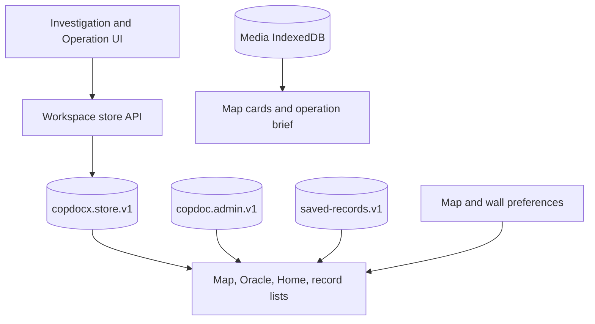
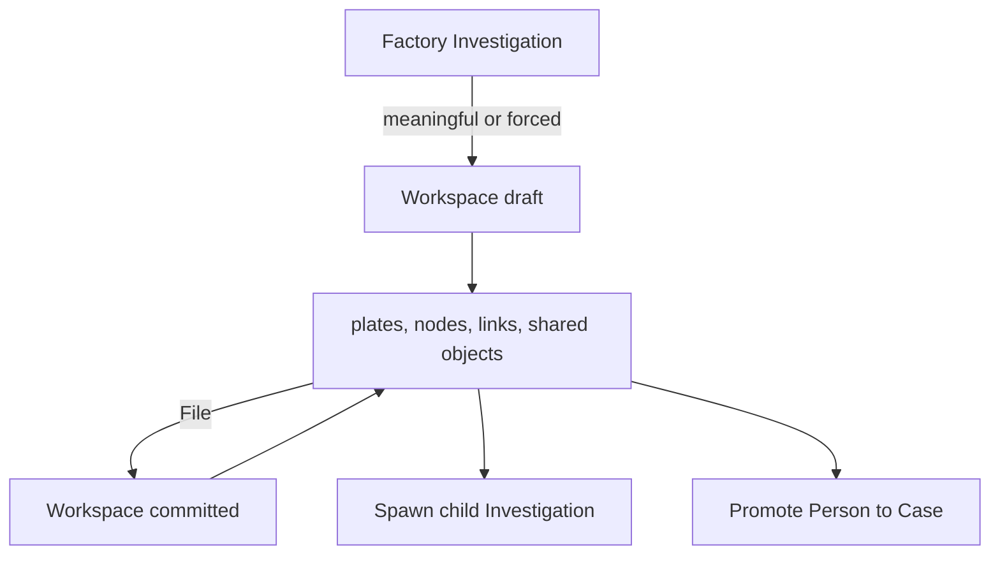
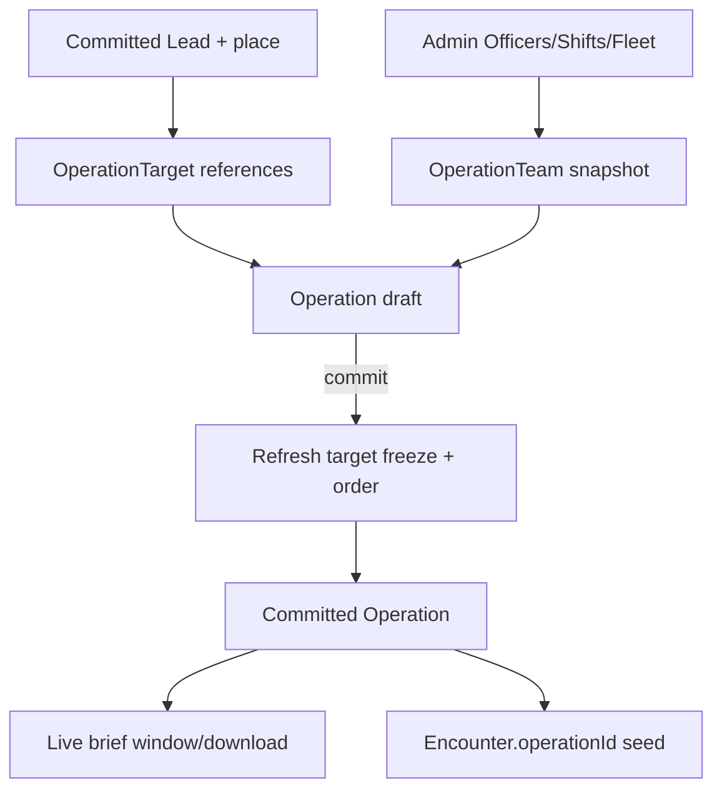
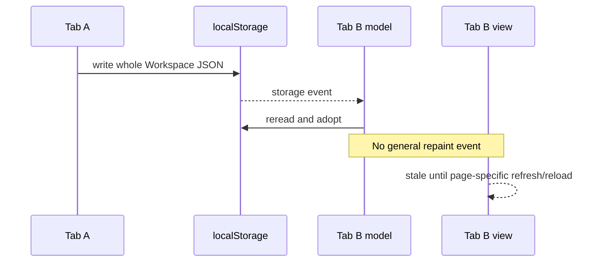

# Map, Investigations, Operations, Analytics, and Window Contract

**Contract status:** current implementation frozen for Stage 1

**Evidence base:** commit `980e5096414a74c16dd71be534b4f88ca456f364`

**Runtime changes made by this audit:** none

This document records the current contracts of the Map, Investigation wall,
Operations, Oracle, Home/record projections, and browser-window integrations.
It describes what the code does; it does not normalize inconsistent models or
authorize a migration.

Evidence labels follow the package convention:

- **VERIFIED** — directly traced to a current constructor, read/write path,
  projection, event listener, or active page script list.
- **INFERRED** — a runtime or concurrency consequence of verified code that was
  not exercised in a full browser session for this audit.
- **UNKNOWN / REVIEW** — a stored field or retained implementation whose current
  product intent cannot be established from the repository.

## 1. Effective topology

**VERIFIED:** Investigations and Operations are aggregates inside the single
Workspace JSON blob. Map, Oracle, Home, and record lists are projections; they
do not own domain records. Map preferences are separate localStorage values,
and Investigation panel layout is a per-tab sessionStorage value. The storage
registry names each physical value at
`functions/workspace-config.js:entries:L11-L33`; the Workspace root is created
and normalized at `functions/model/store.js:emptyState:L21-L35` and
`functions/model/store.js:normalizeState:L164-L218`.



**VERIFIED:** every Workspace aggregate mutation serializes the entire in-memory
state with one `localStorage.setItem`; there is no revision, compare-and-swap,
or transaction boundary around concurrent tabs
(`functions/model/store.js:readDisk:L221-L250`,
`functions/model/store.js:writeDisk:L252-L265`). A storage event makes the
model adopt the new blob but does not ask any mounted view to repaint
(`functions/model/store.js:storage-listener:L8024-L8030`).

## 2. Physical stores in this scope

| Physical key | Medium | Current shape/owner | Current role | Evidence |
|---|---|---|---|---|
| `copdocx.store.v1` | localStorage JSON object | `WorkspaceState`; `model/store` | **VERIFIED AUTHORITATIVE** for Investigation and Operation aggregates and the records projected by Map/Oracle. | `functions/workspace-config.js:entries:L11-L14`; `functions/model/store.js:emptyState:L21-L35` |
| `copdoc.admin.v1` | localStorage JSON object | Admin state | **VERIFIED AUTHORITATIVE** for Officers, fleet, and Shifts consumed by Operations, Map, and Home. | `functions/workspace-config.js:entries:L12-L16`; `functions/map-targets.js:(module constants):L12-L17`; `functions/home.js:(storage keys):L12-L19` |
| `alien-book-in.saved-records.v1` | localStorage JSON array | Book-In | **VERIFIED AUTHORITATIVE** packet store used by Home and the Encounter-list subject projection. | `functions/workspace-config.js:entries:L12-L15`; `functions/home.js:(storage keys):L12-L19`; `functions/encounters.js:bookinRecords/subjectsForEncounter:L1603-L1640` |
| `copdocx.map.views.v1` | localStorage JSON object | Map view preferences | **VERIFIED AUTHORITATIVE** for home view and up to 12 named presets. | `functions/map-views.js:loadState:L34-L53`; `functions/map-views.js:commitSetView:L211-L258` |
| `copdocx.map.layers.v1` | localStorage JSON object | Map layer preferences | **VERIFIED AUTHORITATIVE** for global Map layer visibility. | `functions/map-targets.js:(module constants):L12-L17`; `functions/map-targets.js:loadPrefs:L238-L246`; `functions/map-targets.js:saveLayers:L305-L307` |
| `copdocx.map.icons.v1` | localStorage JSON object | Map icon preferences | **VERIFIED AUTHORITATIVE** for icon library, row/category overrides, filters, and hidden row IDs. | `functions/map-targets.js:loadPrefs:L247-L303`; `functions/map-targets.js:saveIcons:L309-L315`; `assets/icons/copdoc-icons.js:persistMapLibraryId/setMapLibrary:L738-L748,L817-L823` |
| `copdocx.map.markup.v1` | localStorage JSON object | Map markup | **VERIFIED AUTHORITATIVE** global labels and arrows; not Case- or Operation-owned. | `functions/map-markup.js:(module constants):L10-L12`; `functions/map-markup.js:loadState:L36-L49`; `functions/map-markup.js:onMapClick:L242-L284` |
| `copdocx.location-map.basemap` | localStorage plain string | Location-card map | **VERIFIED AUTHORITATIVE preference** for location-card basemap only. The top-level Map starts on `map`. | `functions/location-map.js:rememberedBasemap/rememberBasemap:L369-L383`; `functions/map.js:init:L110-L168` |
| `copdocx.investigation-windows.v1` | sessionStorage JSON object | Investigation wall | **VERIFIED AUTHORITATIVE session preference** for panel visibility and positions in one browser tab. | `functions/workspace-config.js:entries:L23-L30`; `functions/investigation-wall.js:readStoredWindows/persistWindows:L119-L160` |
| `copdocx.import.done.v1` | localStorage timestamp string | Transfer | **VERIFIED DERIVED signal** used to reload pages which load `transfer.js`; it is not domain data. | `functions/transfer.js:notifyOpenerImported:L1540-L1561`; `functions/transfer.js:listenImportDone:L2128-L2155` |

## 3. TypeScript-style current persisted shapes

These interfaces describe current constructor/save output. They do not imply
runtime type enforcement. Imported or historical objects can contain unknown
properties, blank strings commonly represent absence, and references have no
foreign-key enforcement.

### 3.1 Investigation aggregate and relationship copies

```ts
interface Investigation {
  investigationId: string; // INV{team}-{YYYYMMDD}-{NNN}; primary map key
  entityType: "INVESTIGATION";
  schema: "copdocx.investigation.v1" | string;
  kind: "tag" | "otherLe" | "elite" | "other" | "discovered" | string;
  mode: "" | "bulk" | "solitary" | string;
  title: string;
  team: string;
  parentInvestigationId: string; // optional self-reference; no cascade
  sourceLeadId: string;          // optional Lead reference
  assignedOfficerId: string;     // optional Admin Officer reference
  plates: InvestigationPlate[];
  nodes: InvestigationNode[];    // references shared Workspace objects
  links: Link[];                 // wall-local relationship projection
  focusNodeId: string;           // nodeId reference
  history: HistoryEvent[];
  meta: LifecycleMeta;
  [unknown: string]: unknown;
}

interface InvestigationPlate {
  plateId: string; // generic plt_<time>_<random>
  plate: string;   // normalized uppercase A-Z/0-9
  state: string;   // uppercase
  status: "new" | "hit" | "discarded" | "promoted" | "checked";
  notes: string;
  vehicleId: string; // optional Workspace Vehicle reference
  [unknown: string]: unknown;
}

interface InvestigationNode {
  nodeId: string;     // generic node_<time>_<random>
  objectType: string; // PERSON | VEHICLE | LOCATION | BUSINESS | ENTITY | ...
  objectId: string;   // polymorphic Workspace dictionary reference
  x: number;
  y: number;
  [unknown: string]: unknown;
}

interface Link {
  linkId: string;
  associationId: string; // optional global Association citation
  from: { type: string; id: string };
  to: { type: string; id: string };
  reasons: string[];
  notes: string;
  label: string;
  otherType: string;
  [unknown: string]: unknown;
}

interface Association {
  associationId: string; // primary map key in workspace.associations
  linkId: string;        // duplicate/correlation ID
  entityType: "ASSOCIATION" | string;
  schema: "copdocx.association.v1" | string;
  from: { type: string; id: string };
  to: { type: string; id: string };
  reason: string;
  reasons: string[];
  label: string;
  otherType: string;
  occupancy: string;
  validFrom: string;
  validTo: string;
  notes: string;
  source: {
    investigationId: string;
    leadId: string;
    encounterId: string;
    officerId: string;
  };
  assertedAt: string;
  junked: boolean;
  junkedAt: string;
  [unknown: string]: unknown;
}
```

**VERIFIED:** constructors and enumerations are at
`functions/model/investigation.js:schemas-and-kinds:L11-L20` and
`functions/model/investigation.js:createInvestigationPlate/createInvestigationNode/createInvestigation:L68-L169`.
The local Link and global Association shapes are separately constructed at
`functions/model/link.js:createLink/createAssociation:L255-L336`. Generic child
IDs use timestamp-plus-random IDs at `functions/model/util.js:newId:L15-L22`.

### 3.2 Operation aggregate and frozen outputs

```ts
interface Operation {
  operationId: string;     // DAL{team}-OP-{YYYYMMDD}-{NNN}; primary map key
  operationNumber: string; // display identifier; normally duplicates ID
  entityType: "OPERATION";
  schema: "copdocx.operation.v1" | string;
  name: string;
  team: string | number;
  plannedStart: string;
  plannedEnd: string;
  importedTeamKeys: string[];
  targets: OperationTarget[];
  teams: OperationTeam[];
  targetAssignments: OperationTargetAssignment[];
  opLocations: OperationLocation[]; // embedded, not workspace.locations entries
  medevacRoute: Location[];         // embedded ordered points
  markup: { labels: unknown[]; arrows: unknown[] };
  mapLayers: { visible: Record<string, boolean> };
  order: OperationOrder | null;     // derived and persisted at commit
  history: HistoryEvent[];
  meta: LifecycleMeta;
  [unknown: string]: unknown;
}

interface OperationTarget {
  targetId: string;   // generic tgt_<time>_<random>
  leadId: string;     // Workspace Lead reference
  personId: string;   // Workspace Person reference/copy from Lead
  priority: string;
  freeze: OperationTargetFreeze | null;
  [unknown: string]: unknown;
}

interface OperationTargetFreeze {
  subjectLabel: string; // commit-time display snapshot
  photoMediaId: string;
  places: OperationPlace[];
  vehicles: Array<{
    vehicleId: string;
    plate: string;
    plateState: string;
    ymm: string;
    atLocationId: string;
  }>;
  [unknown: string]: unknown;
}

interface OperationPlace {
  locationId: string;
  association: string;
  street: string;
  city: string;
  state: string;
  zip: string;
  latitude: string | number;
  longitude: string | number;
  vehicleId: string;
  plate: string;
  plateState: string;
  ymm: string;
  [unknown: string]: unknown;
}

interface OperationTeam {
  teamId: string;   // generic cell_<time>_<random>
  name: string;
  rosterKey: string;
  vehicleId: string; // optional Admin fleet Vehicle reference
  members: OperationMember[];
}

interface OperationMember {
  officerId: string; // Admin Officer reference
  assignmentRole: "eye" | "contact" | "primary-backup" | "backup" | "";
  start: { latitude?: string; longitude?: string } | null;
  heading: string | number;
  sector: string;
  scans: string;
  notes: string;
}

interface OperationTargetAssignment {
  targetId: string; // embedded OperationTarget reference
  teamId: string;   // embedded OperationTeam reference
}

interface OperationLocation extends Location {
  opAssociation?:
    | "rally" | "cleanup" | "medevac" | "hospital" | "landmark" | string;
}

interface OperationOrder {
  generatedAt: string;
  narrative: string;
  officerBriefs: Array<{
    officerId: string;
    teamId: string;
    teamName: string;
    role: string;
    primary: string;
    secondary: string;
    targetLabel: string;
    address: string;
    start: object | null;
    heading: string | number;
    sector: string;
    scans: string;
    rally: string;
    medevac: string;
    teammates: string[];
  }>;
}
```

**VERIFIED:** target, member, team, aggregate, and generated-order constructors
are at `functions/model/operation.js:createOperationTarget/createOperation:L357-L435`
and `functions/model/operation.js:createOperationMember/createOperationTeam:L192-L221`,
with order output at
`functions/model/operation.js:generateOperationOrder:L508-L579`.
`addOperationLocation` adds `opAssociation` to a newly constructed Location and
embeds it in the Operation; it does not insert it into `workspace.locations`
(`functions/model/store.js:addOperationLocation:L3311-L3359`).

### 3.3 Map and Investigation-window preferences

```ts
interface MapViewsState {
  home: null | {
    lat: number | string;  // loader accepts numeric strings
    lng: number | string;  // loader accepts numeric strings
    zoom: number | string; // loader accepts numeric strings
  };
  presets: Array<{
    id: string; // pv_<time-base36>_<four-random-chars>
    name: string;
    lat: number | string;  // loader accepts numeric strings
    lng: number | string;  // loader accepts numeric strings
    zoom: number | string; // loader accepts numeric strings
  }>;
}

interface MapLayersState {
  visible: {
    targets: boolean;
    arrests: boolean;
    encounters: boolean;
    officers: boolean;
    origin: boolean;
    markup: boolean;
    arrestHeat: boolean;
    [futureOrUnknown: string]: boolean;
  };
}

interface MapIconFilter {
  visible: boolean;
  color: string;
  icon: string;
}

interface MapIconsState {
  libraryId: string;
  category: Record<string, string>;
  pins: Record<string, string>;        // derived Map row ID -> icon
  size: number;                        // normalized to 20..56
  stroke: number;                      // normalized to 1..4
  fillOpacity: number;                 // normalized to 0..100
  labels: boolean;
  badges: boolean;
  filters: Record<string, MapIconFilter>;
  hiddenPins: Record<string, true>;    // derived Map row IDs
  hiddenLabels: Record<string, true>;  // derived Map row IDs
}

interface MapMarkupState {
  labels: Array<{ id: string; lat: number; lng: number; text: string }>;
  arrows: Array<{
    id: string;
    from: [number, number];
    to: [number, number];
  }>;
}

// In-memory only. Categories add different optional fields and table columns.
interface MapProjectionRow {
  category: "targets" | "arrests" | "encounters" | "officers" | "origin";
  id: string; // derived display/preference key, not a domain primary key
  leadId?: string;
  encounterId?: string;
  personId?: string;
  officerId?: string;
  locationId?: string;
  vehicleId?: string;
  subject: string;
  extra: string;
  address: string;
  association?: string;
  latitude: string | number;
  longitude: string | number;
  hasCoords: boolean;
  photoOwners?: Array<{ type: string; id: string }>;
  flags?: Record<string, boolean>;
  cols: string[];
  [categorySpecific: string]: unknown;
}

interface InvestigationWindowsState {
  plates: boolean;
  objects: boolean;
  card: boolean;
  pos: {
    plates: { x: number; y: number } | null;
    objects: { x: number; y: number } | null;
    card: { x: number; y: number } | null;
  };
}
```

**VERIFIED:** Map view normalization and preset ID creation are at
`functions/map-views.js:loadState/saveState:L34-L77` and
`functions/map-views.js:newPresetId:L101-L107`. Layer/icon defaults and
normalization are at `functions/map-targets.js:(module defaults):L31-L60` and
`functions/map-targets.js:loadPrefs:L238-L303`. Markup's accepted state and
writers are at `functions/map-markup.js:loadState/saveState:L36-L57` and
`functions/map-markup.js:onMapClick:L242-L284`. Wall pan and zoom are
memory-only; only panel booleans and positions enter sessionStorage
(`functions/investigation-wall.js:(module state):L14-L28`,
`functions/investigation-wall.js:readStoredWindows/persistWindows:L119-L160`).

## 4. Investigation architecture and lifecycle

### 4.1 Identifier and lifecycle rules

**VERIFIED:** `nextInvestigationId` creates
`INV{numericTeam}-{local YYYYMMDD}-{three-digit sequence}` by scanning supplied
existing IDs for the highest same-day sequence
(`functions/model/investigation.js:nextInvestigationId:L35-L66`). **INFERRED:**
two tabs that generate before either writes can select the same ID; the later
whole-blob write can replace the first record because no reservation or
revision is stored.

The form creates a transient factory object first. It is persisted as a draft
only when it becomes “meaningful” or a caller forces persistence; commit files
the record (`functions/investigations.js:saveDraftQuiet:L1557-L1597`,
`functions/investigations.js:ensureNewInvestigation:L1610-L1631`). Missing lifecycle
metadata is treated as committed by the shared compatibility helper
(`functions/model/util.js:metaStatus/ensureRecordMeta:L49-L96`).



### 4.2 CRUD and relationship paths

| Action | Actual read/write sequence | Integrity behavior | Evidence |
|---|---|---|---|
| List/open | List view reads full Investigation records and filters in memory; wall/form retrieves a clone by `investigationId`. | **VERIFIED:** list is a projection, not a second store. | `functions/investigations.js:filteredRows/paintList:L71-L150`; `functions/model/store.js:getInvestigation/listInvestigations:L2647-L2649,L3439-L3455` |
| Draft/commit | `collectInvestigation` rebuilds the factory shape while preserving nodes, links, history, parent/source/assignee and focus; `saveInvestigation` shallow-merges, stamps metadata, and rewrites Workspace. | **VERIFIED:** commit validates only investigation kind; `markedComplete` is forced false. | `functions/investigations.js:collectInvestigation:L164-L193`; `functions/model/store.js:saveInvestigation:L2585-L2645` |
| Add object | Resolve/create and save a shared Person/Vehicle/Location/Business/Entity, append/reuse a node, optionally persist an Association, then save the Investigation. | **VERIFIED non-transactional:** earlier writes can survive a later failure. | `functions/model/store.js:addInvestigationObject:L4466-L4673` |
| Connect nodes | Create/save a global Association, cite it from the local Link, then save the Investigation. | **VERIFIED duplicated relationship:** Association and Link can diverge; the Association write precedes the wall write. | `functions/model/store.js:connectInvestigationNodes:L4675-L4815`; `functions/model/store.js:citeWallAssociation:L5105-L5118` |
| Edit inspector/card | Wall inspector edits a limited shared-object field set and saves the canonical object. The full Investigation Vehicle card saves the Vehicle, then separately saves wall state. | **VERIFIED:** shared object is the data owner; the card/wall holds a working copy. | `functions/investigation-wall.js:persistInspector:L763-L848`; `functions/investigations.js:persistFocusedVehicle:L958-L1031` |
| Move/focus node | Update node coordinates or `focusNodeId`, then save the Investigation draft. | **VERIFIED aggregate-owned UI state.** | `functions/investigation-wall.js:placeAt/moveNode/focusNode:L1368-L1421` |
| Plate queue | Normalize plate/status, save the aggregate; promotion creates a canonical Vehicle and then updates the plate/node in the Investigation. | **VERIFIED non-transactional promotion.** | `functions/investigations.js:persistPlates:L351-L373`; `functions/model/store.js:promoteInvestigationPlate:L7764-L7866` |
| Spawn child | Copy the focused node and one-hop object nodes into a new child; issue new node/link IDs while reusing cited Association IDs; save child, then add a system note to parent. | **VERIFIED:** parent and child writes are separate. | `functions/model/investigation.js:investigationPlex:L207-L245`; `functions/model/store.js:spawnInvestigation:L7589-L7762` |
| Promote Person to Case | Reuse an existing Lead for the Person or create a draft identity-only Lead, then append a system note separately. | **VERIFIED:** promotion can return a Lead while warning that the note failed. | `functions/model/store.js:promoteInvestigationPersonToCase:L753-L834`; `functions/investigations.js:openInvestigationPersonAsCase:L1776-L1802` |
| Remove node | Remove wall node and incident links only; shared object remains. | **VERIFIED.** | `functions/model/store.js:removeInvestigationObject:L7338-L7388` |
| Clear wall | Empty nodes, links, plates, and focus; canonical objects and Associations remain. | **VERIFIED.** | `functions/model/store.js:clearInvestigationWorkspace:L7395-L7443` |
| Disconnect local Link | Remove `Investigation.links[]` row only. | **VERIFIED:** cited global Association is not deleted or junked by this path. | `functions/model/store.js:disconnectInvestigationLink:L6625-L6656` |
| Junk shared object | Mark the canonical object and related Associations junked and strip it from Investigation walls. | **VERIFIED multi-object whole-blob mutation; write failure result is not propagated consistently.** | `functions/model/store.js:junkInvestigationObject:L7471-L7522` |
| Delete shared object | Run `objectIsReferenced`, remove the node, then remove the shared dictionary row. | **VERIFIED incomplete guard:** it checks Investigations, Leads, and live Encounter object arrays, but not Operations, Association endpoints, or completed snapshots. | `functions/model/store.js:objectIsReferenced:L6036-L6139`; `functions/model/store.js:deleteInvestigationObject:L7524-L7583` |
| Delete aggregate | Delete `workspace.investigations[id]` and rewrite Workspace. | **VERIFIED:** there is no child-parent cleanup or Association cleanup. | `functions/model/store.js:deleteInvestigation:L2652-L2674` |
| Change team/ID | Save the same form under a newly minted ID, then delete the old record. | **VERIFIED non-atomic:** child `parentInvestigationId` values are not retargeted and delete result is ignored by UI. | `functions/investigations.js:bindWorkspace:L1684-L1728` |

### 4.3 Investigation authority and classifications

| Fact | Effective source of truth | Copies/consumers | Classification |
|---|---|---|---|
| Wall topology and positions | `workspace.investigations[id].nodes/links` | Wall DOM is a working projection. | **VERIFIED AUTHORITATIVE aggregate state.** |
| Person/Vehicle/Location/Business/Entity facts | Corresponding Workspace dictionaries | Node holds `{objectType, objectId}`; inspector/card holds editable copies. | **VERIFIED REFERENCE**, except stale full-card copies can still be saved back. |
| Relationship semantics | `workspace.associations[id]` is the intended canonical row | Investigation `links[]` duplicates endpoints/reasons and may cite `associationId`. | **VERIFIED DUPLICATED / authority incompletely enforced.** |
| Parent/child relation | Child `parentInvestigationId` | Parent has no child ID array; children are found by scanning all Investigations. | **VERIFIED one-directional reference** (`functions/investigations.js:hydrateInvestigation:L196-L268`). |
| Parent/child hull | Shared object IDs between parent/child plus parent reference | Calculated for display. | **VERIFIED DERIVED, not persisted** (`functions/model/investigation.js:investigationHulls:L261-L297`). |
| Plate “hit” state | Plate status and/or linked `vehicleId` | UI derives hit display. | **VERIFIED DERIVED** (`functions/model/investigation.js:investigationOutlineIsHit:L367-L383`). |
| Wall panel placement | `copdocx.investigation-windows.v1` in the current tab | Applies to all Investigations in that tab, not keyed by Investigation ID. | **VERIFIED SESSION PREFERENCE.** |
| `sourceLeadId`, `assignedOfficerId` | Persisted Investigation fields | Preserved by current form collection; no editing control found in this UI trace. | **UNKNOWN / REVIEW** as current dormant/reserved UI fields. |

## 5. Operation architecture and lifecycle

### 5.1 Identifier, target import, and snapshots

**VERIFIED:** `nextOperationId` creates
`DAL{numericTeam}-OP-{local YYYYMMDD}-{three-digit sequence}` by scanning
existing IDs (`functions/model/operation.js:nextOperationId:L35-L66`). It has
the same **INFERRED** cross-tab collision risk as Investigation IDs.

A Lead is importable only when committed and `operationPlacesFromLead` returns
at least one current Person location, Vehicle location, or plate-only Vehicle.
Historical occupancy is excluded. Imported targets initially retain live
`leadId`/`personId`; every commit recomputes the target `freeze` from the current
Lead and regenerates `order`
(`functions/model/operation.js:operationPlacesFromLead/leadIsImportableOperationTarget:L89-L162`,
`functions/model/store.js:saveOperation:L2676-L2750`).

**VERIFIED data-loss edge:** `formatPlaceAddress` recognizes `street2`, so a
street2-only place can pass inclusion, but the frozen place row does not copy
`street2` (`functions/model/operation.js:formatPlaceAddress/operationPlacesFromLead:L81-L121`).



### 5.2 Operation CRUD and calculations

| Feature | Actual contract | Evidence |
|---|---|---|
| List/open | `listOperations` returns list rows; view/form reloads Workspace and gets the full aggregate by ID. | `functions/model/store.js:getOperation/listOperations:L2753-L2755,L3417-L3437`; `functions/operations.js:filteredRows/paintList:L79-L171` |
| Create/edit | Form factory stays transient until a meaningful/forced draft save. `collectForm` preserves opaque aggregate arrays/objects and replaces form fields. | `functions/operations.js:collectForm/persistDraftQuiet:L211-L272`; `functions/operations.js:bootForm:L1072-L1101` |
| Commit | Requires nonblank `name`; stamps committed meta, refreshes all resolvable target freezes, derives `order`, then writes the whole Workspace. | `functions/model/store.js:saveOperation:L2676-L2750`; `functions/operations.js:commitOperation:L1122-L1135` |
| Add/remove targets | Add committed importable Leads, deduplicated by `leadId`; removal also drops assignments for that target. | `functions/model/store.js:addOperationTargets/removeOperationTarget:L2816-L2926` |
| Import/remove cell | Store accepts 2–4 unique nonblank Officer ID strings, applies default roles, and embeds the cell; it does not validate those IDs against Admin. Removing a cell removes its target assignment. | `functions/model/store.js:importOperationTeam:L2928-L3005`; `functions/model/store.js:removeOperationTeam:L3113-L3158` |
| Assign target/cell | Before appending, remove every assignment for the target and every assignment for the selected cell. | **VERIFIED one-to-one current constraint** at `functions/model/store.js:assignOperationTargetTeam:L3053-L3110`. |
| Fleet and member fields | Setters persist cell `vehicleId`, member role/start/heading/sector/scans. `member.notes` has no current setter found. | `functions/model/store.js:setOperationTeamVehicle/setOperationMemberStart:L3160-L3240`; `functions/model/store.js:setOperationMemberHeading/setOperationMemberField:L3242-L3309` |
| Operation locations | Add/remove embedded pins by `locationId`; route appends ordered embedded points. There is no current route-point removal API. | `functions/model/store.js:addOperationLocation/removeOperationLocation/addMedevacRoutePoint:L3311-L3415` |
| Delete | Store API deletes aggregate and rewrites Workspace. Current Operations list/view app-bar wiring exposes no aggregate-delete action. | `functions/model/store.js:deleteOperation:L2758-L2779`; `functions/operations.js:bind:L1435-L1510`; `functions/app-bar.js:configFor:L273-L448` |

### 5.3 Officer availability formula

**VERIFIED:** availability is advisory UI logic, not persisted state.

1. Duty values other than blank, `available`, or `in-field` make the Officer
   unavailable.
2. The planned window uses `plannedStart`/`plannedEnd`; one missing endpoint is
   inferred and a missing/earlier end becomes start plus eight hours.
3. If the Officer has any Shifts in the Operation start's ISO week, at least
   one Shift must overlap. With no Shift that week, the Officer passes this
   check.
4. Any other committed Operation containing the Officer conflicts if windows
   overlap. When the current planned window parses but the other Operation's
   window does not, the code cannot prove non-overlap and treats it as a
   conflict. If the current window does not parse, Shift and Operation-conflict
   checks are skipped.

The formulas and branches are implemented at
`functions/model/operation.js:parseTimeWindow/shiftWindow:L229-L260` and
`functions/model/operation.js:overlappingCommittedOperation/officerAvailability:L290-L355`.
Dates are parsed in the browser's local timezone.

**VERIFIED UI edge:** the cell picker permits checked Officers from multiple
roster groups, but `importSelectedCell` overwrites `rosterKey` while iterating;
the stored cell uses the last checked group's key
(`functions/operations.js:openCellPicker/importSelectedCell:L986-L1070`).

### 5.4 Order, map, brief, and Encounter lineage

| Output field | Inputs and selection rule | Persistence/authority | Evidence |
|---|---|---|---|
| `order.narrative` | Operation name/number/window and counts of targets/cells | **DERIVED, persisted on commit** | `functions/model/operation.js:generateOperationOrder:L508-L540`; `functions/model/store.js:saveOperation:L2738-L2740` |
| Brief target/address | Assigned target; frozen `subjectLabel`; first frozen place only | **SNAPSHOT**, not full Lead | `functions/model/operation.js:primaryPlaceLine/targetForTeam:L466-L492`; `functions/model/operation.js:generateOperationOrder:L541-L572` |
| Rally/medevac text | First `opLocations[]` row of that association; notes, then address, then coordinates | **DERIVED, persisted in order** | `functions/model/operation.js:opLocationLine:L494-L506` |
| Officer brief name | Order stores `officerId`; rendered page resolves current Admin name | **LIVE DISPLAY JOIN** | `functions/operations.js:officerLabel:L793-L817`; `functions/operations.js:paintBrief:L1363-L1397` |
| Officer teammates | Store calls the generator without an Officer label resolver, so `order.officerBriefs[].teammates` contains Officer IDs and the brief renders those strings directly | **DERIVED ID SNAPSHOT**, not live names | `functions/model/store.js:saveOperation:L2738-L2740`; `functions/model/operation.js:generateOperationOrder:L508-L572`; `functions/operations.js:paintBrief:L1383-L1388` |
| Target photo | Brief ignores `freeze.photoMediaId` and queries current Person-owned Media by `personId` | **LIVE IDB JOIN** | `functions/operations.js:fillTargetPhoto:L1213-L1246` |
| Operation map | Frozen target places + member start points + embedded op locations + route | **DERIVED UI**, not global Map markup | `functions/operations.js:paintOperationMap:L301-L476` |
| Encounter link | New Encounter can seed `operationId`, Officer IDs, targets, places, and vehicles from an Operation | Encounter then owns its editable copies | `functions/model/encounter.js:seedEncounterFromOperation:L547-L623`; `functions/encounters.js:applyEntrySeeds:L2879-L2934` |
| Completed Encounter link | `operationId` is copied into `Encounter.completed` and each subject's `shared` data | **DUPLICATED snapshot/reference** | `functions/model/encounter.js:sharedStopFromEncounter/createEncounterRecord:L111-L183,L315-L394`; `functions/model/store.js:buildEncounterCompleted:L2146-L2198` |

**VERIFIED:** the Operation map tests coordinates with truthiness, so an exact
latitude or longitude of `0` is excluded; headings are display-only lines
offset by 0.001 degrees, not geodesic routes
(`functions/operations.js:paintOperationMap:L301-L435`). Officer start placement
is pending in page memory until explicitly committed, whereas Operation pins and
route points immediately call store mutations
(`functions/operations.js:setPlaceMode/onOperationMapClick/commitPendingStart:L478-L592`).

**VERIFIED:** `generateBrief` opens an unnamed new tab/window and does not retain
a synchronization channel. The brief reads Operation/Admin/Media once. The
download is an HTML fragment with a relative stylesheet reference and whatever
current `img.src` values happen to be in the sheet; it is not a self-contained
recovery artifact (`functions/operations.js:generateBrief:L1195-L1211`,
`functions/operations.js:paintBrief/saveOperationBrief:L1248-L1433`).

**VERIFIED dangling-reference risk:** `deleteOperation` does not inspect or
clear `Encounter.operationId`, and neither Map nor Oracle uses `operationId` in
its current analytics. The reference can therefore remain after deletion
(`functions/model/store.js:deleteOperation:L2758-L2779`,
`functions/oracle.js:summarize/loadWorkspace:L884-L1083,L2085-L2104`,
`functions/map-targets.js:collectEncounters:L608-L720`).

### 5.5 Operation field classifications

| Field | Current classification | Basis |
|---|---|---|
| `targets[].leadId`, `targets[].personId` | **VERIFIED REFERENCE + DUPLICATE** | `personId` is copied from Lead and can remain if Lead disappears. |
| `targets[].freeze` | **VERIFIED INTENTIONAL SNAPSHOT / DERIVED** | Rebuilt from current Lead on every commit, then used by order/brief. |
| `order` | **VERIFIED PERSISTED DERIVATION** | Rebuilt on every commit from Operation state. |
| `targetAssignments[]` | **VERIFIED ASSOCIATION OBJECT** | Embedded one-to-one target/cell mapping; no global Association row. |
| `teams[].members[].officerId`, `vehicleId` | **VERIFIED CROSS-STORE REFERENCES** | Values point to Admin records without FK validation; brief labels are live. |
| `opLocations`, `medevacRoute` | **VERIFIED EMBEDDED VALUE OBJECTS** | They are not canonical Workspace Location rows. |
| `priority` | **VERIFIED WRITTEN, UNCONSUMED by current Operation surfaces** | Constructor writes it; repository search found no Operation reader beyond shape preservation (`functions/model/operation.js:createOperationTarget:L357-L369`). Intent is **UNKNOWN / REVIEW**. |
| `freeze.photoMediaId` | **VERIFIED WRITTEN EMPTY, UNCONSUMED by current Operation surfaces** | Freeze sets `""`; brief queries live Media by Person instead (`functions/model/operation.js:freezeOperationTarget:L164-L190`; `functions/operations.js:fillTargetPhoto:L1213-L1246`). |
| `importedTeamKeys` | **VERIFIED WRITTEN/PRESERVED, UNCONSUMED by current Operation surfaces** | Team import appends keys, but no current behavioral read was found (`functions/model/store.js:importOperationTeam:L2986-L2994`). Intent is **UNKNOWN / REVIEW**. |
| `markup`, `mapLayers` | **VERIFIED CONSTRUCTED/PRESERVED, UNCONSUMED by current Operation map** | Current map reads global/local Operation facts, not these fields (`functions/model/operation.js:createOperation:L371-L435`; `functions/operations.js:paintOperationMap:L301-L476`). Intent is **UNKNOWN / REVIEW**. |
| `members[].notes` | **VERIFIED CONSTRUCTED, UNCONSUMED by current Operation UI/order** | Factory writes it; current setters and order omit it (`functions/model/operation.js:createOperationMember:L192-L206`; `functions/model/operation.js:generateOperationOrder:L551-L572`). Intent is **UNKNOWN / REVIEW**. |

“Unconsumed” here is not a deletion recommendation; it freezes the current
read/write evidence and preserves the possibility of reserved or imported data.

## 6. Map architecture and projections

### 6.1 Active page and data sources

**VERIFIED:** `map.html` loads Leaflet, the Workspace models/store, Map view,
markup, icon, popup, and target-layer controllers directly
(`map.html:(script list):L280-L296`). Base tiles are remote OpenStreetMap/Esri URLs
(`functions/map.js:makeLayers:L21-L59`). The page has no remote COPDoc domain
API; its domain rows come from same-origin Workspace, Admin, and Media.

**VERIFIED network boundary:** the top-level Map loads both Leaflet CSS and
JavaScript from unpkg, while Oracle loads the vendored Leaflet package but still
requests OpenStreetMap tiles. Thus domain data remains local, but a disconnected
or blocked network can remove the Map library/base imagery; Oracle retains the
library and falls back visually after tile errors
(`map.html:(Leaflet assets):L9-L14,L286-L290`;
`oracle.html:(Leaflet assets):L8-L9,L411-L413`;
`functions/oracle.js:ensureMap:L1937-L1955`).

| Layer | Input records | Projection and row ID | Notable omissions/copies | Evidence |
|---|---|---|---|---|
| Active targets | Committed Leads with `targetPriority` on embedded Person/Vehicle/legacy Lead locations | One row per qualifying place; `targets:{locationId || leadId}` | Uses embedded Lead data, not canonical dictionary hydration; does not exclude historical occupancy. Same location can collide across cases. | `functions/map-targets.js:walkLeadLocations:L384-L405`; `functions/map-targets.js:collectLeads:L722-L852` |
| Origin/find | Same Lead place projection where association is `plate-check` | `origin:{locationId || leadId}` | Same collision/staleness behavior as target rows. | `functions/map-targets.js:collectLeads:L722-L852` |
| Arrests | Committed Lead `person.arrests[]`, with arrest location and completed-Encounter pin fallback | `arrests:{arrestId || leadId}` | Current Person arrest facts can disagree with Encounter outcomes; missing arrest IDs collide per Lead. | `functions/map-targets.js:collectLeads:L722-L852` |
| Encounters | Any Encounter having a non-null `completed` snapshot | One row per distinct completed Location/Vehicle-location; fallback pin/blank; `encounters:{encounterId}:{locationId || vehicleId || index}` | Does not require `meta.markedComplete`; subject identity is snapshot-first. | `functions/map-targets.js:collectEncounters:L608-L720` |
| Officer homes | Committed, non-junked Admin Officers | Last home/residence location wins, with legacy embedded address fallback | Live Admin duty/name/address projection. | `functions/map-targets.js:collectOfficers:L854-L910` |
| Photos in popups | Owner IDs on projected row plus one-hop Person owners found through Associations/Lead links | Queries current Media IndexedDB | Bytes are live, not snapshotted into Map rows. | `functions/map-targets.js:linkedPersonOwners:L450-L476`; `functions/map-popup.js:paintPhotos:L139-L239` |
| Markup | `copdocx.map.markup.v1` | Global label/arrow IDs | Not linked to domain objects, Operations, or Investigations. | `functions/map-markup.js:listMarkup/removeMarkup:L208-L240` |

Map row IDs are also persisted as keys in `pins`, `hiddenPins`, and
`hiddenLabels`. **INFERRED:** an ID collision applies one preference to multiple
rows; when source IDs/locations change, preferences can become orphaned because
there is no reconciliation pass. The relevant ID construction and stored maps
are at `functions/map-targets.js:collectEncounters:L691-L708`,
`functions/map-targets.js:collectLeads:L722-L852`, and
`functions/map-targets.js:loadPrefs:L255-L289`.

### 6.2 Completion split and refresh semantics

**VERIFIED:** Map accepts an Encounter whenever `encounter.completed` exists.
Oracle requires both `meta.markedComplete === true` and `completed`. Unlocking a
completed Encounter flips `markedComplete` false but retains the snapshot, so
the Encounter can remain on Map while disappearing from Oracle
(`functions/map-targets.js:collectEncounters:L608-L620`,
`functions/oracle.js:summarize:L898-L910`,
`functions/model/store.js:unlockEncounter:L2495-L2535`). This is a real consumer
contract difference, not a normalized “completed” definition.

**VERIFIED:** Map builds its catalogs during `init`/`refresh`; it has no storage
listener. The shared store listener adopts a changed Workspace blob without
repainting this page. Another tab's edits are therefore not visible until
`COPDoc.map.refreshTargets()` or reload
(`functions/map-targets.js:refresh/init:L2733-L2739,L2807-L2897`,
`functions/model/store.js:storage-listener:L8024-L8030`).

### 6.3 Heat and spatial calculations

**VERIFIED:** arrest heat rounds coordinates into a zoom-dependent grid. A cell
becomes a “peak” only when it contains at least two points and its count is
strictly greater than every neighboring cell. The displayed center is the
arithmetic average of contributing coordinates, not the grid center
(`functions/map-targets.js:computeHeatPeaksGeo:L1958-L2019`).

The top-level Map's base layer always starts as `map`; the registered
`copdocx.location-map.basemap` preference belongs to reusable location-card
maps. `LocationMap.displayMany` is read-only unless an editable card supplies
DOM fields, in which case the parent form remains responsible for persistence
(`functions/map.js:init:L110-L168`,
`functions/location-map.js:displayMany/(public API):L748-L855,L1007-L1035`).

## 7. Home and records projections

### 7.1 Home snapshot

**VERIFIED:** Home directly parses Workspace, Admin, and Book-In once at boot
and explicitly declares itself read-only
(`functions/home.js:(module contract)/(storage keys):L1-L19`,
`functions/home.js:paintSnapshot/boot:L131-L231,L265-L275`). It does not register
a storage listener. If Home loads `transfer.js`, import completion can reload
the page, but ordinary cross-tab edits remain stale until reload
(`home.html:(script list):L172-L178`; `functions/transfer.js:listenImportDone:L2128-L2155`).

| Home card/stat | Exact current rule | Classification/evidence |
|---|---|---|
| Filed cases | Count Leads whose meta is absent or not `draft`. | **DERIVED**; absent meta is committed compatibility. `functions/home.js:committed/paintSnapshot:L37-L39,L131-L137` |
| Available Officers/fleet | Committed, non-junked Admin rows; missing `duty`/`status` defaults to `available`. | **DERIVED**, and not the Operation availability formula. `functions/home.js:paintSnapshot:L138-L162` |
| Weekly Book-Ins | Book-In rows whose metadata update/commit/create date falls in the local Sunday–Saturday week. | **DERIVED from record metadata, not arrest date.** `functions/home.js:rowTime/paintSnapshot:L41-L47,L144-L153` |
| Recent cases | Leads ordered by updated/committed/created timestamp; UI truncates to six. Person name is embedded `Lead.person` or legacy `Lead.people`, not `workspace.people`. | **DERIVED from writable Lead copy.** `functions/home.js:personName/paintList:L57-L68,L105-L129`; `functions/home.js:paintSnapshot:L164-L173` |
| On duty today | Shifts for local date joined to committed/non-junked Officers. | **DERIVED; does not apply Officer `duty` value.** `functions/home.js:paintSnapshot:L175-L191` |
| Targets | Target-priority coordinates from `Lead.person.locations`, `Lead.vehicles[].locations`, and legacy `Lead.locations`, sorted by numeric rank. | **DERIVED / DUPLICATE source; no canonical hydration, history filter, or dedupe.** `functions/home.js:addLocations/paintSnapshot:L86-L103,L193-L210` |
| Follow-ups | Every Lead follow-up except exact lowercase status `done`; first six in traversal order. | **DERIVED; no due-date sort.** `functions/home.js:paintSnapshot:L212-L230` |

### 7.2 Record-list projections

| Page/list | Projection authority and divergence | Evidence |
|---|---|---|
| Cases | Opens full Lead records. Display stage is derived as `DETAINEE`, else `TARGET` for target Case role or any issued warrant, else `LEAD`; identity and case facts come from embedded Lead/Person data. | `functions/leads.js:snapshots/caseStage/paintList:L1243-L1375` |
| Encounters | Base list comes from `listEncounters`, but the displayed subject names are joined from Book-In packets by Encounter ID/number and role. It does not render `Encounter.subjects[]` for that column. | `functions/model/store.js:listEncounters:L7868-L7887`; `functions/encounters.js:bookinRecords/subjectsForEncounter/paintList:L1603-L1715` |
| Operations | `listOperations` projects aggregate ID/number/name/team/window/counts/meta; UI filters and displays those rows. | `functions/model/store.js:listOperations:L3417-L3437`; `functions/operations.js:filteredRows/paintList:L79-L171` |
| Investigations | `listInvestigations` projects ID/kind/title/parent ID/update time/meta status; current UI then loads full records for filtering/painting. | `functions/model/store.js:listInvestigations:L3439-L3455`; `functions/investigations.js:filteredRows/paintList:L71-L150` |

**VERIFIED consequence:** an Encounter can contain subjects yet show “no
subject” in the list if no matching Book-In packet exists; conversely, a packet
can supply a list name independent of live `Encounter.subjects[]`. That column's
effective source of truth is Book-In, not the Encounter aggregate.

## 8. Oracle/analytics contract

### 8.1 Inputs and output nature

**VERIFIED:** Oracle is read-only and loads only full committed Leads and full
Encounters from the Workspace store. It does not load Admin, Operations,
Investigations, Book-In, Media, or global Associations
(`oracle.html:(script list):L399-L413`; `functions/oracle.js:(module contract):L1-L4`;
`functions/oracle.js:loadWorkspace/run:L2085-L2104,L2171-L2189`). Its returned
summary is an in-memory derived object; it is not persisted.

```ts
interface OracleStopRow {
  encounterId: string;
  startedAt: string; // local date key only
  team: string;
  eventType: string;
  eventTypeLabel: string;
  family: "cop" | "dynamic" | "other";
  city: string;
  zip: string;
  lat: number | null;
  lng: number | null;
  mapped: boolean;
  arrested: number;
  released: number;
  fled: number;
  targetArrests: number;
  collateralArrests: number;
  hit: boolean;
  empty: boolean;
  outcome: "hit" | "flee" | "empty";
}

interface OracleArrestRow {
  leadId: string;
  personId: string;
  arrestId: string;
  name: string;
  date: string;
  team: string;
  encounterId: string;
  encounterNumber: string;
  role: string;
  roleLabel: string;
  family: string;
  familyLabel: string;
  citizenship: string;
  countryLabel: string;
  disposition: string;
  dispositionLabel: string;
  eventType: string;
  eventTypeLabel: string;
  mapped: boolean;
}

interface OracleSummary {
  office: string;
  from: string;
  to: string;
  team: string;
  arrests: number;                  // filtered Person.arrests count
  encountersWithArrests: number;    // distinct nonblank arrest encounter IDs
  completedEncounters: number;      // filtered completed stop count
  target: number;
  collateral: number;
  released: number;
  fled: number;
  unknown: number;
  families: Record<"cop" | "dynamic" | "other" | "all", OracleFamilyRates>;
  shares: object;
  stops: OracleStopRow[];
  places: object[];
  cells: object[];
  weekdays: object[];
  placeWeekdays: object[];
  weekdayOccurrences: number[];
  spread: object;
  teamRows: object[];
  unlocated: OracleStopRow[];
  quality: object;
  mix: object;
  spark: Array<{ day: string; count: number }>;
  teams: string[];
  rows: OracleArrestRow[];
}
```

The row constructors and returned summary are **VERIFIED** at
`functions/oracle.js:stopFromEncounter:L456-L532`,
`functions/oracle.js:collectArrestRows:L534-L596`, and
`functions/oracle.js:summarize:L884-L1083`.

### 8.2 Two independent fact streams

Oracle does not calculate every statistic from one arrest fact:

| Stream | Inclusion and field lineage | Used for |
|---|---|---|
| Completed-stop stream | Encounter must have `meta.markedComplete` and `completed`; date/team/event/subjects/place are snapshot-first. Center is last `isCenter` location, else first; `completed.pin` coordinates override. | Completed stop count, hit/empty/flee, released/fled, event families, target/collateral stop arrests, geography, weekday/team/spread. |
| Booked-arrest stream | Committed Lead → current Person → `person.arrests[]`; date is arrest date/date-time. Encounter join uses arrest `encounterId` or `encounterNumber`; role is read from the **live** Encounter subject, event/pin are snapshot-first, and citizenship/disposition are current Person facts. | Arrest count, distinct encounter IDs, arrest rows, role/country/disposition/event mixes, 14-day spark, team selector values. |

Evidence is `functions/oracle.js:centerPlace/stopFromEncounter:L456-L532`,
`functions/oracle.js:subjectForPerson:L218-L227`, and
`functions/oracle.js:collectArrestRows:L534-L596`.

**VERIFIED duplication effect:** completed-subject “arrested” counts can differ
from `Person.arrests[]` counts. Current edits to citizenship, immigration
disposition, or live Encounter roles rewrite historical Oracle mix labels even
when the Encounter completion snapshot has not changed.

### 8.3 Current formulas

| Metric | Exact formula/current rule | Evidence |
|---|---|---|
| Event family | `cop` for `VEHICLE_STOP`, `CONSENSUAL_ENCOUNTER`, `KNOCK_AND_TALK`, `COLLATERAL_CONTACT`; `dynamic` for `TARGETED_ARREST`, `AT_LARGE`; otherwise `other`. | `functions/oracle.js:familyOf:L166-L175` |
| Periods | Local day/week/month/FY/custom; week begins Sunday, federal year begins October 1, reversed custom endpoints are swapped. | `functions/oracle.js:startOfWeek/fyStart/periodRange:L89-L139` |
| Outcome | Subject outcomes map to arrested/released/fled/unknown; any value beginning `FLED` is fled. Stop is `hit` if arrested > 0, else `flee` if fled > 0, else `empty`. | `functions/oracle.js:roleLabel/outcomeBucket:L181-L210`; `functions/oracle.js:stopFromEncounter:L476-L532` |
| Hit rate | Stored numeric rate is `stopsWithArrest / stops`; the formatted label multiplies by 100. Flee and empty rates use the same denominator. | `functions/oracle.js:rate/formatRate/familyRates:L298-L307,L432-L454` |
| Yield | `arrestedSubjects / stops`; target/collateral yields substitute their respective completed-subject counts. | `functions/oracle.js:rate/familyRates:L298-L300,L432-L454` |
| Spatial cell | Latitude/longitude rounded to 0.01 degrees with bounds of ±0.005. | `functions/oracle.js:gridKey/gridBounds:L259-L283` |
| City | Mapped stops grouped by center city; first stop's coordinate represents the city. | `functions/oracle.js:aggregatePlaces:L598-L635` |
| Active day | A date having at least one included stop. `perActiveDay = completed-subject arrests / active stop-days`. | `functions/oracle.js:aggregateTeams:L789-L835` |
| Spread | Active-day series excludes zero-stop days; calendar-day series fills zeroes. Standard deviation is sample SD (`n - 1`). | `functions/oracle.js:stdev/describe:L348-L371`; `functions/oracle.js:buildSpread:L837-L871` |
| Per-stop normalization | `row.arrests / row.stops` through stored/displayed yield. | `functions/oracle.js:cellMetric:L873-L882` |
| Per-weekday normalization | `row.arrests / countOfThatWeekdayInRange`. | `functions/oracle.js:cellMetric/metricSeries:L873-L882,L1565-L1579` |
| Index | `100 * value / mean`; zero mean produces no value. | `functions/oracle.js:normalizeValue:L1597-L1607` |
| Z-score | `(value - mean) / sampleSD`; zero SD produces no value. | `functions/oracle.js:normalizeValue:L1597-L1607` |

**VERIFIED denominator nuance:** a no-arrest stop increments the family
`empty` counter even when one or more subjects fled. The same stop can therefore
have `outcome: "flee"` and still contribute to `emptyRate`. The `flee` numerator
is the number of fled subjects, not the number of stops with a flight, so
`flee = fledSubjects / stops` can exceed 1 when multiple subjects flee one stop
(`functions/oracle.js:stopFromEncounter:L476-L532`;
`functions/oracle.js:addStopToFamily/familyRates:L416-L454`).

**VERIFIED period nuance:** the 14-day spark always uses the 14 calendar days
ending at `today` and is not clipped to the selected `from`/`to` range. It does
apply the selected team filter. The team selector also collects teams from all
booked-arrest rows, including arrest dates outside the current period
(`functions/oracle.js:summarize:L992-L1022`).

The Map “small cell” threshold of three changes visual opacity; it does not
exclude cells or statistics
(`functions/oracle.js:ensureMap/visibleCells/paintMap:L1937-L2040`).

### 8.4 Quality counter boundaries

**VERIFIED:** `summary.unknown` is the sum of missing arrest dates, booked
arrests without Encounter IDs, blank arrest roles, unknown completed-subject
outcomes, and unmapped stops. It omits `dispositionUnknown` and
`unmappedArrests`, although both remain in `summary.quality`; categories can
overlap, so the number is not a distinct-record count
(`functions/oracle.js:summarize:L916-L991,L1024-L1070`).

`encountersWithArrests` counts distinct nonblank IDs present on arrest rows even
when no matching Encounter record exists. Event-family shares use
completed-subject arrest counts, not booked-arrest rows
(`functions/oracle.js:summarize:L916-L1036`). Team comparison rows always use
all in-range stops before the selected-team filter, so a selected team changes
headline scope but not the comparison population
(`functions/oracle.js:summarize:L898-L914,L1018-L1042`).

`spread.yieldPerActiveDay` is calculated and returned but no current Oracle
renderer consumes it; classification is **VERIFIED DERIVED, CURRENTLY
UNRENDERED**, with future intent **UNKNOWN / REVIEW**
(`functions/oracle.js:buildSpread:L837-L871`; repository-wide symbol search).

### 8.5 Oracle readiness and missing facts

| Question | Current support | Missing/unstable fact |
|---|---|---|
| Arrests by team | **PARTIAL / VERIFIED** | Uses arrest team or Encounter team; two fact streams can disagree. |
| Arrests by Officer | **NOT CURRENTLY SUPPORTED** | `EncounterSubject.arrestingOfficerId` and Encounter `officerIds` exist, but Oracle never loads/aggregates them or Admin. |
| Arrests/encounters by place | **PARTIAL / VERIFIED** | Center city/0.01° cell only; unmapped rows excluded and city coordinate is first observation. |
| Target/collateral ratio | **PARTIAL / VERIFIED** | Role mix comes from live Encounter subject for booked arrests; stop yield comes from completion snapshot. |
| Fugitives/subjects fled | **PARTIAL / VERIFIED** | Completed Encounter outcomes support fled count; no durable fugitive lifecycle entity or resolution timeline is loaded. |
| Technique effectiveness | **NOT CURRENTLY SUPPORTED** | Subjects have `techniques`, but Oracle does not aggregate them or tie technique to immutable outcome/time. |
| Criminal history | **NOT CURRENTLY SUPPORTED** | Oracle does not inspect Person criminal-history fields. |
| Immigration disposition | **PARTIAL / VERIFIED** | Current Person disposition mix exists, but no at-event snapshot/history protects historical meaning. |
| Operation effectiveness | **NOT CURRENTLY SUPPORTED** | Encounter `operationId` exists, but Oracle does not load Operations or group by it. |
| Temporal patterns | **PARTIAL / VERIFIED** | Day and weekday supported; `dateKey` discards time, so hour/shift patterns are unavailable. |
| GEOINT | **PARTIAL / VERIFIED** | Stop center coordinates/city and 0.01° cells exist; no confidence, precision, source provenance, route, or historical address validity is analyzed. |
| Compliance/use of force | **NOT CURRENTLY SUPPORTED** | Subject fields exist but are ignored by Oracle. |

The available but unused subject facts are defined at
`functions/model/encounter.js:createEncounterSubject:L51-L100`; Oracle's actual
loader boundary is `functions/oracle.js:loadWorkspace:L2085-L2104`.

## 9. Cross-window, cross-tab, and embedded-view contract

### 9.1 Current communication matrix

| Surface | Browser primitive | Message/state contract | Validation and refresh behavior | Evidence |
|---|---|---|---|---|
| Workspace tabs | localStorage `storage` event | Key `copdocx.store.v1`; browser supplies new value but handler rereads disk | Model adopts only; mounted Map/Home/Oracle/list UI is not repainted. Last whole-blob writer wins. | `functions/model/store.js:storage-listener:L8024-L8030` |
| Admin tabs | localStorage `storage` event | Key `copdoc.admin.v1` | Admin adopts only; current page is not repainted by the listener. | `functions/admin.js:storage-listener:L2656-L2663` |
| Active modular Book-In tabs | localStorage `storage` event | Key `alien-book-in.saved-records.v1` | Repaints saved-record table only; does not reconcile or lock the active form. | `functions/book-in.js:storage-listener:L4891-L4895` |
| Import popup | named `window.open`, opener, postMessage, localStorage signal | Window name `copdoc-import`; message `{type:"copdocx-import-done"}`; signal value is `String(Date.now())` | Popup posts to `"*"`, then attempts opener reload/focus. Listener checks only message type, not origin/source; storage signal reloads other listeners. | `functions/transfer.js:openImportPopup:L1506-L1538`; `functions/transfer.js:notifyOpenerImported:L1540-L1561`; `functions/transfer.js:listenImportDone:L2128-L2155` |
| Photo picker | actual same-origin `iframe`, direct child methods, postMessage | Child messages: close, status `{message,ok}`, saved `{owner}`; parent emits `CustomEvent("copdoc:media-changed", {detail:{owner}})` | Parent requires `event.source === frame.contentWindow` but does not validate origin; child targets `"*"`. | `functions/photo-picker-modal.js:build/open:L70-L127`; `functions/photo-picker-modal.js:message-listener:L149-L168`; `functions/photo-picker.js:setStatus/saveToOwner:L69-L78,L1027-L1068` |
| Map case popup | named `window.open` | Name derived from Lead ID | Direct same-origin window only; no message/storage refresh protocol is added. | `functions/map-targets.js:caseWindowNameFor:L479-L481`; `functions/map-popup.js:openCaseWindow:L285-L318` |
| Operation brief | `window.open(..., "_blank")` | Operation ID in query string | Reads stores once; no opener messaging or live refresh. | `functions/operations.js:generateBrief/paintBrief:L1195-L1211,L1248-L1399` |
| Narrative draft popout | named same-origin `window.open` plus direct DOM access | Name `copdocxNarrativeDraft`; parent copies draft/resolved DOM/text | Not an iframe and no postMessage/BroadcastChannel. Parent listens to engine/input/MutationObserver changes and polls close state. | `functions/narratives/narrative-page.js:bindDraftPopout:L194-L405` |
| Narrative save in another tab | Workspace reread plus record revision expectation on explicit save | Narrative `expectedRevision`; errors `REVISION_CONFLICT`, duplicate ID/logical duplicate | Conflict is surfaced and participant is blocked until reload; no storage-event live repaint. | `functions/narratives/narrative-page.js:persistLiveEncounter:L669-L754`; `functions/narratives/narrative-page.js:captureCurrent:L1001-L1085` |
| Narrative engine bridge | parent/iframe postMessage API implemented in engine | Versioned request/response contract below plus legacy commands | Requires `event.source === window.parent` and same/configured origin. Current COPDoc Narrative page bootstraps engine in-page, so bridge is **implemented but dormant** there. | `functions/narratives/narrative-builder-engine.js:bridge:L6498-L6603`; `functions/narratives/narrative-builder-engine.js:register-bridge:L6944-L6951`; `functions/narratives/narrative-page.js:bootWorkspace:L78-L189` |

No `BroadcastChannel` call exists in the active modular JavaScript. The retained
standalone Book-In HTML is a separate legacy architecture described below.

### 9.2 Message schemas

```ts
type ImportDoneMessage = {
  type: "copdocx-import-done";
};

type PhotoPickerMessage =
  | { type: "copdocx:photo-picker-close" }
  | { type: "copdocx:photo-picker-status"; message: string; ok: boolean }
  | { type: "copdocx:photo-picker-saved"; owner: { type: string; id: string } };

interface NarrativeBridgeRequest {
  channel: "opdoc:narrative";
  kind: "request";
  requestId: string;
  command:
    | "configure" | "getContract" | "getStatus" | "setDataPacket"
    | "loadPacket" | "setObjects" | "setSelections" | "getOutput"
    | "getState" | "loadState" | "resetEncounter" | "loadTemplate"
    | "validate" | "setView";
  payload?: object;
}

type NarrativeBridgeResponse =
  | {
      channel: "opdoc:narrative";
      kind: "response";
      requestId: string;
      ok: true;
      result: unknown;
    }
  | {
      channel: "opdoc:narrative";
      kind: "response";
      requestId: string;
      ok: false;
      error: { code: "NARRATIVE_BRIDGE_ERROR"; message: string };
    };
```

The Narrative engine also accepts legacy message `type` values `loadPacket`,
`getState`, `getOutput`, and `resetEncounter`, and announces both a versioned
`ready` event and legacy ready message
(`functions/narratives/narrative-builder-engine.js:handleBridgeMessage/announceBridgeReady:L6528-L6603`).

### 9.3 Current active-tab sequence



**INFERRED race:** because a tab may retain a stale form object while its model
adopts another tab's write, a later save can project stale nested arrays or
copies back into the current Workspace. Investigation/Operation saves reread
disk immediately before their own shallow aggregate merge, which avoids
overwriting unrelated aggregate keys but provides no field-level conflict
detection within the same aggregate
(`functions/model/store.js:saveInvestigation/saveOperation:L2585-L2750`).

### 9.4 Retained standalone Book-In synchronization

**VERIFIED:** `Alien_Book_In_Docs_v1_10_0.html` is a self-contained alternate
Book-In implementation retained in the repository. Active navigation points to
`bookin.html`; no active-page reference to the standalone file was found. It is
therefore classified **UNKNOWN / REVIEW; likely standalone legacy**, not the
current modular Book-In contract.

If opened manually on the same origin, it shares the active Book-In keys and
adds a materially richer sync protocol:

- BroadcastChannel `alien-book-in.records.v1`, plus opener/live-table
  `postMessage` and storage-event fallback
  (`Alien_Book_In_Docs_v1_10_0.html:(module constants):L4875-L4889`,
  `Alien_Book_In_Docs_v1_10_0.html:initializeRecordSync:L9356-L9441`).
- Session key `alien-book-in.live-table-session.v1`, per-window ID, mutation ID,
  session token, three-second heartbeat, and a 200-entry seen-mutation cache
  (`Alien_Book_In_Docs_v1_10_0.html:getRecordRevisionNumber/startLiveTableReadyHeartbeat:L8585-L8777`).
- Record messages carry protocol/source/sourceWindowId/mutationId/sessionToken,
  `kind:"records"`, action/reason, record ID, optional record/list, and deletion
  revision token
  (`Alien_Book_In_Docs_v1_10_0.html:buildRecordSyncMessage:L8796-L8829`).
- Handshake/control kinds include snapshot request/response, ready, open-record,
  columns, and records, with document-window/session-token checks for direct
  messages
  (`Alien_Book_In_Docs_v1_10_0.html:handleRecordSyncMessage:L9153-L9353`).
- Revision/content-fingerprint reconciliation and active-form conflict handling
  are implemented inside the standalone
  (`Alien_Book_In_Docs_v1_10_0.html:getRecordRevisionNumber/reconcileRecordSyncSnapshot/handleExternalRecordStateChange:L8585-L8606,L8889-L9151`).

Its session token key is not in `workspace-config.js`, so it is outside the
registered storage contract. This does not change the active modular Book-In's
much smaller storage-listener behavior.

## 10. Consolidated source-of-truth and copy register

| Domain/fact | Effective current source of truth | Persisted/working copies | Sync rule | Risk/classification |
|---|---|---|---|---|
| Investigation aggregate | `workspace.investigations[id]` | Form and wall DOM; session panel prefs | Explicit store save | **VERIFIED AUTHORITATIVE.** Whole-aggregate stale edits can win. |
| Investigation object facts | Workspace Person/Vehicle/Location/Business/Entity maps | Card/inspector working copies | Explicit object save | **VERIFIED SHARED AUTHORITY.** Delete reference scan is incomplete. |
| Relationship | Intended `workspace.associations[id]` | Investigation/Lead Links and nested occupancy | Several explicit projection writers | **VERIFIED DUPLICATED / AMBIGUOUS when copies diverge.** |
| Operation plan | `workspace.operations[id]` | Form draft object | Explicit save; commit refreshes snapshot/order | **VERIFIED AUTHORITATIVE aggregate.** |
| Operation target identity/place | Live Lead/Person before commit; `target.freeze` for issued output | `leadId`, `personId`, label/place/vehicle snapshot | Re-freeze every commit | **VERIFIED REFERENCE + INTENTIONAL SNAPSHOT.** Empty label/place freeze falls back live in UI (`functions/operations.js:targetLabel/placesForTarget:L274-L299`). |
| Operation roster | Embedded `teams[]` for assignment IDs/roles | Live Admin labels/duty/qualifications and Media on brief | No automatic reconciliation | **VERIFIED SNAPSHOT/REFERENCE hybrid.** Deleted Admin rows leave IDs. |
| Encounter ↔ Operation | `Encounter.operationId` after Encounter creation | completed/shared copies | Seed once; later Operation edits do not propagate | **VERIFIED one-directional reference + snapshots.** |
| Global Map domain rows | No Map-owned domain truth | In-memory catalogs; saved visual preferences keyed by derived row IDs | Manual refresh/reload | **VERIFIED DERIVED.** Multiple stale/duplicate input shapes. |
| Global Map markup/preferences | Dedicated Map localStorage keys | In-memory Map state | Direct key writes | **VERIFIED AUTHORITATIVE preferences**, global rather than record-owned. |
| Home cards/stats | No Home-owned truth | Boot-time DOM | Reload only (plus import reload on pages loading transfer) | **VERIFIED DERIVED and potentially stale.** |
| Record list rows | Underlying Workspace or Book-In records | In-memory/DOM projections | Page paint/reload | **VERIFIED DERIVED.** Encounter subject column is Book-In-owned. |
| Oracle summary | No persisted Oracle truth | In-memory summary/DOM | Re-run/reload | **VERIFIED DERIVED.** Uses two arrest fact streams. |
| Cross-tab current state | Physical localStorage values | Per-tab model/form/DOM copies | Key-specific storage listeners | **VERIFIED storage-authoritative, UI sync incomplete.** |

## 11. Field lineage and change blast radius

| Important field | Entered/created | Stored | Current downstream consumers | Contract break if renamed in one place |
|---|---|---|---|---|
| `Investigation.investigationId` | ID generator/form | Workspace map key and field | list, form/wall query, parent refs, Association source, transfer | Open/list/parent/source joins and import may fail. |
| `Investigation.nodes[].objectType/objectId` | wall/add-object actions | Investigation aggregate | shared-object resolver, hull/plex, inspector, delete-reference checks | Nodes become unresolvable; object retention/deletion behavior changes. |
| `Link.associationId` | connect/citation path | Investigation Link | canonical Association lookup/disconnect paths, child spawn | Local/global relationship copies separate or orphan. |
| `parentInvestigationId` | spawn child | child Investigation | child listing and hull calculation | Parent-child display disappears; delete remains non-cascading. |
| `Operation.targets[].leadId` | target importer | Operation | commit freeze refresh, live fallback display | Target cannot refresh; snapshot may become the only readable copy. |
| `Operation.targets[].personId` | Lead subject copy | Operation | brief Media owner lookup, Encounter seed | Photos and Person linkage fail while frozen label can still display. |
| `target.freeze.places` | commit-time Lead projection | Operation | order primary address, Operation map, brief | Issued target map/address/brief breaks. |
| `teams[].members[].officerId` | Admin roster cell picker | Operation | availability, live Admin label, order briefs, Encounter seed | Cell labels/availability/brief joins fail; raw ID remains. |
| `targetAssignments[].targetId/teamId` | cell assignment UI | Operation | one-to-one resolution, order, brief | Target-to-cell assignment disappears without target/cell deletion. |
| `Encounter.operationId` | Operation seed/Encounter selector | live Encounter, completed snapshot, subject shared copy | Encounter UI and narrative context; not current Oracle/Map grouping | Operational provenance breaks while current analytics remain unchanged. |
| `Encounter.completed` | completion workflow | Encounter aggregate | Map and Oracle stop projection | Both lose event snapshots; Map/Oracle differ on markedComplete gate. |
| `meta.markedComplete` | completion/unlock workflow | aggregate meta | Oracle inclusion only in this scope | Oracle drops/adds stops; Map may continue showing retained snapshot. |
| `Person.arrests[].encounterId/encounterNumber` | booking/arrest promotion | embedded Person in Lead/canonical copies | Oracle arrest join; Map arrest fallback | Role/event/team/pin joins and distinct-Encounter count degrade. |
| `Location.latitude/longitude` | cards/geocode/maps | embedded/canonical/snapshot copies | Map pins/heat, Operation map, Oracle cells/city map, Home targets | Rows become unmapped or disappear; no automatic alias resolution here. |
| Book-In `encounterId/encounterNumber` | Book-In encounter linkage | Book-In record/top-level/form copies | Encounter-list subject column, Home count independent of linkage | Encounter records still exist but list subject join fails. |
| Map derived row `id` | Map collectors | icon/hidden preference maps | category icon and visibility rendering | Existing user preferences orphan or attach to a colliding row. |

The writers/readers are traced in the lifecycle and projection tables above;
the table intentionally preserves each inconsistent authority instead of
choosing a future canonical field.

## 12. Current risk and legacy register

| ID | Status | Current failure scenario | Evidence |
|---|---|---|---|
| MOAW-01 | **VERIFIED HIGH** | Investigation Connect can save a global Association and then fail to save the wall Link, leaving partial relationship state. | `functions/model/store.js:connectInvestigationNodes/citeWallAssociation:L4675-L4815,L5105-L5118` |
| MOAW-02 | **VERIFIED HIGH** | Disconnect/Clear removes local wall links but retains global Associations, so relationship consumers can disagree. | `functions/model/store.js:disconnectInvestigationLink/clearInvestigationWorkspace:L6625-L6656,L7395-L7443` |
| MOAW-03 | **VERIFIED HIGH** | Shared-object delete guard omits Operations, Association endpoints, and completed snapshots; a referenced object can be deleted. | `functions/model/store.js:objectIsReferenced:L6036-L6139` |
| MOAW-04 | **VERIFIED HIGH** | Investigation team/ID remint and aggregate delete do not update child parent refs; Operation delete does not update Encounters. | `functions/investigations.js:bindWorkspace:L1684-L1728`; `functions/model/store.js:deleteInvestigation/deleteOperation:L2652-L2674,L2758-L2779` |
| MOAW-05 | **INFERRED HIGH** | Two tabs editing the same Investigation/Operation have no aggregate revision; the later shallow aggregate save can silently replace earlier nested-array edits. | `functions/model/store.js:writeDisk/saveInvestigation/saveOperation:L252-L265,L2585-L2750` |
| MOAW-06 | **VERIFIED MEDIUM** | Map, Home, Oracle, and most record UI do not repaint on ordinary cross-tab storage changes, so displayed facts can lag disk. | `functions/model/store.js:storage-listener:L8024-L8030`; `functions/home.js:boot:L265-L275`; `functions/oracle.js:run:L2171-L2189`; `functions/map-targets.js:refresh/init:L2733-L2739,L2807-L2897` |
| MOAW-07 | **VERIFIED HIGH** | Map counts retained `completed`; Oracle requires `markedComplete && completed`, so unlocking changes Oracle but not Map. | `functions/map-targets.js:collectEncounters:L608-L620`; `functions/oracle.js:summarize:L898-L910`; `functions/model/store.js:unlockEncounter:L2495-L2535` |
| MOAW-08 | **VERIFIED MEDIUM** | Oracle mixes current Person/Encounter fields with completed snapshots, so editing current citizenship/disposition/role alters historical breakdowns. | `functions/oracle.js:collectArrestRows:L534-L596` |
| MOAW-09 | **VERIFIED MEDIUM** | Encounter list subject display depends on Book-In, not `Encounter.subjects`, so a valid Encounter can look subjectless. | `functions/encounters.js:bookinRecords/subjectsForEncounter/paintList:L1603-L1715` |
| MOAW-10 | **VERIFIED MEDIUM** | Import completion message listener accepts any window's message with the expected type and reloads, because origin/source are not checked. | `functions/transfer.js:listenImportDone:L2128-L2155` |
| MOAW-11 | **VERIFIED MEDIUM** | Map-derived row ID collisions/orphans can apply or strand saved visual preferences. | `functions/map-targets.js:collectEncounters/collectLeads/loadPrefs:L608-L852,L238-L289` |
| MOAW-12 | **VERIFIED LOW** | Operation place freeze can admit a `street2`-only place and then omit `street2` from the stored snapshot. | `functions/model/operation.js:formatPlaceAddress/operationPlacesFromLead:L81-L121` |
| MOAW-13 | **UNKNOWN / REVIEW** | Retained standalone Book-In can mutate the active Book-In store with a different synchronization/revision model if opened manually. | `Alien_Book_In_Docs_v1_10_0.html:(module constants)/initializeRecordSync:L4875-L4889,L9356-L9441` |
| MOAW-14 | **VERIFIED MEDIUM** | The main Map depends on externally hosted Leaflet assets and all current basemaps use remote tiles; local records can remain intact while the visual map fails offline or under network policy. | `map.html:(Leaflet assets):L9-L14,L286-L290`; `functions/map.js:makeLayers:L21-L59` |

### Confirmed current compatibility/legacy surfaces

- **VERIFIED LEGACY:** Map and Home read `Lead.locations` alongside current
  Person/Vehicle locations (`functions/map-targets.js:walkLeadLocations:L384-L405`;
  `functions/home.js:paintSnapshot:L193-L201`).
- **VERIFIED LEGACY:** missing lifecycle metadata is treated as committed
  (`functions/model/util.js:metaStatus/ensureRecordMeta:L49-L96`).
- **VERIFIED LEGACY:** Map Officer-home projection accepts an embedded Officer
  address fallback (`functions/map-targets.js:collectOfficers:L854-L910`).
- **VERIFIED UNKNOWN / REVIEW:** the standalone Book-In BroadcastChannel model
  is retained but not linked by active navigation; it is not automatically safe
  to remove because users may still open it directly.

## 13. Current-contract conclusions

1. **VERIFIED:** Investigation and Operation aggregates are authoritative only
   inside the Workspace blob; their referenced object/roster facts live in
   separate dictionaries/stores, while snapshots and display copies are
   deliberately embedded.
2. **VERIFIED:** Map, Home, record lists, and Oracle do not share one projection
   layer. Each encodes different inclusion, fallback, completion, and identity
   rules, so apparently similar counts are not interchangeable.
3. **VERIFIED:** Oracle can support basic stop/arrest, role, event-family,
   team, day/weekday, city, and coarse-cell analysis today, but it cannot
   currently establish Officer, Operation, technique, compliance/force, or
   immutable historical immigration analytics.
4. **VERIFIED:** active cross-window communication is a collection of
   key-specific storage listeners, one import signal, direct same-origin popup
   access, and one actual photo-picker iframe. There is no active modular
   BroadcastChannel coordination or general view-refresh bus.
5. **INFERRED:** stabilization work must preserve the documented consumer
   differences until explicit migration decisions and tests determine which
   source should become canonical; silently normalizing them would change
   current behavior and historical output.
