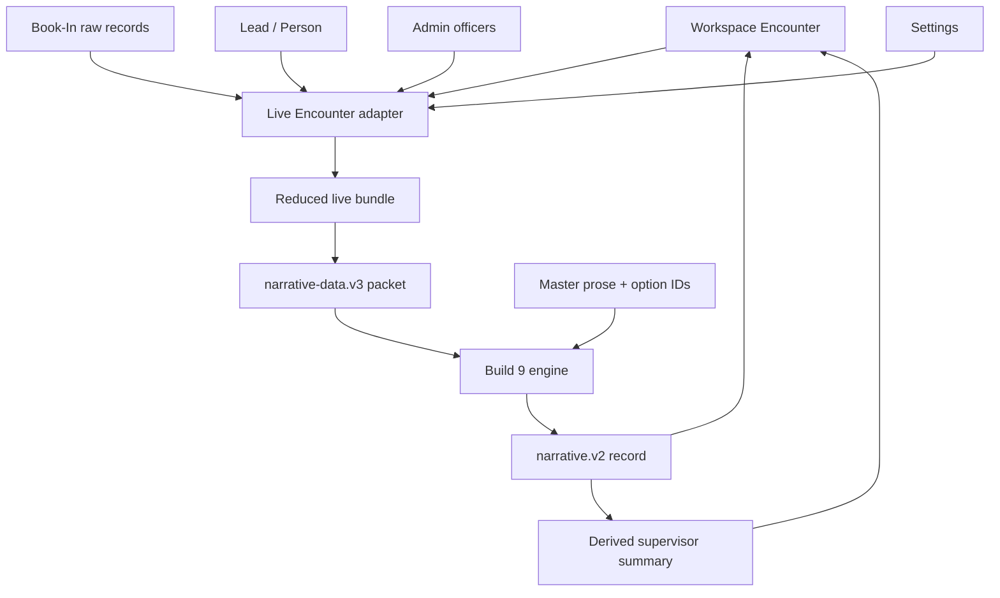
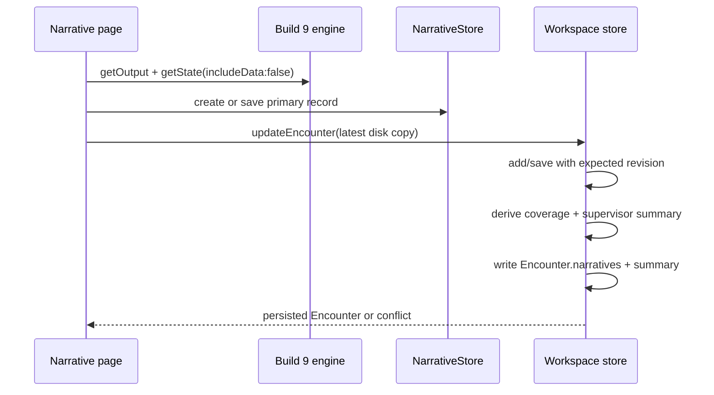
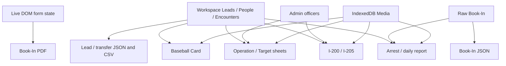

# COPDoc Stage 1 — Narrative and Report Data Contract

**Contract status:** current implementation, frozen for impact analysis
**Scope:** Narrative Build 9 plus every active document/report/export path found by
repository-wide searches for PDF filling, `Blob` downloads, clipboard output,
printing, JSON/CSV construction, and report builders.
**Runtime changes:** none

This document describes what the current code reads, derives, stores, downloads,
and writes back. It does **not** normalize the shapes or propose a replacement
model. In particular, a field called “canonical” elsewhere in the UI is not
treated as authoritative here unless the actual generator uses it as such.

## Evidence and classification legend

- **VERIFIED** — traced through a current read/write path, constructor, active
  page script list, or repeatable repository test.
- **INFERRED** — follows from the code but depends on runtime browser state or a
  workflow not executed end to end.
- **AUTHORITY** — the effective source used by this particular consumer. It does
  not imply global authority.
- **DUPLICATE** — the same fact or an output snapshot is separately persisted.
- **DERIVED** — calculated/projected from source facts; it may still be stored.
- **LEGACY** — compatibility alias, older schema, or retained standalone artifact.
- **UNKNOWN / REVIEW** — intent or current operational use cannot be established
  safely from the repository.

Unless a row or statement is explicitly labeled **INFERRED** or
**UNKNOWN / REVIEW**, its field read, write, transformation, and output path is
**VERIFIED** from the cited implementation. Runtime outcomes that depend on
browser permissions, user-selected folders, or unavailable deployment wiring
remain **INFERRED** even when the branch itself is verified.

Source references use `file:function:line-range` where the function is named.
For page load order and declarative libraries, the reference is `file:line-range`.

## Executive contract findings

| Status | Finding | Contract consequence | Evidence |
|---|---|---|---|
| **VERIFIED** | The durable Narrative authority is `workspace.encounters[encounterId].narratives[]`. The page's `NarrativeStore` is only an in-memory editing copy. | A migration must update the Encounter-embedded records; changing engine state alone does not migrate saved Narratives. | `functions/model/encounter.js:createEncounterRecord:315-393`; `functions/narratives/narrative-page.js:persistLiveEncounter:687-755`; `functions/narratives/build9/index.js:NarrativeStore:69-124` |
| **VERIFIED** | Live Narrative facts do not come from one authority. Participant selection and most factual values prefer raw Book-In rows, some values fall back to canonical Person, conduct/outcome seeding reads Encounter subjects, officer identity is text-matched against Admin, and place/vehicle facts come from Encounter embeds. | A Person, Book-In, or Encounter schema change can silently change or blank Narrative prose even when the other copies remain intact. | `functions/encounter-narrative.js:bundleFromEncounter:185-448`; `functions/narratives/narrative-page.js:seedFromEncounter:481-656` |
| **VERIFIED** | The live adapter fabricates a reduced Encounter: `encounterNumber=encounterId`, type is based only on whether a vehicle exists, status is always `COMPLETED`, end equals start, notes are blank, events are empty, and Operation is nearly empty. | Those projected values are the Narrative packet contract today; they are not faithful reads of the saved Encounter aggregate. | `functions/encounter-narrative.js:bundleFromEncounter:398-447` |
| **VERIFIED** | The engine has four versioned schemas: data/state/output/template v3. The persisted domain wrapper is separately `copdoc.narrative.v2`. | Renaming a host field, packet field, master field ID, option ID, token slot, or persisted record property crosses a distinct compatibility boundary. | `functions/narratives/narrative-builder-engine.js:__opdocNarrativeBootstrap:474-499`; `functions/narratives/build9/narrative-domain.js:18-33,167-243` |
| **VERIFIED** | The live page disables template localStorage and source editing. It stores a complete template snapshot inside each Narrative engine state, but does not persist a shared template library on that page. | Template edits in the training page are session-scoped; per-Narrative state is the resumable copy. There is no source-field writeback from Narrative. | `functions/narratives/narrative-page.js:bootWorkspace:170-190`; `functions/narratives/narrative-builder-engine.js:getIntegrationState:6223-6260`; `functions/narratives/narrative-builder-engine.js:setSourceEditHandler:5914-5922` |
| **VERIFIED** | Saving also stores a derived `supervisorSummary`; completion snapshots copy that summary but omit `narratives[]`. | A Narrative edit after Encounter completion can leave the historical completion summary and current Narrative collection describing different states. | `functions/narratives/narrative-page.js:persistLiveEncounter:703-734`; `functions/model/store.js:buildEncounterCompleted:2146-2197` |
| **VERIFIED** | Most generated reports are transient browser output. There is no common Report/Document entity, artifact registry, generator-run log, or success receipt. | Schema blast radius must be found from code consumers; saved application data cannot enumerate which documents were produced. | Output inventory below; representative paths `functions/book-in.js:generateCombinedPacket:4341-4435`, `functions/arrest-report.js:build:655-750`, `functions/leads.js:saveTargetSheetHtml:4911-5043` |
| **VERIFIED** | Warrant PDFs and Baseball Cards are exceptions: warrant metadata is appended to Person and PDF bytes may be saved to Media; Baseball Card HTML/text is persisted under Person immigration and its photo in Media. | These paths create intentional but independently stale snapshots and require multi-store consistency checks. | `functions/warrant-issue.js:issue:514-630`; `functions/baseball-page.js:persistBaseballCard:773-911` |
| **VERIFIED** | Current daily arrest reporting is built from committed `Person.arrests[]`; raw Book-In only fills blanks. | A Book-In packet with no successful promotion is absent from the current daily report even though the packet exists. | `functions/arrest-report.js:collect:166-292`; `functions/model/store.js:listArrests:1872-1890` |
| **VERIFIED** | The same active Case pages load two implementations that bind the Lead CSV action. | One click can invoke duplicate download handlers and status updates; both schemas currently happen to contain the same 12 fields. | `case.html:854-855`; `cases.html:86-87`; `functions/leads.js:leadCsvRow:3435-3471`; `functions/lead-csv.js:1-95` |

## 1. Narrative Build 9 architecture

### Active page and load contract

**VERIFIED:** `narrative.html` is a classic-script page. It loads shared prose,
the ten ordered section libraries, the Master assembler, engine/UI/packet modules,
Build 9 domain modules, Workspace models/store, the live Encounter adapter, then
the page controller. Order is runtime-significant because each file extends a
global namespace and several modules throw if their predecessor is absent
(`narrative.html:118-149`; `data/narratives/narrative-master.js:17-26`).



- **VERIFIED:** `?encounterId=` activates live mode; no query activates the
  synthetic training fixture (`functions/narratives/narrative-page.js:loadLiveFixture:22-75`,
  `functions/narratives/narrative-page.js:autoBootStandalone:1336-1353`).
- **VERIFIED:** opening Narrative from an Encounter autosaves the Encounter and
  navigates to or mounts this workspace; it is not an iframe
  (`functions/narratives/encounter-launcher.js:13-103`).
- **VERIFIED:** the Draft pop-out is a same-origin `window.open` visual mirror.
  A `MutationObserver` refreshes the copy; the pop-out copy action does not update
  source state (`functions/narratives/narrative-page.js:bindDraftPopout:194-405`).
- **VERIFIED:** the engine also implements a guarded `postMessage` request bridge,
  but the active integrated page calls the engine directly. The bridge is an
  available integration surface, not the current page-to-page persistence path
  (`functions/narratives/narrative-builder-engine.js:executeBridgeCommand:6502-6578`,
  `functions/narratives/narrative-builder-engine.js:6889-6951`).

### Live source precedence and projection

The following table is the effective Narrative read contract, not the intended
business ownership model.

| Narrative fact | Effective read precedence / transformation | Packet destination | Class | Evidence |
|---|---|---|---|---|
| Participant population | If **any** Book-In row has matching `encounterId`, only matching Book-In rows with a valid Target/Collateral `encounterRole` are candidates. Encounter subjects are used only when zero linked Book-In rows exist. | `participants[]` | **AUTHORITY, DUPLICATE** | `functions/encounter-narrative.js:bundleFromEncounter:197-232` |
| Participant role | `formState.encounterRole.value`, then top-level `encounterRole`; only `TARGET`/`COLLATERAL` survive. | object `roles`, `encounter_role` | **AUTHORITY** | `functions/encounter-narrative.js:formValue:52-62`; `functions/encounter-narrative.js:encounterRole:69-72`; `functions/narratives/packet-builder.js:roleForParticipant:51-87` |
| EncounterParticipant ID | `"ep_" + (BookIn.id || sourceIndex)`; Encounter fallback copies `bookinRecordId` into `id`; index fallback is order-dependent. | object `id`; record focus FK | **DERIVED, UNKNOWN / REVIEW** | `functions/encounter-narrative.js:bundleFromEncounter:211-231,298-304`; `functions/narratives/packet-builder.js:participantObject:131-190` |
| Reusable Person ID | Lead resolved from Book-In `leadId`; `model.subjectOf(lead).personId`; otherwise `p_enc_{sourceIndex}`. | object `entity_id`; metadata `person_id` | **AUTHORITY, DERIVED fallback** | `functions/encounter-narrative.js:bundleFromEncounter:252-255,298-304` |
| Name | Book-In `formState.lastName/firstName`, then Book-In top-level; Person name fills only remaining display-name blanks. | `full_name`, label | **AUTHORITY, DUPLICATE** | `functions/encounter-narrative.js:bundleFromEncounter:257-258,289-297`; `functions/narratives/packet-builder.js:participantObject:120-155` |
| A-Number | Book-In `formState.alienNumber`, then `aNumber`, `alienNumber`, then `Person.immigration.alienNumber`; punctuation removed. | `a_number` | **AUTHORITY, DUPLICATE, DERIVED format** | `functions/encounter-narrative.js:bundleFromEncounter:259-264,308-314`; `functions/narratives/packet-builder.js:participantObject:153-176` |
| DOB | Book-In `formState.dateOfBirth`, then Person `dateOfBirth`. | `date_of_birth` | **AUTHORITY, DUPLICATE** | `functions/encounter-narrative.js:bundleFromEncounter:265-266` |
| Sex | Book-In `sexMale`/`sexFemale` checked state; then Person `sex`; `M/F` expanded; blank becomes `UNKNOWN`. | `sex` | **AUTHORITY, DUPLICATE, DERIVED format** | `functions/encounter-narrative.js:formSex:74-82`; `functions/encounter-narrative.js:bundleFromEncounter:267-273,308-315` |
| Nationality/citizenship | Book-In `formState.citizenship`, then Person `citizenship`; catalog label added. | `country`; seed `subject_nationality` | **AUTHORITY, DUPLICATE, DERIVED label** | `functions/encounter-narrative.js:bundleFromEncounter:274-275,308-314`; `functions/narratives/narrative-page.js:seedFromEncounter:623-635` |
| ICE event | Book-In `formState.iceEvent`, then top-level `iceEvent`; no Person fallback. | `ice_event`; record `sourceSnapshot.iceEventNumber` | **AUTHORITY, DUPLICATE** | `functions/encounter-narrative.js:bundleFromEncounter:276,320`; `functions/narratives/narrative-page.js:captureCurrent:1064-1067` |
| Outcome/time | Adapter hardcodes every included participant `ARRESTED`; time is Book-In `dateTime`, not `arrestTime`, falling back to Encounter start. Page seeding may override the selected prose from actual Encounter subject `outcome`. | `outcome_code`, `arrest_time`; `final_outcome` seed | **DERIVED, DUPLICATE, UNKNOWN / REVIEW** | `functions/encounter-narrative.js:bundleFromEncounter:277,317-318`; `functions/narratives/narrative-page.js:seedFromEncounter:555-575` |
| Immigration status/disposition | Person status; Book-In `formState.immigrationDisposition` then Person disposition; final-order confirmation is truthiness of `Person.immigration.finalOrder`. | immigration participant fields | **AUTHORITY, DUPLICATE, DERIVED** | `functions/encounter-narrative.js:bundleFromEncounter:287-329` |
| Enforcement basis | First Person warrant accepted by `isIssuedWarrant`; otherwise `WARRANTLESS_ADMINISTRATIVE`. | participant `enforcementBasisCode` (not emitted by packet fields) | **DERIVED; currently dropped downstream** | `functions/encounter-narrative.js:enforcementBasis:173-183`; `functions/narratives/packet-builder.js:participantObject:131-190` |
| Health/medication/minors/currency/documents | Book-In `medicalIssues`, `medicine`, `children`, `cash`, `travelDocs`; blanks normalized to `UNKNOWN`, cash becomes `{code:"YES",amountUsd}`. | person fields used by closing options | **AUTHORITY, DUPLICATE, DERIVED** | `functions/encounter-narrative.js:bundleFromEncounter:282-286,331-339`; `functions/narratives/packet-builder.js:participantObject:177-180` |
| Reporting officer | First nonblank Book-In `officersName`; exact normalized text match against non-junked Admin officer name/display name; otherwise synthetic `ofc_reporting`. | officer object; Encounter `reportingOfficerId` | **AUTHORITY, DERIVED, UNKNOWN / REVIEW join** | `functions/encounter-narrative.js:matchRosterOfficer:149-170`; `functions/encounter-narrative.js:bundleFromEncounter:278-281,383-397` |
| Vehicle | Every embedded `Encounter.vehicles[]`; aliases `vehicleYear/make/model/color`, `licensePlate/plate`, `plateState`; role from `governmentVehicle`; every vehicle links to the primary participant. | vehicle objects | **AUTHORITY, DUPLICATE, DERIVED projection** | `functions/encounter-narrative.js:bundleFromEncounter:342-381`; `functions/narratives/packet-builder.js:vehicleObject:262-290` |
| Location | First embedded `Encounter.locations[0]`, not `centerLocationId`; address aliases mapped into a synthetic Location and numeric blank coordinates become `0`. | location object | **AUTHORITY, DUPLICATE, DERIVED projection** | `functions/encounter-narrative.js:bundleFromEncounter:195,383,425-443`; `functions/narratives/packet-builder.js:locationObject:292-322` |
| Operation | Synthetic blank ID/name/number; `fieldOffice` from `copdocx.settings.v1.issuingOffice`; date from Encounter start. Saved `Encounter.operationId` is not followed. | operation object | **DERIVED, UNKNOWN / REVIEW** | `functions/encounter-narrative.js:readSettings:27-35`; `functions/encounter-narrative.js:bundleFromEncounter:398-420` |
| Encounter events | Always `[]` in the live adapter. | no event objects | **DERIVED omission** | `functions/encounter-narrative.js:bundleFromEncounter:421-423` |
| Existing narratives | Saved `Encounter.narratives[]` copied into the fixture/in-memory store. | edit state | **AUTHORITY** | `functions/encounter-narrative.js:bundleFromEncounter:445-447`; `functions/narratives/narrative-page.js:bootWorkspace:189-192` |

**VERIFIED failure condition:** if one Book-In row exists for an Encounter, an
Encounter subject without a Book-In row is not included. This is not a merge of
the two participant lists (`functions/encounter-narrative.js:bundleFromEncounter:197-232`).

**VERIFIED failure condition:** invalid Book-In/Admin/settings JSON is converted
to an empty collection/object, so the Narrative page cannot distinguish missing
data from parse corruption (`functions/encounter-narrative.js:bookinRecords:7-15`,
`functions/encounter-narrative.js:readAdmin:17-25`,
`functions/encounter-narrative.js:readSettings:27-35`).

### Current TypeScript-style Narrative contracts

These interfaces intentionally show the *effective* shapes and competing layers.
`string` commonly includes `""`; imported/older records can contain additional
properties.

```ts
type ISODateTime = string;

interface BookInFormEntry {
  checked: boolean;
  type: string;               // DOM input type/tag
  value: string;
}

interface NarrativeLiveBundle {
  encounter: ProjectedNarrativeEncounter;
  operation: ProjectedNarrativeOperation;
  participants: ProjectedNarrativeParticipant[];
  events: [];                 // current live adapter always empty
  encounterVehicles: ProjectedEncounterVehicle[];
  vehicles: ProjectedNarrativeVehicle[];
  location: ProjectedNarrativeLocation;
  officers: ProjectedNarrativeOfficer[];
  unassignedParticipantCount: number;
  narrativesInitial: NarrativeRecord[];
}

interface ProjectedNarrativeEncounter {
  schema: "copdoc.encounter.v1";
  recordType: "ENCOUNTER";
  encounterId: string;
  encounterNumber: string;             // derived = encounterId
  eventType: "VEHICLE_STOP" | "OTHER"; // derived from vehicle count
  status: "COMPLETED";                 // fabricated by adapter
  startedAt: ISODateTime | "";
  endedAt: ISODateTime | "";           // derived = startedAt
  primaryLocationId: string;
  primaryEncounterParticipantId: string;
  reportingOfficerId: string;
  notes: "";                           // saved Encounter notes not read
}

interface ProjectedNarrativeParticipant {
  encounterParticipantId: string;      // `ep_${bookinIdOrIndex}`
  encounterId: string;
  personId: string;                    // real ID or `p_enc_${index}`
  encounterRole: "TARGET" | "COLLATERAL";
  roleSequence: number;
  primaryForReport: boolean;
  identitySnapshot: {
    displayName: string;
    dateOfBirth: string;
    aNumber: string;
    nationalityCountryCode: string;
    nationalityDisplay: string;
    sex: "MALE" | "FEMALE" | "UNKNOWN" | string;
    capturedAt: ISODateTime | "";
  };
  finalOutcome: "ARRESTED";            // current adapter constant
  finalOutcomeAt: ISODateTime | "";
  enforcementBasisCode: "I_200" | "I_205" | "WARRANTLESS_ADMINISTRATIVE";
  iceEventNumber: string | null;
  immigrationSnapshot: {
    statusCode: string | null;
    dispositionCode: string;
    earmDispositionCode: string;
    displayText: string;
    finalOrder: { statusCode: "CONFIRMED" | "UNKNOWN"; orderDate: string | null };
  };
  closing: {
    health: string;
    minors: string;
    medication: string;
    currency: { code: "YES"; amountUsd: string } | null;
    identityDocuments: string;
  };
}

interface NarrativeDataPacket {
  schema_version: "copdoc.narrative-data.v3";
  source_schema_version?: string;       // added by engine normalization
  packet_id: string;                    // `${encounterId}::${focusId}`
  packet_name: string;
  is_test_data: boolean;
  objects: NarrativeObject[];
  metadata?: {
    encounter_id?: string;
    focus_participant_id?: string | null;
    source?: "copdoc.packet-builder.v3" | string;
    [key: string]: unknown;
  };
}

interface NarrativeObject {
  id: string;                           // binding identity
  entity_id: string;                    // reusable-domain identity
  type:
    | "operation" | "encounter" | "event" | "subject" | "officer"
    | "vehicle" | "location" | "agency" | "document" | "country"
    | "facility" | "person" | "narrative_detail";
  role?: string;
  roles: Array<{ role: string; ordinal?: number }>;
  label: string;
  fields: Record<string, string | number | boolean | string[]>;
  metadata?: unknown;
  relationships?: unknown;
}

interface NarrativeTemplateState {
  schema: "copdoc.narrative-template.v3";
  id: string;
  name: string;
  description: string;
  includeDefaults: boolean;
  sourceMasterBuild: number;
  masterBuild: 9;
  activeTemplate: Record<string, unknown>;
  sections: NarrativeTemplateSection[]; // full Master-projected snapshot
}

interface NarrativeIntegrationState {
  schema: "copdoc.narrative-state.v3";
  moduleVersion: "9.0.0-integration-candidate" | string;
  build: 9;
  capturedAt: ISODateTime;
  template: NarrativeTemplateState;
  encounter: {
    selections: Record<string, string>; // field-instance ID -> option ID
    times: Record<string, { value: string; mode: "manual" | "auto" }>;
    tokenBindings: Array<[string, ObjectBinding | CustomBinding]>;
    tokenTypeOverrides: Array<[string, unknown]>;
    view: string;
  };
  narrative: {
    template: string;
    resolved: string;
    sections: EngineNarrativeSection[];
    factsManifest: NarrativeFactsManifest;
    plainText: string;
    plainTextIsManual: boolean;
    dynamicDraftIsManual: boolean;
  };
  dataPacket?: NarrativeDataPacket;     // omitted by active page (`includeData:false`)
  savedTemplates?: NarrativeTemplateState[]; // omitted by active page
}

interface ObjectBinding {
  mode: "object";
  objectId: string;
  fieldKey: string;
}

interface CustomBinding {
  mode: "custom";
  customValue: string;                  // retained in engine state
}

interface NarrativeBindingManifest {
  slotKey: string;                      // `${fieldScope}::slot:${slotId}`
  slotId: string;
  placeholder: string;
  sourceFieldId: string;
  sourceSectionId: string;
  category: string;
  status: string;
  occurrences: number;
  roleSelector: unknown;
  binding:
    | { mode: "object"; objectId: string; entityId: string; fieldKey: string }
    | { mode: "custom" }               // custom value intentionally omitted here
    | null;
  resolvedValue: string;                // duplicate resolved snapshot
}

interface EngineNarrativeSection {
  sectionId: string;
  sequence: number;
  title: string;
  sectionType: "MASTER" | "SYSTEM";
  templateText: string;
  resolvedText: string;
  manualTextOverride: null;             // engine currently always emits null
  sourceFieldInstanceIds: string[];
  sourceEncounterParticipantIds: string[]; // populated only for system other_arrested
}

interface NarrativeEngineOutput {
  schema: "copdoc.narrative-output.v3";
  moduleVersion: string;
  build: 9;
  masterHash: string;
  generatedAt: ISODateTime;
  template: string;
  resolved: string;
  generatedResolvedText: string;
  plainText: string;
  plainTextIsManual: boolean;
  dynamicDraftIsManual: boolean;
  view: string;
  activeTemplate: Record<string, unknown>;
  tokenStatus: Record<string, unknown>;
  bindings: NarrativeBindingManifest[];
  sections: EngineNarrativeSection[];
  factsManifest: NarrativeFactsManifest;
  provenance: {
    masterSource: string | null;
    masterHash: string;
    sourceMasterBuild: number;
    packetId: string | null;
    packetSourceSchema: string | null;
  };
  validation: NarrativeValidation;
}

interface PersistedNarrativeOutput {
  schema: "copdoc.narrative-output.v3";
  sections: Array<EngineNarrativeSection & { sourceObjectIds: string[] }>;
  generatedResolvedText: string;
  finalPlainText: string;
  plainTextIsManual: boolean;
  // Transient moduleVersion, hashes, bindings, provenance, validation, etc. are stripped.
}

interface NarrativeFactsManifest {
  schema: "copdoc.narrative-facts-manifest.v1";
  focusEncounterParticipantId: string | null;
  sourceObjectIds: string[];
  sourceEncounterParticipantIds: string[];
  otherArrestedEncounterParticipantIds: string[];
}

interface NarrativeValidation {
  schema: "opdoc.narrative-validation.v1";
  stage: string;
  valid: boolean;
  errors: Array<Record<string, unknown>>;
  warnings: Array<Record<string, unknown>>;
  tokenStatus: Record<string, unknown>;
}

interface NarrativeRecord {
  schema: "copdoc.narrative.v2";
  recordType: "NARRATIVE";
  narrativeId: string;                  // required, caller-owned
  encounterId: string;                  // Encounter reference
  narrativeKind:
    | "PRIMARY_SUBJECT" | "SUBJECT_SUPPLEMENT"
    | "ENCOUNTER_OVERVIEW" | "ENCOUNTER_SUPPLEMENT";
  focusEncounterParticipantId: string | null;
  relatedEncounterParticipantIds: string[];
  title: string;
  sequence: number;
  workflowStatus: "DRAFT" | "FINALIZED";
  freshnessStatus: "CURRENT" | "STALE" | "UNKNOWN";
  engine: {
    version: string | null;
    build: number;
    stateSchema: "copdoc.narrative-state.v3" | string;
    state: NarrativeIntegrationState | null;
  };
  output: PersistedNarrativeOutput;
  bindings: NarrativeBindingManifest[]; // duplicate of state/output resolution metadata
  factsManifest: NarrativeFactsManifest | null;
  validationSnapshot: NarrativeValidation | null;
  sourceSnapshot: {
    encounterId?: string;
    iceEventNumber?: string;
    [unknown: string]: unknown;
  } | null;
  notes: string | null;
  recordState: "ACTIVE" | "ARCHIVED" | "VOIDED" | "SUPERSEDED";
  revision: number;
  createdAt: ISODateTime;
  updatedAt: ISODateTime;
}

interface NarrativeVersionRecord {      // domain-supported; no active page writer found
  schema: "copdoc.narrative-version.v1";
  recordType: "NARRATIVE_VERSION";
  narrativeVersionId: string;
  narrativeId: string;
  encounterId: string;
  focusEncounterParticipantId: string | null;
  narrativeKind: NarrativeRecord["narrativeKind"];
  versionNumber: number;
  finalizedAt: ISODateTime;
  finalizedByUserId: string | null;
  snapshot: NarrativeRecord;
  sourceFingerprint: string | null;
  recordState: "ACTIVE";
  revision: 1;
  createdAt: ISODateTime;
  updatedAt: ISODateTime;
}
```

Schema evidence: packet projection
`functions/narratives/packet-builder.js:participantObject:131-190,encounterObject:193-214,operationObject:217-235,eventObject:237-260,vehicleObject:262-290,locationObject:292-322,buildPacketFromBundle:337-408`;
engine normalization/output/state
`functions/narratives/narrative-builder-engine.js:normalizeDataPacket:3384-3474,getStructuredNarrativeSections:4456-4480,getBindingManifest:5985-6007,getNarrativeOutput:6077-6110,getIntegrationState:6223-6260`;
durable domain records
`functions/narratives/build9/narrative-domain.js:normalizeSections:82-119,normalizeOutput:128-148,createNarrativeRecord:167-243,createNarrativeVersionRecord:472-511`.

### Master template and selection contract

**VERIFIED:** the Master assembler requires exactly ten section IDs, in order,
and rejects missing, reordered, or duplicate field/option IDs. The current test
run reports **10 sections, 38 fields, 201 options**
(`data/narratives/narrative-master.js:24-68`;
`scripts/test-narrative-build9.js:1-55`). Counts include each field's blank
“Not included” option where the library supplies one.

| Order | Section ID | Persisted selection keys and option counts | Timing/repeat behavior | Evidence |
|---:|---|---|---|---|
| 1 | `origin` | `origin_type` (13) | single | `data/narratives/sections/01-origin.js:18-83` |
| 2 | `authority` | `existing_authority` (7); `initial_encounter_level` (3) | single | `data/narratives/sections/02-authority.js:18-70` |
| 3 | `context` | `encounter_location_type` (8) | single | `data/narratives/sections/03-context.js:18-58` |
| 4 | `observation` | `surveillance_type` (4); `corroboration_one/two/three` (8 each) | event-time capable | `data/narratives/sections/04-observation.js:18-56` |
| 5 | `contact` | `contact_method` (8); `commands` (4); `vehicle_containment` (2) | event-time capable | `data/narratives/sections/05-contact.js:18-93` |
| 6 | `conduct` | `incident_subject` (4); `subject_conduct` (9); `flight` (4); `force_type` (9); `force_result` (5); `window_break` (7); `window_break_tool` (4); `collision` (2) | first seven use repeat group `force_incident` | `data/narratives/sections/06-conduct-incidents.js:18-277` |
| 7 | `confirmation` | `identity_confirmation` (7); `alienage_confirmation` (5); `right_to_remain` (7) | single | `data/narratives/sections/07-confirmation.js:18-117` |
| 8 | `custody` | `enforcement_action` (7); `restraints` (3); `search_type` (4) | single | `data/narratives/sections/08-custody.js:18-92` |
| 9 | `items` | `vehicle_disposition` (9); `property_disposition` (5); `document_disposition` (4); `evidence_disposition` (4) | single | `data/narratives/sections/09-vehicle-property.js:18-134` |
| 10 | `final_disposition` | `final_outcome` (9); `claimed_health` (2); `minor_children_statement` (2); `medication_statement` (3); `currency_statement` (2); `subject_nationality` (3); `identity_documents` (3); `other_arrested` (2); `bwc_closing_statement` (3) | single; `other_arrested` can add a system section | `data/narratives/sections/10-final-disposition.js:18-181` |

The shared library owns the blank option, the eight corroboration choices, the
system-generated “other arrested” prose, and the event-time connective language
(`data/narratives/narrative-shared-options.js:12-81`). These strings and IDs are
data contracts because state stores option IDs while the engine resolves prose
from the currently loaded libraries.

### Encounter-owned seeds and saved override precedence

`seedFromEncounter()` maps these saved Encounter/Book-In facts into Master
selection IDs. It also hides mapped controls in the live page.

| Source fact | Derived option(s) | Class | Evidence |
|---|---|---|---|
| `Encounter.eventType=TARGETED_ARREST` / `COLLATERAL_CONTACT` | `origin_type=preplanned_targeted_arrest` / `collateral_encounter` | **DERIVED** | `functions/narratives/narrative-page.js:seedFromEncounter:499-505` |
| center Location association, falling back to first Location, plus event type | `encounter_location_type` residence/public/moving/parked/workplace/transfer/other | **DERIVED, DUPLICATE** | `functions/narratives/narrative-page.js:seedFromEncounter:506-537` |
| zero vehicles, or any vehicle `encounterDisposition=MOVED/LEFT` | hide `vehicle_disposition`, or choose released/left secured | **DERIVED** | `functions/narratives/narrative-page.js:seedFromEncounter:538-553` |
| focused participant | `incident_subject=primary_subject` | **DERIVED** | `functions/narratives/narrative-page.js:seedFromEncounter:554-555` |
| Encounter subject `outcome` with adapter fallback | flight, enforcement action, final outcome | **AUTHORITY, DERIVED, DUPLICATE** | `functions/narratives/narrative-page.js:matchLiveSubject:440-478`; `functions/narratives/narrative-page.js:seedFromEncounter:555-575` |
| Encounter subject `compliance` | fully compliant / refused commands | **AUTHORITY, DERIVED** | `functions/narratives/narrative-page.js:seedFromEncounter:576-581` |
| Encounter subject `useOfForce`, `forceLevel` | hide force, or physical control/takedown/other | **AUTHORITY, DERIVED** | `functions/narratives/narrative-page.js:seedFromEncounter:582-595` |
| participant closing values from Book-In | health, medication, minors, currency, identity-document options | **AUTHORITY, DERIVED, DUPLICATE** | `functions/narratives/narrative-page.js:seedFromEncounter:596-622` |
| nationality display/code | Mexican / other nationality | **DERIVED** | `functions/narratives/narrative-page.js:seedFromEncounter:623-635` |
| another arrested Encounter subject | include `other_arrested` system section | **DERIVED** | `functions/narratives/narrative-page.js:seedFromEncounter:636-655`; `functions/narratives/narrative-builder-engine.js:appendSystemNarrativeSections:2877-2920` |

**VERIFIED conflict rule:** saved engine selections win over fresh Encounter
seeds because the page performs `Object.assign({}, seed.selections,
state.encounter.selections)` (`functions/narratives/narrative-page.js:seededSelections:972-985`).
Thus a hidden “Encounter-owned” field can remain stale after its source changes.

### Packet normalization, adapters, roles, and resolver contract

| Boundary | Current behavior | Rename/failure effect | Evidence |
|---|---|---|---|
| Packet size | Maximum 500 objects, 100 fields/object, 12,000 characters/scalar, 240-character label/name, 100,000 metadata bytes. | Oversized input throws before rendering. | `functions/narratives/narrative-builder-engine.js:306-313` |
| Object type | Only 13 built-in types or a type with a runtime adapter. | A type rename throws `Unsupported narrative object type`. | `functions/narratives/narrative-builder-engine.js:316-330,3384-3425` |
| Field whitelist | Built-in projection, then registered adapter, then explicit `fields`; explicit wins. Active page sets `allowUnknownFields:false`; binary-looking keys are rejected. | Unknown renamed explicit fields are silently omitted, so a token later becomes unresolved rather than preserving the data. | `functions/narratives/narrative-builder-engine.js:normalizeFieldObject:3242-3272`; `functions/narratives/narrative-builder-engine.js:adaptInputObject:3274-3299` |
| Host adapters | Runtime `objectAdapters` map only; never serialized. | Reload cannot restore a custom adapter definition. | `functions/narratives/narrative-builder-engine.js:597-603`; `functions/narratives/narrative-builder-engine.js:6904-6919` |
| Role shape | Canonical role plus optional positive ordinal, at most 20 per object. | Role rename alters candidate selection and can violate focal-subject invariant. | `functions/narratives/narrative-builder-engine.js:normalizeObjectRoles:3301-3337` |
| Focus invariant | A v3 packet with multiple Target/Collateral people must contain exactly one `narrative_subject`. | Missing/duplicated focus throws `FOCAL_PARTICIPANT_REQUIRED`. | `functions/narratives/narrative-builder-engine.js:normalizeDataPacket:3449-3461` |
| Placeholder resolver | Placeholder name maps to allowed object types, field candidates, and sometimes role candidates. | Field/type/role rename breaks automatic/manual object resolution unless the rule and saved bindings are migrated together. | `functions/narratives/narrative-builder-engine.js:332-402` |
| Binding identity | Token key is stable field/binding scope plus `::slot:{slotId}`. Object binding stores packet object ID and field key. | Master field/slot rename or packet object ID/field rename creates `STALE_BINDING` or `UNRESOLVED_VARIABLE`. | `functions/narratives/narrative-builder-engine.js:4254-4277`; `functions/narratives/narrative-builder-engine.js:resolveBinding:4182-4203`; `functions/narratives/narrative-builder-engine.js:validateNarrative:6010-6073` |
| Custom binding | Full custom value is stored in `state.encounter.tokenBindings`; the top-level binding manifest records only `{mode:"custom"}` plus the last `resolvedValue`. | Treating the manifest as independently resumable loses the custom source value. | `functions/narratives/narrative-builder-engine.js:getBindingManifest:5985-6007`; `functions/narratives/narrative-builder-engine.js:normalizeRestoredBinding:6262-6279` |
| Auto-bind | Candidate scoring is engine-internal; only a score of at least 500 is accepted. | A seemingly minor role/type/field rename can push a binding below threshold. | `functions/narratives/narrative-builder-engine.js:autoBindAllTokens:5727-5774` |
| Conditional fields | Force/window selections require incident subject and qualifying conduct; force result requires force; tool requires window. Disabled selections are cleared. | Changing field IDs without updating conditional logic silently removes selections. | `functions/narratives/narrative-builder-engine.js:updateConditionalLogic:2776-2825`; `functions/narratives/narrative-builder-engine.js:validateNarrative:6048-6064` |

Primary placeholder dependency groups are:

| Group | Object fields read by resolver | Host projection source |
|---|---|---|
| Subject identity | `full_name`, `date_of_birth`, `a_number`, `country`, nationality variants | Book-In/Person through participant projection |
| Immigration/closing | `immigration_status_or_disposition`, `medications`, `currency_usd` | Person immigration plus Book-In closing values |
| Vehicle | `display_name`, `description`, `plate`, `year_make_model` | embedded Encounter vehicle |
| Location | `location`, `full_address`, `address`, `contact_location`, location variants | first/center Encounter location, depending stage |
| Date/time/action | Encounter `date/time/event/action/disposition`; Event `time/action/disposition/description` | adapter's reduced Encounter; live Events currently absent |
| Officer/agency | `full_name`, `display_name`, `name` | Book-In free text, optionally resolved against Admin |
| Narrative detail | command, conduct, arrest/authority facts, force/tool/window, property/evidence/tow/destination and other detail keys | training fixture only in current page; live `narrativeFacts={}` |

The complete field/type/role mapping is code-owned at
`functions/narratives/narrative-builder-engine.js:332-402`; packet projections
are code-owned at `functions/narratives/packet-builder.js:131-335`.

### Template persistence and compatibility

- **VERIFIED:** the engine knows localStorage keys
  `opdoc.narrative.templates.v2` and legacy `opdoc.narrative.templates.v1`, but
  the active Narrative page configures `enableLocalStorage:false`
  (`functions/narratives/narrative-builder-engine.js:597-612`;
  `functions/narratives/narrative-page.js:bootWorkspace:170-181`).
- **VERIFIED:** imported/host templates are projected onto the Master. Unknown
  sections, fields and option IDs are discarded, editable strings are limited,
  and omitted Master sections are restored as empty sections
  (`functions/narratives/narrative-builder-engine.js:1552-1698`).
- **VERIFIED:** template export uses envelope
  `opdoc.narrative-template-export.v1`; it exports a selected in-memory saved
  template (`functions/narratives/narrative-builder-engine.js:exportSelectedTemplate:2104-2119`).
- **VERIFIED:** older saved Narrative engine state without `template.sections`
  is merged onto the current Master state, preserving old Encounter selections,
  times and bindings where the IDs still resolve
  (`functions/narratives/narrative-page.js:resumableStateFor:987-999`).
- **VERIFIED:** state schemas v1/v2, data schemas v1/v2, output schemas v1/v2,
  and template schemas v1/v2 are declared legacy inputs; the engine emits v3
  (`functions/narratives/narrative-builder-engine.js:474-485`).

### Manual overrides and output authority

There are two distinct user-edit surfaces:

| Edit surface | State flag | What is persisted | Rebuild behavior | Evidence |
|---|---|---|---|---|
| Dynamic Draft DOM | `dynamicDraftIsManual` / engine `manualEdits` | Text is captured into section `templateText`/`resolvedText`; the manual flag survives only inside engine state. Persisted domain output strips the transient flag. | Protected until explicit rebuild replaces dropdown-derived draft. | `functions/narratives/narrative-builder-engine.js:6660-6664`; `functions/narratives/narrative-builder-engine.js:getNarrativeOutput:6077-6110`; `functions/narratives/build9/narrative-domain.js:normalizeOutput:128-148` |
| Plain Text textarea | `plainTextIsManual` / engine `resolvedManualEdits` | `output.finalPlainText` is the manual text when flag is true; state also stores `plainText`. | Source changes mark a pending rebuild and do not overwrite manual text unless forced. | `functions/narratives/narrative-builder-engine.js:syncResolvedDraft:4501-4517`; `functions/narratives/narrative-builder-engine.js:6666-6669`; `functions/narratives/build9/narrative-domain.js:normalizeOutput:128-148` |
| Per-section override field | `manualTextOverride` | Domain accepts a string and makes it authoritative for that section. | Engine output currently emits `null`, so active UI does not exercise this separate domain capability. | `functions/narratives/build9/narrative-domain.js:sectionFinalText:82-88,normalizeSections:90-119`; `functions/narratives/narrative-builder-engine.js:getStructuredNarrativeSections:4456-4480` |

**VERIFIED authority rule:** for stored output, `finalPlainText` is the reportable
plain text; if `plainTextIsManual=false`, it is re-derived from stored sections.
`generatedResolvedText` is the section join. The top-level transient engine output
has many more diagnostic properties, but the domain strips them before saving
(`functions/narratives/build9/narrative-domain.js:normalizeOutput:128-148`).

### Save, revision, coverage, and summary lifecycle



| Contract | Current implementation | Status/evidence |
|---|---|---|
| ID | Live primary ID is deterministic `nar_{encounterId}_{encounterParticipantId}_primary`; domain otherwise requires caller-owned IDs. | **VERIFIED** — `functions/narratives/narrative-page.js:captureCurrent:1040-1068`; `functions/narratives/build9/narrative-domain.js:addNarrative:289-307` |
| Kinds | Domain supports primary, subject supplement, Encounter overview and Encounter supplement. Active page creates only a primary. | **VERIFIED** — `functions/narratives/build9/narrative-domain.js:22-30,310-324`; `functions/narratives/narrative-page.js:captureCurrent:1040-1069` |
| Workflow | Domain supports Draft/Finalized plus active/archive/void/supersede. Active page always creates Draft and writes Current; no finalization/archive/version control is wired. | **VERIFIED** — `functions/narratives/build9/narrative-domain.js:31-33,326-415,472-511`; `functions/narratives/narrative-page.js:captureCurrent:1020-1068` |
| Revision | Create defaults to 1. Save requires matching expected revision when supplied, makes identity immutable, rejects finalized content mutation, increments revision. | **VERIFIED** — `functions/narratives/build9/narrative-domain.js:createNarrativeRecord:167-243`; `functions/narratives/build9/narrative-domain.js:saveNarrativeById:341-397` |
| Cross-window write | `updateEncounter` rereads localStorage before applying the synchronous update, but localStorage has no transaction; truly simultaneous writers are still last-writer-wins. | **VERIFIED** — `functions/model/store.js:updateEncounter:2430-2488` |
| Save ordering | Page mutates in-memory store first, then Workspace. On failure it replaces the in-memory collection with the Encounter returned by the failed update. | **VERIFIED** — `functions/narratives/narrative-page.js:captureCurrent:1019-1085`; `functions/narratives/narrative-page.js:persistLiveEncounter:736-754` |
| Autosave | Engine change events refresh audit/derived UI only. Save occurs from explicit action, focus switch, or workspace flush. | **VERIFIED** — `functions/narratives/narrative-page.js:1095-1133,1220-1238,1297-1313` |
| Coverage | Active Target/Collateral EncounterParticipants each require exactly one active primary Narrative; supplements do not count. Coverage key is EncounterParticipant ID, not Person ID. | **VERIFIED** — `functions/narratives/build9/narrative-coverage.js:1-7,91-228` |
| Source freshness | Domain can snapshot a version with `sourceFingerprint`, and Summary can compare fingerprints. Active page instead sets `freshnessStatus="CURRENT"` on every save and stores only Encounter ID/ICE event in `sourceSnapshot`. | **VERIFIED** — `functions/narratives/build9/narrative-domain.js:createNarrativeVersionRecord:472-511`; `functions/narratives/build9/encounter-summary.js:assessEncounterSummaryFreshness:715-730`; `functions/narratives/narrative-page.js:captureCurrent:1020-1067` |

The derived summary schema is `copdoc.encounter-summary.v1`. It includes source
manifest/fingerprint, participant/officer counts, outcomes, immigration/final
order counts, resolved location, start/end/duration, event/force/window/collision/
injury metrics, Narrative coverage, completeness warnings, and generated prose
(`functions/narratives/build9/encounter-summary.js:deriveEncounterSummary:524-694`).
The active page persists that full object plus compatibility aliases `text`,
`derivedAt`, and `{coverage:{complete,missing}}`
(`functions/narratives/narrative-page.js:persistLiveEncounter:718-733`).

**VERIFIED duplicate/derived data:** `Encounter.supervisorSummary` is a mutable
derived cache. `Encounter.completed.supervisorSummary` is another snapshot, while
`Encounter.completed` omits `narratives[]`
(`functions/model/encounter.js:createEncounterRecord:315-393`;
`functions/model/store.js:buildEncounterCompleted:2146-2197`).

### Narrative field lineage

| Origin field(s) | Adapter / calculation | Packet/selection | Durable destination | Class | Evidence |
|---|---|---|---|---|---|
| Book-In `formState.lastName/firstName`; Person name fallback | display formatter | person `full_name` | section resolved text, output text, binding snapshots | **AUTHORITY, DUPLICATE, DERIVED** | `functions/encounter-narrative.js:bundleFromEncounter:257-297`; `functions/narratives/packet-builder.js:participantObject:131-190` |
| Book-In A-number; Person immigration fallback | strip non-digits | `a_number` | resolved text; `sourceSnapshot` does **not** retain A-number | **AUTHORITY, DUPLICATE, DERIVED** | `functions/encounter-narrative.js:bundleFromEncounter:259-264,308-320`; `functions/narratives/narrative-page.js:captureCurrent:1064-1067` |
| Book-In/Person disposition and final-order fields | catalog label/truthiness | immigration packet fields; confirmation/final prose bindings | Narrative output | **AUTHORITY, DUPLICATE, DERIVED** | `functions/encounter-narrative.js:bundleFromEncounter:287-329`; `functions/narratives/packet-builder.js:participantObject:168-176` |
| Encounter `eventType` | direct seed on page; adapter separately invents packet type | `origin_type`, location type; Encounter `event_type` | selections and generated prose | **AUTHORITY + conflicting DERIVED copy** | `functions/narratives/narrative-page.js:seedFromEncounter:499-537`; `functions/encounter-narrative.js:bundleFromEncounter:400-412` |
| Encounter subject `outcome` | outcome option mapping | flight/enforcement/final options | selections and generated prose | **AUTHORITY, DERIVED** | `functions/narratives/narrative-page.js:seedFromEncounter:555-575` |
| Encounter subject `compliance/useOfForce/forceLevel` | option mapping | conduct/force options | selections and generated prose | **AUTHORITY, DERIVED** | `functions/narratives/narrative-page.js:seedFromEncounter:576-595` |
| Book-In medical/cash/children/docs | unknown normalization + option mapping | participant fields and closing option IDs | state, section output, final text | **AUTHORITY, DUPLICATE, DERIVED** | `functions/encounter-narrative.js:bundleFromEncounter:282-286,331-339`; `functions/narratives/narrative-page.js:seedFromEncounter:596-622` |
| Encounter first Location | address/coordinate projection | location fields | bound Narrative text | **AUTHORITY, DUPLICATE, DERIVED** | `functions/encounter-narrative.js:bundleFromEncounter:195,425-443`; `functions/narratives/packet-builder.js:locationObject:292-322` |
| Encounter vehicles | display/plate projection | vehicle fields and vehicle-disposition seed | bound text/state | **AUTHORITY, DUPLICATE, DERIVED** | `functions/encounter-narrative.js:bundleFromEncounter:342-381`; `functions/narratives/narrative-page.js:seedFromEncounter:538-553` |
| Book-In officer free text + Admin roster | exact string join | officer object | bound text; `reportingOfficerId` projected | **AUTHORITY, DUPLICATE, DERIVED** | `functions/encounter-narrative.js:matchRosterOfficer:149-170`; `functions/encounter-narrative.js:bundleFromEncounter:278-281,383-397` |
| Master field and option IDs | selection -> prose -> token resolution | sections | engine state + normalized output | **AUTHORITY, DERIVED** | `data/narratives/narrative-master.js:24-68`; `functions/narratives/narrative-builder-engine.js:resolveNarrativeLogic:2827-2853` |
| Manual Dynamic Draft | serialize edited DOM | section `templateText/resolvedText` | state + normalized sections | **AUTHORITY for edited draft, DUPLICATE** | `functions/narratives/narrative-builder-engine.js:6660-6664`; `functions/narratives/narrative-builder-engine.js:getStructuredNarrativeSections:4456-4480` |
| Manual Plain Text | textarea | output `plainText` | `finalPlainText` when manual | **AUTHORITY for final plain text, DUPLICATE** | `functions/narratives/narrative-builder-engine.js:6666-6669`; `functions/narratives/build9/narrative-domain.js:normalizeOutput:128-148` |
| Narrative records + projected bundle | deterministic summary/fingerprint | coverage/summary | Encounter `supervisorSummary` | **DERIVED, DUPLICATE** | `functions/narratives/build9/encounter-summary.js:deriveEncounterSummary:524-694`; `functions/narratives/narrative-page.js:persistLiveEncounter:718-733` |

### Narrative rename blast radius

| Contract changed | Direct consumers that must move together | Failure mode | Risk |
|---|---|---|---|
| Book-In DOM ID / `formState` key | Book-In capture/restore, promotion adapter, live Narrative adapter, PDF fill | Silent fallback to stale top-level/Person value or blank; PDF and Narrative can diverge. | **CRITICAL** |
| `Encounter.subjects[].personId/leadId/bookinRecordId` | live-subject matcher, Book-In sync, Narrative participant projection, reports | Subject matched by weaker A-number/last-name heuristic or omitted. | **HIGH** |
| `Encounter.subjects[].outcome/compliance/useOfForce/forceLevel` | Narrative seed logic and summary/report derivations | Hidden Master selections retain old saved values while live Encounter changes no longer seed them. | **HIGH** |
| `Encounter.locations[]/centerLocationId` | adapter, page seeding, summary, completion, Target/Operation/CSV outputs | Different generators choose different first/center locations; Narrative address and report address split. | **HIGH** |
| Vehicle aliases (`vehicleYear`, `vehicleMake`, `vehicleModel`, `vehicleColor`, `licensePlate`, `plate`) | Narrative adapter/packet, Target sheet, Operation freeze, transfer CSV | Vehicle becomes partially blank in one output; no validation catches it. | **HIGH** |
| Person immigration fields | Narrative adapter, arrest report, Baseball Card, Target sheet, Warrant filename/defaults | Identity/disposition/final-order text changes across multiple legal/operational outputs. | **CRITICAL** |
| Admin officer fields (`officerId/id`, names, `displayName`, `badge`, `team`, `role`) | Narrative text matcher, Warrant issuer, Operation brief, arrest rows | Synthetic/unresolved officer identity or wrong title/team. | **HIGH** |
| packet object `id` | engine bindings and Narrative focus semantics | Saved object binding becomes stale even if `entity_id` is unchanged. | **CRITICAL** |
| packet object `type`, role, or field key | engine whitelist, placeholder rules, focus invariant | Input rejected/dropped or binding unresolved. | **CRITICAL** |
| Master section/field/option/slot ID | template projection, selections, repeat instances, token keys | Old state selection ignored; option dropped; token bindings stale. | **CRITICAL** |
| Narrative state/output schema or `NarrativeRecord` fields | engine restore, domain normalization/validation, Encounter persistence, coverage, summary | Record invalid, manual override lost, or coverage reports missing/orphan Narrative. | **CRITICAL** |

## 2. Document and report generation architecture

### System-wide output topology



**VERIFIED:** there is no shared report repository. Generators either return
HTML/plain text, invoke print/clipboard/download, persist a domain snapshot, or
write a Media object. “Generated” generally is not a stored domain event.

### Current report-adjacent schemas

```ts
interface ArrestReportRow {             // transient
  leadId: string;
  personId: string;
  arrestId: string;
  bookinRecordId: string;
  name: string;
  age: string;
  country: string;                      // catalog label
  aNumber: string;                      // formatted
  fbiNumber: string;
  iceEvent: string;
  encounterId: string;
  encounterNumber: string;
  disposition: string;                  // catalog label
  arrestDate: string;
  arrestDateTime: string;               // formatted local display
  officer: string;
  team: string;
  card: BaseballCard | null;
  photoDataUrl?: string;                // transient Media hydration
}

interface ArrestReportOutput {          // transient only
  title: string;
  summary: string;
  html: string;
  plainText: string;
  arrestCount: number;
  cardCount: number;
  missingCardCount: number;
  mode: "today" | "selected" | "encounter" | string;
}

interface ArrestRecord {                // persisted under Person.arrests[]
  arrestId: string;
  arrestDate: string;
  arrestTime: string;
  arrestDateTime: string;
  arrestCharge: string;
  arrestStatute: string;
  arrestClass: string;
  arrestAgency: string;
  arrestAgencyCode: string;
  arrestLocation: string;
  latitude: string;
  longitude: string;
  arrestingOfficer: string;
  team: string;
  iceEventNumber: string;
  encounterNumber: string;
  encounterId: string;
  subjectRole: string;
  vehiclePosition: string;
  bookinRecordId: string;
  bookInDateTime: string;
  booking: {
    cash: string;
    travelDocuments: string;
    propertyTag: string;
    holdingCellNumber: string;
    children: string;
    medical: Record<string, string>;
  };
}

interface BaseballCard {                // Person.immigration.baseballCards[]
  cardId: string;
  generatedAt: ISODateTime | "";
  text: string;                         // persisted output snapshot
  html: string;                         // persisted output snapshot
  photoMediaId: string;                 // Media reference
  arrestDate: string;
  disposition: string;
  bookinRecordId: string;               // preferred Arrest join
  foreignWarrantsKnown: boolean;
  hasForeignWarrants: boolean;
  foreignWarrantCountry: string;
  photoDataUrl?: string;                // legacy read compatibility
}

interface IssuedWarrant {               // Person.warrants[]
  warrantId: string;
  charge: string;
  warrantNumber: string;
  warrantDate: string;
  warrantStatus: string;
  warrantIssuer: string;
  warrantIssuerCode: string;
  formType: "I-200" | "I-205" | string;
  fileNo: string;
  pdfFileName: string;
  office: string;
  officerName: string;
  officerTitle: string;
  basis: string[];                      // PDF AcroForm field names
  inaLaw: string;
  entryPlace: string;
  entryDate: string;
  issuedAt: ISODateTime | "";
  mediaId: string;                      // may be blank after Media failure
}

interface OperationTargetFreeze {       // persisted intentional snapshot
  subjectLabel: string;
  photoMediaId: string;                 // current freezer writes blank
  places: Array<Record<string, unknown>>;
  vehicles: Array<{
    vehicleId: string;
    plate: string;
    plateState: string;
    ymm: string;
    atLocationId: string;
  }>;
}

interface OperationOrder {              // persisted derived cache
  generatedAt: ISODateTime | "";
  narrative: string;
  officerBriefs: Array<{
    officerId: string;
    teamId: string;
    teamName: string;
    role: string;
    primary: string;
    secondary: string;
    targetLabel: string;
    address: string;
    start: unknown;
    heading: string | number;
    sector: string;
    scans: string;
    rally: string;
    medevac: string;
    teammates: string[];
  }>;
}

interface RapSheetSummary {             // nested in parsed RAP import state
  statusLabel: string;
  knownAliases: number;
  reportedArrestCycles: number;
  explicitConvictions: number;
  mostRecentArrest: string | null;
  mostRecentConviction: string | null;
  historyItems: Array<{
    text: string;
    basis: string;
    dispositionId?: string;
    supervisionId?: string;
  }>;
  incompleteOrConflictingCycles: number;
  text: string;
}
```

Evidence: Arrest construction `functions/model/person.js:createArrest:174-209`;
report row/output `functions/arrest-report.js:collect:166-292,build:655-750`;
Baseball Card `functions/model/person.js:createBaseballCard:261-279`;
Warrant `functions/model/person.js:createWarrant:229-258`;
Operation freeze/order `functions/model/operation.js:freezeOperationTarget:164-190,generateOperationOrder:508-579`;
RAP summary `functions/rapsheet.js:generateRapSheetSummary:1914-2046`.

### Generator inventory

| Generator / entry point | Reads | Output | Durable writeback / side effect | Class | Evidence |
|---|---|---|---|---|---|
| Narrative Save | live bundle, Master state, bindings/manual prose | normalized Narrative record | replaces/adds `Encounter.narratives[]`; replaces `Encounter.supervisorSummary` | **AUTHORITY + DERIVED/DUPLICATE** | `functions/narratives/narrative-page.js:captureCurrent:1001-1092`; `functions/narratives/narrative-page.js:persistLiveEncounter:687-755` |
| Narrative JSON/TXT/copy | transient `engine.getOutput()` | JSON v3, chosen plain text, clipboard | none | **DERIVED** | `functions/narratives/narrative-page.js:downloadOutputJson:1203-1207`; `functions/narratives/narrative-page.js:downloadOutputText:1209-1217`; `functions/narratives/narrative-page.js:1239-1258` |
| Narrative template export | selected in-memory template | `opdoc.narrative-template-export.v1` JSON | none beyond browser download | **DERIVED** | `functions/narratives/narrative-builder-engine.js:exportSelectedTemplate:2104-2119` |
| Book-In two-page packet | live Book-In DOM via `collectFormData()` | editable combined CAP + Medical PDF | none; PDF bytes not registered in Media | **AUTHORITY = DOM, DERIVED** | `functions/book-in.js:collectFormData:1004-1092`; `functions/book-in.js:generateCombinedPacket:4341-4435`; `functions/book-in.js:downloadPdf:4445-4477` |
| “Generate subject docs” launcher | Encounter subject `bookinRecordId` | navigation to Book-In | writes `EncounterSubject.docsGeneratedAt` **before** PDF generation | **DERIVED marker, UNKNOWN success** | `functions/encounters.js:generateSubjectDocs:2267-2289`; field factory `functions/model/encounter.js:createEncounterSubject:51-100` |
| Book-In saved-record backup | complete raw Book-In array | `alien-book-in-records`, schema 3 JSON | none | **AUTHORITY export** | `functions/book-in.js:exportSavedRecords:1913-1936`; version constants `functions/book-in.js:158-165` |
| Arrest / daily report | committed Leads → Person arrests; Book-In blank-fill; saved cards; Media photos | preview HTML + plain text; clipboard HTML/plain | none | **DERIVED** | `functions/arrest-report.js:collect:166-292,hydratePhotos:330-358,build:655-750`; `functions/arrest-roster.js:generate:392-442`; `functions/arrest-roster.js:copyReport:76-107` |
| Baseball Card generator | live card DOM hydrated from Person/arrest/handoff; conviction rows; photo | email HTML + plain text; HTML download/clipboard | updates Person criminal/immigration; writes card snapshot; photo may write Media | **DUPLICATE snapshot + writeback** | `functions/baseballcard.js:createBaseballText:162-302`; `functions/baseball-page.js:hydrateFromLead:257-322`; `functions/baseball-page.js:persistBaseballCard:773-911`; `functions/baseball-page.js:1118-1213` |
| I-200 warrant | Person name/default A-number; Admin officer; form values/settings | editable I-200 PDF download, optional folder file and Media file | appends Person warrant; forces Person/Lead case role Target; persists office/officer setting | **AUTHORITY + DUPLICATE snapshot** | `functions/warrant-issue.js:collectValues:368-433`; `functions/warrant-issue.js:appendWarrant:455-494`; `functions/warrant-issue.js:issue:514-630` |
| I-205 warrant | same sources plus entry/order/INA inputs | editable I-205 PDF download, optional folder file and Media file | same warrant/role/settings writebacks | **AUTHORITY + DUPLICATE snapshot** | same functions; map `functions/pdf/i205-map.js:12-33,66-83` |
| Operation order | committed Operation plus Lead target freeze and team/officer IDs | `Operation.order` narrative + officer briefs | regenerated/persisted only on Operation commit | **DERIVED, DUPLICATE snapshot** | `functions/model/operation.js:freezeOperationTarget:164-190`; `functions/model/operation.js:generateOperationOrder:508-579`; `functions/model/store.js:saveOperation:2676-2750` |
| Operation brief | committed Operation/order/freeze, Admin officer display, Media photos, map | browser print or downloaded HTML | none | **DERIVED** | `functions/operations.js:generateBrief:1195-1211`; `functions/operations.js:paintBrief:1248-1399`; `functions/operations.js:saveOperationBrief:1405-1432` |
| Mobile Target sheet | committed Lead/Person, embedded locations/vehicles, derived criminal profile/warrants, Admin officer, Media, map assets | self-contained-ish HTML download | none | **DERIVED** | `functions/leads.js:paintTargetSheet:4377-4556`; `functions/leads.js:saveTargetSheetHtml:4911-5043` |
| Lead single/list JSON | committed full Lead snapshot(s) | raw JSON | none | **AUTHORITY export** | `functions/model/ui.js:downloadCurrentLead:409-432`; `functions/leads.js:exportListJson:3402-3418,exportOneJson:3543-3559` |
| Lead single/list CSV | committed Lead/Person/first Vehicle | 12-column CSV | none | **DERIVED, lossy** | `functions/leads.js:leadCsvRow:3435-3471`; `functions/leads.js:exportListCsv:3473-3490,exportOneCsv:3561-3577`; duplicate `functions/lead-csv.js:1-95` |
| Transfer JSON | filtered selected object types plus support state; optional all Media | `copdocx.transfer.v1` JSON | none | **DERIVED transfer bundle, not exact backup** | `functions/transfer.js:14-26`; `functions/transfer.js:collectExport:473-529`; `functions/transfer.js:runExport:1756-1820` |
| Transfer per-type CSV | selected filtered records | separate lossy CSV per type | none | **DERIVED, lossy** | `functions/transfer.js:typeCsv:581-742`; `functions/transfer.js:runExport:1780-1791` |
| RAP summary | parsed RAP import, review statuses, cycles/dispositions/supervision | summary object + text | stored within RAP parsed result; also mutates each disposition `convictionStatus` while deriving | **DERIVED with side effect** | `functions/rapsheet.js:generateRapSheetSummary:1914-2046`; assignment `functions/rapsheet.js:2107-2110` |
| Map print brief | rendered map/markup DOM | browser print | none | **DERIVED DOM view** | `functions/map-markup.js:287-307` |
| File-upload/photo-picker lab exports | lab-local library state | JSON files | none | **EXPERIMENTAL / UNKNOWN** | `functions/file-upload.js:downloadLibrary:747-770`; `functions/photo-picker.js:downloadLibrary:937-960` |

### Book-In PDF field dependency contract

The PDF generator reads the **current DOM**, not the raw saved record or canonical
Person. `collectFormData()` normalizes A-number/FBI/event/name/sex and derives age,
then constructs the following input groups
(`functions/book-in.js:collectFormData:1004-1092`).

| Input group | DOM/form IDs | PDF use | Evidence |
|---|---|---|---|
| Identity | `firstName`, `lastName`, `alienNumber`, `dateOfBirth`, sex radio state, `citizenship`, derived `age` | CAP first/last; Medical name, A-number, DOB, age, gender, citizenship | `functions/book-in.js:collectFormData:1014-1040`; `functions/book-in.js:fillCapPage:3909-3924`; `functions/book-in.js:fillMedicalPdf:4040-4072` |
| Case/arrest | `iceEvent`, `encounterNumber`, `officersName`, `dateTime`, `arrestTime`, `immigrationDisposition`, `team` | CAP event/officer/case/team/date; Medical event/officer/date. `encounterNumber` and `arrestTime` do not fill either current PDF page. | `functions/book-in.js:collectFormData:1021-1043`; `functions/book-in.js:fillCapPage:3920-3933,3968-3982`; `functions/book-in.js:fillMedicalPdf:4074-4087` |
| Property/closing | `cash`, `travelDocs`, `propertyTag`, `cellNum`, `children` | CAP funds, travel doc, property tag, holding cell, pregnancy/breastfeeding/childcare | `functions/book-in.js:collectFormData:1043-1047`; `functions/book-in.js:fillCapPage:3946-3977` |
| Medical summary | `medicalIssues`, `medicine`, q1–q13 answer/detail controls | CAP summarized “Medicine” and “Medical Issues”; Medical detailed text/checkboxes | `functions/book-in.js:collectFormData:1049-1084`; `functions/book-in.js:buildMedicineSummary:3522-3533`; `functions/book-in.js:buildMedicalIssuesSummary:3535-3569`; `functions/book-in.js:fillMedicalPdf:4089-4332` |
| Communication/referral | `communication_answer`, `referral_answer` | Medical yes/no checkbox pairs | `functions/book-in.js:collectFormData:1052-1054,1089-1090`; `functions/book-in.js:fillMedicalPdf:4199-4206,4325-4332` |
| Observations | `additionalObservations` | Medical multiline field | `functions/book-in.js:collectFormData:1086-1087`; `functions/book-in.js:fillMedicalPdf:4154-4158` |
| Filename | last name + ICE event | `{last}_{event}_Book_in.pdf` | `functions/book-in.js:buildBookInFilename:983-1001` |

CAP exact AcroForm field names are defined inline as fourteen map keys at
`functions/book-in.js:fillCapPage:3909-3982`. Medical text fields are defined at
`functions/book-in.js:fillMedicalPdf:4040-4158`; communication/q1–q13/referral
checkbox names are fixed at `functions/book-in.js:fillMedicalPdf:4199-4332`.
Renaming either a DOM ID or a PDF `/T` name breaks a different side of this map.

**VERIFIED write/read split:** `saveCurrentRecord()` separately stores selected
top-level search/join fields plus a generic `formState` entry for every eligible
form control, then promotes a projection into Person/Arrest/Encounter
(`functions/book-in.js:captureFormState:1289-1325`;
`functions/book-in.js:saveCurrentRecord:2925-3079`). The PDF does not reload those
copies during generation; it reads the current DOM again.

**VERIFIED false-success marker:** the Encounter “Generate docs” action writes
`docsGeneratedAt` before it merely navigates to Book-In. A blocked/cancelled/failed
PDF download leaves the timestamp set (`functions/encounters.js:generateSubjectDocs:2267-2289`).

### Arrest and daily report dependency contract

The report's row authority is `Person.arrests[]` under each committed Lead.
`bookinRecordId` joins an optional raw Book-In row. Book-In only fills missing ICE
event, Encounter identity, officer and team; it never creates a report row by
itself (`functions/arrest-report.js:collect:166-292`).

| Output column/fact | Primary source | Fallback/transform | Class |
|---|---|---|---|
| name | Person `name` | formatted | **AUTHORITY, DERIVED display** |
| age | Person `age` | none; stored derived value | **DERIVED, DUPLICATE** |
| country | Person `citizenship` | country catalog label | **AUTHORITY, DERIVED** |
| A-number | `Person.immigration.alienNumber` | formatting | **AUTHORITY, DERIVED display** |
| FBI number | `Person.criminal.fbiNumber` | none | **AUTHORITY** |
| ICE event | Arrest `iceEventNumber` | Book-In promotion projection | **AUTHORITY, DUPLICATE** |
| Encounter | Arrest `encounterId/encounterNumber` | Book-In values, then ID displayed as number | **AUTHORITY, DUPLICATE** |
| disposition | `Person.immigration.disposition` | catalog label; not an Arrest-time snapshot | **AUTHORITY, DERIVED, UNKNOWN historical accuracy** |
| arrest date/time | Arrest `arrestDateTime` or `arrestDate` + `arrestTime` | local display formatter | **AUTHORITY, DUPLICATE, DERIVED** |
| officer/team | Arrest text fields | Book-In values | **AUTHORITY, DUPLICATE** |
| Baseball Card | card with exact `bookinRecordId`; legacy fallback to matching `arrestDate` only when card has no record ID; newest `generatedAt` wins | none | **DUPLICATE snapshot, LEGACY fallback** |
| photo | card `photoMediaId` → Media display/original | legacy `photoDataUrl` | **AUTHORITY Media, LEGACY fallback** |

Evidence for row fields is `functions/arrest-report.js:collect:238-269`; card join
is `functions/arrest-report.js:cardForArrest:127-153`; photo hydration is
`functions/arrest-report.js:hydratePhotos:330-358`.

The default table columns are Subject, Age, Country, A-Number, FBI Number, ICE
Event, Encounter, Disposition and Arrest Date/Time. Officer/team exist on the row
but are not in the default list (`functions/arrest-report.js:360-372`). The
current Admin “today” entry selects by date, builds preview HTML/plain text, and
copies rich + plain clipboard content; no report record is saved
(`functions/arrest-roster.js:rows:221-237,generate:392-442,copyReport:76-107`).

### Baseball Card dependency and writeback contract

| Output fact | Source read into editor | Saved/writeback behavior | Class/evidence |
|---|---|---|---|
| name, stored age, country, A-number | Person | output text/HTML snapshot only | **AUTHORITY, DUPLICATE** — `functions/baseball-page.js:hydrateFromLead:257-280`; `functions/baseballcard.js:createBaseballText:162-190` |
| disposition | Person immigration, with handoff/DOM alternatives | card snapshot `disposition`; Person disposition is not changed here | **AUTHORITY, DUPLICATE** — `functions/baseball-page.js:hydrateFromLead:280-284`; `functions/baseball-page.js:cardInput:855-866` |
| final order date | Person immigration | text snapshot; no writeback in save function | **AUTHORITY, DUPLICATE** — `functions/baseball-page.js:hydrateFromLead:281`; `functions/baseballcard.js:createBaseballText:173-182` |
| first/last deportation dates | Person immigration | **writes current editor values back** to Person immigration | **AUTHORITY + writeback, DUPLICATE in text** — `functions/baseball-page.js:hydrateFromLead:282-283`; `functions/baseball-page.js:persistBaseballCard:816-822` |
| convictions | `Person.convictions[]` | rendered into prose; not modified by card save | **AUTHORITY, DERIVED snapshot** — `functions/baseball-page.js:hydrateFromLead:302-318`; `functions/baseballcard.js:createBaseballText:239-269` |
| foreign warrant status/country | Person criminal or handoff | writes `foreignWarrantsKnown/hasForeignWarrants/country` to Person criminal and card snapshot | **AUTHORITY + writeback, DUPLICATE** — `functions/baseball-page.js:hydrateFromLead:286-300`; `functions/baseball-page.js:persistBaseballCard:811-815,855-866` |
| arrest date / card join | context Arrest selected by Book-In record/date | card stores `arrestDate` and `bookinRecordId` | **AUTHORITY, DUPLICATE** — `functions/baseball-page.js:hydrateFromLead:264-284`; `functions/baseball-page.js:persistBaseballCard:827-875` |
| photo | live data URL or saved card/Media | Media owned by Person; card stores Media ID; obsolete photo cleaned after successful Lead save | **AUTHORITY Media, DUPLICATE reference** — `functions/baseball-page.js:savePhotoToMedia:692-739`; `functions/baseball-page.js:persistBaseballCard:834-904` |
| final prose | generated then content-editable editor | `card.text` and sanitized `card.html` persisted | **AUTHORITY for card snapshot, DUPLICATE** — `functions/baseball-page.js:editorTextForSave:460-487`; `functions/baseball-page.js:persistBaseballCard:780-878` |

**VERIFIED embedded assumptions:** generated prose uses the male pronoun “he” for
conviction sentences and inserts “has no T/U/WAWA visa applications” without a
source field (`functions/baseballcard.js:createBaseballText:264-292`). These are
generator constants, not derived Person facts.

**VERIFIED stale-snapshot behavior:** the arrest report reparses saved card
`html`, then saved `text` as fallback; it does not regenerate a card from current
Person fields (`functions/arrest-report.js:parseCardHtml:492-524,parseCardText:526-569`).

### Warrant PDF dependency and writeback contract

| Layer | I-200 | I-205 | Evidence |
|---|---|---|---|
| Person read | formatted name; A-number can supply filename default | formatted name; A-number can supply filename default | `functions/warrant-issue.js:collectValues:368-433`; `functions/pdf/fill-warrant.js:warrantFileName:156-187` |
| Admin read | selected committed officer ID → name, role/title | same | `functions/warrant-issue.js:fillOfficerSelect:312-347`; `functions/warrant-issue.js:collectValues:368-377` |
| Form text | file/date, determination, officer/title, office, alien name, service date/language/interpreter | file/date, full name, entry place/date, INA law, title/office | `functions/warrant-issue.js:collectValues:380-432` |
| Form checks | charging, pending, deferred, biometric, voluntary basis | IJ, official, BIA, court order | `functions/warrant-issue.js:collectBasis:349-357,collectOrder:359-366` |
| Exact PDF fields | fixed I-200 `/T` strings | fixed I-205 `/T` strings; execution/signature/image widgets left blank | `functions/pdf/i200-map.js:11-40,58-78`; `functions/pdf/i205-map.js:12-55,66-83` |
| PDF behavior | load template, fill text/check boxes, do not flatten, download | same | `functions/pdf/fill-warrant.js:fillForm:71-81,fillWarrantPdf:83-103,downloadBytes:105-115` |

Issuing a warrant also saves `copdocx.settings.v1.issuingOffice/lastOfficerId`,
optionally writes the PDF as Person-owned Media, appends a `Person.warrants[]`
record, and forces both Person and Lead `caseRole="TARGET"`
(`functions/warrant-issue.js:persistOfficeAndOfficer:443-447`;
`functions/warrant-issue.js:appendWarrant:455-494`;
`functions/warrant-issue.js:issue:514-630`).

**VERIFIED consistency gaps:** Media save errors are caught and issuing continues
with blank `mediaId`; conversely, Media can be saved before `saveLead`, and the
warrant path does not remove that Media if Lead save fails
(`functions/warrant-issue.js:issue:553-593`). `downloadWarrantPdf()` uses
`writeRecord:false`, so it intentionally downloads with no domain record
(`functions/warrant-issue.js:633-639`).

### Operation order and brief contract

- **VERIFIED:** commit freezes target label, places and vehicle plate/YMM data,
  then regenerates `Operation.order`. Draft save does not refresh those snapshots
  (`functions/model/operation.js:freezeOperationTarget:164-190`;
  `functions/model/store.js:saveOperation:2723-2740`).
- **VERIFIED:** order text reads Operation name/number/window, target/team counts,
  primary frozen place, rally/medevac locations, team membership/roles, member
  start/heading/sector/scans, and officer labels supplied by the caller
  (`functions/model/operation.js:generateOperationOrder:508-579`).
- **VERIFIED:** the brief prefers `target.freeze.subjectLabel`/places, reads live
  Media photos by `target.personId`, and renders persisted `order.officerBriefs`
  (`functions/operations.js:paintBrief:1248-1399`).
- **VERIFIED:** downloaded Operation HTML links `style/style.css` rather than
  embedding it, so a detached file can lose styling; the output is not persisted
  (`functions/operations.js:saveOperationBrief:1405-1432`).

### Target sheet HTML contract

The Target sheet reads the committed Lead and current `subjectOf(Lead)` Person.
Its field dependency surface is:

| Area | Fields consumed | Selection/derivation | Evidence |
|---|---|---|---|
| Identity | Person name, DOB, persisted age, sex, citizenship, aliases | formatted labels | `functions/leads.js:paintTargetSheet:4414-4447`; `functions/leads.js:aliasLine:3727-3740` |
| Immigration | A-number, status, disposition, finalOrderDate/finalOrder, FIN | formatted disposition | `functions/leads.js:paintTargetSheet:4425,4433-4459` |
| Case | Lead source/case number, assignedOfficerId, meta.updatedAt, notes | Admin officer display; notes flattened | `functions/leads.js:paintTargetSheet:4428-4432,4448-4461`; `functions/leads.js:notesLine:3743-3760` |
| Locations | Person embedded locations plus every embedded Vehicle location | lowest numeric `targetPriority`, otherwise first | `functions/leads.js:locationRows:3673-3684`; `functions/leads.js:primaryLocationOf:3686-3697`; `functions/leads.js:paintTargetSheet:4463-4498` |
| Vehicle | only first Lead vehicle for hero values; all rendered in list | aliases `vehicleYear/color/make/model`, `licensePlate/plate`, `plateState`; association locations | `functions/leads.js:vehicleYmm:3709-3715`; `functions/leads.js:plateOf:3718-3725`; `functions/leads.js:paintTargetSheet:4500-4530` |
| Criminal/warnings | derived criminal profile, convictions, FBI/NCIC/state IDs, issued I-200/I-205 warrants | warning chips and history text | `functions/leads.js:paintFowCriminal:3599-3662`; `functions/leads.js:paintTargetWarnings:4007-4058` |
| Media/map | Person, primary Location, first Vehicle Media plus all collected places and warrant Media | blobs/data URLs and serialized map boot data | `functions/leads.js:paintTargetSheet:4537-4555`; `functions/leads.js:saveTargetSheetHtml:4922-5031` |

The HTML downloader embeds collected CSS, local Leaflet/icon/map scripts when
available, photos, warrants and serialized places; it falls back to external
Leaflet URLs if local asset fetch fails (`functions/leads.js:saveTargetSheetHtml:4911-5043`).
There is no Target-sheet artifact record or source fingerprint.

### JSON and CSV output contract

#### Lead CSV

The active 12-column Lead CSV is exactly:

`lastName, firstName, middleName, sex, dateOfBirth, age, citizenship,
alienNumber, caseNumber, leadSource, licensePlate, plateState`.

It uses `subjectOf(Lead)`, `Lead.source`, and only `Lead.vehicles[0]`
(`functions/leads.js:leadCsvRow:3435-3471`). `functions/lead-csv.js:1-95`
duplicates this builder and binds the same action on `case.html` and `cases.html`
(`case.html:854-855`; `cases.html:86-87`). `lead-form.html` loads only the older
helper (`lead-form.html:1341`).

#### Transfer CSV

| Type | Exact columns | Loss/flattening | Evidence |
|---|---|---|---|
| Leads | 14: Lead ID, name/sex/DOB/age/citizenship/A-number/case/source, first plate/state, updated day | first Vehicle only | `functions/transfer.js:typeCsv:581-623` |
| Officers | 9: ID, name, badge, call sign, duty, role, first city, updated | first Location/address city | `functions/transfer.js:typeCsv:625-642` |
| Vehicles | 8: ID, unit, plate/state, make/model, status, updated | aliases normalized; other fields omitted | `functions/transfer.js:typeCsv:644-660` |
| Encounters | 6: ID, start, first plate, first address, subject names, meta status | first Vehicle/Location; nested details omitted | `functions/transfer.js:typeCsv:661-683` |
| Operations | 6: ID, name, planned start/end, target count, updated | target/team/order details omitted | `functions/transfer.js:typeCsv:684-698` |
| Investigations | 6: ID, kind, title, parent, node count, updated | graph/object/edge detail omitted | `functions/transfer.js:typeCsv:699-713` |
| Shifts | 7: ID/date/officer/vehicle/start/end/assignment | other shift fields omitted | `functions/transfer.js:typeCsv:714-729` |
| Book-In | 6: ID/name/A-number/ICE event/updated | entire `formState`, medical, links omitted | `functions/transfer.js:typeCsv:730-742` |

Transfer JSON uses the filtered `copdocx.transfer.v1` envelope and may attach a
full Media export. If Media export rejects, it silently writes `media=[]` and
still reports a completed export (`functions/transfer.js:collectExport:473-529`;
`functions/transfer.js:runExport:1756-1820`). This is a transfer format, not a
byte-exact recovery contract.

### RAP-sheet derived summary

`generateRapSheetSummary()` counts accepted aliases/cycles/explicit convictions,
finds newest arrest/conviction dates, lists dispositions and supervision, flags
incomplete/conflicting cycles, and produces display text. While doing so, it
mutates each parsed disposition's `convictionStatus`
(`functions/rapsheet.js:generateRapSheetSummary:1914-2046`). The result is placed
on the parsed RAP object (`functions/rapsheet.js:2107-2110`). This is therefore
**DERIVED** and semi-persistent within a larger import, but not a standalone
download report.

### Stage 0 operational reports (boundary note)

Repository-wide output search also finds the Stage 0 integrity report and safety
archive. They are operational safety artifacts rather than case documents:

| Output | Contract | Evidence |
|---|---|---|
| Integrity JSON | read-only current-store scan report, manually downloaded | `functions/integrity.js:scanCurrent:2164-2184`; `functions/integrity.js:downloadReport:2186-2207` |
| Full safety archive | raw registered storage plus verified Media capture; optional integrity report | `functions/safety-backup.js:captureRawStorage:162-206`; `functions/safety-backup.js:captureMedia:345-431`; `functions/safety-backup.js:download:798-833` |

Their storage/restore boundary is frozen in
`docs/stage-1-data-contract/storage-media-transfer.md`; they do not consume the
business fields mapped in this document.

## 3. Cross-generator field lineage

The matrix below answers “if this fact changes, which outputs can change?”
“Stored at” lists the effective current copies rather than declaring a clean
canonical model.

| Fact | Entered/origin | Stored at | Consumers/outputs | Classification and authority | Evidence |
|---|---|---|---|---|---|
| Person name | Lead/Person or Book-In form | `Person.name`; `Lead.person.name`; Book-In top-level + `formState`; Encounter subject snapshot | Narrative, Book-In PDF, arrest report, Baseball Card, warrant PDF/filename, Operation target freeze/brief, Target sheet, Lead/transfer exports | **DUPLICATE; consumer-specific authority** | Narrative `functions/encounter-narrative.js:257-297`; reports `functions/arrest-report.js:243-269`; warrants `functions/warrant-issue.js:368-433`; target sheet `functions/leads.js:4414-4427` |
| DOB | Lead/Book-In | Person + Lead copy + Book-In + Encounter identity projections | Narrative DOB token, Book-In Medical PDF, Baseball hydrate, Target sheet, CSV | **DUPLICATE; Book-In wins Narrative/PDF, Person wins other reports** | `functions/encounter-narrative.js:265-266`; `functions/book-in.js:1014-1040,4059-4062`; `functions/leads.js:4421-4424`; `functions/leads.js:3435-3471` |
| Age | calculated in forms; may be imported | persisted Person age and Book-In state | Book-In Medical PDF, arrest report, Baseball Card, Target sheet, Lead/transfer CSV | **DERIVED but persisted, DUPLICATE** | `functions/book-in.js:collectFormData:1004-1037`; `functions/arrest-report.js:243-269`; `functions/baseball-page.js:257-284`; `functions/leads.js:4421-4445` |
| A-Number | Lead/Book-In | Person immigration, Book-In aliases, Encounter subject, arrest/card/warrant snapshots/filenames | Narrative, Medical PDF, arrest report, Baseball Card, warrant filename/PDF file number, Target sheet, CSV | **DUPLICATE; format varies; high legal-output impact** | `functions/encounter-narrative.js:259-264`; `functions/book-in.js:1017-1019,4049-4052`; `functions/arrest-report.js:243-269`; `functions/pdf/fill-warrant.js:warrantFileName:156-187` |
| Citizenship/nationality | Person/Book-In | Person + Book-In + Narrative identity snapshot | Narrative nationality prose, Medical PDF, arrest report, Baseball Card, Target sheet, CSV | **DUPLICATE; code/label conversion is DERIVED** | `functions/encounter-narrative.js:274-275,308-315`; `functions/book-in.js:1038-1040,4069-4072`; `functions/arrest-report.js:243-269`; `functions/baseballcard.js:createBaseballText:162-190` |
| Immigration status/disposition | Lead/Book-In | Person immigration, Book-In, card snapshot | Narrative, arrest report, Baseball Card, Target sheet | **DUPLICATE; arrest report reads current Person disposition, not arrest snapshot** | `functions/encounter-narrative.js:287-329`; `functions/arrest-report.js:243-269`; `functions/baseball-page.js:257-284,855-866`; `functions/leads.js:4433-4459` |
| Final order/date | Person immigration | Person; Narrative projection; Baseball text snapshot | Narrative confirmation/final prose, Baseball Card, Target sheet, I-205 operational context | **AUTHORITY Person, DERIVED/DUPLICATE outputs** | `functions/encounter-narrative.js:321-329`; `functions/baseballcard.js:173-182,227-238`; `functions/leads.js:4455-4458` |
| ICE event number | Book-In | raw Book-In, Person Arrest, Narrative source snapshot | Narrative, CAP/Medical PDF, arrest report, filename, exports | **DUPLICATE; Narrative source snapshot is incomplete provenance** | `functions/book-in.js:1014-1029,2925-2987`; `functions/narratives/narrative-page.js:1064-1067`; `functions/arrest-report.js:243-269` |
| Arrest date/time | Book-In form/defaults | Book-In date/time/arrestTime; Person Arrest; card arrestDate | Narrative uses Book-In **dateTime** as outcome time; PDFs use Book-In completion date; arrest report uses Arrest; Baseball joins by record/date | **DUPLICATE with conflicting semantics** | `functions/encounter-narrative.js:276-278,317-318`; `functions/book-in.js:1026-1029,4084-4087`; `functions/model/store.js:bookInPromotionInput:1185-1205`; `functions/arrest-report.js:211-269` |
| Encounter ID/number | Encounter and Book-In | Encounter key/ID; Book-In fields; Person Arrest | Narrative IDs/packet, arrest report, PDFs (collected but not filled), exports | **DUPLICATE; adapter makes number=ID** | `functions/encounter-narrative.js:400-412`; `functions/book-in.js:1021-1024,2957-2986`; `functions/arrest-report.js:226-269` |
| Encounter type | Encounter | Encounter aggregate, completion snapshot | Narrative seeding and supervisor summary; transfer/analytics | **AUTHORITY Encounter; adapter adds conflicting DERIVED type** | `functions/narratives/narrative-page.js:499-537`; `functions/encounter-narrative.js:400-412`; `functions/narratives/build9/encounter-summary.js:600-638` |
| Participant role | Encounter subject and Book-In form | Encounter subject, Book-In top-level/formState, Person Arrest `subjectRole` | Narrative eligibility/coverage, arrest records/reports | **DUPLICATE; `encounterRole` vs `subjectRole` LEGACY naming split** | `functions/book-in.js:1206-1217,1293-1305`; `functions/encounter-narrative.js:69-72,197-232`; `functions/narratives/build9/narrative-coverage.js:35-76` |
| Outcome | Encounter subject; adapter hardcode | Encounter subject, completion counts, Narrative projection/state/output | Narrative seed, Summary, daily/analytics | **AUTHORITY Encounter for seeds; conflicting DERIVED adapter constant** | `functions/model/encounter.js:51-100`; `functions/narratives/narrative-page.js:555-575`; `functions/narratives/build9/encounter-summary.js:540-550,582-620` |
| Officer | Book-In free text, Encounter IDs, Admin roster | Book-In, Arrest text, Encounter IDs/events, Narrative projection, Warrant snapshot, Operation order | Narrative, PDFs, arrest report, Warrant, Operation brief, Target sheet | **DUPLICATE; text-to-ID join is UNKNOWN / REVIEW** | `functions/encounter-narrative.js:149-170,278-281,383-397`; `functions/arrest-report.js:266-267`; `functions/warrant-issue.js:312-433`; `functions/operations.js:1343-1395` |
| Team | Book-In/Admin/Operation | Book-In, Arrest, Admin officer, Operation team/member | CAP PDF, arrest row, Narrative officer object, Operation brief, exports | **DUPLICATE** | `functions/book-in.js:1041-1043,3978-3982`; `functions/arrest-report.js:266-268`; `functions/encounter-narrative.js:387-395`; `functions/model/operation.js:508-579` |
| Arrest/contact Location | Encounter location; Book-In promotion stamps arrest | Encounter embeds/canonical location, Person Arrest location/coordinates, completion pin | Narrative, arrest data, Target/Operation sheets, exports/maps | **DUPLICATE; different outputs choose first, center, priority, or pin** | `functions/encounter-narrative.js:195,425-443`; `functions/model/store.js:buildEncounterCompleted:2146-2197`; `functions/leads.js:3673-3697`; `functions/model/operation.js:164-190` |
| Vehicle | Lead/Encounter | canonical Workspace Vehicle plus Lead/Encounter embeds and operation freeze | Narrative, Target sheet, Operation brief, Lead/transfer CSV | **DUPLICATE; aliases and first-item policies differ** | `functions/encounter-narrative.js:342-381`; `functions/leads.js:4500-4530`; `functions/model/operation.js:164-190`; `functions/transfer.js:581-683` |
| Medical/medication | Book-In | Book-In formState, Arrest booking medical, Narrative state/output | CAP/Medical PDF, Narrative closing prose | **DUPLICATE; PDF uses DOM and Narrative uses raw Book-In** | `functions/book-in.js:1049-1084,3522-3569,4089-4332`; `functions/model/store.js:bookInPromotionInput:1306-1325`; `functions/encounter-narrative.js:282-286,331-339` |
| Currency/property/docs/children | Book-In | raw packet + Arrest booking + Narrative projection | CAP PDF, Narrative closing prose | **DUPLICATE** | `functions/book-in.js:1043-1047,3946-3977`; `functions/model/store.js:bookInPromotionInput:1306-1325`; `functions/encounter-narrative.js:282-286,331-339` |
| Criminal history/convictions | Person/RAP import | Person criminal/convictions and RAP parsed/summary | Baseball Card, Target sheet, arrest FBI field | **AUTHORITY Person for outputs; RAP summary DERIVED** | `functions/baseball-page.js:286-318`; `functions/leads.js:3599-3662`; `functions/rapsheet.js:1914-2046` |
| Foreign warrants | Book-In/Person/card editor | Person criminal, Book-In, Baseball Card snapshot | Narrative enforcement is based on issued immigration warrants instead; Baseball Card and Target warnings use criminal/issued warrant facts | **DUPLICATE; terminology collision** | `functions/book-in.js:1030-1034,2895-2921`; `functions/baseball-page.js:811-866`; `functions/leads.js:4007-4058`; `functions/encounter-narrative.js:173-183` |
| Photo | photo/card/media UI | IndexedDB Media; card Media ID; legacy data URL | arrest report, Baseball Card, Operation brief, Target sheet | **AUTHORITY Media; references DUPLICATE; LEGACY embedded data URL** | `functions/baseball-page.js:692-739`; `functions/arrest-report.js:330-358`; `functions/operations.js:1213-1245`; `functions/leads.js:3990-4004` |
| Narrative final text | Master + packet + bindings + manual edits | state, section snapshots, `finalPlainText`, top-level bindings/facts | copy/download, coverage, supervisor summary | **DUPLICATE; `finalPlainText` output authority** | `functions/narratives/narrative-builder-engine.js:6077-6110,6223-6260`; `functions/narratives/build9/narrative-domain.js:128-148,167-243` |
| Operation plan prose | Operation plan/freeze/team assignments | `Operation.order`; downloaded HTML | Operation view/brief | **DERIVED persisted cache, DUPLICATE output** | `functions/model/operation.js:508-579`; `functions/model/store.js:2723-2740`; `functions/operations.js:1248-1432` |

## 4. Authority, duplication, derived, legacy, and unknown register

| Surface | Current effective authority | Other copies / calculations | Classification | Failure scenario |
|---|---|---|---|---|
| Saved Narrative | `Encounter.narratives[]` | in-memory store; engine state; output; top-level binding/fact/validation snapshots | **AUTHORITY, DUPLICATE** | Editing or migrating only one nested copy can restore different prose/bindings on reload. |
| Narrative final prose | stored `output.finalPlainText` when manual; otherwise normalized sections | state narrative text; transient engine output; downloaded TXT/JSON | **AUTHORITY, DUPLICATE, DERIVED** | A consumer reading `generatedResolvedText` ignores a manual final plain-text override. |
| Narrative source facts | no single authority; table in §1 | packet omitted from saved state; partial `sourceSnapshot` | **UNKNOWN / REVIEW, DUPLICATE** | It is impossible from the record alone to reconstruct exactly which Book-In/Person copies produced it. |
| Narrative freshness | page writes `CURRENT` | Summary has a real source fingerprint; version API supports one but is unwired | **DERIVED, UNKNOWN correctness** | Source changes do not automatically mark a Narrative stale. |
| Narrative version history | none persisted by active page | domain can create immutable version records | **UNKNOWN / REVIEW** | Finalization/version APIs exist but there is no active collection/write path to audit. |
| Supervisor Summary | current Encounter `supervisorSummary` | completion snapshot copy; deterministic algorithm output | **DERIVED, DUPLICATE** | Current and completion versions can diverge after Narrative edit. |
| Book-In PDF input | live DOM | raw Book-In record and canonical Person are separate copies | **AUTHORITY = DOM, DUPLICATE** | Unsaved form edits appear in PDF but not reports; saved canonical edits may not appear in an already-open form. |
| Book-In generation status | no artifact receipt | `EncounterSubject.docsGeneratedAt` launcher marker | **DERIVED, UNKNOWN** | Timestamp can claim docs were generated when only navigation occurred. |
| Daily arrest row | `Person.arrests[]` | Book-In blank-fill, Encounter snapshots | **AUTHORITY, DUPLICATE** | Raw Book-In not promoted to Person is invisible. |
| Arrest disposition | current Person immigration | not snapshot on Arrest | **AUTHORITY, DERIVED display, UNKNOWN historical fidelity** | Changing current disposition rewrites how every historical arrest is reported. |
| Baseball Card | persisted `Person.immigration.baseballCards[]` HTML/text | source Person values; downloaded/copied render | **AUTHORITY for saved card, DUPLICATE snapshot** | Correcting Person does not update saved prose. |
| Warrant metadata | `Person.warrants[]` | PDF bytes in Media/folder/download; issuer/office duplicated in settings/Admin | **AUTHORITY, DUPLICATE** | Metadata may exist without Media, or Media without metadata. |
| Operation plan output | committed `Operation.order` and target `freeze` | current Lead/Person/Vehicle/Location/Admin data | **DERIVED, DUPLICATE snapshot** | Source corrections do not appear until a commit regenerates; the brief mixes freeze with live Media/officer display. |
| Target sheet | no saved entity | downloaded HTML snapshot; current Lead/Person/Media/map data | **DERIVED** | No source fingerprint or registry identifies stale downloaded copies. |
| Lead JSON | committed Lead snapshot | `people{}` may hold another Person copy | **AUTHORITY export, DUPLICATE underlying identity** | Export can preserve the Lead copy even if workspace Person differs. |
| Lead/transfer CSV | generated projection | many fields/nested relationships intentionally omitted | **DERIVED, lossy** | CSV cannot round-trip current domain records. |
| RAP summary | nested parsed import summary | underlying cycles/dispositions and mutated conviction status | **DERIVED with hidden side effect** | Recomputing summary changes source nodes as well as the summary. |

## 5. Report schema rename blast-radius index

This is a change-impact index, not a migration proposal.

| Field/contract family | Narrative | Book-In PDF | Arrest/daily | Baseball | Warrant | Operation brief | Target sheet | JSON/CSV | Primary failure mode |
|---|:---:|:---:|:---:|:---:|:---:|:---:|:---:|:---:|---|
| Person `name` | ✓ fallback | DOM copy | ✓ | ✓ | ✓ | frozen label | ✓ | ✓ | blank/mismatched identity or filename |
| Person `dateOfBirth/age` | ✓ fallback | DOM/derived | age | ✓ | — | — | ✓ | ✓ | inconsistent age/DOB displays |
| Person `citizenship` | ✓ fallback | DOM label | ✓ | ✓ | — | — | ✓ | ✓ | lost code/label conversion |
| `Person.immigration.alienNumber` | ✓ fallback | DOM copy | ✓ | ✓ | filename fallback | — | ✓ | ✓ | identifier lost/incorrectly formatted |
| immigration status/disposition/final order | ✓ | case type only | ✓ current | ✓ | I-205 context | — | ✓ | ✓ | historical report silently changes |
| `Person.criminal` / convictions | — | FBI DOM copy | FBI | ✓ | — | — | ✓ | — | warnings/prose/report columns diverge |
| `Person.arrests[]` | indirect | promotion writes | **row authority** | context join | — | — | — | transfer via Lead | arrest disappears or duplicates |
| `BookIn.formState` IDs | **primary facts** | **input after restore** | blank-fill via promotion adapter | handoff/context | — | — | — | Book-In JSON/CSV | silent stale fallback/blank values |
| Book-In top-level aliases | ✓ fallback | saved-record restore/search | blank-fill | handoff | — | — | — | exports | promotion and Narrative choose different copy |
| Encounter ID/type/start | ✓ | ID collected | ✓ | arrest context | — | — | — | ✓ | fabricated or missing Encounter context |
| Encounter subject links/role/outcome | **eligibility/seeds** | launcher/promotion | arrest link | context | — | — | — | nested CSV names | subject omission/coverage orphan |
| Encounter Location/Vehicle aliases | ✓ | — | arrest pin indirectly | — | — | freeze/brief | ✓ | ✓ | different first/center/priority output |
| Admin officer properties | exact text match | free text only | free text | — | selected issuer | live labels | assigned officer | ✓ | unresolved/wrong officer display |
| Master IDs/prose/token slots | **core** | — | — | — | — | — | — | Narrative JSON | state cannot restore selections/bindings |
| Narrative record/output/state schemas | **core** | — | — | — | — | — | — | transfer JSON embeds Encounter | validation/coverage/manual text loss |
| Baseball card `text/html/bookinRecordId/photoMediaId` | — | — | **embedded card** | **core** | — | — | — | transfer JSON via Person | card not joined or cannot hydrate photo |
| Warrant `formType/fileNo/mediaId` and PDF `/T` names | enforcement seed only | — | — | — | **core** | — | warning/cards | transfer JSON via Person | wrong form, blank PDF, broken Media link |
| Operation `targets/freeze/teams/order` | adapter currently ignores | — | — | — | — | **core** | target only indirectly | ✓ | stale/empty brief and lossy CSV |

### High-risk exact rename sets

1. **Book-In field IDs.** Current readers recognize overlapping but non-identical
   alias sets. The promotion adapter handles `dateTime/date_time`,
   `alienNumber/a_number`, `immigrationDisposition/case_type`, and multiple role
   radio IDs; the Narrative adapter mostly requests only the current camelCase
   key (`functions/model/store.js:bookInPromotionInput:1172-1327` versus
   `functions/encounter-narrative.js:formValue:52-62,252-339`). A rename accepted
   by promotion can still break Narrative or PDF.
2. **EncounterParticipant identity.** Coverage and saved Narrative focus use the
   derived `ep_{BookIn ID}` rather than `EncounterSubject.subjectId`. A migration
   that changes Book-In IDs or the prefix must migrate Narrative IDs/focus and
   bindings together (`functions/encounter-narrative.js:298-304`;
   `functions/narratives/build9/narrative-coverage.js:91-228`).
3. **Master IDs.** Template normalization deliberately discards unknown IDs, and
   state restore ignores obsolete option IDs. This protects execution but can
   silently remove authored selections (`functions/narratives/narrative-builder-engine.js:1552-1698,6291-6412`).
4. **PDF field names.** The AcroForm maps use literal `/T` values. Renaming the
   PDF widget without updating its map logs a warning and downloads a partially
   blank document (`functions/pdf/i200-map.js:11-40`;
   `functions/pdf/i205-map.js:12-55`;
   `functions/pdf/fill-warrant.js:setTextField:50-69`).
5. **Saved snapshot HTML/text.** Baseball report composition reparses old HTML or
   text rather than current source data. A markup/schema migration must preserve
   both parser paths or explicitly regenerate snapshots
   (`functions/arrest-report.js:parseCardHtml:492-524,parseCardText:526-569`).

## 6. Confirmed duplicates and derived outputs

| Severity | Duplicate/derived group | Why it exists | Inconsistency mode | Apparent authority |
|---|---|---|---|---|
| **CRITICAL** | Narrative state selections/bindings/text + normalized output + top-level bindings/facts/validation | resumability, review output, provenance snapshots | copies can disagree; manifest omits custom value; packet is not stored | final plain text from output; engine state for resume; neither is complete provenance |
| **CRITICAL** | Book-In raw record + Person identity/arrest + Encounter subject | cross-page workflow and reporting projection | partial write failure or later edits update only some stores | field/consumer-specific; no global authority |
| **HIGH** | Encounter outcome vs adapter `ARRESTED` | adapter assumes Book-In means arrested | packet and hidden selections can disagree | Encounter subject for seed; adapter constant for packet |
| **HIGH** | `Encounter.supervisorSummary` vs completion copy | live derived UI plus historical completion snapshot | Narrative edit updates current only | current Encounter vs historical snapshot by context |
| **HIGH** | Baseball source facts vs saved `text/html` | intentional communication snapshot | Person corrections do not update card | saved card is authority for report attachment |
| **HIGH** | Warrant metadata vs Media PDF vs downloaded/folder PDF | optional persistence/distribution channels | one succeeds while another fails | Person warrant for metadata; Media for app-held bytes |
| **HIGH** | Operation target freeze/order vs live source data | intentional issued-operation snapshot | brief mixes frozen target facts with live photo/officer labels | freeze/order for issued plan, live data for select decoration |
| **MEDIUM** | Person `age` | convenience/performance/display | becomes stale as time passes or date context changes | stored value in reports; Book-In recalculates |
| **MEDIUM** | Arrest disposition from current Person | simplified roster | historical arrests reflect current immigration disposition | current Person by implementation |
| **MEDIUM** | Lead CSV implementation in two files | retained helper plus integrated Lead controller | duplicate click/download and future schema drift | neither explicitly designated |
| **LOW** | resolved values in binding manifest and prose | audit/debug convenience | stale diagnostic value if separated from state/output | output prose for display |

## 7. Legacy, dead, and unknown output architecture

| Classification | Artifact/path | Evidence and disposition |
|---|---|---|
| **LEGACY / UNKNOWN / REVIEW** | `Alien_Book_In_Docs_v1_10_0.html` | Self-contained older Book-In/daily-report implementation with its own `buildSelectedRecordsReport()` and storage/synchronization surfaces (`Alien_Book_In_Docs_v1_10_0.html:12221-12411`). Repository-wide reference search found no active page/script link to this exact file. Do not call it confirmed dead without deployment review. |
| **LEGACY / UNKNOWN / REVIEW** | `Baseball_Card_Standalone_v1_0_0.html` | Self-contained older Baseball Card output with its own HTML builder/downloader (`Baseball_Card_Standalone_v1_0_0.html:1457-1667`). No active page/script link was found. |
| **LEGACY redirect, active compatibility** | `Narrative_Builder.html` | Redirect compatibility is explicitly tested (`scripts/test-narrative-build9.js:358-359`); it is not the current engine implementation. |
| **LEGACY build tooling** | `tools/build-bookin.py` | One-shot generator references the absent/older `Alien_Book_In_Docs_v1_0_4.html`, not the current modular source (`tools/build-bookin.py:1-13`). Do not run it as a current build pipeline. |
| **UNKNOWN / REVIEW** | Narrative version records | Constructor and validation exist, but repository search found no active collection/persistence writer for `copdoc.narrative-version.v1` (`functions/narratives/build9/narrative-domain.js:createNarrativeVersionRecord:472-511`). |
| **UNKNOWN / REVIEW** | `buildPacketFromEncounter()` service path | Expects `COPDoc.services.encounter/location/vehicle`; current live page instead calls adapter + `buildPacketFromBundle`. No matching current service registrations were found (`functions/narratives/packet-builder.js:buildPacketFromEncounter:411-429`; `functions/narratives/narrative-page.js:loadLiveFixture:22-49`). |
| **CONFIRMED inactive on integrated page** | engine source-edit writeback | API exists, but page sets `canEditSourceValues:false` and no external `setSourceEditHandler` call was found. Narrative does not write Person/Encounter/Book-In facts (`functions/narratives/narrative-page.js:170-181`; `functions/narratives/narrative-builder-engine.js:setSourceEditHandler:5914-5922`). |
| **EXPERIMENTAL / UNKNOWN** | file/photo library JSON downloads | Functions operate on lab-local state, not Workspace report entities (`functions/file-upload.js:downloadLibrary:747-770`; `functions/photo-picker.js:downloadLibrary:937-960`). |

## 8. Failure scenarios that must remain visible in later stages

1. **Mixed participant omission — VERIFIED.** One linked Book-In suppresses all
   Encounter-subject fallback, so an unbooked collateral can disappear from
   Narrative coverage (`functions/encounter-narrative.js:197-232`).
2. **Unstable participant identity — VERIFIED.** Missing Book-In ID produces an
   index-based participant and Person ID. Reordering rows changes Narrative focus
   and bindings (`functions/encounter-narrative.js:298-304`).
3. **Stale hidden selection — VERIFIED.** saved selections override new
   Encounter-derived seeds even when the live UI hides the field
   (`functions/narratives/narrative-page.js:972-985`).
4. **False freshness — VERIFIED.** save marks Narrative Current without comparing
   source data; only Summary currently fingerprints its inputs
   (`functions/narratives/narrative-page.js:1020-1067`;
   `functions/narratives/build9/encounter-summary.js:652-693`).
5. **Completion divergence — VERIFIED.** completion freezes Summary but not the
   Narrative collection (`functions/model/store.js:2146-2197`).
6. **Last-writer loss — VERIFIED.** optimistic Narrative revision is checked
   inside a latest-disk Encounter update, but localStorage cannot transact across
   windows (`functions/model/store.js:2430-2488`).
7. **PDF without record / record without PDF — VERIFIED.** Book-In never writes a
   document entity; Warrant Media and Lead writes can fail independently
   (`functions/book-in.js:4341-4477`; `functions/warrant-issue.js:553-617`).
8. **Current-data rewrite of historical report — VERIFIED.** arrest rows read the
   person's current immigration disposition and stored current age
   (`functions/arrest-report.js:243-269`).
9. **Duplicate CSV action — VERIFIED.** active Case pages load both binders
   (`case.html:854-855`; `cases.html:86-87`).
10. **Partial transfer represented as success — VERIFIED.** Media export rejection
    produces an empty Media array and still finishes the JSON export
    (`functions/transfer.js:1796-1819`).

## 9. Evidence validation and audit boundary

The audit used repository-wide searches for:

- script entry points and load order;
- `Blob`, object-URL and `download` construction;
- clipboard HTML/plain-text paths;
- `print()` entry points;
- `PDFDocument.load`, AcroForm field maps and form fill calls;
- JSON/CSV builders and file names;
- Narrative schema strings, Master/option IDs, token bindings, state/output,
  persistence, revision, coverage and source-fingerprint functions;
- every read/write reference to `narratives`, `supervisorSummary`, `baseballCards`,
  `warrants`, `arrests`, `docsGeneratedAt`, and Report builders.

**VERIFIED test result:** `node scripts/test-narrative-build9.js` passes and reports
`Narrative Build 9 tests passed (10 sections, 38 fields, 201 options).` The test
also exercises packet construction, focus/role behavior, coverage, revisions,
summary derivation and compatibility contracts (`scripts/test-narrative-build9.js`).

**Scope boundary:** this document freezes generator-facing contracts and their
writebacks. The full Workspace/Admin/Book-In/Media store shapes and import/merge
semantics are detailed in the sibling Stage 1 contracts. No field or artifact
listed here is safe to rename solely from this document; use the cross-references
and machine-readable manifest before any migration.
