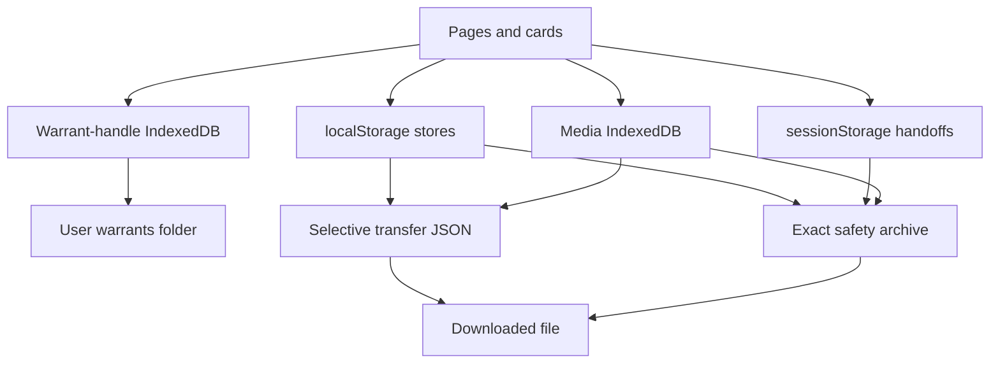
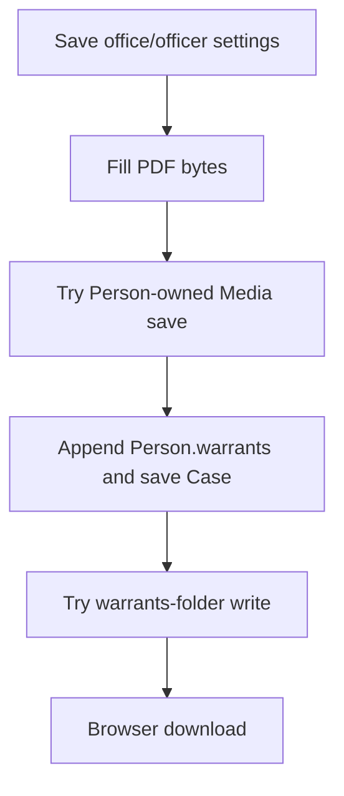

# Storage, Media, and Transfer Contract

**Contract status:** current implementation frozen for Stage 1

**Evidence base:** commit `980e5096414a74c16dd71be534b4f88ca456f364`
plus the Stage 0 read-only integrity and safety-backup modules

**Runtime changes made by this audit:** none

This document describes what COPDoc actually persists outside the Workspace,
Admin, and Book-In domain contracts, and how those stores cross the ordinary
transfer and Stage 0 recovery boundaries. It does not declare the current
behavior safe and does not authorize a migration.

Evidence labels follow the package convention:

- **VERIFIED** — current read/write/delete or tested serialization path.
- **INFERRED** — consequence of the verified browser operations, but not an
  end-to-end browser observation in this audit.
- **UNKNOWN / REVIEW** — present in the repository but not established as an
  active application contract.

## 1. Physical persistence topology

**VERIFIED:** persistence is split across same-origin Web Storage, two
IndexedDB databases, downloaded/uploaded JSON files, and an optional user-picked
filesystem directory. There is no transaction spanning any two of those
boundaries (`functions/workspace-config.js:11-33`,
`functions/transfer.js:1097-1295`, `functions/model/media.js:477-495`,
`functions/warrant-issue.js:514-630`).



The registry is a catalog, not an enforcing repository. Ordinary transfer
hard-codes its supported keys and calls the Media API conditionally; it does not
iterate `portable: true`. The safety archive does iterate all registered
`localStorage` and `sessionStorage` entries, including nonportable entries
(`functions/workspace-config.js:11-33`, `functions/transfer.js:14-26`,
`functions/safety-backup.js:23-26,162-191`).

## 2. Registered storage inventory

Classification in this table is descriptive:

- **AUTHORITATIVE** — effective source for the named data or preference.
- **DUPLICATE** — persists facts or bytes also represented elsewhere.
- **DERIVED** — signal, cache, projection, or generated representation.
- **LEGACY** — compatibility-only path.
- **EXPERIMENTAL** — lab state, not the production object repository.
- **CONFIRMED DEAD** — only current runtime action is removal.

All registration facts below are **VERIFIED** at
`functions/workspace-config.js:11-33`.

| Registry id | Physical name | Medium | Declared owner | Portable | Effective role and classification |
|---|---|---|---|---:|---|
| `workspace` | `copdocx.store.v1` | localStorage | `model/store` | yes | **AUTHORITATIVE / delegated** Workspace aggregate; detailed in `workspace-store.md`. |
| `admin` | `copdoc.admin.v1` | localStorage | `admin` | yes | **AUTHORITATIVE / delegated** Officer, fleet, and Shift aggregate. |
| `bookin` | `alien-book-in.saved-records.v1` | localStorage | `book-in` | yes | **AUTHORITATIVE / DUPLICATE / delegated** Book-In packet store with cross-store Case links. |
| `bookinColumns` | `alien-book-in.saved-record-columns.v1` | localStorage | `book-in` | no | **AUTHORITATIVE preference** for visible saved-record columns; omitted by ordinary transfer. |
| `settings` | `copdocx.settings.v1` | localStorage | `settings` | yes | **AUTHORITATIVE preference** for warrant office and last issuing Officer; also feeds Narrative field office. |
| `importDoneSignal` | `copdocx.import.done.v1` | localStorage | `transfer` | no | **DERIVED event signal** containing a timestamp string, not domain state. |
| `mapViews` | `copdocx.map.views.v1` | localStorage | `map` | yes | **AUTHORITATIVE preference** for map home and named presets. |
| `mapLayers` | `copdocx.map.layers.v1` | localStorage | `map` | yes | **AUTHORITATIVE preference** for global layer visibility. |
| `mapIcons` | `copdocx.map.icons.v1` | localStorage | `map` | yes | **AUTHORITATIVE preference / DUPLICATE derivations** for icon assignments, visual filters, and hidden pins. |
| `mapMarkup` | `copdocx.map.markup.v1` | localStorage | `map` | yes | **AUTHORITATIVE** global labels/arrows. It is not owned by a Case or Operation. |
| `mapBasemap` | `copdocx.location-map.basemap` | localStorage | `map` | yes | **AUTHORITATIVE preference** stored as a plain string, not JSON. |
| `narrativeTemplates` | `opdoc.narrative.templates.v2` | localStorage | `narrative` | yes | **AUTHORITATIVE browser template library**; current records are normalized to template schema v3 despite the storage-key suffix. |
| `narrativeTemplatesLegacy` | `opdoc.narrative.templates.v1` | localStorage | `narrative` | no | **LEGACY fallback** read only when the v2 key is absent/falsy; never removed by the engine. |
| `photoPickerLab` | `copdocx.photo-picker.v1` | localStorage | `photo-picker-lab` | no | **EXPERIMENTAL / DUPLICATE** lab image library with data URLs; bypassed in owner mode, where IndexedDB Media is used. |
| `fileUploadLab` | `copdocx.file-upload.v1` | localStorage | `file-upload-lab` | no | **EXPERIMENTAL / DUPLICATE** lab file library; large payloads become session-only metadata. |
| `investigationWindows` | `copdocx.investigation-windows.v1` | sessionStorage | `investigation-wall` | no | **AUTHORITATIVE session preference** for wall panel visibility/position. |
| `baseballHandoff` | `copdocx.baseball.handoff.v1` | sessionStorage | `baseball` | no | **DERIVED handoff** from Book-In to the Baseball Card page. |
| `baseballCardStyle` | `copdocx.baseball.card-style.v1` | localStorage | `baseball` | no | **AUTHORITATIVE preference** for card presentation defaults. |
| `geocodeCache` | `addrGeoCache_v1` | sessionStorage | `address` | no | **DERIVED cache** of up to 25 address-query results. |
| `media` | `copdocx.media.v1` | IndexedDB | `model/media` | yes | **AUTHORITATIVE** attachment metadata and bytes; references are application-enforced only. |
| `warrants` | `copdocx.warrants` | IndexedDB | `warrant-issue` | no | **AUTHORITATIVE capability store** for one structured-cloned directory handle, not warrant business records. |
| `retiredCaseLayout` | `copdocx.case-view.layout.v1` | retired | `leads` | no | **CONFIRMED DEAD** current contract: Case view boot removes the key (`functions/leads.js:3218-3222,5046-5060`). |

### Registry gaps and repository artifacts

**VERIFIED:** the repository-retained standalone
`Alien_Book_In_Docs_v1_10_0.html` declares additional stores which are not in
the COPDoc registry:

| Name | Medium/type | Standalone purpose | Current classification |
|---|---|---|---|
| `alien-book-in.daily-report.v1` | localStorage | Arrest-of-day selection by date | **UNKNOWN / REVIEW; likely standalone legacy.** Read/write is confined to the standalone file (`Alien_Book_In_Docs_v1_10_0.html:4875-4888,7355-7440`). |
| `alien-book-in.baseball-card-snapshots.v1` | localStorage | Final card snapshot and embedded photo by date | **UNKNOWN / REVIEW; likely standalone legacy.** It is size-pruned and independently deleted (`Alien_Book_In_Docs_v1_10_0.html:7578-7608,7632-7764`). |
| `alien-book-in.live-table-session.v1` | sessionStorage | Live-table session token | **UNKNOWN / REVIEW; likely standalone legacy** (`Alien_Book_In_Docs_v1_10_0.html:4875-4889,8701-8730`). |
| `alien-book-in.records.v1` | BroadcastChannel name | Record synchronization | Not a storage key. The standalone also uses `postMessage` and storage events (`Alien_Book_In_Docs_v1_10_0.html:8810-8869,9356-9403`). |

The standalone also reads/writes the active Book-In and column keys. It has no
runtime reference from the active HTML pages found in this repository, but if a
user opens it under the same origin, it can mutate the same Book-In store
(`Alien_Book_In_Docs_v1_10_0.html:4875-4888,8529-8583`). **INFERRED:** the
registry-driven safety archive will not capture its three unregistered Web
Storage values.

## 3. Auxiliary Web Storage schemas

These are TypeScript-style descriptions of current accepted/written shapes;
they are not proposed schemas. Most have no runtime schema validation and allow
unknown properties to survive a read-modify-write.

```ts
interface CopdocSettings {
  issuingOffice?: string;
  lastOfficerId?: string; // Admin Officer reference; no FK enforcement
  [unknown: string]: unknown;
}

interface MapView {
  lat: number | numericString;
  lng: number | numericString;
  zoom: number | numericString; // clamped to 2..19 when created/used
}
interface MapPreset extends MapView {
  id: string;   // "pv_<time>_<random>"
  name: string;
}
interface MapViewsState {
  home: MapView | null;
  presets: MapPreset[]; // UI creation limit: 12
}

interface MapLayersState {
  visible: Record<
    "targets" | "arrests" | "arrestHeat" | "encounters" |
    "officers" | "origin" | "markup" | string,
    boolean
  >;
}

interface MapVisualFilter {
  visible: boolean;
  color: string;
  icon: string;
}
interface MapIconsState {
  libraryId?: string;
  category: Record<string, string>;
  pins: Record<string, string>;         // domain/map row id -> icon name
  size: number;                         // clamped 20..56
  stroke: number;                       // clamped 1..4
  fillOpacity: number;                  // clamped 0..100
  labels: boolean;
  badges: boolean;
  filters: Record<string, MapVisualFilter>;
  hiddenPins: Record<string, true>;
  hiddenLabels: Record<string, true>;
}

interface MapMarkupState {
  labels: Array<{ id: string; lat: number; lng: number; text: string }>;
  arrows: Array<{
    id: string;
    from: [number, number];
    to: [number, number];
  }>;
}
type MapBasemap = "map" | "satellite" | "hybrid" | string;

interface NarrativeTemplateRecord {
  schema: "copdoc.narrative-template.v3";
  id: string;
  name: string;                         // normalized to <= 80 chars
  description: string;                  // normalized to <= 180 chars
  includeDefaults: boolean;
  sourceMasterBuild: number;
  masterBuild: 9 | number;
  migratedAt: string;
  createdAt: string;
  updatedAt: string;
  sections: NarrativeTemplateSection[]; // projected onto current Master schema
}
interface NarrativeTemplateSection {
  id: string;
  fields: NarrativeTemplateField[];
  [masterField: string]: unknown;
}
interface NarrativeTemplateField {
  id: string;
  baseFieldId: string;
  instanceId: string;
  instanceNumber: number;
  label: string;
  options: Array<{
    id: string;
    label?: string;
    text?: string;
    valueText?: string;
    incidentReason?: string;
    [masterField: string]: unknown;
  }>;
  defaultValue: string;
  hasEventTime: boolean | null;
  tokenRules: Record<string, {
    category?: string;
    selector?: { roles: string[]; types: string[]; ordinal: number | null };
    fieldKey?: string;
  }>;
  [masterField: string]: unknown;
}
type NarrativeTemplateLibrary = NarrativeTemplateRecord[];

interface PhotoPickerLabState {
  schema: "copdocx.photo-picker.v1";
  photos: PhotoPickerLabPhoto[];
  selectedId: string;
}
interface PhotoPickerLabPhoto {
  photoId: string;
  originalName: string;
  mime: string;
  bytes: number;
  width: number;
  height: number;
  dataUrl: string;                      // resized JPEG in lab mode
  originalDataUrl: string;              // same resized data, not source bytes
  crop?: { x: number; y: number; w: number; h: number } | null;
  kind: string;
  caption: string;
  captionCustom: boolean;
  takenAt: string;
  takenAtPrecision: "year" | "month" | "day" | string;
  takenAtApproximate: boolean;
  takenAtSource: "file" | "operator" | string;
  place: string;
  tags: string[];
  notes: string;
  createdAt: string;
  updatedAt: string;
}

interface FileUploadLabState {
  schema: "copdocx.file-upload.v1";
  files: FileUploadLabFile[];
  selectedId: string;
}
interface FileUploadLabFile {
  fileId: string;
  originalName: string;
  mime: string;
  bytes: number;
  dataUrl: string;      // blanked on persistence when source > 2.5 MiB
  previewUrl: string;   // runtime blob URL can be present in in-memory state
  sessionOnly: boolean; // true means persisted metadata has no payload
  kind: string;
  documentType: string;
  caption: string;
  takenAt: string;
  place: string;
  tags: string[];
  notes: string;
  createdAt: string;
  updatedAt: string;
}

interface InvestigationWindowState {
  plates: boolean;
  objects: boolean;
  card: boolean;
  pos: Record<"plates" | "objects" | "card", { x: number; y: number } | null>;
}

interface BaseballHandoff {
  from: "bookin" | string;
  leadId: string;
  bookinRecordId: string;
  firstName: string;
  lastName: string;
  age: string;
  country: string;
  alienNumber: string;
  disposition: string;
  arrestDate: string;
  foreignWarrants: string;
  foreignWarrantCountry: string;
  isCriminal: boolean;
}

interface BaseballCardStyle {
  cardWidth: number;
  photoPercent: number;
  photoMinHeight: number;
  lineWidth: number;
  lineColor: string;
  fontFamily: string;
  bodySize: number;
  headingSize: number;
  lineHeight: number;
}

interface GeocodeCacheEntry {
  latitude: string;
  longitude: string;
  matchedAddress: string;
  source: "census" | "nominatim" | string;
}
type GeocodeCache = Record<string /* formatted address query */, GeocodeCacheEntry>;
```

Evidence:

- Settings merge and its only current writers are
  `functions/warrant-issue.js:62-79,443-447`; Narrative consumes
  `issuingOffice` at `functions/encounter-narrative.js:27-35,398-418`.
- Map Views validates only numeric view properties, creates time/random IDs,
  and writes the whole object (`functions/map-views.js:21-107,211-258,291-345`).
- Map Layers/Icons load selected properties over defaults and then write whole
  preference objects (`functions/map-targets.js:31-60,157-178,195-315`). The
  icon asset also performs a read-modify-write of `libraryId`
  (`assets/icons/copdoc-icons.js:643-747`).
- Map Markup reads/writes global arrays and mutates them directly
  (`functions/map-markup.js:10-57,149-180,227-283`).
- Basemap reads and writes a raw string (`functions/location-map.js:369-382`).
- Template records are projected onto the current Master sections and upgraded
  in memory to schema v3 (`functions/narratives/narrative-builder-engine.js:1552-1698`).
  Token-rule projection is bounded and normalized
  (`functions/narratives/narrative-builder-engine.js:1446-1507`).
- Lab state switches completely away from its localStorage key in owner mode
  (`functions/photo-picker.js:32-47,92-127`,
  `functions/file-upload.js:38-52,144-194`). Photo lab objects are built at
  `functions/photo-picker.js:327-413`; file lab objects are built at
  `functions/file-upload.js:228-275`.
- Investigation window state is session-only
  (`functions/investigation-wall.js:23-27,119-160`). Book-In writes the Baseball
  handoff (`functions/book-in.js:4918-4966`) and the destination reads but does
  not clear it (`functions/baseball-page.js:40-81`).
- Card-style defaults, clamps, read, and write are
  `functions/baseballcard.js:344-455`.
- The geocode cache uses the full formatted address as key, stores provider
  results, and evicts the first enumerated key above 25
  (`functions/address.js:1081-1107,1110-1200`).

## 4. Auxiliary store CRUD matrix

| Store | Create/read | Update/delete | Transfer behavior |
|---|---|---|---|
| Settings | `loadSettings()` / `saveSettings()` read and shallow-merge fields (`functions/warrant-issue.js:62-79`). | No key delete path found. Existing unknown fields survive local UI writes. | Exported as parsed object; a nonempty imported object replaces the entire key (`functions/transfer.js:354-375,378-385`). |
| Map Views | `loadState()` defaults invalid data; `saveState()` writes full state (`functions/map-views.js:30-64`). | Home replace; preset add/delete rewrites state (`functions/map-views.js:211-258,291-345`). | Exported/rewritten as parsed value when truthy; no schema validation (`functions/transfer.js:365-407`). |
| Map Layers / Icons | `loadPrefs()` overlays recognized fields on defaults (`functions/map-targets.js:238-303`). | Whole preferences rewritten from UI (`functions/map-targets.js:305-315`). There is no key delete. | Exported/rewritten as parsed values when truthy; no validation (`functions/transfer.js:365-407`). |
| Map Markup | `loadState()` reads arrays; malformed JSON becomes empty state (`functions/map-markup.js:36-48`). | Adds, drags, and deletes rewrite global state (`functions/map-markup.js:149-180,227-283`). | Exported/rewritten as parsed value when truthy (`functions/transfer.js:365-407`). |
| Basemap | Reads raw value; accepts only three known values at use (`functions/location-map.js:369-382`). | Overwrites raw string; no delete. | Exported and imported as a truthy raw string (`functions/transfer.js:357-373,399-403`). |
| Narrative templates | Loads v2 or legacy v1; invalid individual records are dropped from the in-memory library (`functions/narratives/narrative-builder-engine.js:1708-1733`). | Save/update/delete/import rewrites the complete v2 array (`functions/narratives/narrative-builder-engine.js:1934-1985,2013-2044,2068-2144`). | Ordinary transfer replaces v2 only when imported array is nonempty; empty cannot clear (`functions/transfer.js:354-375,405-407`). |
| Photo Picker lab | Reads/writes lab JSON only without an owner query (`functions/photo-picker.js:92-127`). | Row removal/clear rewrites an empty state; JSON download has no matching JSON restore path (`functions/photo-picker.js:903-960`). | Declared nonportable and omitted by ordinary transfer. Exact safety archive captures raw key. |
| File Upload lab | Reads/writes lab JSON only without an owner query (`functions/file-upload.js:144-194`). | Row removal/clear rewrites state; JSON download has no matching restore path (`functions/file-upload.js:720-785`). | Declared nonportable and omitted by ordinary transfer. Exact safety archive captures raw key. |
| Investigation windows | Reads/writes one session object (`functions/investigation-wall.js:119-160`). | No explicit clear. Browser session lifetime is the delete boundary. | Omitted by ordinary transfer; captured as evidence by safety archive. |
| Baseball handoff | Book-In overwrites before navigating; card page reads (`functions/book-in.js:4918-4966`, `functions/baseball-page.js:40-81`). | No current clear/removal; later navigation can leave a stale handoff. | Omitted by ordinary transfer; captured only from the safety page's current session context. |
| Baseball style | Load normalizes values; save overwrites normalized object (`functions/baseballcard.js:406-455`). | No delete path; defaults are applied in memory on invalid/missing data. | Omitted by ordinary transfer; captured raw by safety archive. |
| Geocode cache | Cache read/write around external geocoding (`functions/address.js:1081-1107,1181-1200`). | Oldest enumerated entry evicted when count exceeds 25; no TTL/explicit clear. | Omitted by ordinary transfer; captured only from current session by safety archive. |
| Import-done signal | `notifyOpenerImported()` overwrites it with `Date.now()` (`functions/transfer.js:1540-1561`). | No explicit delete; subsequent imports overwrite. | Not included in ordinary transfer; safety archive captures it as nonportable evidence. |
| Retired Case layout | No current read. | Case view boot removes it (`functions/leads.js:3218-3222,5046-5060`). | Neither transfer nor safety archive captures `medium: retired`. |

## 5. Media IndexedDB contract

### 5.1 Database schema

**VERIFIED:** `copdocx.media.v1`, version `1`, contains two object stores
(`functions/model/media.js:11-26,240-270`).

| Object store | Key | Indexes | Value authority |
|---|---|---|---|
| `meta` | key path `mediaId` | `ownerKey` nonunique; `mediaClass` nonunique; `sha256` nonunique; `ownerSha` nonunique | Media identity, owner, descriptive fields, declared payload roles, dimensions, primary-photo state, and lifecycle metadata. |
| `blobs` | composite key path `[mediaId, role]` | none | Actual bytes for each representation plus repeated MIME and byte count. |

There is no database-level foreign key, unique owner/hash constraint, or cascade.
The code uses an `ownerSha` lookup before save, but the index is nonunique
(`functions/model/media.js:252-264,641-772`).

### 5.2 Effective TypeScript schema

```ts
type MediaOwnerType =
  | "PERSON" | "VEHICLE" | "LOCATION" | "BUSINESS" | "ENTITY"
  | "OFFICER" | "ENCOUNTER" | "LEAD" | "BOOKIN";

interface MediaOwnerRef {
  type: MediaOwnerType; // required; whitelist enforced
  id: string;           // required; existence is not checked by repository
}

interface MediaMeta {
  mediaId: string;                    // primary ID; generated med_<time>_<random>
  entityType: "MEDIA";
  schema: "copdocx.media.v1";
  mediaClass: "photo" | "file";
  owner: MediaOwnerRef;
  ownerKey: string;                   // derived duplicate: `${type}:${id}`
  ownerSha: string;                   // derived duplicate: `${ownerKey}:${sha256}`
  kind: string;
  documentType: string;
  caption: string;
  captionCustom: boolean;
  takenAt: string;
  takenAtPrecision: "year" | "month" | "day" | string;
  takenAtApproximate: boolean;
  takenAtSource: "file" | "operator" | string;
  place: string;
  tags: string[];
  notes: string;
  mime: string;                       // duplicate declaration of original blob MIME
  bytes: number;                      // duplicate declaration of original size
  width: number;                      // persisted derived image dimension
  height: number;                     // persisted derived image dimension
  originalName: string;
  sha256: string;                     // derived hash of original bytes at save time
  roles: string[];                    // duplicate declaration of blob rows
  crop: { x: number; y: number; w: number; h: number } | null;
  primary: boolean;                   // photo-only owner-level projection
  documentId: string;                 // optional external identifier/free string
  meta: {
    createdAt: string;
    updatedAt: string;
    markedComplete: boolean;
    status: "committed" | string;
    committedAt: string;
    [unknown: string]: unknown;
  };
}

interface MediaBlobRecord {
  mediaId: string;                    // MediaMeta reference
  role: "original" | "display" | "thumb" | string;
  mime: string;                       // duplicate declaration
  bytes: number;                      // duplicate declaration
  blob: Blob | ArrayBuffer | Uint8Array;
}
```

The constructor is the definitive current field projection
(`functions/model/media.js:164-225`). Photos default to declared roles
`original/display/thumb`, files to `original`; actual save rewrites a photo's
roles to the parts it successfully created (`functions/model/media.js:181-185,641-715`).

### 5.3 Authority, duplication, and ownership

| Fact | Effective authority | Duplicates/references | Integrity boundary |
|---|---|---|---|
| Attachment identity | `meta.mediaId` | Every `blobs` key repeats it. | No FK; metadata and payload can orphan independently. |
| Owner | `meta.owner.type/id` | `ownerKey` repeats owner; `ownerSha` repeats owner+hash. | Repository validates type/id presence and whitelist, not owner existence (`functions/model/media.js:53-73`). |
| Source bytes | `blobs[mediaId,"original"].blob` | `meta.bytes`, `meta.mime`, `meta.sha256`; blob row repeats bytes/MIME. | Normal reads do not recompute the hash. |
| Display/thumbnail | Corresponding blob row | `meta.roles`, dimensions, and crop describe them. | `update()` can add/replace display/thumb without changing original hash (`functions/model/media.js:547-638`). |
| Primary photo | `meta.primary` across all photos for one `ownerKey` | UI may carry a selected primary copy. | Enforced by application read/write transaction, not unique index (`functions/model/media.js:498-545`). |
| Warrant PDF link | Person `warrants[].mediaId` -> Media owned by Person | filename/form metadata and optional folder/download copies. | No reverse reference in Media beyond owner; no FK. |
| Baseball Card photo | Person `immigration.baseballCards[].photoMediaId` -> Media owned by Person | card HTML/text and Media caption/date repeat facts. | Baseball save attempts compensating removal if Case save fails (`functions/baseball-page.js:825-905`). |
| Operation frozen target photo | `operation.targets[].freeze.photoMediaId` | Frozen reference to Person-owned Media. | A later Media delete can break the frozen reference; factory initializes it blank (`functions/model/operation.js:165-189`). |
| Encounter evidence association | Media `tags[]` entry with `assoc:<value>` | Encounter UI selection is derived from the tag. | Relationship is a tag convention, not an entity/reference table (`functions/encounters.js:786-814`). |

**VERIFIED:** `VEHICLE` owner IDs have two possible namespaces: Workspace
Vehicles and Admin fleet Vehicles. The Media owner token contains no store
qualifier. Stage 0 therefore treats an ID present in both dictionaries as
ambiguous (`functions/integrity.js:1468-1488,1844-1865`).

**VERIFIED:** photo ownership by `LEAD` is explicitly rejected, while files may
be owned by a Lead (`functions/model/media.js:164-173`). Other owner types are
accepted without checking whether the object exists.

### 5.4 Media CRUD and import/export

| Operation | API and physical behavior | Failure/consistency behavior |
|---|---|---|
| Create | `COPDoc.media.save()` validates owner, caps photos at 15 MiB/files at 25 MiB, estimates quota, hashes original, deduplicates by owner+SHA, and writes metadata plus parts in one readwrite IDB transaction (`functions/model/media.js:641-772`). | Duplicate check is application-level. Persistent-storage permission is requested after the write and its result is ignored (`functions/model/media.js:356-380,736-766`). |
| List/read | `list(owner)` uses `ownerKey`; `get(id)` reads metadata; `blob(id,role)` reads one payload; `listAll()` reads all metadata (`functions/model/media.js:409-465,776-799,871-885`). | Metadata and blobs are separate reads; callers can observe deletion/update between calls. |
| Update | `update()` changes allowed metadata fields and optionally display/thumb in one transaction (`functions/model/media.js:547-638`). | Cannot replace the original through this API; `sha256`, original bytes, and top-level MIME/bytes remain unchanged. |
| Set primary | Reads target, gets every owner metadata row, demotes other photos, then writes all in one metadata transaction (`functions/model/media.js:507-545`). | No database uniqueness; older/corrupt duplicate primaries can exist until a successful call. |
| Delete one | Deletes metadata and only the roles declared in `meta.roles` (or default roles); promotes another photo (`functions/model/media.js:802-867`). | Undeclared blob roles survive as orphan payloads. |
| Delete owner | Lists owner rows, then calls single-row delete sequentially; each rejection is swallowed and iteration continues (`functions/model/media.js:887-899`). | Not atomic; returned `removed` is attempted row count, not confirmed delete count. |
| Transfer export | `exportBundle()` lists metadata, then exports Base64 for each declared role (`functions/model/media.js:902-985`). | Missing role reads are silently skipped. Orphan blob rows and IDB schema/index data are not exported. No per-part transfer hash is added. |
| Transfer import | `importBundle()` deduplicates by `ownerSha`, Base64-decodes parts, runs metadata through `createMedia()`, and `put()`s rows (`functions/model/media.js:923-1032`). | Invalid Base64 is not strictly rejected. A same `mediaId` with different owner/hash is not checked via `get(mediaId)` and can overwrite existing metadata/roles. Items without parts are skipped. |

### 5.5 Delete coupling

Media cleanup is best-effort and follows domain deletion, not a shared
transaction:

- Admin permanently removes an Officer/fleet record first, then asynchronously
  calls `removeByOwner`; failure leaves orphan Media
  (`functions/admin.js:1018-1039`).
- Investigation object cleanup removes the Workspace object and Associations,
  then starts an ignored asynchronous Media removal
  (`functions/model/store.js:6235-6261`).
- Encounter deletion commits removal of the Encounter first, then asynchronously
  removes Media owned by the Encounter and by every embedded Vehicle and
  Location (`functions/model/store.js:2538-2582`). **INFERRED high-risk
  boundary:** because those Vehicle/Location IDs can be shared canonical
  objects, deleting one Encounter can remove their Media even if another record
  still references them.

No general delete path was found that walks Person warrant/Baseball Card Media
references before deleting a Person. Integrity detection, not database
enforcement, is the current backstop.

## 6. Warrant capability store and file copies

`copdocx.warrants` is IndexedDB version `1` with one keyless `handles` store.
The fixed key `warrantsDirectory` holds a structured-cloned
`FileSystemDirectoryHandle` (`functions/warrant-issue.js:9-14,166-219`). Opening
an I-200/I-205 page calls `loadDirectoryHandle()` at boot; `indexedDB.open()` can
therefore create the database/store even when no folder was previously chosen
(`functions/warrant-issue.js:166-185,712-717`).

```ts
// IndexedDB: copdocx.warrants / object store "handles"
type WarrantHandleKey = "warrantsDirectory";
type WarrantHandleValue = FileSystemDirectoryHandle;
```

The handle is an origin/browser capability with a separately queried or
requested permission. It is not a portable path string. There is no current
delete/forget action (`functions/warrant-issue.js:221-284`).

Issuing a warrant crosses five independent stores/outputs in this order:



This ordering is **VERIFIED** at `functions/warrant-issue.js:514-630`.

Failure boundaries:

- Settings are written before PDF validation/fill completes
  (`functions/warrant-issue.js:443-447,514-535`). Even “download only” mutates
  settings.
- Media failure is caught and converted to `null`; the warrant may persist with
  blank `mediaId` (`functions/warrant-issue.js:550-586`).
- If Media succeeds but `saveLead()` fails, the new Media row is not rolled
  back, the folder write/download does not occur, and an orphan remains
  (`functions/warrant-issue.js:455-494,583-593`).
- Folder-write failure is swallowed; Case and Media remain, and browser download
  proceeds (`functions/warrant-issue.js:595-615`).
- The generated PDF can consequently exist in up to three places: Media bytes,
  a user folder file, and the browser download, while Person `warrants[]` stores
  a fourth metadata representation (`functions/model/person.js:229-258`,
  `functions/warrant-issue.js:455-488,550-615`). This is intentional output
  duplication but has no reconciliation routine.

## 7. Ordinary transfer contract (`copdocx.transfer.v1`)

### 7.1 Envelope

```ts
interface COPDocTransferV1 {
  format: "copdocx.transfer.v1";
  appVersion: string;
  exportedAt: string;
  filters: { types: TransferRecordType[]; from: string; to: string };
  leads: unknown[];
  officers: unknown[];
  vehicles: unknown[];       // Admin fleet, not Workspace Vehicle dictionary
  shifts: unknown[];
  bookin: unknown[];
  encounters: unknown[];
  investigations: unknown[];
  operations: unknown[];
  investigationObjects: {
    people: Record<string, unknown>;
    vehicles: Record<string, unknown>;
    locations: Record<string, unknown>;
    businesses: Record<string, unknown>;
    entities: Record<string, unknown>;
    associations: Record<string, unknown>;
  };
  settings: CopdocSettings;
  map: {
    markup: MapMarkupState | null;
    views: MapViewsState | null;
    layers: MapLayersState | null;
    icons: MapIconsState | null;
    basemap: string;
  };
  templates: NarrativeTemplateRecord[];
  media?: Array<{ meta: MediaMeta; blobs: TransferMediaBlob[] }>;
}
interface TransferMediaBlob {
  role: string;
  mime: string;
  bytes: number;
  base64: string;
}
type TransferRecordType =
  | "leads" | "officers" | "vehicles" | "shifts" | "bookin"
  | "encounters" | "investigations" | "operations";
```

The base envelope and support-state attachment are built at
`functions/transfer.js:473-530`; Media is attached later and asynchronously by
the UI at `functions/transfer.js:1756-1819`.

### 7.2 Export selection and dependency closure

| Selected type/state | Actual export behavior |
|---|---|
| Leads | Committed Lead snapshots only. No general closure over Associations or all canonical referenced objects (`functions/transfer.js:301-309,473-500`). |
| Encounters | Committed Encounter rows plus every Book-In row whose `encounterId` matches, even when Book-In was not selected (`functions/transfer.js:310-317,502-523`). |
| Investigations | Investigation rows are not commit-filtered. Node objects are copied from Workspace; Associations touching a currently included endpoint add both endpoints in a single pass (`functions/transfer.js:318-323,410-470`). **INFERRED:** transitive closure can depend on Association iteration order because earlier skipped Associations are not revisited. |
| Operations | Committed Operation rows only; no linked Lead/Person/Admin Officer/fleet closure (`functions/transfer.js:324-331,473-500`). |
| Officers/fleet | Committed Admin rows. |
| Shifts | All Admin Shift rows; no commit filter. |
| Book-In | All stored rows; linked Case promotion occurs only during import. |
| Settings/map/templates | Always appended to JSON once any selected record matches. They are not user-selectable and ignore the date/type filter (`functions/transfer.js:473-530,1756-1779`). |
| Media | If `COPDoc.media.exportBundle` is loaded, **all Media for all owners** is appended, independent of selected types/date (`functions/transfer.js:1796-1816`, `functions/model/media.js:944-985`). |

JSON export is refused when no selected domain records match, even if support
state/templates/Media exist (`functions/transfer.js:1756-1770`). CSV is a flat,
lossy table per selected type and never includes support state or Media
(`functions/transfer.js:538-742,1780-1791`).

### 7.3 Page-dependent Media export

**VERIFIED:** Media inclusion depends on the script list of the page initiating
export. `runExport()` silently completes without a `media` member when the API
is absent (`functions/transfer.js:1796-1819`). Home and the import popup load
Media (`home.html:172-178`, `import.html:82-84`), but Admin, Schedule, and the
Operations list load Transfer without Media (`admin.html:97-112`,
`schedule.html:100-108`, `operations.html:57-63`). The UI nevertheless labels
JSON “the backup format” and says JSON backups restore photos
(`functions/transfer.js:1662-1709`).

Therefore, **ordinary transfer is not an exact or consistently media-bearing
backup**. The file's completeness is a function of which page exported it.

### 7.4 Import formats and merge rules

`parseTransfer()` accepts:

1. current `copdocx.transfer.v1`;
2. a bare Lead array;
3. `alien-book-in-records` with `records[]`;
4. `copdocx-demo-import` / `copdocx.import.v1`;
5. a single `copdocx.lead.v1` object.

It rejects unknown nonempty `format`, but does not enforce a current envelope
schema version (`functions/transfer.js:757-831`). The selected import file is
limited to 32 MiB (`functions/transfer.js:14-26,1830-1854`).

Record merges use ID plus a lexicographic timestamp string. If both sides have
timestamps and local is later, local wins; if either timestamp is absent,
incoming wins. Exact JSON equality skips (`functions/transfer.js:231-249,
872-930`). Import never deletes local records.

Support behavior is replacement-like, not merge-safe:

- Nonempty imported `settings` replaces the whole settings key.
- Truthy map members replace their whole keys.
- Nonempty template arrays replace the whole v2 library.
- Empty settings/templates/basemap cannot clear local values.
- Write return values are ignored, so support-store quota failures are not
  reflected in the import result.

These are **VERIFIED** at `functions/transfer.js:378-408`.

Domain types are then applied one at a time, with a complete localStorage
read/modify/write for each type; support state is applied afterward regardless
of earlier per-type errors (`functions/transfer.js:1097-1295`). Media imports
after all Web Storage writes and its rejection is swallowed
(`functions/transfer.js:1943-2103`). There is no rollback journal.

Selected-type scope does not apply to support state or Media: `applyImport()`
always calls `applySupportState()`, and `runImport()` imports `parsed.media`
whenever present (`functions/transfer.js:1292-1295,2081-2102`). A user selecting
one record type can therefore replace preferences/templates and add unrelated
Media owners.

The popup and opener both call `applyImport()` against the same-origin stores:
the popup applies locally first, then invokes `opener.COPDoc.transfer.applyImport`
when available (`functions/transfer.js:1970-1993`). **INFERRED:** most second
passes become duplicate skips, but support replacement and Book-In promotion
side effects can execute twice.

### 7.5 Import completion signaling

After a write, the popup:

- writes `copdocx.import.done.v1 = String(Date.now())`;
- sends `{ type: "copdocx-import-done" }` to its opener with target origin `*`;
- directly tries to reload/focus the opener.

The opener listens for that message or the storage-key change and reloads
(`functions/transfer.js:1540-1561,2128-2154`). Message listeners do not validate
origin/source. This signal is reload coordination, not transactional commit
evidence.

## 8. Exact Stage 0 recovery contract (`copdocx.safety-backup.v1`)

The safety archive deliberately bypasses normal readers because those readers
parse, default, filter, and normalize (`functions/safety-backup.js:1-10`). It is
read-only and has no restore implementation.

```ts
interface SafetyBackupV1 {
  format: "copdocx.safety-backup.v1";
  schemaVersion: 1;
  metadata: {
    backupId: string;
    createdAt: string;
    productName: string;
    appVersion: string;
    captureComplete: boolean;
    integrityValid: boolean;
    unencrypted: true;
    manifestSha256: string;
    counts: Record<string, number>;
    warnings: string[];
    exclusions: string[];
  };
  stores: {
    localStorage: RawStorageCapture[];
    sessionStorage: RawStorageCapture[];
    media: SafetyMediaCapture;
    warrants: {
      database: string;
      status: "missing" | "unavailable" | "excluded-nonportable";
      version: number | null;
      objectStores?: string[];
    };
  };
  verification: {
    algorithm: "SHA-256";
    registeredStorageUnchangedDuringCapture: true;
    mediaPayloadsHashed: true;
    archiveVerified: true;
    serializedByteLength: number;
  };
  integrityReport: object | null;
}
interface RawStorageCapture {
  id: string;
  key: string;
  owner: string;
  portable: boolean;
  exists: boolean;
  raw: string | null;
  byteLength: number;
  sha256: string | null;
}
interface SafetyMediaBlob {
  mediaId: string;
  role: string;
  mime: string;
  declaredBytes: number;
  byteLength: number;
  sha256: string;
  base64: string;
}
interface SafetyMediaCapture {
  database: string;
  status: "ok" | "invalid" | "missing" | "unavailable";
  version: number | null;
  objectStores: string[];
  storeSchemas?: Array<{
    name: string;
    keyPath: string | string[] | null;
    autoIncrement: boolean;
    indexes: Array<{
      name: string;
      keyPath: string | string[];
      unique: boolean;
      multiEntry: boolean;
    }>;
  }>;
  transaction?: "readonly";
  records: Array<{ meta: unknown; blobs: SafetyMediaBlob[] }>;
  orphanBlobs: SafetyMediaBlob[];
  integrityValid: boolean;
  warnings: string[];
}
```

**VERIFIED capture behavior:**

- Every registered local/session key is represented once and preserves
  missing-vs-present-empty, raw JSON damage, drafts, and unknown fields
  (`functions/safety-backup.js:162-209`).
- Registered Web Storage is read before and after Media capture; any raw change
  aborts the archive (`functions/safety-backup.js:662-709`).
- Existing Media is read in one readonly transaction over available required
  stores. It includes all metadata, all actual blob rows, orphan blobs,
  database/store/index schema, actual byte lengths, Base64, and independent
  SHA-256 hashes (`functions/safety-backup.js:345-513`).
- Warrant IDB name/version/store names are inventoried, but the directory handle
  and permission are excluded (`functions/safety-backup.js:516-530,735-740`).
- The archive is JSON-serialized, reparsed, and verified before download
  (`functions/safety-backup.js:763-776,798-820`).

### Transfer versus safety archive

| Boundary | Ordinary transfer v1 | Safety backup v1 |
|---|---|---|
| Purpose | Selective interchange/merge | Exact evidence/recovery capture |
| Web Storage | Parsed, normalized/defaulted selected objects | Raw strings for every registered local/session key |
| Missing vs empty | Conflated by normal readers | Preserved explicitly |
| Malformed JSON | Can stop import; export readers can substitute fallback/omit | Preserved byte-for-byte |
| Drafts | Commonly filtered out | Preserved inside raw store |
| Map/settings/templates | Parsed support objects; truthy replacement on import | Raw registered values |
| Lab/preferences/signals | Mostly omitted | Captured if registered local/session |
| Media scope | All Media only if API loaded | All metadata and every blob row if DB safely discoverable |
| Missing declared Media role | Silently omitted | Available bytes retained; warning + invalid integrity |
| Orphan Media blob | Omitted | Preserved and warned |
| Media schema/indexes | Omitted | Captured |
| Warrant directory handle | Omitted | Explicitly excluded; DB schema inventory only |
| Concurrency | No snapshot check | Web Storage before/after check + one IDB readonly snapshot |
| Integrity | No envelope/part manifest | Raw/Media hashes and manifest over raw inventory + Media metadata/schema |
| Restore | Merge import implemented | No restore by design |
| File-size symmetry | Export unbounded; import capped at 32 MiB | No restore/import size contract |
| Encryption | None | None; explicitly marked unencrypted |

### Safety archive limits that remain part of the frozen contract

1. **Registered keys only.** Unregistered standalone stores and unrelated
   origin storage are not captured (`functions/safety-backup.js:23-26,162-191`).
2. **Current sessionStorage context only.** **INFERRED:** browser
   `sessionStorage` is scoped to the current top-level browsing context, so the
   Integrity page cannot capture another open tab/window's distinct handoff or
   UI-session state.
3. **Media may be unavailable/missing.** When IndexedDB itself is unavailable,
   the archive still completes with Media/Warrants `status: unavailable`; a
   missing Media database is also represented without failing collection
   (`functions/safety-backup.js:239-258,345-357,662-700`). `captureComplete` is
   still set true (`functions/safety-backup.js:714-740`).
4. **No Media after-snapshot comparison.** The IDB transaction is internally
   consistent, but only Web Storage is recaptured after it
   (`functions/safety-backup.js:377-415,702-709`).
5. **Manifest coverage is scoped.** `storageManifest()` covers registered raw
   rows plus Media metadata/blob descriptors and Media schema. It does not
   include the surrounding backup metadata, embedded integrity report, or the
   Warrant database inventory (`functions/safety-backup.js:532-589`). Those
   fields can be changed without a manifest mismatch; raw and Media payload
   tampering is detected (`functions/safety-backup.js:591-653`).
6. **Source corruption is archived, not repaired.** A declared-byte mismatch,
   missing role, orphan blob, or original hash mismatch sets warnings and may
   set `integrityValid: false`, while retaining available payloads
   (`functions/safety-backup.js:419-513`).
7. **No unsaved DOM/runtime state, warrant capability, caches, external folder
   contents, or remote data.** The archive records those exclusions itself
   (`functions/safety-backup.js:735-740`).

## 9. Migration and version behavior

| Surface | Current migration behavior | Status |
|---|---|---|
| Map/settings/style/session/lab stores | No explicit schema-version migration. Loaders either select known fields, normalize values, or fall back to defaults/empty state. | **VERIFIED.** |
| Narrative storage key | Reads v2 first and v1 only as fallback. Template record schemas v1/v2 are accepted and projected onto current Master/template v3 in memory. Unknown sections/fields/options are discarded. The legacy key is not removed and normalized records are not written until a later persistence action (`functions/narratives/narrative-builder-engine.js:1552-1698,1708-1748`). | **VERIFIED lazy migration.** |
| Media IDB | Fixed DB version 1. Upgrade creates `meta` and `blobs` only when absent; no record migration exists (`functions/model/media.js:240-270`). | **VERIFIED.** **INFERRED:** an already-version-1 malformed schema/index set has no automatic repair trigger. |
| Warrant-handle IDB | Fixed DB version 1; upgrade creates `handles` if absent. No handle migration or forget path (`functions/warrant-issue.js:166-219`). | **VERIFIED.** |
| Ordinary transfer | Parser adapts several legacy envelope shapes but largely preserves record objects; it does not run a general schema migration before writes (`functions/transfer.js:757-831,1097-1295`). | **VERIFIED compatibility adapter, not migration framework.** |
| Safety archive | Envelope schema version 1; collection and verification only. Restore/migration intentionally absent (`functions/safety-backup.js:591-653,714-776`). | **VERIFIED.** |
| Retired Case layout | Removed on Case-view boot rather than migrated (`functions/leads.js:3218-3222,5046-5060`). | **CONFIRMED DEAD.** |

## 10. Frozen failure boundaries

These are not redesign recommendations. They are behaviors later changes must
preserve, explicitly migrate, or cover with a new safety test.

| Severity | Boundary | Verified failure scenario |
|---|---|---|
| **CRITICAL** | Ordinary JSON called a backup | Export from a Transfer-enabled page without `model/media.js` silently omits Media; normal readers also omit malformed/fallback data (`functions/transfer.js:84-121,1662-1709,1796-1819`; `admin.html:97-112`). |
| **CRITICAL** | No atomic import | Each domain type, support state, Book-In promotion, and Media write commits independently. A later quota/error leaves earlier writes in place (`functions/transfer.js:1097-1295,1943-2103`). |
| **HIGH** | Transfer can export a file it refuses to import | All Media is Base64-expanded without an export cap, while import rejects files over 32 MiB (`functions/model/media.js:944-985`; `functions/transfer.js:14-26,1830-1854`). |
| **HIGH** | Selected import is wider than selection | Support state and every included Media item import even when the user selects only one domain type (`functions/transfer.js:1292-1295,2081-2102`). |
| **HIGH** | Media import collision | Same `mediaId` with a different owner/hash is not checked by ID before `put`; it can replace an existing row/roles (`functions/model/media.js:987-1032,477-495`). |
| **HIGH** | Media transfer silently loses damaged parts | Ordinary export swallows a missing role read and omits orphan blob rows (`functions/model/media.js:944-985`). |
| **HIGH** | Media ownership has no FK and Vehicle namespace is ambiguous | Save accepts a whitelisted type and nonempty ID without existence check; `VEHICLE:id` can resolve to Workspace or Admin (`functions/model/media.js:53-73`; `functions/integrity.js:1468-1488`). |
| **HIGH** | Domain delete and Media delete split | Domain deletion commits first; Media cleanup is asynchronous/best-effort. Encounter cleanup also targets embedded Vehicle/Location owners (`functions/model/store.js:2538-2582,6235-6261`; `functions/admin.js:1018-1039`). |
| **HIGH** | Warrant issuance is a multi-store partial commit | Settings, Media, Case warrant metadata, optional folder file, and browser download have separate failure points and no rollback (`functions/warrant-issue.js:443-494,514-630`). |
| **HIGH** | Safety archive is complete only for its declared scope | It excludes unregistered keys, other windows' session state, Warrant handle/permission, external files, and unsaved DOM state; it can complete with IDB unavailable (`functions/safety-backup.js:162-191,662-760`). |
| **MEDIUM** | Support restore cannot represent clearing | Empty settings/template arrays/basemap are skipped, and support write failures are ignored (`functions/transfer.js:378-408`). |
| **MEDIUM** | Template key/schema versions diverge | Key suffix remains v2 while records normalize to template schema v3; legacy v1 remains and can reappear if v2 is removed (`functions/narratives/narrative-builder-engine.js:474-485,604-611,1656-1748`). |
| **MEDIUM** | Malformed auxiliary state disappears in normal UI/export | Map/lab/template loaders catch parse errors and default to empty, so a later save can overwrite evidence (`functions/map-views.js:34-64`, `functions/map-markup.js:36-57`, `functions/photo-picker.js:92-127`, `functions/file-upload.js:144-194`). |
| **MEDIUM** | Global map markup has no domain owner | Every Case/Operation shares one global labels/arrows store, and transfer carries it with any nonempty record export (`functions/map-markup.js:1-12`; `functions/transfer.js:354-375,473-530`). |
| **MEDIUM** | Session handoffs can be stale or incomplete | Baseball handoff is overwritten but never cleared; geocode/window state is session-scoped and nonportable (`functions/book-in.js:4918-4966`, `functions/baseball-page.js:40-81`, `functions/address.js:1081-1107`). |

## 11. Contract conclusions

- **VERIFIED:** IndexedDB Media is the attachment authority, but its owner
  relationship and reverse domain references are application conventions, not
  enforced relationships.
- **VERIFIED:** ordinary Transfer is a selective, parsed, merge-oriented format.
  It is not a byte-exact backup and Media inclusion is page-dependent.
- **VERIFIED:** the Stage 0 safety archive is the only current byte-preserving
  capture of registered Web Storage and actual Media payloads. It is not a
  restore format yet and it deliberately excludes the warrant capability.
- **VERIFIED:** settings, map state, templates, labs, and session handoffs each
  have independent schemas and error handling. None participates in a common
  application transaction or migration ledger.
- **INFERRED:** any Stage 2 write/repository work must treat cross-key and
  cross-medium operations as partial-commit workflows unless and until an
  explicit journal/transaction protocol is introduced and migrated safely.
