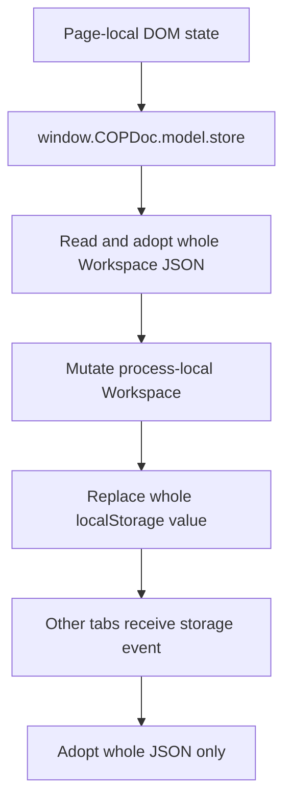
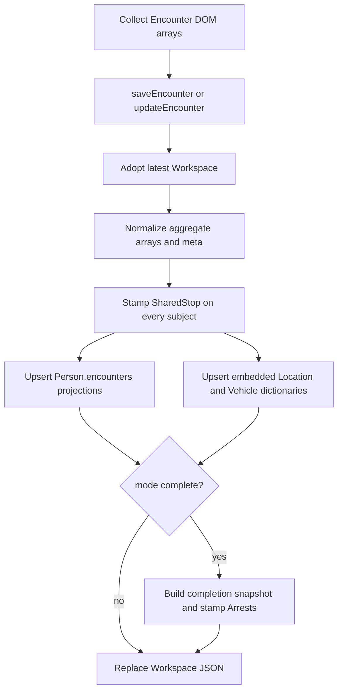
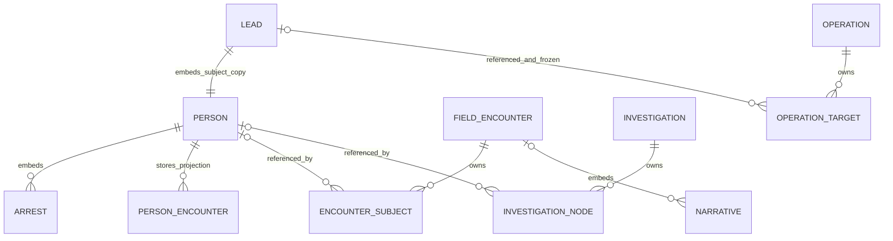
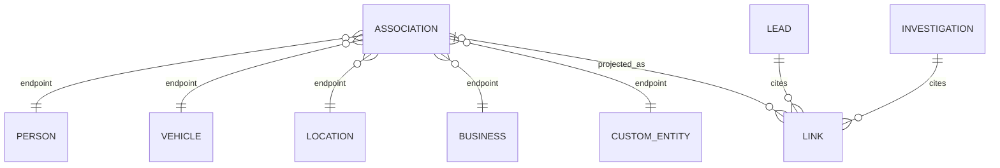

# Workspace Store — Current Persistence Contract

**Contract status:** frozen description of the current implementation

**Base commit:** `980e5096414a74c16dd71be534b4f88ca456f364`

**Physical store:** browser `localStorage["copdocx.store.v1"]`

**Scope:** Workspace root, Case/Lead, Person, shared identity objects,
Associations, Encounters, Investigations, Operations, their embedded records,
and every material current reader/writer of those shapes.

This document describes what COPDoc does today. It does not choose a cleaner
authority when the code permits more than one copy to win, and it does not
silently turn constructor defaults into database constraints. The nominal
schema modules are evidence, but persistence and callers establish the
effective contract.

## Evidence and field-classification legend

- **VERIFIED** — traced to a constructor, read/write path, storage call, or an
  isolated Stage 0 characterization test.
- **INFERRED** — follows from current code and browser semantics, but was not
  exercised as a complete browser workflow.
- **UNKNOWN / REVIEW** — accepted or persisted by the open-object model, but a
  complete live producer/consumer could not be established.
- `[save-required]` — a current save API rejects an absent value.
- `[factory]` — emitted by the current constructor; raw imports and old records
  can still omit it.
- `[optional]` — blank/missing is accepted by current code.
- `[reference]` — an ID into another object or store; no foreign key exists.
- `[projection]` — copied from another current object for navigation/display.
- `[snapshot]` — deliberately frozen at a point in time.
- `[derived]` — calculated from other facts and persisted.
- `[duplicate]` — the same fact is writable or stored at another path.
- `[legacy]` — compatibility alias/fallback or historical shape.
- `[open]` — undeclared extra keys can survive current merge/import paths.

**Important requiredness rule — VERIFIED:** outside a small set of save-time
checks, “required” means only that a factory supplies a property. The transfer
import writes parsed objects directly into dictionaries and does not run the
domain constructors or full graph reconciliation
(`functions/transfer.js:applyImport():1097-1248`).

## 1. Effective root contract

### 1.1 Physical and in-memory shape

**VERIFIED:** `emptyState()` defines a single Workspace object with eleven
dictionary/pointer members. `writeDisk()` serializes the *entire* in-memory
object to one localStorage value. `readDisk()` parses that entire value, and
`adoptDisk()` replaces the process-local object only when parsed data exists
(`functions/model/store.js:emptyState():21-35`,
`functions/model/store.js:readDisk():221-250`,
`functions/model/store.js:writeDisk():252-265`,
`functions/model/store.js:adoptDisk():267-277`).

```ts
interface WorkspaceState {
  schema: "copdocx.store.v1" | string;            // [factory], not dispatched
  currentLeadId: string;                          // [optional][reference] Lead
  people: Record<string, Person>;
  leads: Record<string, Lead>;
  encounters: Record<string, FieldEncounter>;
  investigations: Record<string, Investigation>;
  vehicles: Record<string, Vehicle>;
  locations: Record<string, Location>;
  businesses: Record<string, Business>;
  entities: Record<string, CustomEntity>;
  associations: Record<string, Association>;
  operations: Record<string, Operation>;
  [legacyOrUnknown: string]: unknown;              // [open]
}
```

```json
{
  "schema": "copdocx.store.v1",
  "currentLeadId": "lead_...",
  "people": {},
  "leads": {},
  "encounters": {},
  "investigations": {},
  "vehicles": {},
  "locations": {},
  "businesses": {},
  "entities": {},
  "associations": {},
  "operations": {}
}
```

The configured key is registered as Workspace, portable, and owned by the
model/store layer (`functions/workspace-config.js:12-12`). The fallback literal
is the same key (`functions/model/store.js:18-19`).



### 1.2 Serialization, merge, and read semantics

| Behavior | Actual contract | Evidence |
|---|---|---|
| Serialization | JSON stringify/parse; prototypes, `undefined`, and non-JSON values are not preserved. | `functions/model/store.js:clone():41-43`, `functions/model/store.js:writeDisk():252-265` |
| Record merge | Plain nested objects merge recursively; arrays and scalars replace; undeclared keys survive. | `functions/model/store.js:mergeRecord():45-64`; equivalent helper `functions/model/util.js:assign():28-47` |
| Public snapshots | `getState()` and object getters clone before returning. | `functions/model/store.js:getState():8016-8017`; e.g. `getLead():368-370`, `getEncounter():2490-2493` |
| Getter freshness | Most Lead/Person/Encounter/Investigation/Operation/shared-object getters and lists read process memory and do **not** adopt disk. `listArrests()` and Association getters adopt internally. | `functions/model/store.js:368-370,1815-1832,1872-1877,1988-1997,2490-2493,2647-2649,2753-2755,3417-3455,3510-3513,3703-3705,3777-3779,3844-3846,5121-5144` |
| Initialization API | `loadFromDisk()` returns the internal `state` object, not a clone. | `functions/model/store.js:loadFromDisk():280-282` |
| Missing disk value | `adoptDisk()` does not reset in-memory state when the key is absent. | `functions/model/store.js:adoptDisk():267-277` |
| Malformed disk value | Read sets `diskError`; subsequent `writeDisk()` refuses all writes until a successful adopt clears it. | `functions/model/store.js:readDisk():221-250`, `functions/model/store.js:writeDisk():252-265` |
| Write failure | Most high-level saves call `adoptDisk()` to roll process memory back; direct/compound helpers do not all handle `false` consistently. | `functions/model/store.js:saveLead():306-365`, `saveOperation():2676-2750`; contrast `junkInvestigationObject():7471-7521` |
| Concurrency | Read-latest, mutate, replace-all; no revision, compare-and-swap, lock, or field merge. | `functions/model/store.js:saveLead():306-365`, `updateEncounter():2436-2488` |
| Cross-tab signal | Native `storage` event calls `adoptDisk()` only. It does not emit a domain event, merge, or repaint page UI. | `functions/model/store.js:8024-8030` |

**INFERRED latent hazard:** no current caller was found intentionally mutating
the object returned by `loadFromDisk()`, but the API exposes live state and
therefore permits an in-memory mutation without persistence.

### 1.3 Schema version and normalization

`normalizeState()` supplies missing root dictionaries and `currentLeadId`, then
calls `ensureRecordMeta()` on Leads, Encounters, Investigations, Vehicles,
Locations, Businesses, Custom Entities, and Operations. It does **not** run
constructors, reconcile dictionary key versus embedded ID, normalize People or
Associations, validate relationships, or dispatch a schema migration
(`functions/model/store.js:normalizeState():164-218`).

`ensureRecordMeta()` treats a record with no `meta.status` as **committed** and
manufactures timestamps from any existing timestamp or “now”
(`functions/model/util.js:ensureRecordMeta():80-97`). This is compatibility
normalization, not a versioned migration. `functions/model/schema.js:1-9` is an
explicit compatibility pointer and defines no active model.

**VERIFIED:** no Workspace migration table or version switch was found. The
root remains `copdocx.store.v1`; Lead, Encounter, Investigation, Association,
and Operation sub-schemas likewise remain v1 constants. Unknown fields can
survive merges, while missing factory fields can persist after raw import.

## 2. Identifier contract

### 2.1 Generated IDs

The general generator emits
`<prefix>_<Date.now().toString(36)>_<six random base36 characters>`
(`functions/model/util.js:newId():15-23`). It is neither a UUID nor sequential,
and uniqueness is not checked at generation time.

| Object | Primary/child ID | Current generation and aliases | Status |
|---|---|---|---|
| Lead | `leadId` | `lead_...` | `[save-required]` in `saveLead()` |
| Person | `personId` | `p_...`; no generic `id` alias | `[factory]`; `upsertPerson()` rejects missing |
| Location | `locationId` | `loc_...`; constructor forces `id === locationId` | `[factory]` plus duplicate alias |
| Vehicle | `vehicleId` | `veh_...`; constructor forces `id === vehicleId` | `[factory]` plus duplicate alias |
| Business | `businessId` | `biz_...`; constructor forces `id === businessId` | `[factory]` plus duplicate alias |
| Custom Entity | `entityId` | `ent_...`; constructor forces `id === entityId` | `[factory]` plus duplicate alias |
| Association | `associationId` | `asoc_...`, or supplied `linkId`; `linkId` defaults to same value | `[factory]` duplicate/citation alias |
| Embedded Link | `linkId` | `link_...`; optional `associationId` citation | `[factory]` |
| EncounterSubject | `subjectId` | `sub_...` | `[factory]` aggregate-local identity |
| Arrest | `arrestId` | `arr_...` | `[factory]` embedded identity |
| Alias / identity document | `aliasId` / `documentId` | `als_...` / `doc_...` | `[factory]` |
| Conviction / Warrant / Baseball Card | `convictionId` / `warrantId` / `cardId` | `cnv_...` / `wnt_...` / `bbc_...` | `[factory]` |
| History / Follow-up | `eventId` / `followUpId` | `evt_...` / `fu_...` | `[factory]` |
| Investigation node / plate | `nodeId` / `plateId` | `node_...` / `plt_...` | `[factory]` |
| Operation target / cell | `targetId` / `teamId` | `tgt_...` / `cell_...` | `[factory]` |

Factory evidence is concentrated in
`functions/model/lead.js:createLead():47-105`,
`functions/model/person.js:createPerson():56-127`,
`functions/model/person.js:createAlias():129-139`,
`functions/model/person.js:createDocument():141-154`,
`functions/model/person.js:createArrest():174-209`,
`functions/model/person.js:createConviction():211-227`,
`functions/model/person.js:createWarrant():229-259`,
`functions/model/person.js:createBaseballCard():261-279`,
`functions/model/location.js:createLocation():40-77`,
`functions/model/vehicle.js:createVehicle():18-108`, and
`functions/model/link.js:createLink():255-271` /
`createAssociation():273-336`.

### 2.2 Human-readable event IDs

| Object | Format | Allocation algorithm | Collision boundary |
|---|---|---|---|
| FieldEncounter | `<OFFICE><team>-YYYYMMDD-NNN`, normally `DAL3-...`; factory fallback is generic `enc_...` if the allocator is absent. | Scan caller-supplied `existingIds` for same prefix, take max + 1. | Two tabs can calculate the same next number before either writes. |
| Investigation | `INV<team>-YYYYMMDD-NNN`, default team 3 | Same scan/max pattern. | Same concurrent allocation risk. |
| Operation | `DAL<team>-OP-YYYYMMDD-NNN`, default team 3 | Same scan/max pattern. | Same concurrent allocation risk. |

Evidence: `functions/model/encounter.js:nextEncounterId():15-49` and
`createEncounterRecord():315-394`;
`functions/model/investigation.js:nextInvestigationId():35-66`;
`functions/model/operation.js:nextOperationId():35-66` and
`createOperation():371-435`.

**VERIFIED contradiction:** map dictionaries trust the external map key, while
most readers trust the embedded ID. Neither `normalizeState()` nor transfer
import verifies that they match. Thus `people["A"].personId === "B"` is a
persistable imported state (`functions/model/store.js:normalizeState():164-218`,
`functions/transfer.js:applyImport():1097-1248`).

## 3. TypeScript-style effective schemas

These types show the current shape, not a normalized redesign. Every interface
is open because `assign()`, `mergeRecord()`, shallow aggregate saves, and raw
imports retain at least some unknown keys.

### 3.1 Lifecycle and Lead aggregate

```ts
type Id = string;
type ISODateTime = string;

interface LifecycleMeta {
  createdAt: ISODateTime;                // [factory]
  updatedAt: ISODateTime;                // [factory][derived] save time
  markedComplete: boolean;               // [factory][derived]
  completedAt?: ISODateTime | "";         // [optional][derived]
  status: "draft" | "committed" | string; // [factory]; old missing => committed
  committedAt: ISODateTime | "";          // [factory][derived]
  [legacyOrUnknown: string]: unknown;
}

interface LeadSource {
  leadSource: string;                    // [factory][optional]
  caseNumber: string;                    // [factory][optional]
  refAgency: string;                     // [factory][optional]
  refAgencyCode: string;                 // [factory][optional]
  probationCheck: boolean;               // [factory]
  leadInfo: string;                      // [factory][optional]
  [legacyOrUnknown: string]: unknown;
}

interface FollowUp {
  followUpId: Id;                        // [factory]
  type: string;                          // [factory]
  label: string;                         // [factory]
  note: string;                          // [factory]
  status: "open" | "done" | string;      // [factory]
  [legacyOrUnknown: string]: unknown;
}

interface HistoryEvent {
  eventId: Id;                           // [factory]
  at: ISODateTime;                       // [factory]
  type: string;                          // [factory]
  text: string;                          // [factory]
  source: string;                        // [factory]
  officerId: Id | "";                    // [optional][reference] Admin Officer
  officerAlias: string;                  // [optional][snapshot][duplicate]
  bookinRecordId?: Id;                   // [optional][reference] Book-In
  [legacyOrUnknown: string]: unknown;
}

interface Lead {
  schema: "copdocx.lead.v1" | string;     // [factory]
  leadId: Id;                            // [factory][save-required]
  subjectPersonId: Id;                   // [factory][reference][duplicate]
  caseRole: "LEAD" | "TARGET" | "DETAINEE" | string; // [factory][duplicate]
  source: LeadSource;                    // [factory]
  person: Person;                        // [factory][duplicate] writable embed
  vehicles: Vehicle[];                   // [factory][duplicate] writable embeds
  links: Link[];                         // [factory][projection] Association cites
  followUps: FollowUp[];                 // [factory]
  history: HistoryEvent[];               // [factory]
  assignedOfficerId: Id | "";            // [optional][reference] Admin Officer
  meta: LifecycleMeta;                   // [factory]
  people?: Person[];                     // [legacy] subjectOf() fallback
  locations?: Location[];                // [legacy/open] observed compatibility
  [legacyOrUnknown: string]: unknown;
}
```

Lead source/aggregate fields are defined by
`functions/model/lead.js:createSource():31-44` and
`createLead():47-105`. Empty is explicitly legal for a new Lead
(`functions/model/lead.js:8-14`). `subjectOf()` prefers `Lead.person`, then a
legacy `Lead.people[]` match, then its first entry
(`functions/model/lead.js:subjectOf():108-123`). Follow-up writes are defined in
`functions/workflow.js:156-165,231-247`, and Home treats `status === "open"` as
pending (`functions/home.js:212-229`).

### 3.2 Person and Person-owned children

```ts
interface PersonName {
  lastName: string;
  firstName: string;
  middleName: string;
  [legacyOrUnknown: string]: unknown;
}

interface Alias {
  aliasId: Id;                           // [factory]
  lastName: string;
  firstName: string;
  middleName: string;
  [legacyOrUnknown: string]: unknown;
}

interface IdentityDocument {
  documentId: Id;                        // [factory]
  documentType: string;
  documentNumber: string;
  issuingState: string;
  issuingCountry: string;
  documentIssueDate: string;
  documentExpiration: string;
  [legacyOrUnknown: string]: unknown;
}

interface CriminalProfile {
  isCriminal: boolean;                   // [derived][duplicate]
  hasCriminalRecord: boolean;            // [derived][duplicate]
  hasCriminalWarrants: boolean;          // [derived][duplicate]
  foreignWarrantsKnown: boolean;
  hasForeignWarrants: boolean;
  foreignWarrantCountry: string;
  sexOffender: boolean;                  // may be [derived]
  foreignFugitive: boolean;              // may be [derived]
  armed: boolean;
  threatLevel: string;
  fbiNumber: string;
  ncicNumber: string;
  stateId: string;
  rapSheet: string;
  [legacyOrUnknown: string]: unknown;
}

interface ImmigrationProfile {
  alienNumber: string;
  finNumber: string;
  disposition: string;
  status: string;
  finalOrder: boolean;
  finalOrderDate: string;
  firstDeportationDate: string;
  lastDeportationDate: string;
  baseballCards: BaseballCard[];          // [snapshot][derived]
  [legacyOrUnknown: string]: unknown;
}

interface PersonEncounter {              // not a FieldEncounter
  encounterId: Id;                       // [reference][duplicate]
  subjectId?: Id;                        // [reference] EncounterSubject
  personId?: Id;                         // [reference][duplicate]
  encounterDate: string;
  encounterRole: string;
  encounterType: string;
  encounterDisposition: string;
  encounterAgency: string;
  encounterAgencyCode: string;
  encounterReportNumber: string;
  encounterLocation: string;
  encounterNarrative: string;
  [legacyOrUnknown: string]: unknown;
}

interface ArrestBookingProjection {
  cash: string;
  travelDocuments: string;
  propertyTag: string;
  holdingCellNumber: string;
  children: string;
  medical: Record<string, unknown>;       // [duplicate] Book-In subset
  [legacyOrUnknown: string]: unknown;
}

interface Arrest {
  arrestId: Id;                          // [factory]
  arrestDate: string;                    // [duplicate]
  arrestTime: string;                    // [duplicate]
  arrestDateTime: string;                // [duplicate]
  arrestCharge: string;
  arrestStatute: string;
  arrestClass: string;
  arrestAgency: string;
  arrestAgencyCode: string;
  arrestLocation: string;                // [duplicate][projection]
  latitude: string;                      // [duplicate][projection]
  longitude: string;                     // [duplicate][projection]
  arrestingOfficer: string;              // [snapshot][duplicate]
  arrestingOfficerId?: Id;               // [optional][reference] Admin Officer
  team: string;
  iceEventNumber: string;
  encounterNumber: string;               // [duplicate][reference-like]
  encounterId: Id | "";                  // [optional][reference] FieldEncounter
  subjectRole: string;                   // [projection]
  vehiclePosition: string;               // [projection]
  bookinRecordId: Id | "";               // [optional][reference] Book-In
  bookInDateTime: string;
  booking: ArrestBookingProjection;       // [duplicate][projection]
  [legacyOrUnknown: string]: unknown;
}

interface Conviction {
  convictionId: Id;
  crime: string;
  convictionStatute: string;
  convictionClass: string;
  disposition: string;
  convictionDate: string;
  dispositionDate: string;
  court: string;
  docketNumber: string;
  sentence: string;
  [legacyOrUnknown: string]: unknown;
}

interface Warrant {
  warrantId: Id;
  charge: string;
  warrantNumber: string;
  warrantDate: string;
  warrantStatus: string;
  warrantIssuer: string;
  warrantIssuerCode: string;
  formType: string;                       // I-200/I-205 identifies issued warrant
  fileNo: string;
  pdfFileName: string;
  office: string;
  officerName: string;                    // [snapshot][duplicate]
  officerTitle: string;                   // [snapshot]
  basis: string[];
  inaLaw: string;
  entryPlace: string;
  entryDate: string;
  issuedAt: string;
  mediaId: Id | "";                      // [optional][reference] Media IndexedDB
  [legacyOrUnknown: string]: unknown;
}

interface BaseballCard {
  cardId: Id;
  generatedAt: ISODateTime | "";          // [snapshot][derived]
  text: string;                           // [snapshot][derived]
  html: string;                           // [snapshot][derived]
  photoMediaId: Id | "";                 // [reference] Media IndexedDB
  arrestDate: string;                    // [snapshot][duplicate]
  disposition: string;                   // [snapshot][duplicate]
  bookinRecordId: Id | "";               // [reference] Book-In
  foreignWarrantsKnown: boolean;          // [snapshot][duplicate]
  hasForeignWarrants: boolean;            // [snapshot][duplicate]
  foreignWarrantCountry: string;          // [snapshot][duplicate]
  [legacyOrUnknown: string]: unknown;
}

interface Person {
  personId: Id;                          // [factory]; upsert [save-required]
  entityType: "PERSON";                  // [factory]
  caseRole: string;                      // [duplicate] Lead.caseRole
  junked: boolean;
  junkedAt: ISODateTime | "";
  name: PersonName;
  sex: string;
  dateOfBirth: string;
  age: string | number;                  // [derived][duplicate], persisted
  citizenship: string;
  ssn: string;
  lexId: string;
  locations: Location[];                 // [duplicate] relationship projection
  aliases: Alias[];
  documents: IdentityDocument[];
  criminal: CriminalProfile;
  encounters: PersonEncounter[];         // [projection][duplicate][legacy mixed]
  arrests: Arrest[];                     // embedded records
  convictions: Conviction[];
  warrants: Warrant[];
  immigration: ImmigrationProfile;
  [legacyOrUnknown: string]: unknown;
}
```

Factories: `functions/model/person.js:createPerson():56-127`,
`createAlias():129-139`, `createDocument():141-154`,
`createEncounter():156-172`, `createArrest():174-209`,
`createConviction():211-227`, `createWarrant():229-259`, and
`createBaseballCard():261-279`. Stored criminal flags are recomputed by
`deriveCriminalProfile()` from warrants/convictions/text heuristics
(`functions/model/person.js:deriveCriminalProfile():374-429`), so they are
persisted derived values. `Person.age` is also reconstructable from DOB but is
accepted and persisted independently.

**VERIFIED:** Book-In’s Arrest booking projection additionally writes medical
keys `communicationAnswer`, `noMedicalIssues`, `medicalIssues`, `medicine`,
`additionalObservations`, `referralAnswer`, `q1Answer` through `q13Answer`, and
selected `qNDetails` values
(`functions/model/store.js:bookInMedicalData():1117-1168`). These keys are
dynamic relative to `createArrest()`.

### 3.3 Location, Vehicle, Business, and Custom Entity

```ts
interface Location {
  locationId: Id;                        // [factory]
  id: Id;                                // [duplicate][legacy alias]
  entityType: "LOCATION";
  street: string;
  street2: string;
  city: string;
  state: string;
  zip: string;
  latitude: string | number;
  longitude: string | number;
  association: string;                   // [duplicate] Association.reason-ish
  parksHere: "yes" | "no" | "" | string;
  targetPriority: string;
  pinColor: string;
  junked: boolean;
  junkedAt: ISODateTime | "";
  occupancy: "current" | "historical" | string; // [duplicate]
  occupiedFrom: string;                  // [duplicate] Association.validFrom
  occupiedTo: string;                    // [duplicate] Association.validTo
  notes: string;
  otherResidents: string;
  meta?: LifecycleMeta;                  // added by direct save/load normalize
  latLong?: string;                      // [legacy/open] observed caller field
  opAssociation?: string;                // [open] Operation embedded location
  [legacyOrUnknown: string]: unknown;
}

interface Vehicle {
  vehicleId: Id;
  id: Id;                                // [duplicate][legacy alias]
  entityType: "VEHICLE";
  licensePlate: string;                  // current spelling
  plate?: string;                        // [legacy][duplicate] synchronized alias
  plateState: string;
  vehicleYear: string;
  vehicleMake: string;
  vehicleModel: string;
  vehicleColor: string;
  vehicleBodyStyle: string;
  vin: string;
  registeredOwnerName: string;           // text fact, not Person reference
  junked: boolean;
  junkedAt: ISODateTime | "";
  locations: Location[];                 // [duplicate] writable embeds
  governmentVehicle: boolean;
  unit: string;
  status: string;
  barcode: string;
  driverNumber: string;
  assignedOfficerIds: Id[];              // [reference] Admin Officers
  equipment: unknown[];
  occupancy: string;                     // [duplicate]
  occupiedFrom: string;                  // [duplicate]
  occupiedTo: string;                    // [duplicate]
  notes: string;
  otherResidents: string;
  meta: LifecycleMeta;
  encounterDisposition?: string;         // [open] Encounter embed
  parkedLocationText?: string;           // [open] Encounter embed
  [legacyOrUnknown: string]: unknown;
}

interface Business {
  businessId: Id;
  id: Id;                                // alias
  entityType: "BUSINESS";
  name: string;
  phone: string;
  notes: string;
  junked: boolean;
  junkedAt: string;
  meta: LifecycleMeta;
  [legacyOrUnknown: string]: unknown;
}

interface CustomEntity {
  entityId: Id;
  id: Id;                                // alias
  entityType: "ENTITY";
  name: string;
  kind: string;
  notes: string;
  junked: boolean;
  junkedAt: string;
  meta: LifecycleMeta;
  [legacyOrUnknown: string]: unknown;
}
```

Evidence: `functions/model/location.js:createLocation():40-77`,
`functions/model/vehicle.js:createVehicle():18-108`,
`functions/model/business.js:createBusiness():11-51`, and
`functions/model/entity.js:createCustomEntity():11-52`. Vehicle constructor
converts legacy `registeredOwner.nameText` into `registeredOwnerName`, deletes
the old object, uppercases plates, and fills either `plate` or `licensePlate`
from the other (`functions/model/vehicle.js:18-23,63-83`). Encounter UI adds
the two encounter-only Vehicle fields
(`functions/encounters.js:collectVehicle():1835-1856`).

### 3.4 Association and embedded Link

```ts
interface ObjectRef {
  type: "PERSON" | "VEHICLE" | "LOCATION" | "BUSINESS" | "ENTITY" | string;
  id: Id | "";                           // blank can survive some paths
}

interface AssociationSource {
  investigationId: Id | "";              // [reference]
  leadId: Id | "";                       // [reference]
  encounterId: Id | "";                  // [reference]
  officerId: Id | "";                    // [reference] Admin Officer
  bookinRecordId?: Id;                   // [open][reference] observed extension
  [legacyOrUnknown: string]: unknown;
}

interface Association {
  associationId: Id;                     // [factory]
  linkId: Id;                            // [duplicate][legacy/citation alias]
  entityType: "ASSOCIATION";
  schema: "copdocx.association.v1" | string;
  from: ObjectRef;                       // [reference]
  to: ObjectRef;                         // [reference]
  reason: string;                        // intended one canonical reason
  reasons: string[];                     // [duplicate][legacy]
  label: string;
  otherType: string;                     // [duplicate][legacy]
  occupancy: string;                     // [duplicate] nested objects
  validFrom: string;                     // [duplicate]
  validTo: string;                       // [duplicate]
  notes: string;
  source: AssociationSource;
  assertedAt: ISODateTime | "";
  junked: boolean;
  junkedAt: ISODateTime | "";
  [legacyOrUnknown: string]: unknown;
}

interface Link {
  linkId: Id;
  associationId: Id | "";                // [reference] canonical Association
  from: ObjectRef;                       // [projection][duplicate]
  to: ObjectRef;                         // [projection][duplicate]
  reasons: string[];                     // [projection][duplicate]
  notes: string;                         // [projection][duplicate]
  label: string;
  otherType: string;
  occupancy?: string;                    // [open][projection][duplicate]
  validFrom?: string;                    // [open][projection][duplicate]
  validTo?: string;                      // [open][projection][duplicate]
  [legacyOrUnknown: string]: unknown;
}
```

The code states the intended authority directly: world facts live in
`store.associations{}`, while Investigation wall edges are Links that cite an
Association (`functions/model/link.js:13-15`). `createAssociation()` accepts
legacy flat endpoint fields and aliases, creates both `reason` and `reasons`,
and retains extra fields through `assign()`
(`functions/model/link.js:createAssociation():273-336`).

**VERIFIED validation contradiction:** `saveAssociationRecord()` requires a
reason and validates the endpoint type pair before writing
(`functions/model/store.js:saveAssociationRecord():4897-4987`). The more general
`upsertAssociation()` validates the pair only when *both* endpoint types are
nonempty and does not require endpoint IDs, so incomplete endpoints can enter
the canonical dictionary (`functions/model/store.js:upsertAssociation():4990-5102`).

### 3.5 Encounter aggregate and EncounterSubject association object

```ts
interface SharedEncounterVehicle {
  vehicleId: Id | "";
  vehicleColor: string;
  vehicleMake: string;
  vehicleModel: string;
  licensePlate: string;
  plateState: string;
  encounterDisposition: string;
  [legacyOrUnknown: string]: unknown;
}

interface SharedStop {
  encounterId: Id;
  startedAt: string;
  eventType: string;
  operationId: Id | "";                  // [reference]
  officerIds: Id[];                      // [reference] Admin Officers
  team: string;
  officeCode: string;
  centerLocationId: Id | "";             // [reference]
  city: string;
  address: string;                       // [projection][snapshot]
  latitude: string | number;             // [projection][snapshot]
  longitude: string | number;            // [projection][snapshot]
  vehicles: SharedEncounterVehicle[];    // [projection][snapshot]
  [legacyOrUnknown: string]: unknown;
}

interface EncounterSubject {
  subjectId: Id;                         // [factory] association-row identity
  personId: Id | "";                     // [optional][reference] Person
  leadId: Id | "";                       // [optional][reference] Lead
  bookinRecordId: Id | "";               // [optional][reference] Book-In
  lastName: string;                      // [snapshot][duplicate]
  firstName: string;                     // [snapshot][duplicate]
  alienNumber: string;                   // [snapshot][duplicate]
  encounterRole: string;
  roleOther: string;
  citizenship: string;                   // [snapshot][duplicate]
  vehicleRole: string;
  custody: string;
  outcome: string;
  releaseReason: string;
  techniques: string[];
  unidentified: boolean;
  notes: string;
  packetFiledAt: string;
  fledAt: string;
  fledAtPrecision: string;
  arrestingOfficerId: Id | "";           // [reference] Admin Officer
  compliance: string;
  useOfForce: string;
  forceLevel: string;
  docsGeneratedAt: string;               // [derived] side-effect marker
  shared: SharedStop;                    // [projection][duplicate]
  [legacyOrUnknown: string]: unknown;
}

interface SupervisorSummary {
  text: string;                          // [derived]
  derivedAt: ISODateTime | "";            // [derived]
  coverage: unknown | null;              // [derived][open]
}

interface EncounterOutcomeCounts {
  arrested: number;
  released: number;
  fled: number;
  [legacyOrUnknown: string]: unknown;
}

interface EncounterSnapshotLocation {
  locationId: Id | "";
  street: string;
  street2: string;
  city: string;
  state: string;
  zip: string;
  latitude: string | number;
  longitude: string | number;
  association: string;
  isCenter: boolean;                     // [derived][snapshot]
}

interface EncounterSnapshotVehicle {
  vehicleId: Id | "";
  licensePlate: string;
  plateState: string;
  year: string;                          // snapshot spelling differs from Vehicle
  make: string;                          // snapshot spelling differs from Vehicle
  model: string;                         // snapshot spelling differs from Vehicle
  locations: EncounterSnapshotLocation[];
}

interface EncounterSnapshotPin {
  latitude: string | number;
  longitude: string | number;
  arrestLocation: string;
  locationId: Id | "";
}

interface EncounterCompletion {
  schema: "copdocx.encounter-snapshot.v1" | string;
  generatedAt: ISODateTime;
  encounterId: Id;
  startedAt: string;
  eventType: string;
  operationId: Id | "";                  // [snapshot][reference]
  officerIds: Id[];                      // [snapshot][reference]
  centerLocationId: Id | "";             // [snapshot][reference]
  team: string;
  officeCode: string;
  subjects: EncounterSubject[];          // [snapshot]
  locations: EncounterSnapshotLocation[]; // [snapshot], reduced shape
  vehicles: EncounterSnapshotVehicle[];  // [snapshot], reduced/renamed shape
  outcomeCounts: EncounterOutcomeCounts; // [derived][snapshot]
  supervisorSummary: SupervisorSummary;  // [derived][snapshot]
  pin: EncounterSnapshotPin | null;       // [derived][snapshot]
  [legacyOrUnknown: string]: unknown;
}

interface EncounterCompletionHistoryEntry {
  generatedAt: ISODateTime | "";          // previous completion timestamp
  unlockedAt: ISODateTime | "";
  unlockedByAlias: string;
  reason: string;
  snapshot: EncounterCompletion;         // [snapshot]
  [legacyOrUnknown: string]: unknown;
}

interface NarrativeOutputSection {
  sectionId: Id;
  sequence: number;
  title: string | null;
  sectionType: string;
  templateText: string;
  resolvedText: string;
  manualTextOverride: string | null;
  sourceFieldInstanceIds: Id[];
  sourceObjectIds: Id[];
  sourceEncounterParticipantIds: Id[];
  [legacyOrUnknown: string]: unknown;
}

interface NarrativeRecord {              // complete top-level durable shape
  schema: "copdoc.narrative.v2" | string;
  recordType: "NARRATIVE";
  narrativeId: Id;                       // domain [save-required], caller-owned
  encounterId: Id;                       // domain [save-required][reference]
  narrativeKind:
    | "PRIMARY_SUBJECT"
    | "SUBJECT_SUPPLEMENT"
    | "ENCOUNTER_OVERVIEW"
    | "ENCOUNTER_SUPPLEMENT";
  focusEncounterParticipantId: Id | null; // required only for subject kinds
  relatedEncounterParticipantIds: Id[];
  title: string;
  sequence: number;
  workflowStatus: "DRAFT" | "FINALIZED";
  freshnessStatus: "CURRENT" | "STALE" | "UNKNOWN";
  engine: {
    version: string | null;
    build: number;
    stateSchema: "copdoc.narrative-state.v3" | string;
    state: Record<string, unknown> | null;
    [legacyOrUnknown: string]: unknown;
  };
  output: {
    schema: "copdoc.narrative-output.v3" | string;
    sections: NarrativeOutputSection[];
    generatedResolvedText: string;
    finalPlainText: string;
    plainTextIsManual: boolean;
    [legacyOrUnknown: string]: unknown;
  };
  bindings: Array<Record<string, unknown>>;
  factsManifest: Record<string, unknown> | null;
  validationSnapshot: Record<string, unknown> | null;
  sourceSnapshot: Record<string, unknown> | null;
  notes: string | null;
  recordState: "ACTIVE" | "ARCHIVED" | "VOIDED" | "SUPERSEDED";
  revision: number;
  createdAt: ISODateTime;
  updatedAt: ISODateTime;
  [legacyOrUnknown: string]: unknown;
}

interface FieldEncounter {
  encounterId: Id;                       // [factory][save-required]
  entityType: "ENCOUNTER";
  schema: "copdocx.encounter.v1" | string;
  officeCode: string;
  team: string;
  startedAt: string;                    // UI completion-required, not all saves
  eventType: string;
  operationId: Id | "";                  // [optional][reference] Operation
  officerIds: Id[];                      // [reference] Admin Officers
  centerLocationId: Id | "";             // [reference] embedded Location
  vehicles: Vehicle[];                   // writable embeds + dictionary copies
  locations: Location[];                 // writable embeds + dictionary copies
  subjects: EncounterSubject[];          // owned association objects
  links: Link[];                         // [projection][open]
  narratives: NarrativeRecord[];         // owned persisted records
  supervisorSummary: SupervisorSummary;  // [derived][duplicate]
  completed: EncounterCompletion | null; // [snapshot][derived]
  completedHistory: EncounterCompletionHistoryEntry[]; // [snapshot][derived]
  unlock?: {                             // [open] added after completion
    unlockedAt: ISODateTime;
    reason: string;
    unlockedByAlias: string;
  } | null;
  meta: LifecycleMeta;
  [legacyOrUnknown: string]: unknown;
}
```

Factories and projections: EncounterSubject and root Encounter are
`functions/model/encounter.js:createEncounterSubject():51-101` and
`createEncounterRecord():315-394`; `sharedStopFromEncounter()` defines the
subject-shared copy (`functions/model/encounter.js:111-152`); and
`upsertPersonLeEncounter()` materializes a distinct `Person.encounters[]` row
(`functions/model/encounter.js:187-235`). Completion snapshot shape is built in
`functions/model/store.js:buildEncounterCompleted():2146-2197`; when a completed
Encounter is unlocked and completed again, the prior snapshot is wrapped with
unlock provenance in `completedHistory[]`
(`functions/model/store.js:persistEncounter():2295-2405`, specifically
`functions/model/store.js:2374-2386`).

The Narrative record is embedded in `Encounter.narratives[]`, not stored in
another Workspace dictionary. Subject narrative kinds require a focus ID;
overview kinds prohibit one and persist `null`. Output section normalization is
defined at `functions/narratives/build9/narrative-domain.js:90-148`, while the
top-level fields and kind/focus invariants are defined at
`functions/narratives/build9/narrative-domain.js:createNarrativeRecord():167-243`.
The complete engine/binding semantics are frozen in `narrative-reports.md`.
Live records are persisted through
`functions/narratives/narrative-page.js:persistLiveEncounter():687-754`.

### 3.6 Investigation aggregate

```ts
interface InvestigationPlate {
  plateId: Id;
  plate: string;                         // normalized A-Z/0-9 uppercase
  state: string;                         // uppercase
  status: "new" | "hit" | "discarded" | "promoted" | "checked" | string;
  notes: string;
  vehicleId: Id | "";                    // [optional][reference] Vehicle
  [legacyOrUnknown: string]: unknown;
}

interface InvestigationNode {
  nodeId: Id;
  objectType: string;                    // [reference discriminator]
  objectId: Id;                          // [reference] shared dictionary object
  x: number;                             // persisted UI layout
  y: number;                             // persisted UI layout
  [legacyOrUnknown: string]: unknown;
}

interface Investigation {
  investigationId: Id;                  // [factory][save-required]
  entityType: "INVESTIGATION";
  schema: "copdocx.investigation.v1" | string;
  kind: "tag" | "otherLe" | "elite" | "other" | "discovered" | string;
                                            // valid kind [save-required]
  mode: "" | "bulk" | "solitary" | string;
  title: string;
  team: string;
  parentInvestigationId: Id | "";         // [optional][reference] Investigation
  sourceLeadId: Id | "";                  // [optional][reference] Lead
  assignedOfficerId: Id | "";             // [optional][reference] Admin Officer
  plates: InvestigationPlate[];
  nodes: InvestigationNode[];            // references, not owned identities
  links: Link[];                         // Association citations/projections
  focusNodeId: Id | "";                  // [reference] own node
  history: HistoryEvent[];
  meta: LifecycleMeta;
  [legacyOrUnknown: string]: unknown;
}
```

Evidence: `functions/model/investigation.js:createInvestigationPlate():68-94`,
`createInvestigationNode():96-108`, and `createInvestigation():110-170`.
Investigation IDs and valid kinds/modes are defined at
`functions/model/investigation.js:11-20,35-66`. Save validates only the ID and
kind, shallow-merges the aggregate, and coerces four arrays
(`functions/model/store.js:saveInvestigation():2585-2645`).

### 3.7 Operation aggregate

```ts
interface FrozenOperationVehicle {
  vehicleId: Id;
  plate: string;
  plateState: string;
  ymm: string;
  atLocationId: Id | "";
  [legacyOrUnknown: string]: unknown;
}

interface OperationPlaceSnapshot {
  locationId: Id | "";
  association: string;
  street: string;
  city: string;
  state: string;
  zip: string;
  latitude: string | number;
  longitude: string | number;
  vehicleId: Id | "";
  plate: string;
  plateState: string;
  ymm: string;
  [legacyOrUnknown: string]: unknown;
}

interface OperationTargetFreeze {
  subjectLabel: string;                  // [snapshot][derived]
  photoMediaId: Id | "";                 // [snapshot][reference] Media
  places: OperationPlaceSnapshot[];      // [snapshot] Lead places
  vehicles: FrozenOperationVehicle[];    // [snapshot] Lead vehicles
  [legacyOrUnknown: string]: unknown;
}

interface OperationRoutePoint {
  latitude: string;
  longitude: string;
  [legacyOrUnknown: string]: unknown;
}

interface OperationTarget {
  targetId: Id;
  leadId: Id | "";                       // [reference] Lead
  personId: Id | "";                     // [reference] Person
  priority: string;
  freeze: OperationTargetFreeze | null;  // [snapshot] refreshed on commit
  [legacyOrUnknown: string]: unknown;
}

interface OperationMember {
  officerId: Id | "";                    // [reference] Admin Officer
  assignmentRole: string;
  start: Record<string, unknown> | null;
  heading: string | number;
  sector: string;
  scans: string;
  notes: string;
  [legacyOrUnknown: string]: unknown;
}

interface OperationTeam {
  teamId: Id;
  name: string;
  rosterKey: string;                     // [reference-like] Admin roster/team
  vehicleId: Id | "";                    // [reference] Admin fleet vehicle
  members: OperationMember[];
  [legacyOrUnknown: string]: unknown;
}

interface TargetAssignment {
  targetId: Id;                          // [reference] own target
  teamId: Id;                            // [reference] own team
  [legacyOrUnknown: string]: unknown;
}

interface OperationOrderBrief {
  officerId: Id;
  teamId: Id;
  teamName: string;
  role: string;
  primary: string;
  secondary: string;
  targetLabel: string;
  address: string;
  start: Record<string, unknown> | null;
  heading: string | number;
  sector: string;
  scans: string;
  rally: string;
  medevac: string;
  teammates: string[];
  [legacyOrUnknown: string]: unknown;
}

interface OperationOrder {
  generatedAt: ISODateTime;
  narrative: string;                    // [derived][snapshot]
  officerBriefs: OperationOrderBrief[]; // [derived][snapshot]
}

interface Operation {
  operationId: Id;                      // [factory][save-required]
  operationNumber: Id;                  // [duplicate], defaults to operationId
  entityType: "OPERATION";
  schema: "copdocx.operation.v1" | string;
  name: string;                         // commit [save-required], draft optional
  team: string | number;
  plannedStart: string;
  plannedEnd: string;
  importedTeamKeys: string[];           // [reference-like] Admin roster/team
  targets: OperationTarget[];
  teams: OperationTeam[];
  targetAssignments: TargetAssignment[];
  opLocations: Location[];              // owned embeds, not root Location refs
  medevacRoute: OperationRoutePoint[];
  markup: { labels: unknown[]; arrows: unknown[]; [key: string]: unknown };
  mapLayers: { visible: Record<string, unknown>; [key: string]: unknown };
  order: OperationOrder | null;          // [derived][snapshot]
  history: HistoryEvent[];
  meta: LifecycleMeta;
  [legacyOrUnknown: string]: unknown;
}
```

Evidence: place projection, freeze, member/team, target, root and order
factories are `functions/model/operation.js:operationPlacesFromLead():89-152`,
`functions/model/operation.js:freezeOperationTarget():164-190`,
`createOperationMember():192-207`, `createOperationTeam():209-220`,
`createOperationTarget():357-369`, `createOperation():371-435`, and
`generateOperationOrder():508-579`. `saveOperation()` requires the ID on every
save and the name only on commit; commit refreshes reachable target freezes and
regenerates the order (`functions/model/store.js:saveOperation():2676-2750`).
Route points are appended as string coordinate pairs by
`functions/model/store.js:addMedevacRoutePoint():3390-3415`.

**VERIFIED conceptual boundary:** Target is not a separate Workspace identity
entity. A Case subject has `Lead.caseRole`/`Person.caseRole`; an
`OperationTarget` is a plan-local association and snapshot. Likewise an
Operation cell is not the Admin organizational Team, and its `vehicleId` points
to Admin fleet data, not `workspace.vehicles{}`.

## 4. CRUD and lifecycle contract

### 4.1 Aggregate and registry CRUD matrix

| Object / root bucket | Create / update | Read / list | Delete / retire | Current behavior and gaps |
|---|---|---|---|---|
| Workspace root | `emptyState()`, then whole-state writes | `loadFromDisk()`, `getState()` | No supported clear in store API | One JSON replacement; no transaction/revision. `functions/model/store.js:21-35,221-282,8016-8017` |
| Lead | `saveLead()` handles create/update, draft/commit | `getLead()`, `listLeads()` | No primary `deleteLead()` found; UI chiefly retains/filters cases | Save canonicalizes embedded graph, syncs associations and registry, and sets `currentLeadId`. `functions/model/store.js:306-370,1815-1832` |
| Person registry | `upsertPerson()` | `getPerson()`, `allPeople()` and identity searches | Shared-object delete path only; junk path available | Upsert canonicalizes Person but does not update `Lead.person`. `functions/model/store.js:1988-2023,6036-6261,7310-7330` |
| Arrest | Embedded create/update via Book-In promotion and Encounter completion | `listArrests()` plus direct Lead/Person readers | No first-class delete; disappears only through parent edits/deletes | Book-In upserts by Book-In/Encounter clues; report source is commonly `Lead.person.arrests[]`. `functions/model/store.js:upsertBookInArrest():1375-1440`, `listArrests():1872-1947`, `stampArrestsFromEncounter():2200-2245` |
| Vehicle | `saveVehicleRecord()` / generic `saveObjectRecord()` plus Lead/Encounter backward sync | `getVehicleRecord()`, list/search/generic get | shared-object delete/junk | Direct save stamps meta and validates ID; embedded copies can overwrite it later. `functions/model/store.js:3468-3513,3885-3979,5249-5402,6235-6261` |
| Location | `saveLocationRecord()` / generic object save plus backward sync | `getLocationRecord()`, list/search/generic get | shared-object delete/junk | Same split authority; nested save overlays use truthy fallbacks. `functions/model/store.js:3663-3728,3885-3979,5249-5481` |
| Business / Entity | dedicated or generic record saves | dedicated/generic/list | shared-object delete/junk | Canonical dictionaries; referenced by Nodes and Associations. `functions/model/store.js:3737-3847,3885-4002,6036-6261` |
| Association | `saveAssociationRecord()`, `upsertAssociation()` and graph-sync helpers | `getAssociation()`, `associationsFor()` | `dropAssociation()` / object cleanup | Canonical dictionary intended, but embeds remain writable. `functions/model/store.js:4897-5144,5430-5881` |
| FieldEncounter | `saveEncounter()`, `updateEncounter()`, `completeEncounter()`, `unlockEncounter()` | `getEncounter()`, `listEncounters()` | `deleteEncounter()` | Save projects subjects into People and shared object dictionaries. Delete removes the root, then asynchronously deletes Media owned by the Encounter **and every embedded Vehicle/Location ID**, even though those IDs can be shared. `functions/model/store.js:2247-2582,7868-7886` |
| EncounterSubject | Replace/update inside `Encounter.subjects[]`; Book-In upsert bridge | Read through Encounter; Book-In/Narrative adapters | UI removes from array | No first-class dictionary; removal does not prune Person encounter/arrest projections. `functions/encounters.js:saveSubjectToEncounter():1414-1515`, `functions/book-in.js:syncEncounterSubjects():2523-2582`, `functions/encounters.js:2154-2185` |
| Investigation | `saveInvestigation()`, wall commands | `getInvestigation()`, `listInvestigations()` | `deleteInvestigation()`; clear/remove/junk/delete wall-object commands | Aggregate delete does not remove source/citations/shared objects. `functions/model/store.js:2585-2674,3439-3455,7338-7582` |
| Operation | `saveOperation()` and command helpers | `getOperation()`, `listOperations()` | `deleteOperation()` | Delete does not repair `Encounter.operationId`; operation-local child removal cascades only selected assignment rows. `functions/model/store.js:2676-3415` |
| Operation child rows | add/remove target/team/location; assign and edit member | Embedded lookup | parent command removes | Target/team assignment enforces one target per team and one team per target at write time. `functions/model/store.js:2816-3415` |

### 4.2 Lead save sequence

```mermaid
sequenceDiagram
    participant Page as Case page
    participant Store as Workspace store
    participant Assoc as Associations/projections
    participant Disk as copdocx.store.v1
    Page->>Store: saveLead(snapshot, mode)
    Store->>Disk: read/adopt latest whole JSON
    Store->>Store: merge + canonicalLeadGraph
    Store->>Assoc: nested occupancy to Associations
    Store->>Store: remember embedded Person
    Store->>Assoc: Links to Associations; nest back to Lead
    Store->>Store: replace leads[id], currentLeadId
    Store->>Disk: replace whole JSON
```

This sequence is directly implemented in
`functions/model/store.js:saveLead():306-365`. The primary Lead page collector
constructs the snapshot from DOM cards
(`functions/model/collect.js:collectLead():179-546`), the UI calls `saveLead()`
(`functions/model/ui.js:saveCurrentLead():260-292`), and hydration reads the
embedded `Lead.person`, `Lead.vehicles`, and nested locations/links
(`functions/model/hydrate.js:hydrateLead():133-358`).

### 4.3 Encounter save/complete sequence



Implementation: `functions/encounters.js:collectEncounter():1872-1927` and
`functions/model/store.js:persistEncounter():2295-2405`. The UI validates a
start time before normal completion
(`functions/encounters.js:2793-2822`), while `completeEncounter()` also checks
it (`functions/model/store.js:completeEncounter():2247-2267`). However the
public `saveEncounter(record, {mode: "complete"})` reaches
`persistEncounter()` directly and does not perform that same start-time guard
(`functions/model/store.js:saveEncounter():2408-2428`).

**VERIFIED Person projection overwrite:** `persistEncounter()` projects from
the current registry Person into `Person.encounters[]`, but a later stale
`Lead.person` save can replace that array through `rememberPeople()`. The
isolated regression is
`scripts/test-stage0-known-risks.js:37-59`.

### 4.4 Investigation and Operation lifecycles

Investigation page state is collected and shallow-saved
(`functions/investigations.js:collectInvestigation():164-193`,
`saveDraftQuiet():1557-1574`, `commitInvestigation():1576-1599`). Wall inspector
edits save the shared dictionary object separately from the Investigation node
reference (`functions/investigation-wall.js:persistInspector():763-817`). A
Vehicle promotion/edit is therefore a multi-step workflow, not an atomic
aggregate mutation (`functions/investigations.js:persistFocusedVehicle():958-1030`).

Removing an Investigation node intentionally keeps the shared object
(`functions/model/store.js:removeInvestigationObject():7338-7387`); clearing a
workspace keeps all shared objects
(`functions/model/store.js:clearInvestigationWorkspace():7395-7443`). Hard
deletion first checks references, but that reference scan does not cover every
possible Operation/Association/nested-location reference
(`functions/model/store.js:objectIsReferenced():6036-6139`,
`dropUnreferencedObject():6235-6261`).

Operations collect the current form while preserving nested state
(`functions/operations.js:collectForm():211-241`), autosave draft
(`functions/operations.js:persistDraftQuiet():244-271`), and commit through
`saveOperation()` (`functions/operations.js:commitOperation():1122-1135`). On
commit, current reachable Lead data is frozen into targets and the order is
regenerated. Subsequent Lead changes do not automatically refresh a committed
Operation until it is committed again.

## 5. Relationship and authority audit

### 5.1 Effective relationships





The endpoint cardinalities above express allowable reference patterns, not
enforced foreign keys: missing and dangling endpoint IDs are representable.

### 5.2 Authority and copy matrix

| Fact/object | Intended/current authority | Writable copies/projections | Synchronization direction | Actual verdict |
|---|---|---|---|---|
| Case aggregate | `leads[leadId]` | list/card DOM | page collect/save | **VERIFIED authoritative** for the Case snapshot. |
| Person identity | `people[personId]` *and* `Lead.person` | EncounterSubject name/A-number/citizenship; Book-In; output snapshots | Lead save writes embed → registry; direct Person upsert writes registry only | **VERIFIED ambiguous split authority.** |
| Person ↔ Encounter | `Encounter.subjects[]` for participation | `Person.encounters[]`; Arrest; Book-In | Encounter save adds/updates Person projection; no symmetric prune | **VERIFIED one-way, non-self-healing projection.** |
| Arrest | embedded `Person.arrests[]`; reports usually traverse committed `Lead.person` | Book-In packet and EncounterSubject outcome/booking link | Book-In promotion updates Person/Lead; Encounter completion stamps matching Arrests | **VERIFIED split/bridged authority.** |
| Location identity | `locations[locationId]` intended | Person/Vehicle/Lead/Encounter/Operation/completion embeds | direct save dictionary; Lead/Encounter saves can write embed → dictionary; Associations can nest back | **VERIFIED ambiguous.** |
| Vehicle identity | `vehicles[vehicleId]` intended | Lead/Encounter/Operation freeze/Book-In | direct save dictionary; Lead/Encounter saves can write embed → dictionary | **VERIFIED ambiguous.** |
| Relationship | `associations[associationId]` intended | `Lead.links[]`, `Investigation.links[]`, nested occupancy/location rows | several bidirectional reconciliation helpers | **VERIFIED incompletely enforced canonical authority.** |
| Investigation graph | `investigations[id].nodes/links` | shared dictionaries carry object data | Nodes reference; inspectors save shared object separately | **VERIFIED aggregate owns layout/citations, not identity.** |
| Operation target | `operations[id].targets[]` | Lead/Person refs plus `freeze` | import refs; commit refreezes current Lead | **VERIFIED ref + intentional snapshot.** |
| Encounter completion | `Encounter.completed` / history | live Encounter fields | built at completion; not live-recalculated | **VERIFIED persisted historical snapshot.** |
| Narrative | `Encounter.narratives[]` | Narrative page engine/UI working state, supervisor summary | `updateEncounter()` embeds saved record | **VERIFIED Encounter-owned record.** |

### 5.3 Reconciliation details that affect authority

- `canonicalLeadGraph()` merges the incoming embedded subject and Vehicles
  against previous embeds or dictionaries, then rebuilds Person, Location,
  Vehicle, Source, and Link shapes
  (`functions/model/store.js:canonicalLeadGraph():107-161`).
- `saveLead()` calls `rememberPeople()` both before and after association
  nesting; the embedded Person therefore writes back into `people{}`
  (`functions/model/store.js:rememberPeople():285-299`,
  `saveLead():306-365`).
- `upsertPerson()` canonicalizes and writes only `people{}`. It does not find or
  patch Leads that embed the same ID
  (`functions/model/store.js:upsertPerson():1999-2023`).
- `putIdentityLocation()` and `putIdentityVehicle()` use truthy fallback overlays
  for selected fields. A blank incoming value can therefore fail to clear an
  older canonical value (`functions/model/store.js:5249-5308`).
- Lead nested Location/Vehicle occupancy is converted into Associations by
  `syncNestedOccupancyToAssociations()`
  (`functions/model/store.js:5430-5481`). Canonical Associations are then
  materialized back into Lead nesting by `applyAssociationNestingToLead()`
  (`functions/model/store.js:5705-5763`).
- `syncLeadsForPerson()` calls `leadIdForPerson()`, which returns the first match;
  multiple Leads that share a Person ID are not all refreshed
  (`functions/model/store.js:leadIdForPerson():851-864`,
  `syncLeadsForPerson():5766-5773`).
- Removing a Case Link removes only the Lead citation; because its canonical
  Association survives, a later reconciliation can rematerialize it
  (`functions/model/store.js:removeCaseLink():7121-7165`). Investigation link
  disconnect has the same citation-versus-world-fact distinction
  (`functions/model/store.js:disconnectInvestigationLink():6625-6655`).
- `dropAssociation()` is the stronger delete: it removes the canonical row,
  strips Lead/Investigation citations, and prunes nested projections
  (`functions/model/store.js:dropAssociation():5847-5881`).

## 6. Complete material caller inventory

The table follows reads and writes across the repository rather than treating
the model files in isolation.

| Caller / feature | Reads | Writes | Architectural significance |
|---|---|---|---|
| Lead entry | current Lead and embedded graph through hydration | DOM collector → `saveLead()`; open/new/query navigation writes `currentLeadId` | Primary Case aggregate editor and pointer owner. `functions/model/collect.js:179-546`; `functions/model/hydrate.js:133-358`; `functions/model/ui.js:187-198,260-292,312-349,502-528` |
| Case list/detail | `listLeads()`, embedded Person/places/history | officer assignment, history, map place fields, exports | Operates on Lead copies, not registry joins. `functions/leads.js:512-768,1684-1780,2810-3169,3402-3579` |
| Case edit modal | `getLead()` embedded children | mutator → `saveLead()` for identity, immigration, criminal, Vehicle, Location, document and relationship edits | Concentrated alternate Case writer. `functions/case-edit.js:118-146,470-811,1191-1480` |
| Warrant issue | committed Lead Person | appends Person Warrant then saves Lead; Media is separate | Cross-repository nontransactional output. `functions/warrant-issue.js:collectOrder():359-442`, `functions/warrant-issue.js:455-493` |
| Baseball Card | Lead Person/Arrest or handoff | appends `immigration.baseballCards[]`, saves Lead | Derived snapshot writer. `functions/baseball-page.js:hydrateFromLead():257-324`, `persistBaseballCard():773-880` |
| Encounters page | registry Persons/Leads/Operations/Admin officers | upserts Person, then saves Encounter; edits nested objects/subjects | Two separate Workspace writes even for one subject action. `functions/encounters.js:upsertSubjectPerson():1358-1412`, `saveSubjectToEncounter():1414-1515`, `collectEncounter():1872-1927` |
| Encounter Book dialog | current Encounter/Subject, Admin, Book-In | Workspace + Book-In + Admin independently | No cross-store transaction or rollback. `functions/encounters.js:saveBookToEncounter():2291-2433` |
| Book-In page | Book-In packet and linked Encounter | packet save, then `syncEncounterSubjects()` and promotion to Lead/Arrest | Quiet autosave can write custody/outcome before explicit filing. `functions/book-in.js:syncEncounterSubjects():2523-2582`, `saveCurrentRecord():2925-3079`, `functions/book-in.js:4621-4633` |
| Investigation page | Investigation plus shared objects | Investigation aggregate; shared Vehicle/object commands | Multi-stage graph/identity writes. `functions/investigations.js:164-196,958-1030,1557-1599` |
| Investigation wall | Investigation Nodes/Links + shared object registry | `saveObjectRecord()` and graph commands | Graph layout and identity have separate owners. `functions/investigation-wall.js:loadRecord():262-270`, `persistInspector():763-817` |
| Operations | Operation aggregate, Leads as target source, Admin teams/officers/fleet | draft/commit Operation and child commands | Commit freezes Lead data; team Vehicle references Admin, not Workspace. `functions/operations.js:211-271,682-805,986-1135` |
| Map/GEOINT | committed Leads, nested Person/Vehicle/Location, central Associations, completed Encounters | map preferences only, not Workspace domain records | Reads both canonical and embedded copies. `functions/map-targets.js:377-476,581-840` |
| Oracle analytics | completed Encounter snapshots and committed Lead arrests | derived in-memory/UI output | Different measures originate from different copies. `functions/oracle.js:476-595,2085-2104` |
| Arrest report | committed Lead Person/Arrests + Book-In lookup + Media | generated report only | Report authority is Lead embed, not `people{}`. `functions/arrest-report.js:collect():166-292`, `build():655-724` |
| Home | raw Workspace localStorage | none | Direct raw reader bypasses Store normalization/API. `functions/home.js:13-68,131-229` |
| Transfer | raw Workspace/Admin/Book-In | direct map assignment to Workspace | Bypasses constructors/reconciliation; selection-based, multi-write import. `functions/transfer.js:readLeadStore():273-285`, `collectExport():473-529`, `applyImport():1097-1248` |
| Admin reference checks | raw Workspace | none to Workspace | Blocks some Admin deletes based on Operation/Encounter/Arrest refs. `functions/admin.js:334-347,699-720` |
| CSV export | Lead snapshots | file output | Carries embedded Case values. `functions/lead-csv.js:19-60` |
| Arrest roster | Lead/Person Arrest data | output | Another arrest-copy consumer. `functions/arrest-roster.js:221-236` |
| App bar | current Lead metadata | none to Workspace | Reads Lead commit state only. `functions/app-bar.js:117-131` |
| Encounter → Narrative adapter | Encounter, committed Lead Person, Book-In and Admin | builds in-memory Narrative bundle | Switches the participant source to Book-In when any linked packet exists; otherwise synthesizes IDs from array position. `functions/encounter-narrative.js:bundleFromEncounter():185-448` |
| Narrative page | Encounter, Book-In, Admin adapters | `Encounter.narratives[]` and supervisor summary via `updateEncounter()` | Participant joins depend on EncounterSubject/Book-In IDs. `functions/narratives/narrative-page.js:440-479,687-754,1041-1049` |

No Workspace `BroadcastChannel`, remote API, IndexedDB table, service worker
repository, or file-backed database was found. Workspace cross-window adoption
uses the native localStorage event only; media bytes are a separate IndexedDB
domain documented in `storage-media-transfer.md`.

## 7. Import/export and migration boundary

The transfer envelope is `copdocx.transfer.v1`
(`functions/transfer.js:1-3,14-37`). Export selects subsets of Leads,
Investigations, Encounters, Operations, and referenced investigation objects
(`functions/transfer.js:collectExport():473-529`). Import accepts several input
shapes, cleans lists primarily by ID/deduplication/commit filtering, and assigns
records directly into maps (`functions/transfer.js:757-858,1097-1248`).

Current consequences, all **VERIFIED** from the implementation:

1. Exporting Leads alone is not an exact Workspace backup: independent
   registries and Associations are not necessarily included.
2. Transfer type `"vehicles"` denotes Admin fleet vehicles, not the Workspace
   `vehicles{}` registry.
3. Investigation object export/import is conditional on selecting
   Investigations; there is no general standalone Workspace object export.
4. `incomingIsNewer()` compares timestamp strings and lets an incoming row with
   missing timestamps win (`functions/transfer.js:243-250`).
5. Each selected store/type is applied in sequence; there is no all-or-nothing
   journal. Stage 0 reproduces partial import persistence at
   `scripts/test-stage0-known-risks.js:263-318`.
6. The import’s Workspace map initialization omits `associations`; importing
   investigation objects into a sufficiently old root without that dictionary
   can fail when Associations are assigned
   (`functions/transfer.js:1122-1131,1200-1221`).
7. There is no persisted migration watermark, per-record version upgrade log,
   or automatic reconciliation pass after import.

## 8. Delete and unlink integrity

| Action | What it deletes | What it leaves behind |
|---|---|---|
| `deleteEncounter(id)` | `encounters[id]`, then asynchronously all Media whose owner is that Encounter or any embedded Vehicle/Location ID | `Person.encounters[]`, embedded Arrests, Book-In packets, `Association.source.encounterId`, `Operation` relationship and external references. Because Vehicle/Location identities are shared dictionaries, their Media can be erased while the object remains in a Lead or another Encounter. `functions/model/store.js:dropOwnedMedia():2538-2556`, `deleteEncounter():2559-2582`; owner-wide delete `functions/model/media.js:ownerKeyOf():66-69`, `removeByOwner():887-899` |
| Remove EncounterSubject in UI | row from `Encounter.subjects[]` | matching Person encounter projection, Arrest, Book-In and Narrative participant references. `functions/encounters.js:2154-2185` |
| Delete Book-In record | Book-In packet | Workspace subject/Arrest residue: subsequent sync is upsert-only. `functions/book-in.js:deleteSavedRecord():3119-3149`; `syncEncounterSubjects():2523-2582` |
| `deleteInvestigation(id)` | root Investigation | shared objects and canonical Associations/citations/source references. `functions/model/store.js:2652-2674` |
| Remove Investigation node | Node and that Investigation’s connected Links | shared identity object and central world Association. `functions/model/store.js:7338-7387` |
| Delete Investigation object | node, then shared object if reference scan allows | scan can miss Operation, central Association, Vehicle-owned Location, or operation-location references. `functions/model/store.js:6036-6139,7524-7582` |
| `deleteOperation(id)` | root Operation | any `Encounter.operationId`, frozen/exported outputs or other external references. `functions/model/store.js:2758-2779` |
| `removeCaseLink()` / disconnect wall Link | local citation | central Association world fact. `functions/model/store.js:6625-6655,7121-7165` |
| `dropAssociation()` | canonical row plus known citations/nested projections | any unscanned external snapshots/exports. `functions/model/store.js:5847-5881` |

## 9. Contradictions and frozen risk register

These are current-contract facts, not proposed fixes.

| Severity | Contradiction / failure scenario | Evidence |
|---|---|---|
| **P0 / CRITICAL** | **Person split brain.** A direct Encounter/Investigation Person edit updates `people{}` only. Opening and saving an older Case later writes stale `Lead.person` back into the registry, including child arrays. Reports/Map often keep reading the Lead embed, so different screens can disagree before and after overwrite. | `functions/model/store.js:saveLead():306-365`, `upsertPerson():1999-2023`; `functions/model/hydrate.js:133-163`; Stage 0 `scripts/test-stage0-known-risks.js:37-59` |
| **P0 / CRITICAL** | **Book-In is a nontransactional multi-store command.** Packet, EncounterSubject, Lead/Arrest and Admin statistic changes use independent writes with no rollback. A later failure leaves a plausible partial booking. | `functions/encounters.js:2291-2433`; `functions/book-in.js:2925-3079`; Stage 0 `scripts/test-stage0-known-risks.js:137-178` |
| **P0 / CRITICAL** | **Quiet Book-In autosave mutates domain outcome.** Quiet mode skips explicit role validation but still saves and syncs Encounter subjects, forcing arrested/in-custody state before explicit filing. | `functions/book-in.js:2949-2955,3009-3013,4621-4633` |
| **P0 / CRITICAL** | **Delete is not inverse to Book-In sync.** Packet deletion calls an upsert-only Encounter sync and cannot remove the booking link/outcome/Arrest it created. | `functions/book-in.js:2523-2582,3119-3149`; Stage 0 `scripts/test-stage0-known-risks.js:181-243` |
| **P0 / CRITICAL** | **Raw import bypasses invariants and is partial.** Constructors, endpoint validation, dictionary/embedded ID checks and aggregate reconciliation are skipped; earlier stores can persist when a later write fails. | `functions/transfer.js:1097-1248`; Stage 0 `scripts/test-stage0-known-risks.js:263-318` |
| **P0 / CRITICAL** | **Narrative adaptation can change or omit EncounterSubject facts.** It uses linked Book-In rows instead of Encounter subjects when any packet exists, drops stable EncounterSubject/Person IDs in the fallback, and emits `finalOutcome: "ARRESTED"` for every included participant. | `functions/encounter-narrative.js:197-232,252-330`; Stage 0 `scripts/test-stage0-known-risks.js:321-428` |
| **P1 / HIGH** | **Vehicle/Location split authority.** Direct canonical edits can be rolled back by a later stale Lead/Encounter save; truthy overlays also prevent reliable clearing. | `functions/model/store.js:5249-5481`; Stage 0 `scripts/test-stage0-known-risks.js:62-109` |
| **P1 / HIGH** | **Association exists in several writable forms.** Central Association, Lead Link, Investigation Link and nested occupancy may disagree; deleting only a citation can be reversed by reconciliation. | `functions/model/store.js:5430-5881,6625-6655,7121-7165` |
| **P1 / HIGH** | **Encounter/Operation/Investigation deletes are shallow.** References and derived projections can dangle or continue appearing in reporting paths. | `functions/model/store.js:2559-2582,2652-2674,2758-2779,6036-6139` |
| **P1 / HIGH** | **Encounter deletion can over-delete shared-object Media.** After removing the Encounter, `dropOwnedMedia()` deletes by each embedded Vehicle/Location owner key; those IDs also identify shared registry objects that may remain in Cases or other Encounters. Media removal is asynchronous and its errors are ignored. | `functions/model/store.js:dropOwnedMedia():2538-2556`; `functions/model/media.js:ownerKeyOf():66-69`, `removeByOwner():887-899` |
| **P1 / HIGH** | **Last whole-state writer wins across tabs.** The storage event adopts but does not repaint or reconcile page-local DOM; a stale form can later overwrite newer fields. | `functions/model/store.js:8024-8030`; Stage 0 `scripts/test-stage0-known-risks.js:431-471` |
| **P1 / HIGH** | **Getter freshness is inconsistent.** Most object getters return process memory unless the caller first invokes `loadFromDisk()`, while Arrest and Association query families adopt internally. Two callers using the same Store API can therefore observe different cross-tab freshness guarantees. | `functions/model/store.js:368-370,1815-1832,1872-1877,1988-1997,2490-2493,5121-5144` |
| **P1 / HIGH** | **Failed first write can leave phantom process state.** If no disk value existed, post-failure `adoptDisk()` has nothing to replace the already-mutated memory object with. | `functions/model/store.js:267-277`; Stage 0 `scripts/test-stage0-known-risks.js:112-123` |
| **P1 / HIGH** | **Event-number allocation is non-atomic.** Two tabs can both scan the same `existingIds` and mint the same Encounter/Investigation/Operation sequence. | `functions/model/encounter.js:15-49`; `functions/model/investigation.js:35-66`; `functions/model/operation.js:35-66` |
| **P2 / MEDIUM** | **Old missing metadata is interpreted as committed.** Importing or loading an incomplete historical record can make it appear filed without an explicit user commit. | `functions/model/util.js:80-97`; `functions/model/store.js:164-218` |
| **P2 / MEDIUM** | **Operation target and order data become stale by design.** They are commit-time snapshots, but no invalidation marker records later Lead/Officer/place changes. | `functions/model/operation.js:164-190,508-579`; `functions/model/store.js:2723-2740` |

### Field-change blast radius for the highest-risk joins

| Field(s) | Direct write families | Direct read/derived families | Rename/change consequence |
|---|---|---|---|
| `personId`, `subjectPersonId` | Lead/Person factories, Case save, Encounter subject, Book-In promotion, import | Case, Encounter, Investigation, Operation target, Book-In join, Narrative, Media owner lookup, reports | Breaks identity joining across nearly every feature; map key and embedded ID can diverge. |
| `encounterId`, `subjectId`, `bookinRecordId` | Encounter, Book-In sync/promotion, Arrest, Narrative | reopen booking, Narrative participant match, reports, Oracle, delete flows | Creates orphan bookings/narratives/projections or attaches facts to wrong participant. |
| `locationId` / `id`, address and coordinates | Location/Lead/Encounter/geocode/map editors | Map, Oracle, Narrative, report output, completion pin, Operations | Can split canonical and embedded places; output may silently use fallback first location. |
| `vehicleId` / `id`, `licensePlate` / `plate` | Vehicle cards, Encounter, import, Operation freeze | search, Map, Narrative, operation briefs, reports | Aliases can disagree; Operation/Admin Vehicle namespaces can be confused. |
| `associationId` / `linkId`, endpoints, `reason(s)` | Case/Investigation relationship commands and nesting sync | graphs, Map, object delete checks, Lead hydration | Central facts and citations desynchronize; an apparent delete can rematerialize. |
| `meta.status`, `committedAt` | all major aggregate saves and normalization | lists, Home, Map, Oracle, transfer filters, app bar | Changes record visibility and export/analytics membership, not just UI labeling. |

## 10. What is and is not authoritative today

The following answers are the frozen conclusions of this audit:

1. **Lead:** `workspace.leads[leadId]` is the effective Case aggregate authority.
2. **Person:** there is no consistently enforced single authority. The registry
   and `Lead.person` are competing writable copies.
3. **Encounter:** `workspace.encounters[encounterId]` owns the live field-event
   aggregate; `Encounter.subjects[]` owns participation. Person encounter rows,
   Arrests, completed data, Book-In, and Narrative source snapshots are
   projections or independent copies.
4. **Arrest:** embedded `Person.arrests[]` is the current Workspace record, but
   reporting commonly reaches it through `Lead.person`; Book-In is the editable
   source of many booking facts. Authority is field-dependent and split.
5. **Vehicle/Location:** root dictionaries are intended shared identity, but
   current aggregate saves can overwrite them from embedded copies. Authority
   is ambiguous in practice.
6. **Association:** the root dictionary is intended canonical world fact;
   Lead/Investigation Links and nested occupancy are projections that remain
   writable enough to conflict.
7. **Investigation:** the root Investigation owns wall layout, plate queue,
   focus, history, and citations; Nodes only reference shared identities.
8. **Operation:** the root Operation owns the plan. Targets are operation-local
   roles with references plus commit-time freezes, not canonical Persons.
9. **Completion and order:** stored derived snapshots, not automatically live
   views.
10. **Persistence:** the localStorage Workspace JSON is the physical source of
    truth, but each open page also holds unsynchronized DOM/JavaScript working
    state until its next read or save.

## 11. Verification boundary and self-check record

**VERIFIED repository-wide searches performed for this contract:**

- constructors and ID factories for every root and embedded type;
- every named public Store CRUD method and its UI callers;
- direct raw reads of `copdocx.store.v1`;
- Lead/Person/Location/Vehicle/Association/Encounter/Investigation/Operation ID
  and projection fields;
- Book-In promotion/synchronization/deletion paths;
- Map, Oracle, report, transfer, warrant, baseball-card, Admin-reference and
  Narrative consumers;
- delete, junk, disconnect, clear and import paths before declaring a field or
  relationship unmaintained.

**UNKNOWN / REVIEW:** because objects are intentionally open and users can
import historical JSON, this document cannot enumerate every possible unknown
property already present in real browser storage. Such properties are part of
the frozen compatibility surface until a later inventory/migration explicitly
classifies them.

**No application behavior is changed by this file.** Stage 0’s isolated
characterization suite remains the executable evidence for the most important
known failures (`scripts/test-stage0-known-risks.js:1-555`), with expected risk
identifiers recorded in `scripts/stage0-known-risks.json:1-65`.
