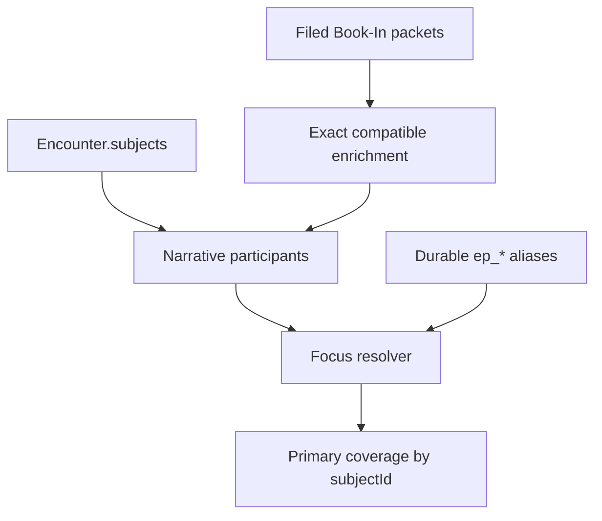

# Stage 2 — Encounter-subject integrity

Status: complete; verified 2026-09-05
Scope: `FieldEncounter.subjects[]`, its Book-In projection, and subject-aware downstream joins

## Outcome

Stage 2 makes an Encounter subject a stable embedded association. `subjectId` identifies the participation row; it is not a Person ID and it is not a booking ID. The Encounter aggregate still owns the row, so this stage does not create a separate EncounterSubject repository.

The implementation preserves the release `0.66.1` Encounter and Book-In storage shapes. Canonical fields are written beside synchronized legacy aliases. Historical identities are retained inside the owning Encounter so a removed row or detached booking cannot later be silently reused.

Primary implementation boundaries:

- `functions/model/encounter.js`: construction, normalization, deterministic migration IDs, aliases, and shared-stop projections.
- `functions/model/store.js`: ownership validation, revision checks, completion locks, histories, Book-In promotion, and persistence.
- `functions/encounters.js`: Encounter form preflight, stale-edit token retention, subject/document/evidence actions, and best-effort cross-store rollback.
- `functions/book-in.js`: explicit versus quiet save intent, import handling, projection, and exact unlink on delete.
- `functions/encounter-narrative.js`: Encounter-to-Narrative participant projection and Book-In enrichment.
- `functions/narratives/narrative-page.js` and `functions/narratives/build9/narrative-coverage.js`: canonical focus resolution and coverage.
- `functions/arrest-report.js` and `functions/oracle.js`: subject-aware downstream joins.

## Effective persisted contract

```ts
interface EncounterSubject {
  entityType: "ENCOUNTER_SUBJECT";
  schema: "copdocx.encounter-subject.v1";

  // Required after normalization. Permanent identity of this participation.
  subjectId: string;
  encounterId: string;

  // Optional entity and workflow references. Empty string means unlinked.
  personId: string;
  leadId: string;
  bookingId: string;

  // Canonical role fields. Values are uppercased but legacy/unknown codes are retained.
  role: string;
  occupantRole: string;
  outcome: string;

  // Synchronized compatibility aliases.
  bookinRecordId: string; // alias of bookingId
  encounterRole: string;  // alias of role
  vehicleRole: string;    // alias of occupantRole

  // Durable aliases accepted only for resolving older Narrative focus values.
  legacyEncounterParticipantIds: string[];

  // Existing identity snapshots, custody facts, notes, techniques, timestamps,
  // shared Encounter facts, and workflow fields remain part of the embedded row.
  [field: string]: unknown;
}

interface EncounterIdentityHistory {
  subjectIdentityHistory: Array<{
    subjectId: string;
    encounterId: string;
    personId: string;
    leadId: string;
    bookingId: string;
    bookinRecordId: string;
    legacyEncounterParticipantIds: string[];
    removedAt: string;
  }>;

  bookingIdentityHistory: Array<{
    subjectId: string;
    encounterId: string;
    bookingId: string;
    bookinRecordId: string;
    bookingUnlinked: true;
    removedAt: string;
  }>;

  meta: {
    encounterRevision: number;
    markedComplete: boolean;
    [field: string]: unknown;
  };
}
```

`subjectIdentityHistory` and `bookingIdentityHistory` are store-maintained ownership records, not editable domain content. Removed-subject history intentionally retains identity references and aliases but drops narrative notes, names, A-numbers, and other unnecessary personal snapshots. A new Encounter cannot inject its own authoritative history; the write path rebuilds history from the prior persisted aggregate.

## Canonicalization and legacy migration

- `createEncounterSubject()` mints a normal `sub_*` ID for a new row.
- A persisted row without `subjectId` receives a deterministic `sub_legacy_*` ID. The seed uses the owning Encounter plus, in order, booking, Person, Lead, A-number/name, name, or row index.
- Colliding generated IDs receive a deterministic numeric suffix within that roster.
- A non-empty existing `subjectId` is retained. An edit merges into the prior row instead of reconstructing only mounted form fields.
- Canonical properties win when both canonical and legacy aliases are explicitly present, even when the canonical value is `""`. If the canonical property is absent, its legacy alias is adopted. Both names are then synchronized.
- Encounter subject `occupantRole` / `vehicleRole` use uppercase codes (`DRIVER`, `PASSENGER`, `OTHER`). Book-In and Arrest `vehiclePosition` retain their existing form values (`Driver`, `Passenger`, `Other`). Import adapters synchronize both packet fields and saved form state to that compatibility format so reopening a packet preserves the selection.
- `ep_<booking-id>` is a durable Narrative compatibility alias when a booking exists.
- `ep_<array-index>` is stamped only while upgrading a pre-v1 EncounterSubject shape. It is retained in `legacyEncounterParticipantIds`; canonical rows do not gain a new index alias when reordered.
- Normalization during read changes only the deserialized in-memory state. The migrated shape is written on the next successful Encounter save; opening the application does not eagerly rewrite every Encounter.
- A missing legacy `subjects` property remains distinguishable from an explicit `subjects: []` where callers request that compatibility behavior. Narrative may synthesize participants only for the missing-roster case.

Workspace load also canonicalizes Encounter map keys. Whitespace-equivalent keys are trimmed; a substantive key/payload disagreement, blank canonical ID, or duplicate canonical ID stops adoption and directs the user to Integrity rather than choosing a winner.

## Authority and enforced invariants

| Fact | Current authority | Enforced behavior |
|---|---|---|
| Participant roster | `FieldEncounter.subjects[]` | An explicit empty roster remains empty. Book-In cannot create a replacement row during hydration. |
| Participation identity | `EncounterSubject.subjectId` | Stable across edits; duplicate rows and cross-Encounter reuse are rejected. |
| Person link | `EncounterSubject.personId` | Existing non-empty ownership cannot be retargeted. A newly referenced Person must exist or be declared as the preflight's prospective Person. |
| Case link | `EncounterSubject.leadId` | The Lead key, payload `leadId`, embedded Person, declared Person, and canonical Person must agree. A new Lead-only row is rejected. Unchanged malformed legacy links are grandfathered until repaired. |
| Booking link | `EncounterSubject.bookingId` | `bookinRecordId` is synchronized. Contradictory aliases, duplicate owners, cross-Encounter reuse, and retired-booking reactivation are rejected. |
| Role | `EncounterSubject.role` | `encounterRole` is synchronized. Existing unknown role codes are retained rather than silently coerced. |
| Occupant role | `EncounterSubject.occupantRole` | `vehicleRole` is synchronized. |
| Outcome | `EncounterSubject.outcome` | Exact stored values are preserved; Narrative does not assume every participant was arrested. |
| Removed identity | `subjectIdentityHistory[]` | A removed `subjectId` or its owned references cannot be reactivated or claimed by another Encounter. |
| Detached booking | `bookingIdentityHistory[]` | Exact unlink retires the subject/booking pairing and prevents later accidental reuse. |
| Completed Encounter | `meta.markedComplete` plus completed snapshot | Draft, commit, roster, Book-In projection, and exact booking-unlink writes reject while locked. Direct Encounter deletion is a separate operation and is not protected by this lock. |
| Full-roster write version | `meta.encounterRevision` | Once revisioned, a writer that supplies `subjects` must present the currently persisted revision or receives `ENCOUNTER_STALE_WRITE`. |

Two different canonical `subjectId` rows may refer to the same Person or Lead at the model/store boundary because participation identity and Person identity are separate concepts. Weak Person/Lead fallback is used only when an incoming row lacks a canonical `subjectId`, and only when the weak match is unique. The current Encounter UI separately prevents selecting the same Person twice in one roster.

Historical ownership checks include active rows, removed-subject history, completed snapshots, and prior completed snapshots. Retired booking-history rows participate in booking ownership checks but are excluded from active-subject identity matching.

## Encounter form behavior

`hydrateEncounter()` captures the loaded record's `meta` as `encounterEditMeta`. `collectEncounter()` uses that captured token rather than adopting a newly loaded revision behind the form. `saveDraftQuiet()` reloads storage immediately before save so a completed Encounter is noticed, while the store can still reject a stale full-roster write. A successful draft or commit replaces the captured token with the saved revision.

Subject save performs the complete-roster validation before `upsertSubjectPerson()`. A selected Lead without its required Person is rejected before any Person write. The editor updates by `subjectId` and carries forward fields not mounted in the visible form.

Removing a subject is deliberately packet-first:

1. Read and parse the Book-In array.
2. Require one subject owner; reject contradictory packet aliases.
3. Detach only an exact packet or one uniquely compatible legacy packet.
4. Write the detached Book-In array.
5. Save the reduced Encounter roster.
6. If the Encounter save fails, restore the in-memory roster and attempt to restore the exact prior Book-In array.

Encounter deletion similarly parses Book-In storage and writes detached packets before deleting the Workspace Encounter. If Workspace deletion fails, it attempts to restore the original packet array. This sequencing avoids deletion when Book-In JSON is unreadable, but it is not a cross-store transaction.

Evidence links are withheld until the Encounter can be read back from the Workspace store. A transient form has no `href`, protecting context-menu and middle-click paths; the normal click path saves, rebuilds the link from the persisted record, and then navigates. Completed Encounters keep evidence links disabled.

Document generation requires exactly one roster row and one Book-In packet matching the exact Encounter, `subjectId`, and one unambiguous booking ID. The `docsGeneratedAt` marker is saved before navigation. If that save fails, the in-memory roster is restored and navigation does not occur.

## Book-In behavior

The canonical Book-In identity is one unambiguous value across `id`, `bookingId`, and `bookinRecordId`. A packet `subjectId` requires an Encounter. When present it must resolve to exactly one row in that Encounter and cannot fall through to a weaker Person, Lead, or booking match. A legacy packet without `subjectId` may use one unique compatible fallback; successful promotion writes the canonical `subjectId` back to the packet.

An explicit Book-In save preflights the join before Person/Lead/Arrest promotion or packet persistence. Existing subject identity, Person/Lead ownership, role, and occupant role cannot be retargeted through Book-In; Book-In fills compatible blanks and custody/booking projections.

Quiet autosave records draft intent and does not authorize Encounter custody projection. Only explicit save or an explicitly promoted quiet save stamps the projection filing marker. Startup reconciliation skips quiet drafts, preventing another packet's save or a reload from converting an unfinished form into `ARRESTED` / `IN_CUSTODY`.

Import conflict copies are reminted and detached from canonical Encounter, subject, Person, Lead, Arrest, and booking identities before promotion. A failed imported promotion remains a detached draft rather than a durable linked packet. Merge-mode promotion is scoped to newly introduced records so an unrelated pre-existing packet is not rewritten by the import pass.

Transfer rejects an explicitly supplied non-array `subjects` value before merging an Encounter. A malformed roster cannot become an empty roster and remove existing participants; an omitted roster retains the legacy partial-update behavior.

Deleting a Book-In packet uses `unlinkEncounterSubjectBooking(encounterId, subjectId, bookingId)`. The store requires one exact subject/booking owner, rejects completed Encounters, clears the active booking fields and document/packet markers, and records the retired pair. If Encounter unlink fails, the Book-In packet array is restored. The Person/Lead Arrest projection is intentionally retained as historical arrest data; this unlink removes the live booking association rather than erasing the arrest event.

After a completed Encounter is explicitly unlocked and its booking unlinked, the same subject may receive a fresh booking ID. The archived snapshot retains the old booking, and the retired ID remains unavailable for reuse. Replacement does not permit changing the subject's Person or Lead owner.

## Narrative behavior

When an Encounter has a roster property, Narrative participants originate from `FieldEncounter.subjects[]`; compatible filed Book-In packets only enrich those rows. With a mixed roster, booked and unbooked participants are both retained. An explicit empty roster remains empty. Only a legacy Encounter whose roster property is absent may synthesize rows from linked filed Book-In packets.

Only `TARGET` and `COLLATERAL` roles become required Narrative participants. Blank, `OTHER`, and unknown roles remain on the Encounter and are reported as unassigned instead of being silently converted. `encounterParticipantId` is the canonical `subjectId`, `personId` remains the real Person reference, and `finalOutcome` comes from the EncounterSubject.

Older `ep_*` focus values resolve through `legacyEncounterParticipantIds` only when one active participant owns the alias. Ambiguous aliases produce warnings/no match. Narrative save canonicalizes a compatible legacy focus to the current `subjectId`; it refuses a focus whose identity snapshot contradicts the active participant. Coverage requires exactly one active primary narrative per active TARGET/COLLATERAL `subjectId` and treats missing or duplicate canonical identities as errors.



## Reports and Oracle

Arrest projections carry `subjectId`, `bookingId`/`bookinRecordId`, Person, Lead, and Encounter references. Report enrichment requires compatible ownership and rejects duplicate packet IDs, contradictory aliases, cross-Person cards, and cross-Encounter hybrids. Legacy encounter-number matching is retained only when it is unambiguous.

Oracle joins an Arrest to an EncounterSubject by canonical `subjectId` before considering historical Person fallback. An explicit canonical mismatch does not fall through to another row for the same Person, preventing role/outcome attribution to the wrong participation.

## Persistence and failure semantics

Encounter persistence still serializes the complete Workspace document to `localStorage`. `encounterRevision` is an optimistic compare token for full-roster writes, not a browser transaction or lock. A write failure reloads the last readable Workspace state. Store-level save validates the latest disk snapshot, but two truly simultaneous localStorage writers can still race.

Book-In packets live in a separate localStorage key. Actions spanning Workspace, Book-In, Admin, media, Person/Lead projections, or navigation remain multi-write workflows. Several Stage 2 UI paths now preflight and perform targeted compensating writes, but compensation can itself fail (quota, private mode, concurrent tab, or corrupt JSON). Integrity remains the recovery authority for those cases.

## Verification

Run from the repository root:

```sh
node scripts/run-stage2.js
```

`run-stage2.js` runs the complete Stage 1 baseline and the existing model regression suite, then discovers and runs every `scripts/test-stage2-*.js` gate in lexical order. The focused gates cover:

- stable, migrated, collision-free, and cross-window-consistent subject IDs;
- store ownership, Lead/Person validity, map-key safety, completion locks, stale revisions, tombstones, booking retirement, Arrest projection, and exact unlink;
- explicit versus quiet Book-In projection, import isolation, and delete rollback;
- Narrative projection, aliases, focus resolution, and coverage identity errors;
- subject-aware Oracle and report joins;
- Encounter UI ordering guards for stale edit tokens, evidence, deletion, subject unlink, Lead preflight, and document generation;
- team-remint safety; and
- any additional Stage 2 focused gate added under the same filename convention.

`scripts/stage2-resolved-risks.json` is the machine-readable allowlist of Stage 0 probes that this stage expects to stop reproducing. Risks not listed there must continue to reproduce in the known-risk gate until a later stage owns them.

### Final local verification — 2026-09-05

| Check | Result |
|---|---|
| Stage 2 runner | 12/12 gates: Stage 1 baseline, existing model suite, 10 focused Stage 2 suites |
| Complete offline JavaScript inventory | 42/42 distinct suites passed, including the suites reached by the Stage 2 runner |
| Stage 0 safety baseline | 9/9 checks passed |
| Known-risk characterization | 4/4 planned resolutions hold; 8/8 deferred risks still reproduce |
| Stage 1 manifest contract | Passed: 22 stores, 70 objects, 36 relationships, 11 workflows, 155 valid source citations |
| JavaScript syntax | 25 changed/new JavaScript files passed |
| JSON and whitespace | Changed/new JSON parses; `git diff --check` passes |

The existing model tests now reload saved Encounter revisions before the next full-roster edit, expect completed-record edits to be rejected until unlock, and use distinct IDs for independent fixtures. The previously flaky “list includes untitled” check now verifies membership by ID rather than depending on same-millisecond sort order.

Validation executes the real application scripts in isolated Node/VM storage fixtures, including real Transfer-to-model promotion. Browser automation and the unrelated `test-warrant-fill-pdflib.js` network-dependent PDF check were not run. No live browser data was modified.

This checkpoint is based on `9571793` on `codex/release-0.66.1-narrative-direct-tab`. Verification completed before publication; the Git history records the Stage 2 checkpoint.

## Deferred risks

Stage 2 does **not** claim to solve:

- atomic commits or guaranteed rollback across Workspace, Book-In, Admin, media, and navigation;
- a true cross-tab transaction/lock; revision protection is limited to writes that include the full subject roster;
- a versioned Workspace or Book-In schema-migration framework;
- canonical Person versus embedded Lead Person split-brain outside the protected Book-In/Encounter paths;
- general repair of stale Person, Lead, Vehicle, Location, Association, Arrest, report, or operation snapshots;
- complete referential repair for every Transfer/import/export object type;
- media cleanup and all external projection cleanup when an Encounter or nested object is deleted;
- prevention or additional authorization for deleting a completed Encounter;
- eliminating grandfathered malformed legacy references without an explicit Integrity repair decision;
- making document generation and its `docsGeneratedAt` marker one atomic operation;
- immutable domain events, a durable audit log, or complete actor attribution;
- a normalized top-level EncounterSubject repository; or
- final normalization of detailed flight outcomes into a category plus mode.

These limitations remain explicit because hiding them behind automatic normalization would make legacy ownership conflicts harder to detect and would exceed Stage 2's identity-integrity boundary.
