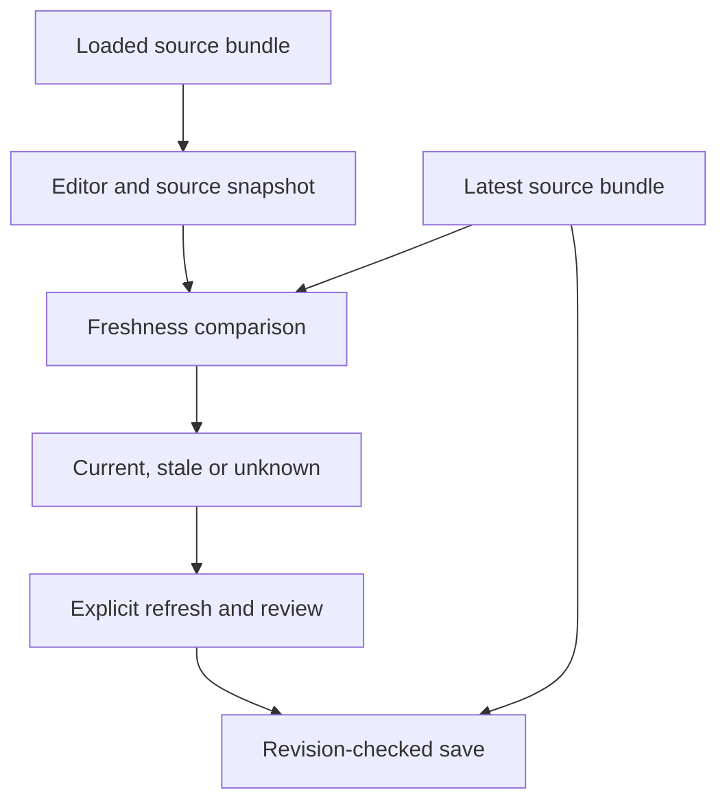

# Stage 3 — Narrative correctness and source tracking

Status: complete; verified on 2026-09-05; publication authorized as the Stage 3 checkpoint

## Checkpoint and scope

Stage 2 was committed locally as `7161b8e24a2e21fa8daba8c98544976d4024e684` and published to `codex/release-0.66.1-narrative-direct-tab` as `fe5f1217cc220369d3c66ba10493ce65d9b15033`. The local and remote Git trees both equal `e6ab18dbdba96d8be5c3a4045ee1b0f51f267ebd`.

Stage 3 builds on that checkpoint. Stage 2 already supplied stable subject IDs, real outcomes, mixed booked/unbooked rosters, strict booking joins, and durable legacy aliases. This stage completes Narrative context and adds source tracking without migrating or regenerating saved narrative prose.

## Implemented boundaries

| File | Responsibility |
|---|---|
| `functions/encounter-narrative.js` | Builds detached live Narrative context from canonical Person identity, Encounter subjects, compatible Book-In records, Operation, locations, vehicles, events and officers. |
| `functions/narratives/source-freshness.js` | Pure deterministic source projection, fingerprint capture, and `CURRENT` / `STALE` / `UNKNOWN` comparison. No storage writes. |
| `functions/narratives/narrative-page.js` | Captures the source used by the editor, detects later changes, preserves text, provides explicit refresh/review, and checks freshness again at persistence. |
| `narrative.html` | Loads source comparison before the page controller. |
| `style/style.css` | Compact source-status and review controls using the existing page theme. |

## Context authority

- Resolve Person identity using the subject's exact `personId`. An explicitly present canonical value, including an empty value, takes precedence over stale embedded copies. Compatibility fallback applies to genuinely absent fields.
- Book-In enriches only the compatible Encounter subject established by Stage 2. Its saved form values take precedence over duplicated shorthand values, including explicit clears.
- Retain actual Encounter type, start/end values, notes and completion state. Vehicle presence does not imply a vehicle stop, and start time does not imply end time.
- Prefer an explicit subject outcome time, then an explicitly recorded arrest time. A Book-In timestamp alone does not establish the arrest time.
- Use the selected `centerLocationId` when it resolves; retain the legacy first-location fallback otherwise. Missing coordinates stay unknown, and zero stays zero.
- Resolve linked Operation by exact ID. Include actual Encounter, arresting and event-linked officers. Do not silently add the Operation's whole roster to an Encounter.
- Preserve structured events and detached event details. Resolve an old participant alias only when it has one owner; ambiguous references remain unresolved.
- Keep Stage 2's required-participant boundary: TARGET and COLLATERAL need primary narratives; blank, OTHER and unknown roles remain unassigned.
- Remove A-number, surname and sole-subject guesses from Narrative write-back/seeding. Canonical IDs and compatible unique legacy ID paths remain supported.
- Do not infer warrantless authority or transport to an ICE office merely from `ARRESTED`. Broad noncompliance or force categories do not establish specific commands or force techniques. Explicit flight mode can precede an arrest.

## Source snapshot

New or explicitly reviewed primary drafts save:

```ts
interface NarrativeSourceSnapshot {
  schema: "copdocx.narrative-source.v1";
  encounterId: string;
  focusSubjectId: string;
  fingerprint: string;
}
```

The fingerprint covers the source bundle used by the editor: Encounter, Operation, participant identities/outcomes/immigration/closing facts, events, officers, location, vehicles and their Encounter links. `sourceFacts` includes additional inputs used to seed choices, such as location association, vehicle disposition, flight, compliance and force facts.

Object keys are serialized deterministically. Array order is retained because participant, event and vehicle ordering can affect output. Narrative records, generated summaries, record metadata and capture/write timestamps are excluded. Actual event, outcome and planning times remain included.

The synchronous two-lane FNV fingerprint is a change detector, not a signature or tamper-evident audit record. Snapshots contain IDs and a fingerprint rather than duplicating all personal or booking data.

## Draft workflow

1. Capture the source actually loaded into the editor.
2. On load, focus and relevant browser events, compare the draft's saved source against the latest available bundle.
3. `Refresh source facts` loads current facts and source-derived choices while preserving manual narrative prose. It does not certify old text as reviewed.
4. `Mark source reviewed` accepts the loaded source only if it still matches the latest source. A change between refresh and review requires another refresh.
5. At save, re-read the Encounter and compare again inside the existing per-narrative revision check. An old-source save cannot be stamped current using a newer fingerprint.

Existing records without a supported source snapshot are `UNKNOWN` until explicitly reviewed. Source drift is displayed without writing the record merely because it was opened. Failed writes preserve the editable draft for retry.

Unreadable source stores cannot be certified from stale in-memory data or empty fallbacks. An unavailable current source produces `UNKNOWN` and prevents accepting its fingerprint.



## Existing Narrative semantics

The existing domain continues to enforce one active primary per subject, one Encounter overview, unlimited supplements, exact narrative-ID saves, expected revisions, immutable focus identity, and immutable finalized content/version snapshots. Supplements remain separate records and do not satisfy primary coverage.

Finalized records can show a changed-source notice while retaining saved prose and source snapshots. A completed Encounter continues to require its existing unlock workflow before writes. This stage does not rewrite finalized reports when Person or Book-In data changes.

## Verification

Run from the repository root:

```sh
node scripts/run-stage3.js
```

This includes the entire Stage 2 gate, the existing Narrative Build 9 suite, and every `test-stage3-*.js` suite.

Final results:

- Stage 3 gate: **5/5 passed**, including Stage 2's **12/12** aggregate gates.
- Complete offline inventory: **45/45 distinct suites passed** (25 through the Stage 3 gate, plus 20 remaining suites).
- Syntax checks: all **10** changed/new JavaScript files passed.
- `git diff --check`: passed.
- Independent adapter, lifecycle and documentation reviews completed.

- Adapter tests exercise canonical identity, explicit clears, chosen location, unknown/zero coordinates, actual Encounter state, Operation, multiple officers, strict legacy joins, and structured events.
- Source tests exercise changes in every input family, stable timestamps/key ordering, legacy unknown sources, and finalized snapshot immutability.
- Controller tests execute the real page controller, adapter, packet builder, domain and persistence model with isolated storage. DOM and text-editor rendering are doubled. They cover source drift, manual prose, refresh/review races, subject switching, failed-save retry, revision conflict, finalized/complete locks and supplement preservation.

Browser automation could not reach the isolated local test origin: the connected browser returned `net::ERR_BLOCKED_BY_CLIENT` for localhost. No production browser data was read or changed. The unrelated network-dependent PDF download test is outside this stage.

## Remaining limits

- Cross-store transactions, simultaneous localStorage races, general Person/Lead copy repair and import/deletion architecture remain in their previously documented stages.
- Source review is an explicit officer action, not a determination that prose is legally or factually sufficient.
- Template/output hashes and durable document-generation provenance remain Stage 7 work.
- This stage preserves existing supplements and finalized revisions; it does not introduce a new supplement editor or event-capture workflow.
- This document describes the Stage 3 checkpoint. Subsequent booking recovery work belongs to Stage 4.
