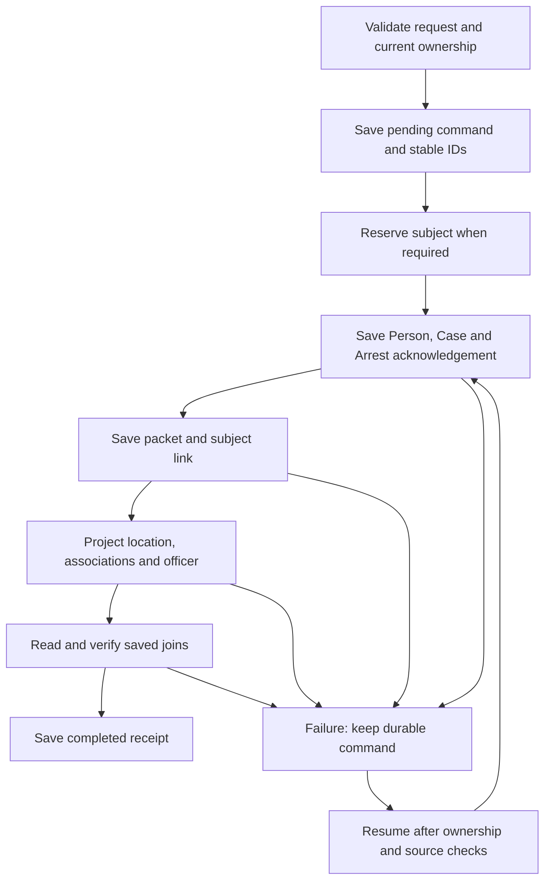

# Stage 4 — Recoverable booking

Status: complete; verified on 2026-09-05; publication authorized as the Stage 4 checkpoint.

## Published checkpoint

Stage 3 was committed locally as `5f332e48ee959f8eb555b6cf1b6a8ecfd25e06bd` and published to `codex/release-0.66.1-narrative-direct-tab` as `b8a37523c3f670328e00c649fa9f9a28d76718d7`. Both commits have tree `13ed76749825ae82dfd468cac52f8afc01c1745c`.

Stage 4 builds on that checkpoint. It makes booking recoverable across the existing independent stores. It does not make localStorage a transactional database.

## Changed behavior

- Explicit Book-In form saves, edits to filed packets, inline table saves, and Encounter quick-book use one shared `COPDoc.booking.bookSubject()` workflow.
- Booking and transaction IDs are saved in a journal before canonical data is written. The legacy Add Another path reserves its permanent Encounter subject ID in the same journal before adding the subject.
- The canonical Person, Case and Arrest are saved together with a transaction acknowledgement. A fresh page can resolve the exact booking IDs even if the browser stopped before the next journal checkpoint.
- Packet, Encounter subject, arrest-location, vehicle-association and officer projections have explicit failure checks. Completion requires reading and verifying the saved ownership links; a completed checkpoint label alone is insufficient.
- Retrying an interrupted command preserves its original input and identity. Repeating a completed command returns the verified receipt without repeating writes. An intentional later edit creates a new receipt for the same booking and Arrest.
- Existing RELEASED/FLED subjects must be changed to ARRESTED in the Encounter before explicit booking. Saving Book-In no longer silently changes those outcomes. Quiet legacy packets without filed markers retain their existing packet-only compatibility path.
- Quiet unfiled drafts remain packet-only. A pending booking cannot be overwritten through that draft path or the old startup reconciliation sweep.
- The Book-In saved-records panel lists incomplete bookings with a **Resume booking** action. Failed saves retain the form and reserved ID. Navigation and duplicate submissions are guarded during the asynchronous save.

## Workflow and persistence



The new registered nonportable localStorage key is `copdocx.booking-transactions.v1` (`bookingTransactions`). It is included in full recovery archives and excluded from ordinary portable transfer exports. The original Stage 1 manifest remains historical; `stage-4-booking-storage.json` adds the new store to current validation.

```ts
interface BookingJournal {
  schema: "copdocx.booking-transactions.v1";
  transactions: Record<string, {
    transactionId: string;
    bookingId: string;
    encounterId: string;
    subjectId: string;
    personId: string;
    leadId: string;
    arrestId: string;
    status: "PENDING" | "FAILED" | "COMPLETED";
    completedSteps: string[];
    revision: number;
    createdAt: string;
    updatedAt: string;
    lastError: string;
    requestHash: string;
    contextHash: string;
    basePacketHash: string;
    baseCanonicalHash: string;
    baseSourceHash: string;
    packetHash?: string;
    request?: { packet: object; options: object };
    reservedSubject?: object;
  }>;
}
```

An unfinished command keeps its frozen request for recovery. Completion removes that request, retaining identifiers, source checksums and step history. Completed receipts are retained; this stage does not introduce automatic pruning. The optional legacy subject reservation remains part of its receipt. Hashes are deterministic change detectors, not security signatures.

Checkpoints are `subject-reservation` (when needed), `canonical`, `packet`, `subject`, `location`, `associations`, `officer`, and `verified`. A separate final write changes the status to `COMPLETED`.

## Shared APIs and implementation

| File / API | Responsibility |
|---|---|
| `functions/booking-workflow.js` · `bookSubject(record, options)` | Asynchronous shared workflow; accepts form data or compact quick-book promotion input and an optional expected packet timestamp. |
| `booking.resume(transactionId)` | Reloads a frozen command, validates current ownership and source state, then completes or reports the conflict. |
| `booking.listTransactions()` / `pendingBookingId(encounterId, subjectId)` | Recovery summaries and pending identity lookup. Summaries exclude frozen form data. |
| `functions/model/store.js` · `resolveBookInBooking(bookingId)` | Strict read-only resolution across canonical Person Arrests, Case projections and history. Rejects ambiguous or contradictory ownership. |
| `promoteBookInRecord(..., {recoverBooking, bookingTransactionId})` | Revalidates recovery identity and stamps the Arrest acknowledgement/source fingerprint in the same workspace save. |
| Booking-specific `saveLead()` boundary | Preserves canonical Person encounter history and restores memory if persistence fails, including the first write. |
| `functions/officer-roster.js` · `recordFieldArrest()` | Stores subject/booking provenance, rejects conflicting claims, deduplicates Arrest facts, and surfaces read/write failure. |
| `functions/book-in.js` / `functions/encounters.js` | Form, inline, quick-book, recovery UI, retained input and awaited navigation. |
| `functions/integrity.js` | Reports malformed journals, unfinished commands, competing owners and contradictory IDs without reporting frozen request data. |

## Recovery guarantees and limits

Verified: failure at every actual write boundary is recoverable after a fresh runtime starts, including failure after canonical save, packet save, projections, journal acknowledgements, and the final receipt. Retry produces one Person, Case, Arrest, packet, vehicle association and officer Arrest entry for the tested booking.

Verified: malformed stores, duplicate/noncanonical packet IDs, contradictory requests, deleted subjects, completed Encounters and changed owned facts block unsafe replay. Source checks cover existing Person/Case data even when the first canonical save failed and there is no Arrest yet. Unrelated records are preserved; recovery does not restore whole-store snapshots over later writes.

Conflict handling is deliberately conservative. If a Person/Case, packet or relevant Encounter facts changed after the command began, the command remains failed for review. Resume does not accept a changed source automatically, overwrite the later edit, or undo an independently changed record. There is no automatic rollback/rebase or conflict-resolution editor in this stage. Without an explicit Person owner, the legacy matching candidate set is checked conservatively before initial promotion.

Calls serialize within the page and use a shared exclusive Web Lock when the browser supports it. Optimistic stored-byte and journal-revision checks also detect intervening writes. Browsers without Web Locks and writers outside this workflow do not provide full cross-store isolation; the global last-writer-wins architecture is not claimed to be solved.

Media payloads are not written by the current booking paths and are outside this workflow. Existing general import/deletion behavior, stale embedded Vehicle/Location authority, and general Person/Lead copy repair remain separately documented work. The existing arrest-location projection fills missing values and preserves existing recorded locations.

## Verification

Run `node scripts/run-stage4.js` from the repository root.

- Stage 4 aggregate gate: **5/5 passed**, including the complete Stage 3/2/1/0 chain.
- Complete offline inventory: **49/49 distinct suites passed** (29 through the aggregate gate and 20 remaining suites).
- Stage 0 characterization: **7 deferred risks still reproduce; 5 resolved behaviors pass**. Stage 4 adds only `S0-BOOKIN-001` to its separate resolution manifest.
- All **17** changed/new JavaScript files passed syntax checks; JSON and `git diff --check` passed.
- Workflow tests inject failure at every observed write for standalone booking, linked booking, and legacy subject creation, then restart and retry. They also cover repeated commands, edits, shared lock use, corrupt storage, stale ownership, deleted/locked subjects, and later independent edits.
- Controller tests cover async failure/retry, duplicate clicks, draft routing, stale packet guards, pending protection, retained manual input, recovery controls, navigation and quick-book.
- Store/officer tests cover exact recovery IDs, durable acknowledgement/source checks, failed first-write rollback, Person history preservation and idempotent officer facts.
- Integrity/backup tests cover journal shape, ownership conflicts, read-only privacy and exact-byte recovery archive inclusion.

The previously observed browser localhost restriction prevented a real-browser pass in this environment. Controller tests use the real application logic with isolated storage and a simulated DOM. The unrelated network-dependent PDF download test remains excluded.
