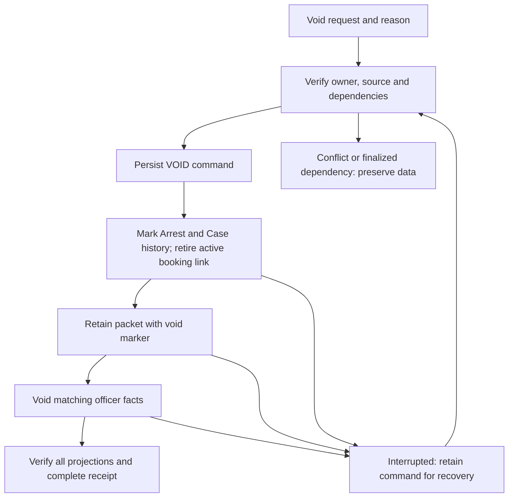

# Stage 5 — Shared creation, relationships and record lifecycle

Status: complete; verified on 2026-09-05; publication authorized as the Stage 5 checkpoint.

Stage 5 builds on the Stage 4 checkpoint: local commit `1f0e97354bb08268cd1292644804d8874db4b1cd`, published equivalent `88538ab806dcdad6f5335f13dfbf3e6fa77aecc9`, tree `b4aefbfc1e6203b1bc137dcad6336ae8626de2fa`.

This package extends the agreed deletion/relationship stage to cover the creation inconsistency identified during planning. Different entry screens now use common identity and persistence rules for the same domain objects. Fleet vehicles and officers retain their separate Admin ownership; this is not a migration merging fleet with civilian Vehicles.

## Entry points and ownership

| Entry point | Shared object behavior | Owned relationship or workflow |
|---|---|---|
| Case cards and associate promotion | Resolve/create canonical Person, Vehicle, Location, Business or Entity; preserve Person history | Case membership and explicit Associations |
| Encounter subject/object editors | Resolve Person identity, retain permanent subject ID, validate deliberate canonical edits | `Encounter.subjects[]` owns Person↔Encounter participation |
| Investigation and wall inspector | Use the same object gateway; stable existing IDs; no automatic destructive merge | Investigation node membership is separate from a world relationship |
| Plate promotion | Canonical Vehicle resolution, then attachment | Investigation membership |
| Standalone and Encounter Book-In | Shared Person identity resolution and Stage 4 booking command | Person/Case Arrest, packet and Encounter subject join |
| Operation support locations | Stage canonical Location with the parent Operation | Operation location reference |
| Admin officer and fleet forms | Per-type shared save, revision/identity checks and archive controls | Admin owns fleet/officer records and their retained historical facts |
| Transfer and Book-In import | Validate identities and preserve lifecycle history before writes | Existing import mechanism; full staged/atomic import remains Stage 6 |

Operation targets continue referencing existing Cases. Creating a child Investigation changes its wall node IDs while retaining canonical object IDs. Neither path should mint another Person merely to represent the new context.

## Shared object contract

`functions/model/store.js` exposes:

- `resolveObjectIdentity(type, input)`: read-only identity/candidate resolution.
- `resolveObjectRecord(type, input)`: resolution plus canonical creation when allowed.
- `saveObjectRecord(type, record, options)`: one per-type canonical write boundary; supports create/update intent and expected revision.
- `validateObjectWorkspace(incoming, current)`: read-only import identity validation.

Exact IDs and strong Person identifiers establish identity. Conflicting supplied identifiers block the operation. A name match proposes candidates; it does not silently merge two people. A deliberate separate-person choice remains possible when there is no conflicting strong identifier. Plate/address matching retains compatibility resolution with archive and ambiguity checks; these values are not permanent universal identities.

Canonical records carry `objectRevision`. An editor that supplies an old revision must reload. Existing legacy Case copies without a revision use their saved Case baseline to distinguish intentional edits from stale fields. Canonical Person Encounter/Arrest history survives an ordinary Case save. A Case association promoted to a new Case reuses the canonical Person rather than recreating an identity-only Person.

Vehicle/Location editors carry a temporary `_objectEdit` marker and their loaded revision. The store validates those intentional edits while staging the parent save, then removes the marker before serialization. Passive embedded copies take canonical values. Failed persistence restores in-memory state, including a failed first write.

Case/Investigation attachment and plate/Person-to-Case promotion stage the complete object, Association and membership graph through `atomicWorkspaceMutation`, then perform one workspace write. `saveEncounterWithObjects(record, {personEdits})` applies the same boundary to Encounter subject creation. A failed attachment leaves neither an orphan new object nor a partially updated canonical record.

Revision checks do not provide database-wide isolation. The existing overlapping-tab whole-workspace write probe still reproduces and remains explicitly tracked.

## Relationship ownership and lifecycle

`EncounterSubject` remains the authoritative Person↔Encounter association. Other explicit object relationships use Associations. Case links and nested occupancy are projections of those relationships.

| Action | Meaning | History |
|---|---|---|
| Remove an object from an Investigation wall | Remove membership in that Investigation | Canonical object and relationships remain |
| Disconnect a relationship / remove a related Case card | Retract the shared Association | Retraction metadata remains; stale snapshots cannot revive it |
| End a relationship | Record that a formerly valid relationship has ended | Historical period remains; excluded from active nesting |
| Reassert a relationship | Explicitly establish it again with a reason | Lifecycle history records the change |
| Archive an object | Retain identity and references while removing it from active creation/assignment choices | Existing history stays readable |

Shared APIs are `retractAssociation`, `endAssociation`, `reassertAssociation`, and `removeObjectRelationship`. `dropAssociation` is a compatibility alias for retraction. Implicit saves do not reassert a retracted/ended relationship. Changing an endpoint or reason preserves the superseded relationship's lifecycle instead of allowing a stale copy to recreate it.

## Dependencies, archive and deletion

`dependenciesFor(type, id)` returns exact referencing store, record type, record ID, field path and reason. It reads registered related stores and refuses to certify a deletion when required data is malformed. `archiveRecord(type, id, {reason})` retains the record and uses `meta.archivedAt` for workspace objects.

Historical/referenced objects cannot be physically deleted through ordinary draft deletion. An unused draft can be removed only after dependency checks. Encounter deletion no longer cascades through Media owned by shared Vehicle or Location IDs. Removing Investigation membership does not delete the canonical object. Archive controls preserve existing wall/history references.

Admin uses `COPDoc.officers.saveOfficer`, `saveFleetVehicle`, `archiveRecord`, `restoreRecord`, `inspectDependencies` and `deleteDraft`. Active assignment lists exclude inactive/archived officers and fleet, while exact historical lookup retains their labels. `voidFieldArrest` marks a fact as voided rather than removing its audit record.

`functions/model/media.js` checks stored media-ID references before individual removal. Bulk owner cleanup requires the owner to be absent and unreferenced, then checks each asset before deleting. Errors propagate. Store deletion retains Media; automatic orphan-media reclamation is outside this stage.

## Booking void

Filed bookings use `COPDoc.booking.voidBooking(bookingId, {reason, expectedUpdatedAt})`. Only explicitly unfiled, unreferenced drafts can use `deleteDraftBooking`. A legacy packet with no filing markers is not presumed to be an unused draft.

The existing booking journal gains `kind: "VOID"` commands and four checkpoints: `void-canonical`, `void-packet`, `void-officers`, `void-verified`. No new store is introduced. A void command records the exact booking/Person/Case/Arrest/Encounter/subject IDs, reason, timestamp and original source checksums. Interrupted commands remain visible in **Bookings needing attention** and can be resumed.

Retained Arrest and packet fields are `voidedAt`, `voidReason`, and `voidTransactionId`. Case history retains the original booking event and adds a `BOOKING_VOIDED` event using `voidedBookingId`. Encounter `bookingIdentityHistory` retains the former subject booking claim; the live subject clears its booking aliases and keeps a `bookingVoid` audit record. The subject ID, Person ID, and actual Encounter outcome remain intact.

A void does not declare that the underlying encounter never happened. Active booked-Arrest reports and officer statistics exclude voided facts; Encounter outcome analytics continue to reflect the recorded outcome. Previously generated documents remain historical. Editing a voided packet or generating a new document from it is blocked. A new booking may use a new booking/Arrest ID for the same permanent subject; the old void receipt remains verifiable.

Completed/archived Encounters and finalized narratives block a new void until the existing explicit unlock/revision process is followed. Reason and stale-source failures occur before side effects. Recovery rechecks the exact saved ownership and source; it does not roll back unrelated records.

Archiving an officer during an unfinished booking can also pause its pending officer-statistic projection. The command remains visible for review; recovery does not treat an inactive officer as a new active assignment.

## Imports, consumers and integrity

Transfer loads the shared model before object-bearing imports. Direct import calls without the validator fail visibly. Dictionary IDs, aliases, strong Person identities and retained archive/retraction/void facts are checked before writes. A portable Book-In import cannot create a void on its own: it cannot reconcile all the associated stores. An unchanged existing voided packet can round-trip; new/conflicting void history requires the full recovery data.

Report, Oracle, Narrative enrichment and baseball-card paths exclude voided booking facts as appropriate. Historical archived objects remain available for historical reads. The integrity scanner distinguishes valid void history and interrupted recovery from dangling active joins. It requires canonical/journal/tombstone evidence and still flags forged or inconsistent lifecycle markers. Reports from the scanner do not expose void reasons or frozen form content.

The frozen Stage 1 architecture manifest remains historical. Its source citations are checked against the recorded baseline Git tree, with the frozen Stage 0/1 checkpoint for files added during those stages. Current storage overlays are still validated against the current implementation.

## Verification and remaining boundaries

Run `node scripts/run-stage5.js` from the repository root. It includes the prior Stage 4/3/2/1/0 gates and Stage 5 tests for shared objects, UI controllers, relationships, dependencies/Media, Admin lifecycle, booking void recovery, imports/consumers, and integrity.

The void test interrupts every observed write, restarts the runtime, resumes twice, and checks that history and statistics are changed exactly once. It also exercises blocked finalized sources, legacy deletion uncertainty, source conflicts and replacement booking on the same subject.

Final validation: **11/11 Stage 5 aggregate gates passed**, including the full prior-stage chain; **59/59 distinct offline suites passed**. The changed/new JavaScript files passed syntax checks and `git diff --check` passed. The unrelated network-dependent PDF-library download test remains excluded. Tests exercise production controller logic with isolated synthetic data; no production browser records were modified.

Final controller regressions also cover explicit plate clearing across both legacy aliases and reuse of a Person whose canonical DOB/citizenship was not displayed in the new-subject form. Reuse preserves those facts; deliberate edits to a displayed canonical Person still support clearing. The aggregate gate and affected model/object suites passed again after those corrections.

`scripts/stage5-resolved-risks.json` records six newly resolved Stage 0 probes: Person history loss, Vehicle/Location rollback, failed-first-write phantom state, and both booking deletion residue cases. The original baseline is preserved. Across Stages 2–5, ten probes are resolved. Two still reproduce: partial multi-store import and overlapping whole-workspace tab writes.

Full schema migration, automatic duplicate repair, physical modularization, automatic Media cleanup and a database transaction layer are outside Stage 5. Existing duplicate records remain visible for review. Browser integration is checked with real production controllers in an isolated simulated DOM; a full browser session remains subject to the environment's previously observed localhost restriction.
