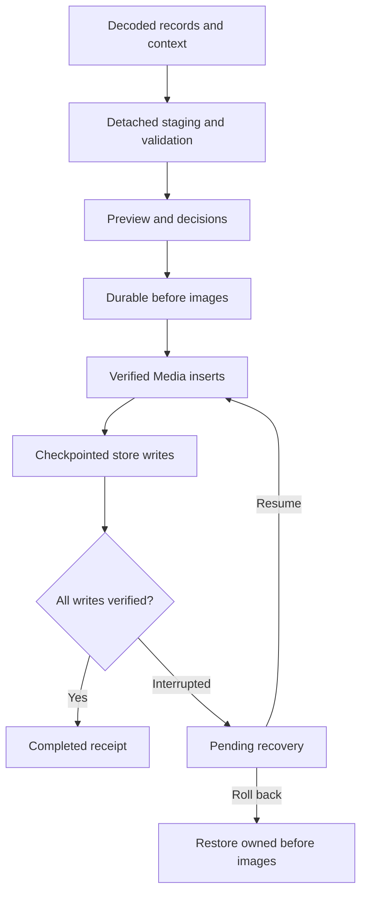

# Stage 6 — Import safety and Alien Book-In v1.12 compatibility

Status: implemented and verified. Publication is tracked by the repository commit history.

Baseline: Stage 5 local commit `8172be0f03436aaad40a1d633e8507a2fe000572`, published equivalent `6f6819066bad9247d04fcd717698d79038bab2ef`, identical tree `c3551dbde60c90026bb47e33be7ef770ad15cda6`.

Reference: supplied `Alien_Book_In_Docs_v1_12_0.html`, SHA-256 `40da14e495de15fa8986d7c1677a21ed196f934de283e98039b7aa0ab234bddf`. Its export format is `alien-book-in-records`, schema 5. The supplied file is a reference; it was not modified.

## What Stage 6 changes

| Area | Result | Implementation |
|---|---|---|
| Standalone imports | One schema 1–5 decoder for General Import and Book-In Import; validates version, counts, IDs, aliases, typed form state, saved cards and limits | `functions/import-schema.js`: `decode` |
| Preview | Rows show create/update/skip and required related records; custody review has explicit choices; preview and cancellation leave browser records unchanged | `functions/transfer.js`: `buildImportPlan`; `functions/import-workflow.js`: `preview`, `reviewCustody` |
| Identity | Imports use the same canonical object boundaries and complete model constructors across entry points | `functions/model/store.js`: `withImportWorkspace`, `validateImportWorkspace`; `functions/transfer.js`: `ensureCanonicalBookInStore` |
| Persistence | Exact before images precede changes; resume and rollback checkpoint every store and verify the result | `functions/import-workflow.js`: `apply`, `commitSync`, `resume`, `rollback` |
| Photos/files | Verify IDs, owners, roles, sizes, MIME types and original SHA-256; new explicit Media IDs use insert-only writes | `functions/import-workflow.js`: `bundleFor`, `existingMedia`, `validateMediaOwner`; `functions/model/media.js`: `importExactBundle` |
| Saved cards | Complete structured state, source photo and transforms, layout, editable content, City/County history and chosen order | `functions/baseball-card-contract.js`; `functions/baseballcard.js`; `functions/baseball-page.js` |
| Admin reports | Today/date range/selection, visible columns, natural sorting, Last Saved, daily summary and designated finalized card | `functions/arrest-report.js`; `functions/arrest-roster.js`; `functions/admin.js` |
| Portability | Current canonical cards and required linked context survive exports and fresh-workspace restoration | `functions/transfer.js`: `collectBookInContext`; `functions/book-in.js`: `exportSavedRecords` |

## Import contract

**Verified:** schema 1, 2, 3, 4 and 5 exports are supported. Missing schema versions require the explicit `allowUnversionedLegacy` decoder option; future/unsupported versions are rejected. The import bound is 32 MiB and 5,000 records. Browser storage quotas can impose a smaller practical bound; a checkpoint that cannot be stored must fail before domain changes.

Unknown record properties, form fields and extension data are preserved. Ordinary Book-In saves merge current form values into the retained form-state dictionary, so opening an imported record does not erase unknown fields. Provenance records the source format, version, application version and export information. The original source card is retained when normalization changes its representation. Portable graph and Media envelopes are kept separately rather than copied into every record's provenance.

The standalone tool's human Encounter number is not a canonical Encounter ID. Standalone imports do not fabricate an Encounter, subject association or officer ID from a text label. A `NIC`/non-arrested record requires an explicit custody decision: preserve it as an unfiled draft, or confirm that it represents an arrested booking. Linked records cannot be detached into drafts to bypass identity checks.

Native COPDoc exports retain stable Person, Lead, Arrest, EncounterSubject, Booking, card and Media identities. `canonicalContext` carries the required related graph when Book-In records are exported alone; these dependency rows appear in preview. Missing, contradictory, stale or incomplete relationships block the plan. A voided booking can be restored to a fresh workspace only with its coherent canonical void history; import never reactivates a voided booking.

Source revisions and local object revisions are distinct. A three-way comparison preserves local edits when an external source is unchanged, applies an uncontested newer source, and blocks conflicting changes. Reimporting unchanged data is a skip and does not mint another Person, Booking, card or Media object or refresh Case timestamps unnecessarily.

## Recovery and backup

The new registered key is `copdocx.import-transactions.v1`; its additive contract is in `stage-6-import-storage.json`. Stage 1 remains a historical schema freeze. Full recovery archives automatically include this journal as exact raw bytes. Normal transfer exports exclude workflow journals.

An import plan contains exact before/after strings for registered browser stores, read guards, Media insertion plans and preview rows. Staging runs against a detached workspace and storage snapshot. It cannot read fallback live data or write live stores. The final graph is validated before the workflow receives the plan.

**Verified:** this is a recoverable cross-store protocol, not a single database transaction. Other windows can briefly observe partial data. A persistent recovery screen blocks ordinary UI editing while an import is unfinished; shared model and booking write boundaries also reject edits. Web Locks serialize cooperating import and booking commands when available. Each resumed or rolled-back key must still match its before or after image; conflicting later edits are preserved and recovery stops visibly.

Media is inserted before domain references become live. Existing IDs are reused only when owner, bytes and metadata agree. A different explicit ID remains a different identity even when its content matches another image. Rollback deletes only newly inserted Media owned by that exact rolling-back command, after restoring domain references, and still refuses deletion if external references exist. Completed/rolled-back backup receipts are not treated as live relationships.

Completed receipts retain before images for recovery archives. Automatic rollback is restricted to unfinished imports; a completed import cannot overwrite later work through an old rollback request. Retained checkpoints consume browser storage. Unreadable journals are preserved and block new writes, rather than being silently reset.

## Baseball-card compatibility

The shared version-2 state includes source field names, gender, ordered criminal-history rows, narrative/heading/bullets, raw photo or Media reference, photo adjustments, layout and save time. Presentation edits do not overwrite canonical Person identity or Arrest facts.

| Capability | Behavior |
|---|---|
| Photo controls | Drag/keyboard positioning, zoom, X/Y position, rotation, horizontal flip, brightness and contrast |
| Card layout | Width, photo width/height, border width including zero, color/style, header height/font size, content size/padding; COPDoc font settings and presets retained |
| Criminal history | City/County jurisdiction, ascending/descending date sort, manual order, row extensions and blank row state retained |
| Manual content | Narrative, heading and bullets saved and reopened as edited |
| Output | Shared escaped HTML/plain-text renderer; exported/copied photo transformations are baked into PNG rather than relying on email-client CSS transforms |
| Legacy behavior | Older card records, existing foreign-warrant presentation and void checks remain supported |
| Concurrency | Stale saves and competing first saves are blocked; a void during asynchronous photo work cannot receive a new active card |

Saving a card does **not** finalize it. Finalization captures an immutable `finalizedSnapshot`; later draft edits retain that snapshot and its original Media. `arrestOfDay={date,markedAt}` explicitly designates a finalized card. The most recently designated eligible finalized snapshot wins per date, globally before report selection filters. Historical frozen snapshots are not silently regenerated from today's Person or draft card.

## Reports and export behavior

Reports use canonical nonvoid Arrests and verified Encounter joins. A human Encounter number alone is shown as an unresolved link, not counted as a verified canonical Encounter. Daily summary, arrest-of-the-day sentence, visible labels/columns, Last Saved, natural sorting and HTML/plain-text formatting follow v1.12. The roster supports today, date ranges and selections retained across filters. Workspace/Book-In updates and import recovery refresh the displayed roster without resetting preferences.

Only an eligible designated finalized snapshot is included once per date. Draft or legacy cards are not assumed finalized. Missing finalized-card photos fail generation visibly. Clipboard output supplies rich HTML and exact plain text, with selection/text fallback and accurate failure status.

Standalone schema-5 export refreshes each packet's card from its exact canonical card, includes the original current photo and required Media bundles for different finalized photos, and includes canonical context. Extra finalized-card/context fields are COPDoc extensions; v1.12's ordinary export does not itself contain a separate finalization history. General exports limit Media to the selected graph. Both export paths reject missing required photos and recheck source bytes after asynchronous reads so a changed workspace cannot produce a mixed snapshot.

## Verification

Run `node scripts/run-stage6-tests.js` for the combined Stage 0–6 gate. Stage 6 adds focused production-code tests for schema decoding, detached store staging, General Import, actual Book-In UI handlers, every-write recovery, real Media storage, card state, the editor controller, reports, and integrity/backup integration.

Report tests compare HTML and plain text to unmodified functions extracted from the supplied v1.12 reference. Fixtures are synthetic. Media tests use the production Media module's memory backend, including interrupted inserts, exact-ID reuse, owned rollback, external-reference protection and corrupt metadata. No production browser data was imported or changed.

The known-risk overlay resolves `S0-IMPORT-001` only after reproducing a real second-domain-store write failure and proving restart/recovery. Whole-workspace writes from unrelated tabs remain the existing broader concurrency risk; this stage does not claim to provide database isolation for every application writer.

Final validation:

- Combined Stage 0–6 gate: **11/11 passed** (prior Stage 5 gate plus ten Stage 6 suites).
- Complete distinct offline inventory: **69/69 passed**. The Narrative script-list assertion was updated for the three shared imports and rerun successfully; Narrative production behavior did not change.
- Known-risk characterization: **11/11 resolved protections passed**, with **1/1 remaining concurrency risk reproduced**.
- Changed/new JavaScript syntax: **35 files passed**; Git whitespace/diff checks passed.
- HTML dependency audit: **32 app pages**, with no missing or duplicate local scripts or ordering defects.
- The network-dependent `test-warrant-fill-pdflib.js` was excluded from the offline inventory.

Browser automation is unavailable: Playwright is installed, but Chromium/Firefox/WebKit executables are absent. DOM/controller and canvas-pipeline tests do not substitute for a visual browser check.
