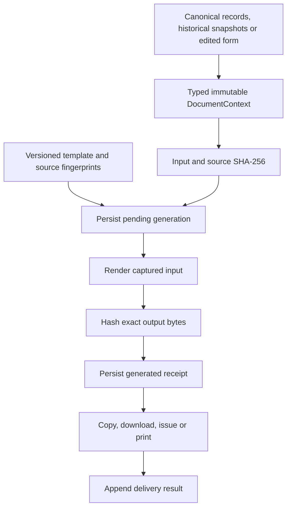

# Stage 7 — Document contexts, lineage and generation history

Implementation baseline: local `3e3da31`, published equivalent `f06ef73`, tree `b4696ccb88aedde88c857eb023c6378feb16a954`. This stage adds document generation provenance on top of the completed Stage 6 formats and Narrative review/close flow. It does not migrate existing domain records or regenerate historical documents.

## What changes for users

- Document outputs capture their inputs once, before asynchronous rendering, photo loading or hashing can observe later edits.
- A generation receipt must persist before output is released. Unavailable or full storage produces a visible error.
- Admin → **Document history**, also available in Home → Tools, shows generation receipts, delivery attempts and a field-dependency lookup. Receipt export contains IDs and hashes; it is not a document archive.
- Existing v1.12.0 Baseball Card and daily arrest report output formats remain intact. Narrative **Save**, **Back to Evidence**, **Continue to Review** and close-time snapshots retain their Stage 6 behavior. Copy/download does not save or close the Encounter.
- I-205 selected order grounds now reach the PDF checkbox map. Case CSV exports share one handler, preventing duplicate downloads.

## Current output contracts

| Document type | Input authority | Final action | Implementation |
|---|---|---|---|
| `bookin.combined-pdf` | Captured edited form; exact saved packet links identify its origin | Download CAP/medical PDF | `book-in.js`: `generateCombinedPacket`, `fillCapPage`, `fillMedicalPdf` |
| `warrant.i200`, `warrant.i205` | Canonical Person seed, captured warrant form and selected officer, exact fetched blank PDF | Issue, save optional Media and download | `warrant-issue.js`: `issue`; `pdf/fill-warrant.js`: `fillWarrantPdf` |
| `arrest-report.email` | Frozen preview rows, exact Encounter joins, nonvoid Arrest facts, finalized daily card and presentation options | Copy HTML or text | `arrest-roster.js`: `generate`, `copyReport`; `arrest-report.js`: `build` |
| `baseball-card.html` | Captured editor state, overrides, layout and photo presentation | Copy or download HTML | `baseball-page.js`; `baseball-card-contract.js` |
| `narrative.text`, `narrative.json` | Current draft output, or the exact saved/locked output and its source snapshot | Copy text, download text/JSON | `narratives/narrative-page.js`: `deliverNarrativeOutput` |
| `lead.csv` | Captured filed Cases with canonical Person/Vehicle joins | Single/list CSV download | `leads.js`; `lead-csv.js` delegates to the same exporter |
| `target-sheet.html` | Painted source snapshot plus captured sheet and offline presentation assets | Download target sheet | `leads.js`: `saveTargetSheetHtml` |
| `operation-brief.html`, `operation-brief.print` | Issued Operation target snapshots and captured officer/photo presentation | Download HTML or submit prepared page to print | `operations.js`: `saveBriefHtml`, `printBrief` |
| `map-brief.print` | Captured map presentation and briefing data | Submit map brief to print | `map-markup.js`: `printBrief` |

Previews and editor configuration/data exports do not create document-generation receipts. Existing JSON transfer/recovery archives, template/state exports and downloads of already-existing Media keep their existing roles. Receipt export also does not recursively generate another receipt.

## Data flow



`functions/document-context.js` defines and validates the shared context envelope with JSDoc types. It includes `person`, `encounter`, `encounterSubject`, `booking`, `arrest`, `officers[]`, `vehicles[]`, `locations[]`, renderer `input`, explicit `sources[]`, capture time and optional generating officer ID. Capturing deep-clones and freezes JSON-safe inputs, rejects invalid values and checks supplied identity joins. It does not look up records or invent missing relationships. The caller must declare source authority as `canonical`, `draft` or `snapshot`.

The generator defensively validates and captures again. Semantic input hashes exclude wall-clock capture time; source fingerprints include identities/revisions and the input hash. Source revisions remain null where no reliable revision is available. Unknown generating users remain null; an arresting or selected document officer is not silently identified as the current user.

## Lineage and template fingerprints

`functions/document-registry.js` and `docs/stage-7-document-dependencies.json` describe actual direct inputs and upstream seed/snapshot dependencies. Each field mapping carries its source, authority and implementation citation. Extensible roots such as narrative state and saved card content are conservative change-impact boundaries.

The reviewed registry covers 12 document contracts, 417 dependency entries and 31 rendering/template/presentation source files. Dependency entries can appear in more than one contract; this count is not a count of unique canonical fields.

```js
COPDoc.documents.registry.dependentsOf("person.dateOfBirth");
COPDoc.documents.registry.dependentsOf("person.immigration.alienNumber");
COPDoc.documents.registry.dependentsOf("encounterSubject.outcome");
```

Queries support parent/child paths, array indices, documented legacy aliases and the query shorthand `person.dob`. This is an explicit reviewed catalog, not automatic reflection. A match means review that output before a rename; it does not mean a previously saved snapshot will be rewritten. No match does not prove a field is unused.

`scripts/build-document-fingerprints.js` computes SHA-256 for each registered renderer, helper, template and presentation source and emits `functions/document-fingerprints.js`. The gate rejects drift. After changing a renderer, review the dependencies and golden outputs, then rebuild fingerprints:

```sh
node scripts/test-stage7-document-context.js
node scripts/build-document-fingerprints.js
node scripts/build-document-fingerprints.js --check
node scripts/run-stage7-tests.js
```

Runtime template hashes combine the template ID/version, pinned source hashes and runtime template content where applicable. Missing or incomplete source fingerprints block generation, even when runtime template content is available. Warrant bytes supplied to hashing are the same bytes supplied to PDF filling. The Book-In embedded PDF and selected Narrative template are included. Pinned hashes describe the checked application source bundle; they are not a browser subresource-integrity enforcement mechanism.

## Generation receipts and failure behavior

`functions/document-generation.js` owns `copdocx.document-generations.v1`. See `stage-7-document-storage.json` for its additive persistence contract. Receipts store generation ID, document type, template ID/version, SHA-256 input/source/template/output hashes, source IDs/revisions/authority, capture/start/completion time, generating officer ID or null, output MIME/byte count, optional Media ID and delivery attempts. They omit raw form data, prose, photos, medical answers, filenames and renderer error messages.

| Situation | Behavior |
|---|---|
| Context/template/crypto preflight fails | Visible error; no output and no started receipt |
| Pending receipt cannot persist | Renderer is not run |
| Renderer fails | `FAILED` receipt, if writable; no output |
| Completion receipt cannot persist | Output is withheld; failed or pending receipt remains |
| Window closes during rendering | Pending receipt remains visible; no implied completion |
| Duplicate explicit request ID | Rejected without another render; retry uses a new request |
| Output submits but delivery annotation cannot persist | Explicit submitted/copied-but-history-warning; no fabricated failed delivery |
| Warrant issuance is already committed | Delivery annotation failure does not roll back issuance or permit another same-page issuance |
| History is malformed or unsupported | Existing bytes remain untouched; further generation is blocked |

Web Locks serialize every ledger mutation across cooperating windows, with a fresh storage read under the lock. Web Crypto and Web Locks are required. Pending/invalid import recovery blocks new ledger writes. These guarantees apply to the new ledger; they do not claim whole-application serializable transactions. The previously documented unrelated workspace last-writer-wins limitation remains.

There is no automatic receipt deletion or destructive reset. The ledger caps history at 5000 receipts and 100 delivery attempts per receipt; storage quota can be reached sooner. Full safety backups include exact ledger bytes. Normal record transfers exclude browser-local delivery claims. History references do not become live ownership links that block deletion of source domain objects.

## Output and delivery limits

- `GENERATED` means bytes were produced and their receipt saved. Download/print `SUBMITTED` describes the browser action, not receipt by a human or successful physical printing.
- Clipboard fallback payloads have their own delivery hash, so a plaintext fallback is not misrepresented as full HTML. Browser HTML clipboard normalization and printers can still change presentation after submission.
- HTML and print hashes cover the prepared document input, not a screenshot or the final print-spool bytes. External imagery referenced by a map cannot be reconstructed from a URL hash alone.
- Warrant Media storage retains its existing best-effort behavior. If Media saves but a later pre-issuance receipt annotation fails, that Media may remain; it is not automatically removed because save may have reused an existing object.
- Historical generation receipts establish provenance and change detection within the local application. They are neither a complete output archive nor a tamper-proof server audit trail.

## Verification

The Stage 7 runner includes the complete Stage 0–6 gates and the new context, generation, history/backup, host/UI, Book-In, warrant, report/card/narrative, CSV/target/operation and map output checks.

Verified locally: the combined runner passed **10/10 gates**. The distinct offline inventory passed **79/79 suites**: 70 existing suites and 9 new Stage 7 suites. Syntax, diff and generated-source fingerprint checks passed. The network-dependent `test-warrant-fill-pdflib.js` remains excluded from the offline inventory.

Coverage includes exact UTF-8/binary/Blob hashes; mutable input/template/renderer races; failed first/final storage writes; malformed roots; interrupted generations; four simulated tabs producing 20 receipts without loss; duplicate request IDs; actual clipboard fallbacks; delivery annotation failures; source join/authority checks; saved Narrative immutability; exact recovery backup and tamper rejection; and source-fingerprint drift.

Existing v1.12.0 report HTML/text fixtures and Baseball Card tests remain the output reference. CAP/medical and I-200/I-205 golden field maps verify the real mapping functions against deterministic PDF doubles. CSV and Operation brief outputs use checked-in fixtures. These verify inputs and output bytes without fetching an external PDF library.

Rendered browser/physical-print verification was not performed: this environment has no installed Playwright browser binaries. Automated UI controllers, persistence and output contracts are tested in the repository's isolated harnesses.
