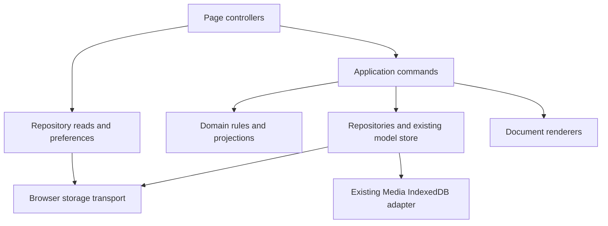

# Stage 8 — Application module boundaries

Baseline: local Stage 7 commit `e1dc487a867912809dd8f6dad6e57c7b43ddb6be`, published equivalent `04aafbf7432c91c3eb61e6b874b1c3935d97735d`, tree `70b4374265443527da54570c4e1cb308c2c46d9f`.

Stage 8 separates existing behavior into domain rules, application commands, repositories, projections, document rendering and UI. The application continues to use classic scripts and its existing public `COPDoc` APIs. Root HTML pages declare the new prerequisites explicitly, preserving direct `file://` use without introducing a server, bundler or framework.

There are no new storage keys, schema versions, migrations or application version changes. The Stage 6 v1.12.0 import, Baseball Card and Admin report contracts remain in place. Narrative **Back to Evidence**, **Save**, **Continue to Review**, and the reviewed Encounter's close-time Narrative snapshot retain their existing behavior.

## Implemented boundaries

Paths in this table are relative to `functions/`.

| Responsibility | Implementation | Existing entry point or consumer |
|---|---|---|
| Canonical Person/Case, Vehicle and Location precedence | `domain/canonical-records.js`: `createCanonicalRecords` | `model/store.js` |
| Encounter subject identity, normalization and historical ownership | `domain/encounter-subject-policy.js`: `createEncounterSubjectPolicy` | `model/store.js` |
| Book-In Arrest projection and exact identity joins | `domain/booking-projection.js`: `createBookingProjection` | `model/store.js` |
| Completed Encounter snapshot | `projections/encounter-completion.js`: `createEncounterCompletion` | `model/store.js` |
| Encounter Narrative roster and context | `projections/encounter-narrative.js`: `createEncounterNarrative` | `encounter-narrative.js` compatibility entry |
| Completed Encounter map pins and heat points | `projections/map.js` | `map-targets.js` |
| Recoverable booking commands | `application/booking.js`: `createBooking` | `booking-workflow.js`, preserving `COPDoc.booking` |
| Import commit, recovery and rollback | `application/import.js`: `createImport` | `import-workflow.js`; dialogs in `ui/import-dialogs.js` |
| Transfer parsing, graph closure, detached plans and verified export | `application/transfer.js`: `createTransfer` | `transfer.js`, preserving `COPDoc.transfer` |
| Officer/fleet creation, scheduling, lifecycle and Arrest commands | `application/admin.js` | `admin.js` and `officer-roster.js` |
| Document capture, hashing, rendering and delivery orchestration | `application/document-generation.js`: `createDocumentGeneration` | `document-generation.js`, preserving `COPDoc.documents` |
| Generation receipt persistence and serialized ledger mutations | `repositories/document-generations.js`: `createDocumentGenerations` | Document generation service |
| CAP/medical PDF template, field maps and rendering | `documents/bookin-pdf.js` | `book-in.js` |

These are moved implementations, not copies retained behind wrappers. For example, the store delegates subject normalization, booking projection and completion building to the new modules. The PDF template and its rendering functions have one implementation in the document module.

Service factories receive capabilities such as the model, repositories, clocks, cryptography and locks through explicit dependencies. Workspace-dependent domain factories receive `getWorkspace()` rather than retaining the first workspace object: reloads and detached import staging therefore use the current state. Transfer instances maintain separate staging state. Admin commands retain their declared `COPDoc` repository/model dependencies; not every legacy module has become a factory.



## Persistence ownership

`repositories/browser-storage.js` is the Web Storage transport. It exposes raw byte operations only to repositories, application infrastructure and compatibility composition. UI consumers use domain-specific methods instead of choosing arbitrary keys. A missing storage implementation in an isolated test host remains distinguishable from a denied browser storage getter; denied reads/writes propagate failure.

| Repository | Owned access |
|---|---|
| `repositories/bookin.js` | Saved packets, column preferences, session handoff and exact export source snapshots |
| `repositories/admin.js` | Detached Admin reads, compare-before-write saves, officer/fleet lookups and dependency snapshots |
| `repositories/preferences.js` | Settings, arrest-roster preferences and Baseball Card style |
| `repositories/view-state.js` | Existing map layers/icons/views/markup/basemap, investigation windows, session geocode cache and demo file/photo state |
| `repositories/narrative-templates.js` | Current and legacy template reads, normalization and current-format saves |
| `repositories/workspace.js` | Read-only workspace snapshots and removal of the already-retired Case layout key |
| `repositories/recovery.js` | Storage channels supplied to the import recovery service |
| `repositories/transfer.js` | Exact storage capture, transfer consistency checks and existing import completion signal |
| `repositories/document-generations.js` | Existing document-generation receipt ledger |
| `repositories/warrants.js` | Existing warrant-directory handle IndexedDB access |

The 25 registered storage entries retain their existing formats and purposes. `model/store.js` continues to own workspace persistence and public domain commands; `model/media.js` remains the Media IndexedDB adapter. The new workspace repository does not become a competing writer. Normal transfer still excludes browser-local recovery journals and document-delivery claims; full safety backup retains exact registered bytes and Media payloads.

Missing saved Book-In storage yields an empty collection. Persisted malformed JSON, `null`, empty bytes or a non-array root cannot be accepted as a clean empty packet collection. The separately named history reader retains the legacy `{records: [...]}` read adapter. Unknown packet fields are preserved. Pending import recovery continues to block packet writes.

Warrant directory-handle saves resolve after the IndexedDB transaction completes, so a request succeeding before a transaction abort is not reported as a completed save.

## Dependency contract and loading

`functions/module-manifest.js` is the machine-readable module inventory, available through CommonJS and `COPDoc.moduleManifest` if explicitly loaded. It classifies all 116 reviewed runtime modules, including the icon asset, into eight layers. The current counts are 53 UI, 23 domain, 5 projection, 13 repository, 6 application, 9 document, 4 compatibility and 3 infrastructure modules.

The dependency lists specify the prerequisites introduced by these boundaries. They are not a complete historical call graph of every `COPDoc` reference. Existing public script ordering is preserved. Transfer's on-demand model loading is checked separately from static host prerequisites so Home cannot rely on a test harness loading missing factories for it.

`scripts/wire-module-hosts.js` emits prerequisites in root HTML hosts. `scripts/support/module-dependencies.js` uses the same declarations to load actual scripts in tests. The boundary gate checks classification, missing dependencies, cycles, duplicate implementations, UI access to raw persistence, domain/projection access to browser capabilities, and prerequisite order across 33 active hosts. The retained standalone legacy Alien Book-In HTML reference is outside this active COPDoc host set.

Stage 7 report fingerprints now include the transitive module prerequisites of each registered source file. Moving a renderer or changing an extracted helper therefore changes the source bundle fingerprint. `document-registry.js` and `docs/stage-7-document-dependencies.json` now point CAP/medical rendering citations to `documents/bookin-pdf.js`. Previously generated receipt history is not rewritten.

After changing module prerequisites or rendering sources:

```sh
node scripts/wire-module-hosts.js
node scripts/test-stage7-document-context.js --write-manifest
node scripts/build-document-fingerprints.js
node scripts/wire-module-hosts.js --check
node scripts/build-document-fingerprints.js --check
node scripts/run-stage8-tests.js
```

## Verification and remaining limits

Eight Stage 8 suites exercise the module boundaries, repositories, store rules, Book-In PDF module, Admin commands, map projections, Narrative projection/templates and transfer service. They cover denied storage, malformed packet preservation, exact serialization, export races, changed workspace providers, identity conflicts, historical custody, immutable completion snapshots, isolated service instances, import recovery guards, Media selection and real output mappings.

The existing 79 offline suites remain the behavioral baseline, including Stage 6 v1.12.0 compatibility, Stage 7 receipt failures/concurrency, Narrative snapshots and output fixtures. The PDF template is unchanged, with SHA-256 `073f8dcde4faa1897ca308ddecb960b9d96f5a5e932ea84111c93016a2fd90da`. CAP/medical golden field mappings and map golden outputs are exercised through their extracted implementations.

Validation passed: all 79 existing offline suites, all 8 new Stage 8 suites, and the combined Stage 0–8 runner's **9/9 gates**. Host wiring and generated document fingerprints match their declarations. Syntax checks passed for all 93 changed/new JavaScript files, and `git diff --check` is clean. The existing network-dependent `test-warrant-fill-pdflib.js` remains outside the 87-suite offline inventory.

The final storage regression test exercises the real model store with denied storage, present-but-null storage and an absent test-host implementation. The first two fail without leaving a phantom in-memory Person; only the intentionally absent test-host implementation permits memory-only saves.

This is an incremental modular architecture. Large legacy controllers and the remaining workspace store still contain work that can be separated later. Classic global entry points remain for compatibility. The existing unrelated cross-tab whole-workspace last-writer-wins limitation is not solved by moving code. Dependency checks enforce the declared boundaries; they do not prove every historical implicit dependency has been cataloged.

Rendered browser and physical-print verification are unavailable in this environment because Playwright browser binaries are not installed. UI controller harnesses, offline output fixtures and script-order checks provide the automated coverage here.
